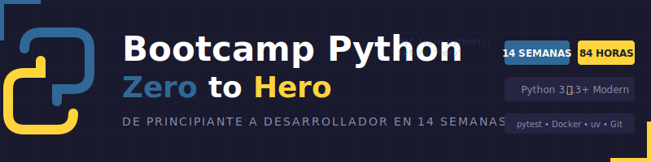

<p align="center">
  
</p>

<p align="center">
  <a href="LICENSE"></a>
  <a href="#"></a>
  <a href="#"></a>
  <a href="#"></a>
  <a href="CONTRIBUTING.md"></a>
</p>

<p align="center">
  <a href="README-EN.md"></a>
</p>

---

## 📋 Descripción

Bootcamp intensivo de **14 semanas (~3.5 meses)** enfocado en el dominio de **Python moderno** desde cero. Diseñado para llevar a estudiantes de principiantes absolutos a **Desarrollador Python Junior**, con énfasis en código limpio, mejores prácticas y proyectos del mundo real.

### 🎯 Objetivos

Al finalizar el bootcamp, los estudiantes serán capaces de:

- ✅ Dominar los fundamentos de Python moderno (3.13+)
- ✅ Aplicar type hints y tipado estático correctamente
- ✅ Trabajar con estructuras de datos complejas
- ✅ Implementar Programación Orientada a Objetos (POO)
- ✅ Manejar archivos, excepciones y módulos
- ✅ Escribir código limpio y mantenible
- ✅ Crear tests automatizados con pytest
- ✅ Usar control de versiones con Git
- ✅ Trabajar con librerías populares del ecosistema Python
- ✅ Desarrollar proyectos completos desde cero

### 🚀 ¿Por qué Python?

> **Python moderno desde el día 1** - Sin código legacy, solo las mejores prácticas actuales.

Python es el lenguaje de programación más versátil y demandado del mundo. Este bootcamp se enfoca exclusivamente en Python 3.13+ con características modernas como type hints, match statements y f-strings. Los estudiantes aprenden directamente las herramientas y técnicas que usarán en el mundo profesional.

---

## 🗓️ Estructura del Bootcamp

|          Etapa           | Semanas | Horas | Temas Principales                                  |
| :----------------------: | :-----: | :---: | -------------------------------------------------- |
|     **Fundamentos**      |   1-4   |  24h  | Variables, tipos, condicionales, bucles, funciones |
| **Estructuras de Datos** |   5-7   |  18h  | Listas, diccionarios, sets, tuplas, algoritmos     |
|  **POO y Modularidad**   |  8-10   |  18h  | Clases, herencia, módulos, paquetes, uv            |
|   **Temas Avanzados**    |  11-13  |  18h  | Archivos, excepciones, decoradores, testing        |
| **Proyecto Integrador**  |   14    |  6h   | Proyecto final, librerías externas, presentación   |

**Total: 14 semanas** | **84 horas** de formación intensiva

---

## 📚 Contenido por Semana

Cada semana incluye:

```
bootcamp/week-XX/
├── README.md                 # Descripción y objetivos
├── rubrica-evaluacion.md     # Criterios de evaluación
├── 0-assets/                 # Imágenes y diagramas
├── 1-teoria/                 # Material teórico
├── 2-ejercicios/             # Ejercicios guiados
├── 3-proyecto/               # Proyecto semanal
├── 4-recursos/               # Recursos adicionales
│   ├── ebooks-free/
│   ├── videografia/
│   └── webgrafia/
└── 5-glosario/               # Términos clave
```

### 🔑 Componentes Clave

- 📖 **Teoría**: Conceptos fundamentales con ejemplos del mundo real
- 💻 **Práctica**: Ejercicios progresivos y proyectos hands-on
- 📝 **Evaluación**: Evidencias de conocimiento, desempeño y producto
- 🎓 **Recursos**: Glosarios, referencias y material complementario

---

## 🛠️ Stack Tecnológico

| Tecnología     | Versión    | Uso                  |
| -------------- | ---------- | -------------------- |
| Python         | **3.13+**  | Lenguaje principal   |
| pytest         | **8.3+**   | Testing              |
| Docker         | **27+**    | Containerización     |
| Docker Compose | **2.31+**  | Orquestación         |
| uv             | **0.5+**   | Gestión de paquetes  |
| Git            | **2.40+**  | Control de versiones |
| VS Code        | **Latest** | Editor recomendado   |

**Entorno de desarrollo**: Docker + docker compose (❌ NO instalar Python localmente)

**Gestión de paquetes**: uv (❌ NO usar pip directamente)

---

## 🚀 Inicio Rápido

### Prerrequisitos

- **Docker** y **Docker Compose** instalados
- **Git** para control de versiones
- **VS Code** (recomendado) con extensiones incluidas
- Navegador moderno (Chrome, Firefox, Edge)

### 1. Clonar el Repositorio

```bash
git clone https://github.com/epti-dev/bc-python.git
cd bc-python
```

### 2. Instalar Extensiones de VS Code

```bash
# Abrir en VS Code
code .

# Las extensiones recomendadas aparecerán automáticamente
# O ejecutar: Ctrl+Shift+P → "Extensions: Show Recommended Extensions"
```

### 3. Navegar a la Semana Actual

```bash
cd bootcamp/week-01
```

### 4. Seguir las Instrucciones

Cada semana contiene un `README.md` con instrucciones detalladas.

---

## 📊 Metodología de Aprendizaje

### Estrategias Didácticas

- 🎯 **Aprendizaje Basado en Proyectos (ABP)**
- 🧩 **Práctica Deliberada**
- 🔄 **Coding Challenges**
- 👥 **Code Review entre pares**
- 🎮 **Live Coding**

### Distribución del Tiempo (6h/semana)

- **Teoría**: 1.5-2 horas
- **Ejercicios**: 2.5-3 horas
- **Proyecto**: 1.5-2 horas

### Evaluación

Cada semana incluye tres tipos de evidencias:

1. **Conocimiento 🧠** (30%): Cuestionarios y evaluaciones teóricas
2. **Desempeño 💪** (40%): Ejercicios prácticos en clase
3. **Producto 📦** (30%): Entregables evaluables (proyectos funcionales)

**Criterio de aprobación**: Mínimo 70% en cada tipo de evidencia

---

## 🤝 Contribuir

¡Las contribuciones son bienvenidas! Este es un proyecto educativo de código abierto.

### Cómo Contribuir

1. Lee la [Guía de Contribución](CONTRIBUTING.md)
2. Revisa el [Código de Conducta](CODE_OF_CONDUCT.md)
3. Fork del repositorio
4. Crea tu rama (`git checkout -b feature/nueva-funcionalidad`)
5. Commit con [Conventional Commits](https://www.conventionalcommits.org/) (`git commit -m 'feat: add new exercise'`)
6. Push a la rama (`git push origin feature/nueva-funcionalidad`)
7. Abre un Pull Request

### 📋 Áreas de Contribución

- ✨ Ejercicios adicionales
- 📚 Mejoras en documentación
- 🐛 Corrección de errores
- 🎨 Recursos visuales (diagramas SVG)
- 🌐 Traducciones
- 📹 Videos tutoriales

---

## 📞 Soporte

- 💬 **Discussions**: [GitHub Discussions](https://github.com/epti-dev/bc-python/discussions)
- 🐛 **Issues**: [GitHub Issues](https://github.com/epti-dev/bc-python/issues)

---

## 📄 Licencia

Este proyecto está bajo la Licencia MIT - ver el archivo [LICENSE](LICENSE) para más detalles.

---

## 🏆 Agradecimientos

- [Python](https://python.org/) - Por crear el lenguaje más versátil del mundo
- [pytest](https://pytest.org/) - Por hacer el testing simple y poderoso
- [Astral](https://astral.sh/) - Por crear uv, el gestor de paquetes moderno
- [Real Python](https://realpython.com/) - Por los excelentes tutoriales
- Comunidad Python - Por los recursos y ejemplos
- Todos los contribuidores

---

## 📚 Documentación Adicional

- [🤖 Instrucciones de Copilot](.github/copilot-instructions.md)
- [🤝 Guía de Contribución](CONTRIBUTING.md)
- [📜 Código de Conducta](CODE_OF_CONDUCT.md)
- [🔒 Política de Seguridad](SECURITY.md)

---

<p align="center">
  <strong>🎓 Bootcamp Python - Zero to Hero</strong><br>
  <em>De cero a desarrollador Python en 3.5 meses</em>
</p>

<p align="center">
  <a href="bootcamp/week-01">Comenzar Semana 1</a> •
  <a href="_docs">Ver Documentación</a> •
  <a href="https://github.com/epti-dev/bc-python/issues">Reportar Issue</a> •
  <a href="CONTRIBUTING.md">Contribuir</a>
</p>

<p align="center">
  Hecho con ❤️ para la comunidad de desarrolladores
</p>
