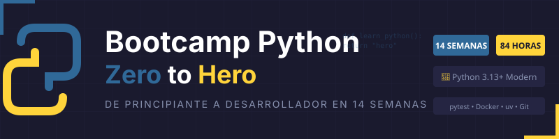

<p align="center">
  
</p>

<p align="center">
  <a href="LICENSE"></a>
  <a href="#"></a>
  <a href="#"></a>
  <a href="#"></a>
  <a href="CONTRIBUTING.md"></a>
</p>

<p align="center">
  <a href="README-EN.md"></a>
</p>

---

## 📋 Descripción

Bootcamp completo de **36 semanas (~9 meses)** que lleva a estudiantes de cero a nivel **Master** en Python moderno. Énfasis en **automatización**, **procesamiento de media** y **pipelines**, aplicados al dominio de un **estudio de producción audiovisual** (Studio BC).

> Ver el plan curricular completo en [docs/expansion-zero-to-master.md](docs/expansion-zero-to-master.md)

### 🎯 Objetivos por Fase

| Fase | Semanas | Horas | Nivel | Logros principales |
|:----:|:-------:|:-----:|:-----:|---------------------|
| **1** | 1–14 | 84h | Junior | Fundamentos, POO, testing, proyecto CLI |
| **2** | 15–21 | 42h | Mid-level | Types avanzados, async, CLI Typer, Polars, SQLModel |
| **3** | 22–30 | 54h | Senior | Pipelines de imagen/audio/video, cloud, integraciones |
| **4** | 31–36 | 36h | Master | Clean Architecture, IA, performance, CI/CD, seguridad |

### 🚀 ¿Por qué Python?

> **Python moderno desde el día 1** — Sin código legacy, solo las mejores prácticas actuales.

Python es el lenguaje de programación más versátil del mundo, y el único lenguaje con ecosistema de primera clase para automatización, ciencia de datos, IA y desarrollo web simultáneamente. Este bootcamp se enfoca en Python 3.13+, type hints estrictos, async/await y las herramientas que se usan en producción real.

---

## 🗓️ Estructura del Bootcamp

### Fase 1 — Fundamentos y POO (Semanas 1–14) · 84h · Junior

|          Etapa           | Semanas | Horas | Temas Principales                                  |
| :----------------------: | :-----: | :---: | -------------------------------------------------- |
|     **Fundamentos**      |   1–4   |  24h  | Variables, tipos, condicionales, bucles, funciones |
| **Estructuras de Datos** |   5–7   |  18h  | Listas, diccionarios, sets, tuplas, algoritmos     |
|  **POO y Modularidad**   |  8–10   |  18h  | Clases, herencia, módulos, paquetes, uv            |
|   **Temas Avanzados**    |  11–13  |  18h  | Archivos, excepciones, decoradores, testing        |
| **Proyecto Integrador**  |   14    |   6h  | Weather Dashboard CLI                              |

### Fase 2 — Python Profesional (Semanas 15–21) · 42h · Mid-level

|          Etapa                | Semanas | Horas | Temas Principales                                      |
| :---------------------------: | :-----: | :---: | ------------------------------------------------------ |
|  **Python Moderno Avanzado**  |   15    |   6h  | Protocols, TypeGuard, Structural Pattern Matching      |
|  **Concurrencia y AsyncIO**   |   16    |   6h  | asyncio, concurrent.futures, threading vs processes   |
| **CLI Profesional**           |   17    |   6h  | Typer, Rich, Textual                                   |
| **Gestión de Datos**          |   18    |   6h  | Polars, Parquet, reportes del estudio                  |
| **HTTP y APIs**               |   19    |   6h  | httpx async, retry, OAuth2                             |
| **Bases de Datos**            |   20    |   6h  | SQLModel, Alembic, migraciones                         |
| **Proyecto Fase 2**           |   21    |   6h  | CLI Studio BC: proyectos, clientes, entregables        |

### Fase 3 — Automatización y Pipelines de Media (Semanas 22–30) · 54h · Senior

|          Etapa               | Semanas | Horas | Temas Principales                                      |
| :--------------------------: | :-----: | :---: | ------------------------------------------------------ |
| **Sistema de Archivos**      |   22    |   6h  | watchdog, pathlib avanzado, auto-organización          |
| **Procesamiento Imágenes**   |   23    |   6h  | Pillow, thumbnails automáticos, watermarks             |
| **Procesamiento Audio**      |   24    |   6h  | pydub, Whisper, transcripción                          |
| **Video con FFmpeg**         |   25    |   6h  | ffmpeg-python, proxies, transcodificación              |
| **Cloud Storage**            |   26    |   6h  | S3, Google Drive, sync automático                      |
| **Arquitectura Pipelines**   |   27    |   6h  | Colas, retry, dead-letter, estado                      |
| **Integraciones**            |   28    |   6h  | YouTube API, Vimeo, Slack, Discord, Notion             |
| **Monitoreo**                |   29    |   6h  | structlog, alertas, dashboards                         |
| **Proyecto Fase 3**          |   30    |   6h  | Pipeline end-to-end: watch → process → deliver         |

### Fase 4 — Arquitectura Master (Semanas 31–36) · 36h · Master

|          Etapa               | Semanas | Horas | Temas Principales                                      |
| :--------------------------: | :-----: | :---: | ------------------------------------------------------ |
| **Clean Architecture + DDD** |   31    |   6h  | Repository, Service Layer, Aggregates, DI              |
| **IA Aplicada a Media**      |   32    |   6h  | OpenAI, Whisper, embeddings, auto-tagging              |
| **Performance**              |   33    |   6h  | Profiling, Redis, streaming de archivos grandes        |
| **DevOps y CI/CD**           |   34    |   6h  | Docker multi-stage, GitHub Actions, Makefile           |
| **Seguridad**                |   35    |   6h  | OWASP, secrets, bandit, hardening                      |
| **Proyecto Final Master**    |   36    |   6h  | Sistema Studio BC completo — producción-ready          |

**Total: 36 semanas** | **216 horas** de formación intensiva

---

## 🏭 Dominio: Studio BC

El hilo conductor de las Fases 2–4 es **Studio BC**, un estudio de producción audiovisual ficticio con proyectos, clientes, assets y flujos de entrega reales. Cada fase agrega una capa nueva al sistema del estudio:

```
Fase 2  →  CLI de gestión (clientes, proyectos, entregables)
Fase 3  →  Pipeline de automatización (ingest → process → deliver → notify)
Fase 4  →  Sistema completo: gestión + pipelines + IA + CI/CD
```

---

## 📚 Contenido por Semana

Cada semana incluye:

```
bootcamp/week-XX-tema_principal/
├── README.md                 # Descripción y objetivos
├── rubrica-evaluacion.md     # Criterios de evaluación
├── 0-assets/                 # Imágenes y diagramas
├── 1-teoria/                 # Material teórico
├── 2-ejercicios/             # Ejercicios guiados
├── 3-proyecto/               # Proyecto semanal
├── 4-recursos/               # Recursos adicionales
│   ├── ebooks-free/
│   ├── videografia/
│   └── webgrafia/
└── 5-glosario/               # Términos clave
```

### 🔑 Componentes Clave

- 📖 **Teoría**: Conceptos fundamentales con ejemplos del mundo real
- 💻 **Práctica**: Ejercicios progresivos y proyectos hands-on
- 📝 **Evaluación**: Evidencias de conocimiento, desempeño y producto
- 🎓 **Recursos**: Glosarios, referencias y material complementario

---

## 🛠️ Stack Tecnológico

### Base (todas las fases)

| Tecnología     | Versión    | Uso                  |
| -------------- | ---------- | -------------------- |
| Python         | **3.13+**  | Lenguaje principal   |
| pytest         | **8.3+**   | Testing              |
| Docker         | **27+**    | Containerización     |
| Docker Compose | **2.31+**  | Orquestación         |
| uv             | **0.5+**   | Gestión de paquetes  |
| Git            | **2.40+**  | Control de versiones |

### Fase 2 — Python Profesional
`mypy` · `pyright` · `typer` · `rich` · `textual` · `polars` · `httpx` · `tenacity` · `sqlmodel` · `alembic`

### Fase 3 — Automatización y Media
`watchdog` · `Pillow` · `pydub` · `openai-whisper` · `ffmpeg-python` · `boto3` · `google-api-python-client` · `rq` · `redis` · `slack-sdk` · `structlog`

### Fase 4 — Arquitectura Master
`openai` · `sentence-transformers` · `py-spy` · `redis` · `dependency-injector` · `bandit` · `safety` · `GitHub Actions` · `Docker multi-stage`

**Entorno de desarrollo**: Docker + docker compose (❌ NO instalar Python localmente)

**Gestión de paquetes**: uv (❌ NO usar pip directamente)

---

## 🚀 Inicio Rápido

### Prerrequisitos

- **Docker** y **Docker Compose** instalados
- **Git** para control de versiones
- **VS Code** (recomendado) con extensiones incluidas
- Navegador moderno (Chrome, Firefox, Edge)

### 1. Clonar el Repositorio

```bash
git clone https://github.com/epti-dev/bc-python.git
cd bc-python
```

### 2. Instalar Extensiones de VS Code

```bash
# Abrir en VS Code
code .

# Las extensiones recomendadas aparecerán automáticamente
# O ejecutar: Ctrl+Shift+P → "Extensions: Show Recommended Extensions"
```

### 3. Navegar a la Semana Actual

```bash
cd bootcamp/week-01-introduccion_python_y_entorno
```

### 4. Seguir las Instrucciones

Cada semana contiene un `README.md` con instrucciones detalladas.

---

## 📊 Metodología de Aprendizaje

### Estrategias Didácticas

- 🎯 **Aprendizaje Basado en Proyectos (ABP)**
- 🧩 **Práctica Deliberada**
- 🔄 **Coding Challenges**
- 👥 **Code Review entre pares**
- 🎮 **Live Coding**

### Distribución del Tiempo (6h/semana)

- **Teoría**: 1.5-2 horas
- **Ejercicios**: 2.5-3 horas
- **Proyecto**: 1.5-2 horas

### Evaluación

Cada semana incluye tres tipos de evidencias:

1. **Conocimiento 🧠** (30%): Cuestionarios y evaluaciones teóricas
2. **Desempeño 💪** (40%): Ejercicios prácticos en clase
3. **Producto 📦** (30%): Entregables evaluables (proyectos funcionales)

**Criterio de aprobación**: Mínimo 70% en cada tipo de evidencia

---

## 🤝 Contribuir

¡Las contribuciones son bienvenidas! Este es un proyecto educativo de código abierto.

### Cómo Contribuir

1. Lee la [Guía de Contribución](CONTRIBUTING.md)
2. Revisa el [Código de Conducta](CODE_OF_CONDUCT.md)
3. Fork del repositorio
4. Crea tu rama (`git checkout -b feature/nueva-funcionalidad`)
5. Commit con [Conventional Commits](https://www.conventionalcommits.org/) (`git commit -m 'feat: add new exercise'`)
6. Push a la rama (`git push origin feature/nueva-funcionalidad`)
7. Abre un Pull Request

### 📋 Áreas de Contribución

- ✨ Ejercicios adicionales
- 📚 Mejoras en documentación
- 🐛 Corrección de errores
- 🎨 Recursos visuales (diagramas SVG)
- 🌐 Traducciones
- 📹 Videos tutoriales

---

## 📞 Soporte

- 💬 **Discussions**: [GitHub Discussions](https://github.com/epti-dev/bc-python/discussions)
- 🐛 **Issues**: [GitHub Issues](https://github.com/epti-dev/bc-python/issues)

---

## 📄 Licencia

Este proyecto está bajo la Licencia MIT - ver el archivo [LICENSE](LICENSE) para más detalles.

---

## 🏆 Agradecimientos

- [Python](https://python.org/) - Por crear el lenguaje más versátil del mundo
- [pytest](https://pytest.org/) - Por hacer el testing simple y poderoso
- [Astral](https://astral.sh/) - Por crear uv, el gestor de paquetes moderno
- [Real Python](https://realpython.com/) - Por los excelentes tutoriales
- Comunidad Python - Por los recursos y ejemplos
- Todos los contribuidores

---

## 📚 Documentación Adicional

- [📐 Plan de Expansión Zero to Master](docs/expansion-zero-to-master.md)
- [🤖 Instrucciones de Copilot](.github/copilot-instructions.md)
- [🤝 Guía de Contribución](CONTRIBUTING.md)
- [📜 Código de Conducta](CODE_OF_CONDUCT.md)
- [🔒 Política de Seguridad](SECURITY.md)

---

<p align="center">
  <strong>🎓 Bootcamp Python - Zero to Master</strong><br>
  <em>De cero a desarrollador Python Master en 9 meses · Studio BC</em>
</p>

<p align="center">
  <a href="bootcamp/week-01-introduccion_python_y_entorno">Comenzar Semana 1</a> •
  <a href="docs/expansion-zero-to-master.md">Plan Curricular</a> •
  <a href="https://github.com/epti-dev/bc-python/issues">Reportar Issue</a> •
  <a href="CONTRIBUTING.md">Contribuir</a>
</p>

<p align="center">
  Hecho con ❤️ para la comunidad de desarrolladores
</p>
