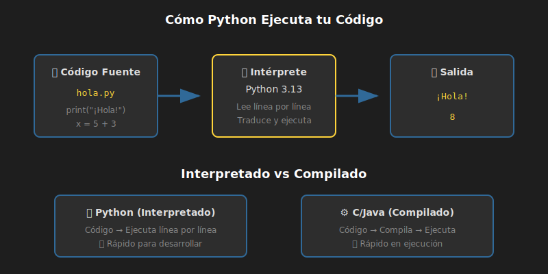

# 🐍 ¿Qué es Python?

## 🎯 Objetivos

- Entender qué es Python y su historia
- Conocer por qué Python es tan popular
- Identificar en qué se usa Python actualmente
- Comprender las características que hacen único a Python

---

## 📋 Contenido

### 1. Introducción

**Python** es un lenguaje de programación de alto nivel, interpretado y de propósito general. Fue creado por **Guido van Rossum** y lanzado por primera vez en **1991**.



> 💡 **Dato curioso**: El nombre "Python" no viene de la serpiente, sino del grupo de comedia británico **Monty Python**, del cual Guido era fanático.

### 2. ¿Por qué Python?

Python se ha convertido en uno de los lenguajes más populares del mundo por varias razones:

#### 📖 Fácil de Leer y Escribir

```python
# Python - Claro y legible
if age >= 18:
    print("Eres mayor de edad")
```

Compara con otros lenguajes:

```java
// Java - Más verboso
if (age >= 18) {
    System.out.println("Eres mayor de edad");
}
```

#### 🚀 Versátil

Python se usa en prácticamente todo:

| Área | Uso | Ejemplos |
|------|-----|----------|
| 🌐 **Web** | Backend de aplicaciones | Instagram, Pinterest, Spotify |
| 🤖 **IA/ML** | Machine Learning, Deep Learning | TensorFlow, PyTorch |
| 📊 **Data Science** | Análisis de datos | Pandas, NumPy |
| 🔧 **Automatización** | Scripts, DevOps | Ansible, scripts de sistema |
| 🎮 **Juegos** | Desarrollo de videojuegos | Pygame |
| 🔬 **Ciencia** | Investigación científica | NASA, CERN |

#### 👥 Gran Comunidad

- Millones de desarrolladores en todo el mundo
- Miles de librerías gratuitas disponibles
- Documentación extensa y tutoriales
- Comunidad activa y amigable con principiantes

### 3. Características de Python

#### 🔤 Lenguaje de Alto Nivel

No necesitas preocuparte por detalles de memoria o hardware. Python maneja eso por ti.

#### 🎭 Interpretado

El código se ejecuta línea por línea, sin necesidad de compilar. Esto hace el desarrollo más rápido.

```
Código Python → Intérprete → Resultado
    (.py)         (python)    (output)
```

#### 📐 Tipado Dinámico (con Type Hints opcionales)

Python determina el tipo de las variables automáticamente, pero desde Python 3.5+ podemos agregar **type hints** para mayor claridad:

```python
# Sin type hints (funciona, pero menos claro)
name = "Ana"
age = 25

# Con type hints (recomendado - lo usaremos siempre)
name: str = "Ana"
age: int = 25
```

#### 🧱 Multiparadigma

Soporta diferentes estilos de programación:

- **Procedural**: Funciones y secuencias de instrucciones
- **Orientado a Objetos**: Clases y objetos
- **Funcional**: Funciones como ciudadanos de primera clase

### 4. Python 2 vs Python 3

> ⚠️ **Importante**: Python 2 llegó al fin de su vida útil el 1 de enero de 2020.

| Aspecto | Python 2 | Python 3 |
|---------|----------|----------|
| Estado | ❌ Obsoleto | ✅ Activo |
| Print | `print "hola"` | `print("hola")` |
| División | `5/2 = 2` | `5/2 = 2.5` |
| Unicode | Limitado | Nativo |

**En este bootcamp usamos Python 3.13+** con todas las características modernas.

### 5. El Zen de Python

Python tiene una filosofía de diseño documentada en "El Zen de Python". Puedes verla ejecutando:

```python
import this
```

Los principios más importantes:

> 🎯 **"Beautiful is better than ugly"**
> El código debe ser bonito y legible

> 🎯 **"Explicit is better than implicit"**
> Sé claro en lo que hace tu código

> 🎯 **"Simple is better than complex"**
> Prefiere soluciones simples

> 🎯 **"Readability counts"**
> El código se lee más de lo que se escribe

### 6. Python en el Mercado Laboral

Python es consistentemente uno de los lenguajes más demandados:

- 🥇 **#1 en TIOBE Index** (2025)
- 🥇 **#1 en Stack Overflow Survey** (más deseado)
- 💰 Salarios competitivos en todo el mundo
- 📈 Crecimiento constante en ofertas laborales

#### Roles que usan Python

- Backend Developer
- Data Scientist
- Machine Learning Engineer
- DevOps Engineer
- Automation Engineer
- Full Stack Developer

---

## 📚 Recursos Adicionales

- [Python.org - About Python](https://www.python.org/about/)
- [Historia de Python (Wikipedia)](https://es.wikipedia.org/wiki/Python)
- [The Zen of Python](https://peps.python.org/pep-0020/)

---

## ✅ Checklist de Verificación

- [ ] Entiendo qué es Python y quién lo creó
- [ ] Conozco al menos 3 áreas donde se usa Python
- [ ] Comprendo por qué Python es fácil de aprender
- [ ] Sé la diferencia entre Python 2 y Python 3
- [ ] Conozco algunos principios del Zen de Python

---

<p align="center">
  <a href="02-configuracion-entorno.md">Siguiente: Configuración del Entorno ➡️</a>
</p>
