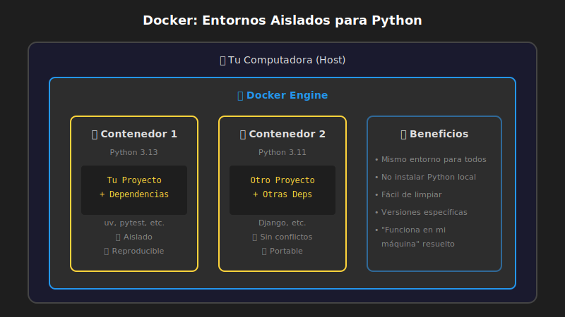

# 🔧 Configuración del Entorno de Desarrollo

## 🎯 Objetivos

- Instalar Docker Desktop
- Configurar VS Code con las extensiones necesarias
- Entender por qué usamos Docker para desarrollo
- Ejecutar tu primer contenedor con Python

---

## 📋 Contenido

### 1. ¿Por qué Docker?

En este bootcamp usamos **Docker** en lugar de instalar Python directamente. ¿Por qué?

| Problema | Solución con Docker |
|----------|---------------------|
| "En mi máquina funciona" | Mismo entorno para todos |
| Conflictos de versiones | Entornos aislados |
| Configuración compleja | Un comando lo levanta todo |
| Limpiar el sistema | Solo borrar contenedor |



> 💡 **Docker** es como una "caja" que contiene todo lo necesario para ejecutar tu aplicación: Python, librerías, configuración, etc.

### 2. Instalación de Docker Desktop

#### Windows

1. Descarga [Docker Desktop para Windows](https://www.docker.com/products/docker-desktop/)
2. Ejecuta el instalador
3. Reinicia tu computadora
4. Abre Docker Desktop y espera a que inicie

#### macOS

1. Descarga [Docker Desktop para Mac](https://www.docker.com/products/docker-desktop/)
2. Arrastra Docker a Aplicaciones
3. Abre Docker desde Aplicaciones
4. Autoriza con tu contraseña si lo pide

#### Linux (Ubuntu/Debian)

```bash
# Actualizar paquetes
sudo apt update

# Instalar dependencias
sudo apt install -y apt-transport-https ca-certificates curl software-properties-common

# Agregar repositorio de Docker
curl -fsSL https://download.docker.com/linux/ubuntu/gpg | sudo gpg --dearmor -o /usr/share/keyrings/docker-archive-keyring.gpg

echo "deb [arch=$(dpkg --print-architecture) signed-by=/usr/share/keyrings/docker-archive-keyring.gpg] https://download.docker.com/linux/ubuntu $(lsb_release -cs) stable" | sudo tee /etc/apt/sources.list.d/docker.list > /dev/null

# Instalar Docker
sudo apt update
sudo apt install -y docker-ce docker-ce-cli containerd.io docker-compose-plugin

# Agregar tu usuario al grupo docker
sudo usermod -aG docker $USER

# Cerrar sesión y volver a entrar para aplicar cambios
```

#### Verificar instalación

```bash
docker --version
# Docker version 27.x.x, build xxxxxxx

docker compose version
# Docker Compose version v2.x.x
```

### 3. Instalación de VS Code

1. Descarga [VS Code](https://code.visualstudio.com/)
2. Instala según tu sistema operativo
3. Abre VS Code

### 4. Extensiones de VS Code

Al abrir el proyecto, VS Code te sugerirá instalar las extensiones recomendadas. Acepta instalarlas todas.

Las más importantes para Python:

| Extensión | ID | Uso |
|-----------|-----|-----|
| Python | `ms-python.python` | Soporte básico de Python |
| Pylance | `ms-python.vscode-pylance` | IntelliSense avanzado |
| Docker | `ms-azuretools.vscode-docker` | Gestión de contenedores |
| GitHub Copilot | `github.copilot` | Asistente de código IA |

### 5. Estructura del Proyecto con Docker

Cada proyecto tendrá esta estructura:

```
mi-proyecto/
├── docker-compose.yml    # Orquestación de servicios
├── Dockerfile            # Imagen de Python
├── pyproject.toml        # Dependencias del proyecto
├── .env.example          # Variables de entorno (template)
└── src/                  # Código fuente
    └── main.py
```

#### Dockerfile básico

```dockerfile
FROM python:3.13-slim

# Variables de entorno para Python
ENV PYTHONDONTWRITEBYTECODE=1 \
    PYTHONUNBUFFERED=1 \
    UV_SYSTEM_PYTHON=1

# Instalar uv (gestor de paquetes moderno)
RUN pip install --no-cache-dir uv

# Directorio de trabajo
WORKDIR /app

# Copiar archivos de dependencias
COPY pyproject.toml ./

# Instalar dependencias
RUN uv sync --frozen --no-dev 2>/dev/null || uv sync

# Copiar código fuente
COPY . .

# Comando por defecto
CMD ["python", "src/main.py"]
```

#### docker-compose.yml básico

```yaml
services:
  app:
    build: .
    volumes:
      - .:/app
    working_dir: /app
    stdin_open: true
    tty: true
```

### 6. Comandos Esenciales de Docker

| Comando | Descripción |
|---------|-------------|
| `docker compose up --build` | Construir y ejecutar |
| `docker compose up -d` | Ejecutar en segundo plano |
| `docker compose down` | Detener contenedores |
| `docker compose exec app bash` | Entrar al contenedor |
| `docker compose logs -f` | Ver logs en tiempo real |

### 7. Tu Primer Contenedor Python

Vamos a verificar que todo funciona:

```bash
# 1. Crear un directorio de prueba
mkdir python-test
cd python-test

# 2. Ejecutar Python en Docker (sin instalar nada local)
docker run -it --rm python:3.13-slim python --version
# Python 3.13.x

# 3. Ejecutar código Python directamente
docker run -it --rm python:3.13-slim python -c "print('¡Hola desde Docker!')"
# ¡Hola desde Docker!
```

> 🎉 ¡Felicidades! Acabas de ejecutar Python sin instalarlo en tu sistema.

### 8. Gestión de Paquetes con uv

En este bootcamp usamos **uv** en lugar de pip. ¿Por qué?

| pip | uv |
|-----|-----|
| Lento | 10-100x más rápido |
| Resolución básica | Resolución avanzada |
| Estándar antiguo | Estándar moderno |

#### Comandos básicos de uv

```bash
# Crear nuevo proyecto
uv init

# Agregar dependencia
uv add requests

# Agregar dependencia de desarrollo
uv add --dev pytest

# Instalar todas las dependencias
uv sync

# Ejecutar script
uv run python src/main.py
```

### 9. Configuración de VS Code para Docker

Crea el archivo `.vscode/settings.json` en tu proyecto:

```json
{
  "python.defaultInterpreterPath": "/usr/local/bin/python",
  "python.analysis.typeCheckingMode": "basic",
  "editor.formatOnSave": true,
  "[python]": {
    "editor.defaultFormatter": "ms-python.python"
  }
}
```

---

## 🔥 Ejercicio Práctico

1. Abre una terminal
2. Ejecuta: `docker run -it --rm python:3.13-slim`
3. Ahora estás dentro de Python. Escribe:
   ```python
   print("Mi nombre es [TU NOMBRE]")
   2 + 2
   exit()
   ```
4. ¡Acabas de usar Python en Docker!

---

## 📚 Recursos Adicionales

- [Docker Documentation](https://docs.docker.com/)
- [VS Code Python Tutorial](https://code.visualstudio.com/docs/python/python-tutorial)
- [uv Documentation](https://docs.astral.sh/uv/)

---

## ✅ Checklist de Verificación

- [ ] Docker Desktop está instalado y funcionando
- [ ] `docker --version` muestra la versión
- [ ] VS Code está instalado
- [ ] Las extensiones de Python están instaladas
- [ ] Puedo ejecutar `docker run -it python:3.13-slim`
- [ ] Entiendo la diferencia entre pip y uv

---

<p align="center">
  <a href="01-que-es-python.md">⬅️ Anterior</a> •
  <a href="03-primer-programa.md">Siguiente: Tu Primer Programa ➡️</a>
</p>
