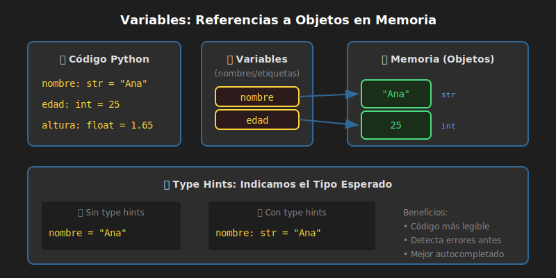

# 📦 Variables y Tipos de Datos

## 🎯 Objetivos

- Entender qué son las variables y cómo funcionan
- Conocer los tipos de datos básicos en Python
- Aprender a usar type hints (anotaciones de tipo)
- Aplicar convenciones de nomenclatura

---

## 📋 Contenido

### 1. ¿Qué es una Variable?

Una **variable** es un nombre que se refiere a un valor almacenado en memoria. Piensa en ella como una "caja etiquetada" donde guardas información.



```python
# Creamos una variable llamada "nombre" con el valor "Ana"
nombre = "Ana"

# Ahora podemos usar esa variable
print(nombre)  # Ana
```

### 2. Asignación de Variables

En Python, usamos el operador `=` para asignar valores:

```python
# Asignación simple
edad = 25

# Asignación múltiple
x = y = z = 0

# Asignación múltiple con diferentes valores
nombre, edad, ciudad = "Ana", 25, "Madrid"
```

### 3. Type Hints (Anotaciones de Tipo)

Desde Python 3.5+, podemos indicar el tipo de una variable usando **type hints**. Esto hace el código más legible y ayuda a detectar errores.

> 🎯 **En este bootcamp SIEMPRE usamos type hints**

```python
# ❌ Sin type hints (funciona, pero no recomendado)
nombre = "Ana"
edad = 25

# ✅ Con type hints (siempre usar esto)
nombre: str = "Ana"
edad: int = 25
altura: float = 1.75
es_estudiante: bool = True
```

### 4. Tipos de Datos Básicos

Python tiene varios tipos de datos incorporados:

#### 📝 str (String / Cadena de texto)

Texto entre comillas:

```python
nombre: str = "Ana García"
mensaje: str = 'Hola, mundo'
texto_largo: str = """Este es un
texto de varias líneas"""

# Strings vacíos
vacio: str = ""
```

#### 🔢 int (Integer / Entero)

Números enteros (sin decimales):

```python
edad: int = 25
año: int = 2026
negativo: int = -10
grande: int = 1_000_000  # Puedes usar _ para legibilidad

# Otras bases
binario: int = 0b1010     # 10 en binario
hexadecimal: int = 0xFF   # 255 en hexadecimal
```

#### 🔢 float (Punto Flotante / Decimal)

Números con decimales:

```python
altura: float = 1.75
precio: float = 99.99
pi: float = 3.14159
negativo: float = -0.5

# Notación científica
distancia: float = 1.5e6  # 1,500,000
pequeño: float = 1e-3     # 0.001
```

#### ✅ bool (Boolean / Booleano)

Valores de verdad: `True` o `False`

```python
es_mayor: bool = True
tiene_trabajo: bool = False
activo: bool = True

# Los booleanos son case-sensitive
# ✅ Correcto: True, False
# ❌ Error: true, false, TRUE, FALSE
```

### 5. La Función type()

Para verificar el tipo de una variable, usa `type()`:

```python
nombre: str = "Ana"
edad: int = 25
altura: float = 1.75
activo: bool = True

print(type(nombre))   # <class 'str'>
print(type(edad))     # <class 'int'>
print(type(altura))   # <class 'float'>
print(type(activo))   # <class 'bool'>
```

### 6. Conversión de Tipos (Casting)

Puedes convertir entre tipos usando funciones:

```python
# String a entero
edad_texto: str = "25"
edad_numero: int = int(edad_texto)  # 25

# Entero a string
numero: int = 100
texto: str = str(numero)  # "100"

# Entero a float
entero: int = 5
decimal: float = float(entero)  # 5.0

# Float a entero (trunca, no redondea)
decimal: float = 3.9
entero: int = int(decimal)  # 3
```

#### ⚠️ Cuidado con conversiones inválidas

```python
# ❌ Esto dará error
texto: str = "hola"
numero: int = int(texto)  # ValueError: invalid literal

# ✅ Esto sí funciona
texto: str = "42"
numero: int = int(texto)  # 42
```

### 7. Nomenclatura de Variables

#### ✅ Reglas obligatorias

1. Deben comenzar con letra o guion bajo (`_`)
2. Solo pueden contener letras, números y guion bajo
3. No pueden ser palabras reservadas de Python
4. Son case-sensitive (`edad` ≠ `Edad` ≠ `EDAD`)

```python
# ✅ Válidos
nombre = "Ana"
_privado = 42
nombre2 = "Pepe"
mi_variable = True

# ❌ Inválidos
2nombre = "error"      # No puede empezar con número
mi-variable = "error"  # No puede tener guion medio
class = "error"        # 'class' es palabra reservada
```

#### 📏 Convención snake_case

En Python usamos **snake_case** para variables y funciones:

```python
# ✅ snake_case (correcto en Python)
nombre_completo: str = "Ana García"
fecha_nacimiento: str = "1995-05-15"
es_mayor_de_edad: bool = True

# ❌ Otros estilos (no usar en Python)
nombreCompleto = "Ana"    # camelCase (JavaScript)
NombreCompleto = "Ana"    # PascalCase (para clases)
NOMBRE_COMPLETO = "Ana"   # UPPER_CASE (para constantes)
```

### 8. Constantes

Python no tiene constantes reales, pero por convención usamos MAYÚSCULAS:

```python
# Constantes (por convención, no modificar)
PI: float = 3.14159
GRAVEDAD: float = 9.81
MAX_INTENTOS: int = 3
URL_BASE: str = "https://api.ejemplo.com"
```

### 9. None - El Valor Nulo

`None` representa la ausencia de valor:

```python
resultado: None = None
usuario: str | None = None  # Puede ser str o None

if usuario is None:
    print("No hay usuario")
```

### 10. Variables y Memoria

Las variables en Python son **referencias** a objetos en memoria:

```python
# Ambas variables apuntan al mismo objeto
a: int = 100
b: int = a

print(a)  # 100
print(b)  # 100

# Reasignar b no afecta a
b = 200
print(a)  # 100
print(b)  # 200
```

### 11. f-Strings (Formatted Strings)

La forma moderna de incluir variables en strings:

```python
nombre: str = "Ana"
edad: int = 25

# ✅ f-string (usar siempre)
mensaje: str = f"Hola, soy {nombre} y tengo {edad} años"
print(mensaje)  # Hola, soy Ana y tengo 25 años

# También puedes hacer operaciones dentro
print(f"El próximo año tendré {edad + 1} años")

# Formateo de números
precio: float = 49.99
print(f"Precio: ${precio:.2f}")  # Precio: $49.99
```

---

## 📊 Resumen de Tipos

| Tipo | Ejemplo | Descripción |
|------|---------|-------------|
| `str` | `"Hola"` | Texto |
| `int` | `42` | Entero |
| `float` | `3.14` | Decimal |
| `bool` | `True` / `False` | Booleano |
| `None` | `None` | Sin valor |

---

## 🔥 Mini Ejercicios

### Ejercicio 1
Declara variables para almacenar tu información personal:
```python
nombre: str = "Tu nombre"
edad: int = 0
altura: float = 0.0
es_estudiante: bool = True
```

### Ejercicio 2
Usa f-strings para imprimir una presentación:
```python
print(f"Hola, soy {nombre}, tengo {edad} años y mido {altura}m")
```

### Ejercicio 3
Convierte y verifica tipos:
```python
texto: str = "42"
numero: int = int(texto)
print(f"Tipo original: {type(texto)}, Tipo convertido: {type(numero)}")
```

---

## 📚 Recursos Adicionales

- [Python Data Types - W3Schools](https://www.w3schools.com/python/python_datatypes.asp)
- [PEP 484 – Type Hints](https://peps.python.org/pep-0484/)
- [Real Python - Variables](https://realpython.com/python-variables/)

---

## ✅ Checklist de Verificación

- [ ] Entiendo qué es una variable
- [ ] Sé usar type hints en mis variables
- [ ] Conozco los 4 tipos básicos: `str`, `int`, `float`, `bool`
- [ ] Puedo convertir entre tipos con `int()`, `str()`, `float()`
- [ ] Uso `snake_case` para nombrar variables
- [ ] Sé usar f-strings para formatear texto

---

<p align="center">
  <a href="03-primer-programa.md">⬅️ Anterior</a> •
  <a href="05-operadores.md">Siguiente: Operadores ➡️</a>
</p>
