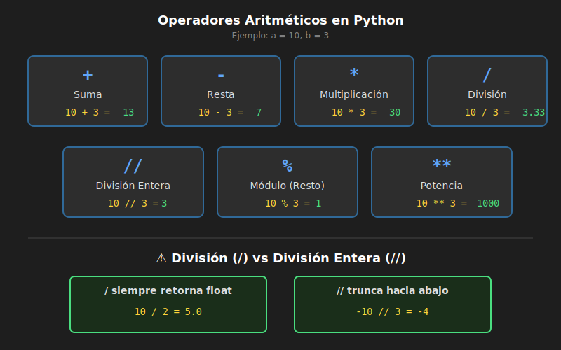

# ➕ Operadores en Python

## 🎯 Objetivos

- Conocer los operadores aritméticos
- Entender los operadores de comparación
- Aprender sobre operadores de asignación
- Comprender la precedencia de operadores

---

## 📋 Contenido

### 1. Operadores Aritméticos

Realizan operaciones matemáticas básicas:



| Operador | Nombre | Ejemplo | Resultado |
|----------|--------|---------|-----------|
| `+` | Suma | `5 + 3` | `8` |
| `-` | Resta | `5 - 3` | `2` |
| `*` | Multiplicación | `5 * 3` | `15` |
| `/` | División | `5 / 3` | `1.666...` |
| `//` | División entera | `5 // 3` | `1` |
| `%` | Módulo (resto) | `5 % 3` | `2` |
| `**` | Potencia | `5 ** 3` | `125` |

```python
a: int = 10
b: int = 3

print(f"Suma: {a} + {b} = {a + b}")           # 13
print(f"Resta: {a} - {b} = {a - b}")          # 7
print(f"Multiplicación: {a} * {b} = {a * b}") # 30
print(f"División: {a} / {b} = {a / b}")       # 3.333...
print(f"División entera: {a} // {b} = {a // b}") # 3
print(f"Módulo: {a} % {b} = {a % b}")         # 1
print(f"Potencia: {a} ** {b} = {a ** b}")     # 1000
```

#### ⚠️ División: `/` vs `//`

```python
# División normal (siempre retorna float)
resultado: float = 10 / 3  # 3.3333...
resultado: float = 10 / 2  # 5.0 (¡sigue siendo float!)

# División entera (trunca hacia abajo)
resultado: int = 10 // 3   # 3
resultado: int = -10 // 3  # -4 (no -3, trunca hacia abajo)
```

#### 🔢 El Operador Módulo (%)

El módulo retorna el **resto** de la división:

```python
# Muy útil para:

# 1. Verificar si un número es par o impar
numero: int = 7
es_par: bool = numero % 2 == 0  # False (7 es impar)

# 2. Obtener el último dígito
numero: int = 12345
ultimo_digito: int = numero % 10  # 5

# 3. Ciclos de tiempo
minutos: int = 125
horas: int = minutos // 60       # 2
mins_restantes: int = minutos % 60  # 5
print(f"{minutos} minutos = {horas}h {mins_restantes}m")
```

### 2. Operadores de Comparación

Comparan valores y retornan `bool` (`True` o `False`):

| Operador | Nombre | Ejemplo | Resultado |
|----------|--------|---------|-----------|
| `==` | Igual a | `5 == 5` | `True` |
| `!=` | Diferente de | `5 != 3` | `True` |
| `>` | Mayor que | `5 > 3` | `True` |
| `<` | Menor que | `5 < 3` | `False` |
| `>=` | Mayor o igual | `5 >= 5` | `True` |
| `<=` | Menor o igual | `5 <= 3` | `False` |

```python
x: int = 10
y: int = 5

print(f"{x} == {y}: {x == y}")   # False
print(f"{x} != {y}: {x != y}")   # True
print(f"{x} > {y}: {x > y}")     # True
print(f"{x} < {y}: {x < y}")     # False
print(f"{x} >= {y}: {x >= y}")   # True
print(f"{x} <= {y}: {x <= y}")   # False
```

#### 🔗 Comparaciones encadenadas

Python permite encadenar comparaciones:

```python
edad: int = 25

# En lugar de:
es_adulto_joven: bool = edad >= 18 and edad <= 35

# Puedes escribir:
es_adulto_joven: bool = 18 <= edad <= 35  # True

# Más ejemplos
x: int = 5
print(1 < x < 10)   # True (x está entre 1 y 10)
print(1 < x < 3)    # False (x no está entre 1 y 3)
```

### 3. Operadores de Asignación

Asignan y modifican valores:

| Operador | Equivale a | Ejemplo |
|----------|------------|---------|
| `=` | Asignación | `x = 5` |
| `+=` | `x = x + valor` | `x += 3` → `x = x + 3` |
| `-=` | `x = x - valor` | `x -= 3` → `x = x - 3` |
| `*=` | `x = x * valor` | `x *= 3` → `x = x * 3` |
| `/=` | `x = x / valor` | `x /= 3` → `x = x / 3` |
| `//=` | `x = x // valor` | `x //= 3` → `x = x // 3` |
| `%=` | `x = x % valor` | `x %= 3` → `x = x % 3` |
| `**=` | `x = x ** valor` | `x **= 3` → `x = x ** 3` |

```python
puntos: int = 100

puntos += 10   # puntos = 110
print(f"Después de +10: {puntos}")

puntos -= 20   # puntos = 90
print(f"Después de -20: {puntos}")

puntos *= 2    # puntos = 180
print(f"Después de *2: {puntos}")

puntos //= 3   # puntos = 60
print(f"Después de //3: {puntos}")
```

### 4. Operadores Lógicos

Combinan expresiones booleanas:

| Operador | Descripción | Ejemplo |
|----------|-------------|---------|
| `and` | True si ambos son True | `True and False` → `False` |
| `or` | True si al menos uno es True | `True or False` → `True` |
| `not` | Invierte el valor | `not True` → `False` |

```python
edad: int = 25
tiene_licencia: bool = True
tiene_auto: bool = False

# and - ambas condiciones deben ser True
puede_manejar: bool = edad >= 18 and tiene_licencia
print(f"¿Puede manejar? {puede_manejar}")  # True

# or - al menos una condición debe ser True
tiene_transporte: bool = tiene_licencia or tiene_auto
print(f"¿Tiene transporte? {tiene_transporte}")  # True

# not - invierte el valor
es_menor: bool = not (edad >= 18)
print(f"¿Es menor? {es_menor}")  # False
```

#### Tablas de verdad

**AND**
| A | B | A and B |
|---|---|---------|
| True | True | True |
| True | False | False |
| False | True | False |
| False | False | False |

**OR**
| A | B | A or B |
|---|---|--------|
| True | True | True |
| True | False | True |
| False | True | True |
| False | False | False |

### 5. Operadores de Identidad

Comparan si dos variables apuntan al mismo objeto:

| Operador | Descripción |
|----------|-------------|
| `is` | True si son el mismo objeto |
| `is not` | True si no son el mismo objeto |

```python
a: list = [1, 2, 3]
b: list = [1, 2, 3]
c = a

print(a == b)      # True (mismo contenido)
print(a is b)      # False (objetos diferentes)
print(a is c)      # True (mismo objeto)

# Uso común con None
resultado: str | None = None
if resultado is None:
    print("Sin resultado")
```

### 6. Operador de Pertenencia

Verifica si un valor está en una secuencia:

| Operador | Descripción |
|----------|-------------|
| `in` | True si está en la secuencia |
| `not in` | True si no está en la secuencia |

```python
texto: str = "Hola Mundo"
numeros: list = [1, 2, 3, 4, 5]

print("Mundo" in texto)      # True
print("Python" in texto)     # False
print(3 in numeros)          # True
print(10 not in numeros)     # True
```

### 7. Precedencia de Operadores

Del más alto al más bajo:

| Precedencia | Operadores |
|-------------|------------|
| 1 (más alta) | `**` |
| 2 | `+x`, `-x`, `~x` (unarios) |
| 3 | `*`, `/`, `//`, `%` |
| 4 | `+`, `-` |
| 5 | `<`, `<=`, `>`, `>=`, `!=`, `==` |
| 6 | `not` |
| 7 | `and` |
| 8 (más baja) | `or` |

```python
# Sin paréntesis
resultado = 2 + 3 * 4    # 14 (no 20)
resultado = 2 ** 3 * 2   # 16 (no 64)

# Con paréntesis (más claro)
resultado = 2 + (3 * 4)  # 14
resultado = (2 ** 3) * 2 # 16

# Siempre usa paréntesis para claridad
es_valido: bool = (edad >= 18) and (tiene_licencia or tiene_permiso)
```

### 8. Operaciones con Strings

Algunos operadores funcionan con strings:

```python
# Concatenación con +
saludo: str = "Hola" + " " + "Mundo"
print(saludo)  # Hola Mundo

# Repetición con *
linea: str = "=" * 20
print(linea)  # ====================

# Pertenencia con in
texto: str = "Python es genial"
print("Python" in texto)  # True
```

---

## 📊 Resumen

| Categoría | Operadores |
|-----------|------------|
| Aritméticos | `+`, `-`, `*`, `/`, `//`, `%`, `**` |
| Comparación | `==`, `!=`, `>`, `<`, `>=`, `<=` |
| Asignación | `=`, `+=`, `-=`, `*=`, `/=`, etc. |
| Lógicos | `and`, `or`, `not` |
| Identidad | `is`, `is not` |
| Pertenencia | `in`, `not in` |

---

## 🔥 Mini Ejercicios

### Ejercicio 1: Calculadora básica
```python
a: int = 15
b: int = 4

print(f"Suma: {a + b}")
print(f"Resta: {a - b}")
print(f"Multiplicación: {a * b}")
print(f"División: {a / b}")
print(f"División entera: {a // b}")
print(f"Módulo: {a % b}")
print(f"Potencia: {a ** b}")
```

### Ejercicio 2: Verificar mayoría de edad
```python
edad: int = 17
es_mayor: bool = edad >= 18
print(f"¿Es mayor de edad? {es_mayor}")
```

### Ejercicio 3: Convertir minutos a horas
```python
minutos_totales: int = 150
horas: int = minutos_totales // 60
minutos: int = minutos_totales % 60
print(f"{minutos_totales} minutos = {horas}h {minutos}m")
```

---

## 📚 Recursos Adicionales

- [Python Operators - W3Schools](https://www.w3schools.com/python/python_operators.asp)
- [Real Python - Operators](https://realpython.com/python-operators-expressions/)

---

## ✅ Checklist de Verificación

- [ ] Conozco los 7 operadores aritméticos
- [ ] Entiendo la diferencia entre `/` y `//`
- [ ] Sé usar el operador módulo `%`
- [ ] Puedo usar operadores de comparación
- [ ] Entiendo `and`, `or` y `not`
- [ ] Sé usar operadores de asignación compuestos (`+=`, etc.)
- [ ] Comprendo la precedencia de operadores

---

<p align="center">
  <a href="04-variables-tipos.md">⬅️ Anterior</a> •
  <a href="../2-ejercicios/01-hola-mundo/">Ir a Ejercicios ➡️</a>
</p>
