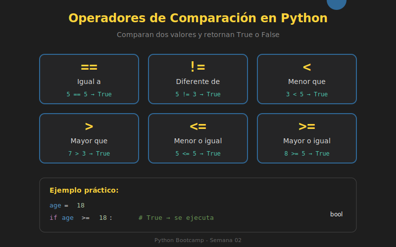

# 🔍 Operadores de Comparación

## 🎯 Objetivos

- Comprender los operadores de comparación en Python
- Diferenciar entre igualdad (`==`) e identidad (`is`)
- Usar operadores de pertenencia (`in`)
- Aplicar comparaciones encadenadas

---

## 📋 Contenido

### 1. Operadores de Comparación Básicos

Los operadores de comparación comparan dos valores y retornan un **booleano** (`True` o `False`).



| Operador | Nombre | Ejemplo | Resultado |
|----------|--------|---------|-----------|
| `==` | Igual a | `5 == 5` | `True` |
| `!=` | Diferente de | `5 != 3` | `True` |
| `<` | Menor que | `3 < 5` | `True` |
| `>` | Mayor que | `5 > 3` | `True` |
| `<=` | Menor o igual | `5 <= 5` | `True` |
| `>=` | Mayor o igual | `5 >= 3` | `True` |

```python
# Comparaciones numéricas
x: int = 10
y: int = 5

print(x == y)   # False - ¿son iguales?
print(x != y)   # True  - ¿son diferentes?
print(x > y)    # True  - ¿x es mayor que y?
print(x < y)    # False - ¿x es menor que y?
print(x >= 10)  # True  - ¿x es mayor o igual a 10?
print(y <= 5)   # True  - ¿y es menor o igual a 5?
```

---

### 2. Comparación de Strings

Los strings se comparan **lexicográficamente** (orden alfabético basado en Unicode).

```python
# Comparación alfabética
print("apple" < "banana")   # True  - 'a' viene antes que 'b'
print("Apple" < "apple")    # True  - mayúsculas antes que minúsculas
print("abc" == "abc")       # True  - exactamente iguales
print("abc" == "ABC")       # False - Python es case-sensitive

# Comparación por longitud (NO funciona con < >)
name1: str = "Ana"
name2: str = "Alexander"

# Para comparar longitudes, usa len()
print(len(name1) < len(name2))  # True - 3 < 9
```

> ⚠️ **Importante**: Las mayúsculas tienen valores Unicode menores que las minúsculas.
> `'A' = 65`, `'a' = 97`

---

### 3. Igualdad vs Identidad: `==` vs `is`

Esta es una distinción **crucial** en Python:

| Operador | Compara | Pregunta |
|----------|---------|----------|
| `==` | **Valor** | ¿Tienen el mismo contenido? |
| `is` | **Identidad** | ¿Son el mismo objeto en memoria? |

```python
# Ejemplo con listas
list1: list[int] = [1, 2, 3]
list2: list[int] = [1, 2, 3]
list3: list[int] = list1

# Comparación de VALOR
print(list1 == list2)  # True  - mismo contenido
print(list1 == list3)  # True  - mismo contenido

# Comparación de IDENTIDAD
print(list1 is list2)  # False - diferentes objetos en memoria
print(list1 is list3)  # True  - mismo objeto (list3 es alias de list1)

# Verificar con id()
print(id(list1))  # ej: 140234567890
print(id(list2))  # ej: 140234567999 (diferente)
print(id(list3))  # ej: 140234567890 (igual a list1)
```

#### Caso especial: Integers pequeños y strings

Python optimiza algunos valores comunes:

```python
# Integer caching (-5 a 256)
a: int = 100
b: int = 100
print(a is b)  # True - Python reutiliza el objeto

# Pero con números grandes...
x: int = 1000
y: int = 1000
print(x is y)  # False (puede variar según implementación)

# String interning
s1: str = "hello"
s2: str = "hello"
print(s1 is s2)  # True - Python reutiliza strings simples
```

> 💡 **Regla de oro**: Usa `==` para comparar valores, usa `is` solo para `None`.

```python
# ✅ CORRECTO
if value is None:
    print("No hay valor")

# ❌ INCORRECTO
if value == None:  # Funciona, pero no es pythónico
    print("No hay valor")
```

---

### 4. Operadores de Pertenencia: `in` y `not in`

Verifican si un elemento **existe** dentro de una secuencia.

```python
# Con listas
fruits: list[str] = ["apple", "banana", "orange"]
print("apple" in fruits)      # True
print("grape" in fruits)      # False
print("grape" not in fruits)  # True

# Con strings
message: str = "Hello, Python!"
print("Python" in message)    # True
print("Java" in message)      # False
print("H" in message)         # True - busca substring

# Con diccionarios (busca en keys)
user: dict[str, int] = {"name": "Ana", "age": 25}
print("name" in user)         # True  - busca en keys
print("Ana" in user)          # False - "Ana" no es una key
print("Ana" in user.values()) # True  - busca en values
```

---

### 5. Comparaciones Encadenadas

Python permite encadenar comparaciones de forma elegante:

```python
# En lugar de esto:
x: int = 5
if x > 0 and x < 10:
    print("x está entre 0 y 10")

# Puedes escribir:
if 0 < x < 10:
    print("x está entre 0 y 10")

# Funciona con cualquier combinación
age: int = 25
if 18 <= age <= 65:
    print("Edad laboral")

# Múltiples encadenamientos
a, b, c = 1, 2, 3
if a < b < c:
    print("Están en orden ascendente")

# También con igualdad
if a <= b <= c:
    print("Orden ascendente o iguales")
```

---

### 6. Comparación de Tipos Diferentes

Python 3 es estricto con comparaciones entre tipos:

```python
# Números: int y float se pueden comparar
print(5 == 5.0)    # True
print(5 < 5.5)     # True

# Pero strings y números NO
# print("5" == 5)  # False (no error, pero probablemente no es lo que quieres)
# print("5" > 5)   # TypeError en Python 3!

# Convierte explícitamente
num_str: str = "5"
num_int: int = 5
print(int(num_str) == num_int)  # True
```

---

## 🧪 Ejercicio Rápido

¿Qué imprime cada línea?

```python
# Intenta predecir antes de ejecutar
print(10 == 10.0)
print("Python" > "Java")
print([1, 2] == [1, 2])
print([1, 2] is [1, 2])
print("on" in "Python")
print(5 in [1, 2, 3, 4, 5])
print(0 < 5 < 10)
print(None is None)
```

<details>
<summary>Ver respuestas</summary>

```python
print(10 == 10.0)         # True  - mismo valor numérico
print("Python" > "Java")  # True  - 'P' (80) > 'J' (74) en Unicode
print([1, 2] == [1, 2])   # True  - mismo contenido
print([1, 2] is [1, 2])   # False - diferentes objetos
print("on" in "Python")   # True  - "on" es substring
print(5 in [1, 2, 3, 4, 5])  # True  - 5 está en la lista
print(0 < 5 < 10)         # True  - comparación encadenada
print(None is None)       # True  - solo hay un None en Python
```

</details>

---

## 📚 Recursos Adicionales

- [Comparisons - Python Docs](https://docs.python.org/3/reference/expressions.html#comparisons)
- [is vs == - Real Python](https://realpython.com/python-is-identity-vs-equality/)

---

## ✅ Checklist de Verificación

- [ ] Conozco los 6 operadores de comparación básicos
- [ ] Entiendo la diferencia entre `==` (valor) e `is` (identidad)
- [ ] Sé usar `in` y `not in` para verificar pertenencia
- [ ] Puedo encadenar comparaciones (ej: `0 < x < 10`)
- [ ] Uso `is None` en lugar de `== None`
