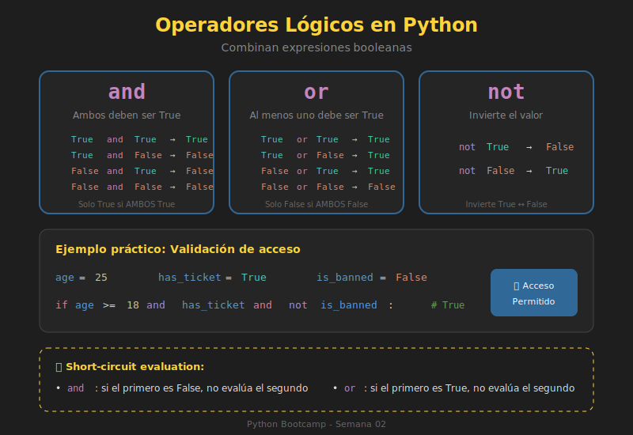

# 🔗 Operadores Lógicos

## 🎯 Objetivos

- Dominar los operadores `and`, `or` y `not`
- Comprender la precedencia de operadores
- Aplicar evaluación de cortocircuito
- Combinar condiciones de forma eficiente

---

## 📋 Contenido

### 1. Los Tres Operadores Lógicos

Python tiene tres operadores lógicos que trabajan con valores booleanos:



| Operador | Descripción | Ejemplo |
|----------|-------------|---------|
| `and` | True si **ambos** son True | `True and True` → `True` |
| `or` | True si **al menos uno** es True | `True or False` → `True` |
| `not` | Invierte el valor | `not True` → `False` |

---

### 2. Operador `and`

Retorna `True` solo si **ambas** condiciones son verdaderas.

```python
# Tabla de verdad de AND
print(True and True)    # True
print(True and False)   # False
print(False and True)   # False
print(False and False)  # False

# Ejemplo práctico: validar rango de edad
age: int = 25
has_license: bool = True

if age >= 18 and has_license:
    print("Puede conducir")  # Se imprime

# Múltiples condiciones con and
temperature: float = 22.5
humidity: int = 45
is_sunny: bool = True

if temperature > 20 and humidity < 60 and is_sunny:
    print("Día perfecto para pasear")
```

---

### 3. Operador `or`

Retorna `True` si **al menos una** condición es verdadera.

```python
# Tabla de verdad de OR
print(True or True)    # True
print(True or False)   # True
print(False or True)   # True
print(False or False)  # False

# Ejemplo práctico: múltiples opciones válidas
day: str = "Saturday"

if day == "Saturday" or day == "Sunday":
    print("Es fin de semana")  # Se imprime

# Forma más elegante con in
if day in ["Saturday", "Sunday"]:
    print("Es fin de semana")  # Equivalente
```

---

### 4. Operador `not`

Invierte el valor booleano.

```python
# Tabla de verdad de NOT
print(not True)   # False
print(not False)  # True

# Ejemplo práctico
is_raining: bool = False

if not is_raining:
    print("Buen día para salir")  # Se imprime

# Doble negación (evitar)
is_active: bool = True
print(not not is_active)  # True - confuso, mejor usar is_active directamente
```

---

### 5. Precedencia de Operadores

El orden de evaluación es: **`not` → `and` → `or`**

```python
# Sin paréntesis - Python evalúa en orden de precedencia
result = True or False and False
# Equivale a: True or (False and False)
# Equivale a: True or False
# Resultado: True

# Con paréntesis - cambia el orden
result = (True or False) and False
# Equivale a: True and False
# Resultado: False

# Ejemplo práctico
age: int = 15
has_permission: bool = True
is_adult: bool = False

# ¿Qué evalúa primero?
can_enter = is_adult or age >= 13 and has_permission
# Evaluación: is_adult or (age >= 13 and has_permission)
#           = False or (True and True)
#           = False or True
#           = True

# Mejor ser explícito con paréntesis
can_enter = is_adult or (age >= 13 and has_permission)  # Más claro
```

> 💡 **Consejo**: Usa paréntesis para hacer explícita tu intención, incluso cuando no sean necesarios.

---

### 6. Evaluación de Cortocircuito (Short-Circuit)

Python **no evalúa** el resto de la expresión si ya puede determinar el resultado.

```python
# Con AND: si el primero es False, no evalúa el segundo
def check_first() -> bool:
    print("Evaluando primero...")
    return False

def check_second() -> bool:
    print("Evaluando segundo...")
    return True

# El segundo nunca se evalúa porque el primero es False
result = check_first() and check_second()
# Output: "Evaluando primero..."
# result = False
```

```python
# Con OR: si el primero es True, no evalúa el segundo
def always_true() -> bool:
    print("Soy True")
    return True

def never_runs() -> bool:
    print("Nunca me ejecuto")
    return False

result = always_true() or never_runs()
# Output: "Soy True"
# result = True
```

#### Uso Práctico del Cortocircuito

```python
# Evitar errores con cortocircuito
user: dict | None = None

# ❌ Esto causaría error si user es None
# if user["name"] == "Ana":  # TypeError!

# ✅ Usar cortocircuito para validar primero
if user is not None and user["name"] == "Ana":
    print("Hola Ana")
# Si user es None, la segunda parte nunca se evalúa

# ✅ Forma más moderna con walrus operator
if user and (name := user.get("name")) == "Ana":
    print(f"Hola {name}")
```

---

### 7. Retorno de Valores (No Solo Booleanos)

En Python, `and` y `or` retornan **el valor que determina el resultado**, no necesariamente `True` o `False`.

```python
# OR retorna el primer valor truthy o el último
print(0 or "default")      # "default" - 0 es falsy
print("" or "fallback")    # "fallback" - "" es falsy
print(None or "backup")    # "backup" - None es falsy
print("hello" or "world")  # "hello" - ya es truthy

# AND retorna el primer valor falsy o el último
print(1 and 2 and 3)       # 3 - todos truthy, retorna último
print(1 and 0 and 3)       # 0 - primer falsy
print("a" and "b")         # "b" - ambos truthy

# Uso práctico: valores por defecto
name: str | None = None
display_name = name or "Anonymous"
print(display_name)  # "Anonymous"

# ⚠️ Cuidado con 0 y strings vacíos
count: int = 0
result = count or 10  # 10 - ¡0 es falsy!
# Si 0 es un valor válido, usa el operador ternario:
result = count if count is not None else 10
```

---

### 8. Combinando Operadores

```python
# Ejemplo complejo: sistema de acceso
def can_access_system(
    user_age: int,
    is_employee: bool,
    has_clearance: bool,
    is_emergency: bool
) -> bool:
    """
    Determina si un usuario puede acceder al sistema.

    Reglas:
    - Empleados mayores de 18 con clearance pueden acceder
    - En emergencias, cualquier empleado mayor de 18 puede acceder
    - No empleados nunca pueden acceder
    """
    is_adult = user_age >= 18

    normal_access = is_adult and is_employee and has_clearance
    emergency_access = is_adult and is_employee and is_emergency

    return normal_access or emergency_access

# Tests
print(can_access_system(25, True, True, False))   # True - acceso normal
print(can_access_system(25, True, False, True))   # True - emergencia
print(can_access_system(25, True, False, False))  # False - sin clearance
print(can_access_system(16, True, True, False))   # False - menor de edad
print(can_access_system(25, False, True, True))   # False - no es empleado
```

---

## 🧪 Ejercicio Rápido

¿Qué imprime cada línea?

```python
# Intenta predecir antes de ejecutar
print(True and False or True)
print(not True or True)
print(False or 0 or "" or "hello" or [])
print(1 and 2 and 3)
print("" and "hello")
print(None or 0 or False or "found!")
```

<details>
<summary>Ver respuestas</summary>

```python
print(True and False or True)           # True (False or True)
print(not True or True)                 # True (False or True)
print(False or 0 or "" or "hello" or [])  # "hello" (primer truthy)
print(1 and 2 and 3)                    # 3 (último truthy)
print("" and "hello")                   # "" (primer falsy)
print(None or 0 or False or "found!")   # "found!" (primer truthy)
```

</details>

---

## 📚 Recursos Adicionales

- [Boolean Operations - Python Docs](https://docs.python.org/3/reference/expressions.html#boolean-operations)
- [Short-Circuit Evaluation - Real Python](https://realpython.com/python-boolean/)

---

## ✅ Checklist de Verificación

- [ ] Conozco las tablas de verdad de `and`, `or` y `not`
- [ ] Entiendo la precedencia: `not` → `and` → `or`
- [ ] Sé aplicar evaluación de cortocircuito
- [ ] Comprendo que `and`/`or` retornan valores, no solo booleanos
- [ ] Uso paréntesis para clarificar expresiones complejas
