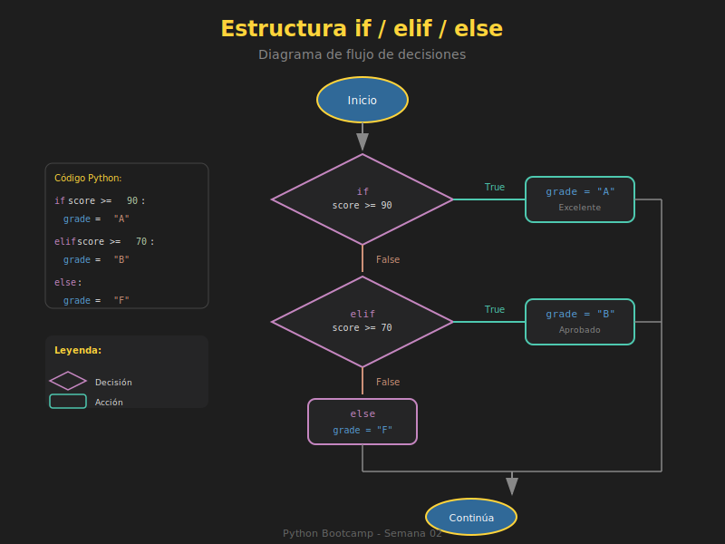

# 🔀 Condicionales if/elif/else

## 🎯 Objetivos

- Dominar la estructura if/elif/else
- Aplicar condicionales anidados correctamente
- Usar el operador ternario para expresiones concisas
- Evitar errores comunes en condicionales

---

## 📋 Contenido

### 1. Estructura Básica: `if`

El `if` ejecuta un bloque de código **solo si** la condición es verdadera.



```python
# Sintaxis básica
age: int = 20

if age >= 18:
    print("Eres mayor de edad")
    print("Puedes votar")

# Se ejecuta si age >= 18, si no, continúa sin hacer nada
print("Programa continúa...")
```

> ⚠️ **Importante**: La **indentación** (4 espacios) define el bloque de código.

---

### 2. Estructura `if-else`

El `else` se ejecuta cuando la condición del `if` es **falsa**.

```python
temperature: float = 15.0

if temperature > 25:
    print("Hace calor")
else:
    print("No hace tanto calor")

# Solo uno de los dos bloques se ejecuta
```

```python
# Ejemplo práctico: validación de usuario
password: str = "secret123"
user_input: str = input("Ingresa la contraseña: ")

if user_input == password:
    print("✅ Acceso concedido")
else:
    print("❌ Contraseña incorrecta")
```

---

### 3. Estructura `if-elif-else`

`elif` (else if) permite múltiples condiciones.

```python
score: int = 85

if score >= 90:
    grade = "A"
elif score >= 80:
    grade = "B"
elif score >= 70:
    grade = "C"
elif score >= 60:
    grade = "D"
else:
    grade = "F"

print(f"Tu calificación es: {grade}")  # B
```

**Orden de evaluación**: Python evalúa de arriba hacia abajo y ejecuta el **primer** bloque que sea verdadero.

```python
# ⚠️ El orden importa
value: int = 95

# ❌ MAL - nunca alcanza la condición más específica
if value >= 60:
    print("Aprobado")     # Esto se ejecuta
elif value >= 90:
    print("Excelente")    # Nunca se alcanza

# ✅ BIEN - de más específico a menos específico
if value >= 90:
    print("Excelente")    # Esto se ejecuta
elif value >= 60:
    print("Aprobado")
```

---

### 4. Condicionales Anidados

Puedes poner condicionales dentro de otros condicionales.

```python
age: int = 25
has_license: bool = True
has_car: bool = False

if age >= 18:
    print("Eres mayor de edad")

    if has_license:
        print("Tienes licencia")

        if has_car:
            print("¡Puedes conducir tu auto!")
        else:
            print("Necesitas un auto")
    else:
        print("Necesitas obtener tu licencia")
else:
    print("Eres menor de edad")
```

> 💡 **Consejo**: Evita más de 2-3 niveles de anidamiento. Refactoriza si es necesario.

```python
# ✅ Mejor: usar early returns o combinar condiciones
def can_drive(age: int, has_license: bool, has_car: bool) -> str:
    if age < 18:
        return "Eres menor de edad"

    if not has_license:
        return "Necesitas obtener tu licencia"

    if not has_car:
        return "Necesitas un auto"

    return "¡Puedes conducir tu auto!"
```

---

### 5. Operador Ternario

Una forma concisa de escribir if-else en una sola línea.

```python
# Sintaxis: valor_si_true if condición else valor_si_false

age: int = 20

# Forma tradicional
if age >= 18:
    status = "adulto"
else:
    status = "menor"

# Forma ternaria (equivalente)
status = "adulto" if age >= 18 else "menor"
print(status)  # "adulto"
```

#### Casos de Uso del Operador Ternario

```python
# Asignar valores condicionales
score: int = 75
result = "Aprobado" if score >= 60 else "Reprobado"

# En f-strings
count: int = 1
print(f"Hay {count} {'item' if count == 1 else 'items'}")

# En return statements
def get_absolute(n: int) -> int:
    return n if n >= 0 else -n

# En listas
numbers = [1, -2, 3, -4, 5]
absolutes = [n if n >= 0 else -n for n in numbers]
# [1, 2, 3, 4, 5]
```

#### Cuándo NO usar el Operador Ternario

```python
# ❌ MAL - demasiado complejo
result = "A" if score >= 90 else "B" if score >= 80 else "C" if score >= 70 else "F"

# ✅ BIEN - usar if/elif para múltiples condiciones
if score >= 90:
    result = "A"
elif score >= 80:
    result = "B"
elif score >= 70:
    result = "C"
else:
    result = "F"
```

---

### 6. Condiciones Múltiples

Combina condiciones con operadores lógicos.

```python
# AND - ambas deben ser verdaderas
age: int = 25
income: float = 50000.0

if age >= 21 and income >= 30000:
    print("Aprobado para crédito")

# OR - al menos una debe ser verdadera
day: str = "Saturday"

if day == "Saturday" or day == "Sunday":
    print("Es fin de semana")

# NOT - invierte la condición
is_holiday: bool = False

if not is_holiday:
    print("Día laboral")

# Combinación
if (age >= 18 and income >= 30000) or has_guarantor:
    print("Puede aplicar al préstamo")
```

---

### 7. Patrones Comunes

#### Validar Entrada de Usuario

```python
user_input: str = input("Ingresa un número: ")

if user_input.isdigit():
    number = int(user_input)
    print(f"El doble es: {number * 2}")
else:
    print("Error: debes ingresar un número válido")
```

#### Verificar Rango

```python
# Usando comparación encadenada
age: int = 25

if 18 <= age <= 65:
    print("Edad laboral")
elif age < 18:
    print("Menor de edad")
else:
    print("Tercera edad")
```

#### Verificar Valor en Lista

```python
valid_options: list[str] = ["rock", "paper", "scissors"]
choice: str = input("Elige (rock/paper/scissors): ").lower()

if choice in valid_options:
    print(f"Elegiste: {choice}")
else:
    print("Opción no válida")
```

#### Verificar None

```python
data: dict | None = get_data()  # Puede retornar None

# ✅ Forma correcta
if data is not None:
    process(data)

# ✅ También válido (aprovecha truthiness)
if data:
    process(data)
```

---

### 8. Errores Comunes

```python
# ❌ Error 1: Usar = en lugar de ==
x = 5
# if x = 5:  # SyntaxError!
if x == 5:   # ✅ Correcto
    print("x es 5")

# ❌ Error 2: Olvidar los dos puntos
# if x == 5  # SyntaxError!
if x == 5:   # ✅ Correcto
    print("OK")

# ❌ Error 3: Indentación incorrecta
# if x == 5:
# print("Sin indentación")  # IndentationError!

# ❌ Error 4: Comparar con True/False explícitamente
is_valid = True
# if is_valid == True:  # ❌ Redundante
if is_valid:            # ✅ Pythónico
    print("Es válido")

# ❌ Error 5: Usar or de forma incorrecta
day = "Monday"
# if day == "Saturday" or "Sunday":  # ❌ Siempre True!
if day == "Saturday" or day == "Sunday":  # ✅ Correcto
    print("Fin de semana")
# O mejor:
if day in ["Saturday", "Sunday"]:  # ✅ Más elegante
    print("Fin de semana")
```

---

## 🧪 Ejercicio Rápido

Escribe una función que clasifique un IMC (Índice de Masa Corporal):

```python
def classify_bmi(bmi: float) -> str:
    """
    Clasifica el IMC según los rangos de la OMS:
    - Bajo peso: < 18.5
    - Normal: 18.5 - 24.9
    - Sobrepeso: 25 - 29.9
    - Obesidad: >= 30
    """
    # Tu código aquí
    pass

# Tests
print(classify_bmi(17.5))   # "Bajo peso"
print(classify_bmi(22.0))   # "Normal"
print(classify_bmi(27.5))   # "Sobrepeso"
print(classify_bmi(35.0))   # "Obesidad"
```

<details>
<summary>Ver solución</summary>

```python
def classify_bmi(bmi: float) -> str:
    if bmi < 18.5:
        return "Bajo peso"
    elif bmi < 25:
        return "Normal"
    elif bmi < 30:
        return "Sobrepeso"
    else:
        return "Obesidad"
```

</details>

---

## 📚 Recursos Adicionales

- [Control Flow - Python Docs](https://docs.python.org/3/tutorial/controlflow.html)
- [Conditional Statements - Real Python](https://realpython.com/python-conditional-statements/)

---

## ✅ Checklist de Verificación

- [ ] Sé usar if, elif y else correctamente
- [ ] Entiendo la importancia del orden en elif
- [ ] Puedo usar el operador ternario para casos simples
- [ ] Evito anidamiento excesivo (máximo 2-3 niveles)
- [ ] Uso `is None` en lugar de `== None`
- [ ] No comparo con `== True` o `== False`
