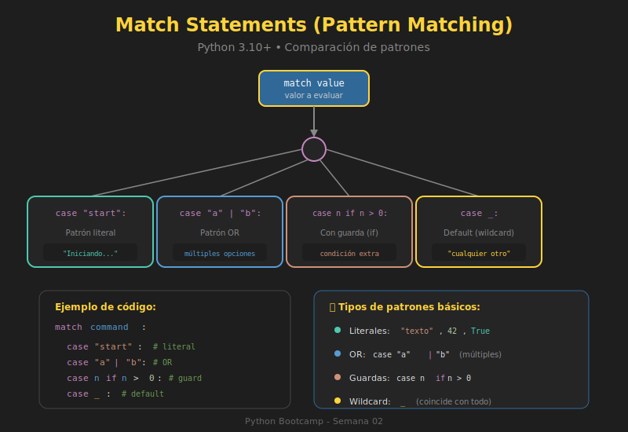

# 🎯 Match Statements (Pattern Matching)

## 🎯 Objetivos

- Comprender la sintaxis de match/case de Python 3.10+
- Aplicar patrones literales y combinados con OR
- Usar guardas (guards) para condiciones adicionales
- Saber cuándo usar match vs if/elif

---

## 📋 Contenido

### 1. Introducción a Match Statements

`match` es la versión de Python del "switch/case" de otros lenguajes. Es ideal para comparar un valor contra múltiples opciones.



```python
# Sintaxis básica
def handle_command(command: str) -> str:
    match command:
        case "start":
            return "Iniciando..."
        case "stop":
            return "Deteniendo..."
        case "pause":
            return "Pausando..."
        case _:
            return "Comando desconocido"

print(handle_command("start"))  # "Iniciando..."
print(handle_command("exit"))   # "Comando desconocido"
```

> ⚠️ **Requisito**: Match statements requieren **Python 3.10** o superior.

---

### 2. Patrones Literales

El caso más básico: comparar con valores específicos (strings, números).

```python
def get_day_type(day: str) -> str:
    match day.lower():
        case "monday":
            return "Inicio de semana"
        case "friday":
            return "¡Viernes!"
        case _:
            return "Otro día"

print(get_day_type("Monday"))  # "Inicio de semana"
print(get_day_type("Friday"))  # "¡Viernes!"
print(get_day_type("Tuesday")) # "Otro día"
```

#### Patrones Numéricos

```python
def http_status(code: int) -> str:
    match code:
        case 200:
            return "OK"
        case 201:
            return "Created"
        case 400:
            return "Bad Request"
        case 404:
            return "Not Found"
        case 500:
            return "Internal Server Error"
        case _:
            return f"Unknown status code: {code}"

print(http_status(200))  # "OK"
print(http_status(418))  # "Unknown status code: 418"
```

---

### 3. Patrón Wildcard (`_`)

El guión bajo `_` coincide con **cualquier valor** y actúa como "default".

```python
def get_color_emoji(color: str) -> str:
    match color.lower():
        case "red":
            return "🔴"
        case "green":
            return "🟢"
        case "blue":
            return "🔵"
        case "yellow":
            return "🟡"
        case _:  # Default - cualquier otro color
            return "⚪"

print(get_color_emoji("red"))     # "🔴"
print(get_color_emoji("purple"))  # "⚪"
```

> 💡 El `_` debe ir **siempre al final** ya que coincide con todo.

---

### 4. Patrones Combinados con OR (`|`)

El operador `|` permite combinar múltiples patrones en un solo case.

```python
def get_day_type(day: str) -> str:
    match day.lower():
        case "monday":
            return "😩 Inicio de semana"
        case "tuesday" | "wednesday" | "thursday":
            return "📅 Entre semana"
        case "friday":
            return "🎉 ¡Viernes!"
        case "saturday" | "sunday":
            return "🏖️ Fin de semana"
        case _:
            return "❓ Día no válido"

print(get_day_type("Tuesday"))   # "📅 Entre semana"
print(get_day_type("Saturday"))  # "🏖️ Fin de semana"
```

#### Combinando Números

```python
def http_status_category(code: int) -> str:
    match code:
        case 200 | 201 | 204:
            return "✅ Success"
        case 400 | 401 | 403 | 404:
            return "⚠️ Client Error"
        case 500 | 502 | 503:
            return "❌ Server Error"
        case _:
            return "❓ Unknown"

print(http_status_category(200))  # "✅ Success"
print(http_status_category(404))  # "⚠️ Client Error"
```

---

### 5. Captura de Valores

Puedes capturar el valor coincidente en una variable para usarlo.

```python
def describe_number(n: int) -> str:
    match n:
        case 0:
            return "Es cero"
        case 1:
            return "Es uno"
        case other:  # Captura cualquier otro valor en 'other'
            return f"Es el número {other}"

print(describe_number(0))   # "Es cero"
print(describe_number(42))  # "Es el número 42"
```

---

### 6. Patrones con Guardas (Guards)

Las guardas añaden condiciones adicionales con `if` después del patrón.

```python
def classify_age(age: int) -> str:
    match age:
        case n if n < 0:
            return "Edad inválida"
        case n if n < 13:
            return "Niño"
        case n if n < 18:
            return "Adolescente"
        case n if n < 65:
            return "Adulto"
        case _:
            return "Adulto mayor"

print(classify_age(-1))   # "Edad inválida"
print(classify_age(10))   # "Niño"
print(classify_age(15))   # "Adolescente"
print(classify_age(30))   # "Adulto"
print(classify_age(70))   # "Adulto mayor"
```

#### Más Ejemplos con Guardas

```python
def classify_temperature(temp: float) -> str:
    match temp:
        case t if t < 0:
            return "🥶 Congelante"
        case t if t < 15:
            return "❄️ Frío"
        case t if t < 25:
            return "🌤️ Agradable"
        case t if t < 35:
            return "☀️ Caluroso"
        case _:
            return "🔥 Extremo"

print(classify_temperature(-5))   # "🥶 Congelante"
print(classify_temperature(22))   # "🌤️ Agradable"
print(classify_temperature(40))   # "🔥 Extremo"
```

```python
def grade_score(score: int) -> str:
    match score:
        case s if s < 0 or s > 100:
            return "Puntaje inválido"
        case s if s >= 90:
            return "A - Excelente"
        case s if s >= 80:
            return "B - Muy bien"
        case s if s >= 70:
            return "C - Bien"
        case s if s >= 60:
            return "D - Suficiente"
        case _:
            return "F - Reprobado"

print(grade_score(95))   # "A - Excelente"
print(grade_score(75))   # "C - Bien"
print(grade_score(45))   # "F - Reprobado"
```

---

### 7. Cuándo Usar match vs if/elif

| Usa `match` cuando... | Usa `if/elif` cuando... |
|----------------------|-------------------------|
| Comparas contra múltiples valores específicos | Tienes solo 2-3 condiciones |
| Los casos son mutuamente excluyentes | Las condiciones son complejas |
| Quieres código más legible | Necesitas compatibilidad con Python < 3.10 |
| Tienes muchas opciones (menús, comandos) | Comparas rangos simples |

```python
# ✅ Buen uso de match - múltiples valores específicos
def get_planet_position(planet: str) -> int:
    match planet.lower():
        case "mercury":
            return 1
        case "venus":
            return 2
        case "earth":
            return 3
        case "mars":
            return 4
        case _:
            return -1

# ✅ Buen uso de if - condiciones de rango simples
def get_discount(total: float) -> float:
    if total >= 1000:
        return 0.20
    elif total >= 500:
        return 0.10
    elif total >= 100:
        return 0.05
    else:
        return 0
```

---

### 8. Ejemplo Práctico: Menú de Opciones

```python
def process_menu_option(option: str) -> str:
    """Procesa la selección de un menú."""
    match option.lower():
        case "1" | "new" | "n":
            return "Creando nuevo archivo..."
        case "2" | "open" | "o":
            return "Abriendo archivo..."
        case "3" | "save" | "s":
            return "Guardando archivo..."
        case "4" | "quit" | "q" | "exit":
            return "Saliendo del programa..."
        case "help" | "h" | "?":
            return "Mostrando ayuda..."
        case _:
            return "Opción no válida. Escribe 'help' para ver opciones."

# Simulación de uso
print(process_menu_option("1"))      # "Creando nuevo archivo..."
print(process_menu_option("save"))   # "Guardando archivo..."
print(process_menu_option("q"))      # "Saliendo del programa..."
print(process_menu_option("xyz"))    # "Opción no válida..."
```

---

## 🧪 Ejercicio Rápido

Implementa un traductor de notas musicales:

```python
def note_to_frequency(note: str) -> str:
    """
    Retorna la frecuencia aproximada de una nota musical.
    - "do" o "c" -> "261 Hz"
    - "re" o "d" -> "293 Hz"
    - "mi" o "e" -> "329 Hz"
    - "fa" o "f" -> "349 Hz"
    - "sol" o "g" -> "392 Hz"
    - "la" o "a" -> "440 Hz"
    - "si" o "b" -> "493 Hz"
    - otro -> "Nota desconocida"
    """
    # Tu código aquí
    pass

# Tests
print(note_to_frequency("do"))   # "261 Hz"
print(note_to_frequency("A"))    # "440 Hz"
print(note_to_frequency("sol"))  # "392 Hz"
print(note_to_frequency("x"))    # "Nota desconocida"
```

<details>
<summary>Ver solución</summary>

```python
def note_to_frequency(note: str) -> str:
    match note.lower():
        case "do" | "c":
            return "261 Hz"
        case "re" | "d":
            return "293 Hz"
        case "mi" | "e":
            return "329 Hz"
        case "fa" | "f":
            return "349 Hz"
        case "sol" | "g":
            return "392 Hz"
        case "la" | "a":
            return "440 Hz"
        case "si" | "b":
            return "493 Hz"
        case _:
            return "Nota desconocida"
```

</details>

---

## 📚 Recursos Adicionales

- [Match Statements - Python Docs](https://docs.python.org/3/reference/compound_stmts.html#the-match-statement)
- [PEP 634 - Structural Pattern Matching](https://peps.python.org/pep-0634/)

---

## 🔮 Adelanto: Patrones Avanzados

En semanas posteriores, cuando aprendas sobre **listas, tuplas y diccionarios**, verás que `match` puede hacer cosas mucho más poderosas como:

- Desempaquetar secuencias: `case [first, second, *rest]:`
- Patrones de diccionarios: `case {"type": "click", "x": x}:`
- Patrones de clases: `case Point(x=0, y=0):`

Por ahora, domina los patrones literales, OR y guardas. ¡Son la base!

---

## ✅ Checklist de Verificación

- [ ] Entiendo la sintaxis básica de match/case
- [ ] Sé usar el patrón wildcard `_` como default
- [ ] Puedo combinar patrones con `|` (OR)
- [ ] Sé añadir guardas con `if` para condiciones
- [ ] Conozco cuándo usar match vs if/elif
