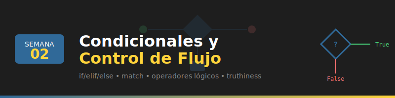

# 📘 Semana 02: Condicionales y Control de Flujo



## 🎯 Objetivos de Aprendizaje

Al finalizar esta semana, serás capaz de:

- ✅ Utilizar operadores de comparación y lógicos
- ✅ Implementar estructuras condicionales (if/elif/else)
- ✅ Aplicar el operador ternario para expresiones concisas
- ✅ Usar match statements (Python 3.10+) para pattern matching
- ✅ Comprender truthiness y falsiness en Python
- ✅ Combinar condiciones de forma eficiente

---

## 📚 Requisitos Previos

Antes de comenzar esta semana, debes:

- ✅ Haber completado la **Semana 01** (Fundamentos)
- ✅ Conocer variables y tipos de datos básicos
- ✅ Saber usar operadores aritméticos
- ✅ Tener el entorno de desarrollo configurado (Docker + VS Code)

---

## 🗂️ Estructura de la Semana

```
week-02/
├── 📄 README.md                    # Este archivo
├── 📄 rubrica-evaluacion.md        # Criterios de evaluación
├── 📁 0-assets/                    # Recursos visuales
├── 📁 1-teoria/                    # Material teórico
│   ├── 01-operadores-comparacion.md
│   ├── 02-operadores-logicos.md
│   ├── 03-condicionales-if.md
│   ├── 04-match-statements.md
│   └── 05-truthiness-falsiness.md
├── 📁 2-ejercicios/                # Ejercicios prácticos
│   ├── 01-comparaciones/
│   ├── 02-condicionales/
│   └── 03-match-patterns/
├── 📁 3-proyecto/                  # Proyecto integrador
│   ├── README.md
│   ├── starter/
│   └── solution/                   # ⚠️ Solo instructores
├── 📁 4-recursos/                  # Material complementario
│   ├── ebooks-free/
│   ├── videografia/
│   └── webgrafia/
└── 📁 5-glosario/                  # Términos clave
```

---

## 📝 Contenidos

### 1️⃣ Teoría

| #  | Tema | Descripción | Duración |
|----|------|-------------|----------|
| 01 | [Operadores de Comparación](1-teoria/01-operadores-comparacion.md) | ==, !=, <, >, <=, >=, is, in | 20 min |
| 02 | [Operadores Lógicos](1-teoria/02-operadores-logicos.md) | and, or, not y precedencia | 20 min |
| 03 | [Condicionales if/elif/else](1-teoria/03-condicionales-if.md) | Estructuras de decisión | 25 min |
| 04 | [Match Statements](1-teoria/04-match-statements.md) | Pattern matching en Python 3.10+ | 20 min |
| 05 | [Truthiness y Falsiness](1-teoria/05-truthiness-falsiness.md) | Valores truthy/falsy y cortocircuito | 15 min |

### 2️⃣ Ejercicios Prácticos

| #  | Ejercicio | Tema | Dificultad |
|----|-----------|------|------------|
| 01 | [Comparaciones](2-ejercicios/01-comparaciones/) | Operadores de comparación | 🟢 Básico |
| 02 | [Condicionales](2-ejercicios/02-condicionales/) | if/elif/else y ternario | 🟡 Intermedio |
| 03 | [Match Patterns](2-ejercicios/03-match-patterns/) | Pattern matching | 🟡 Intermedio |

### 3️⃣ Proyecto Integrador

| Proyecto | Descripción | Duración |
|----------|-------------|----------|
| [🎮 Juego de Aventura](3-proyecto/) | Sistema de decisiones con múltiples caminos | 2 horas |

---

## ⏱️ Distribución del Tiempo

| Actividad | Tiempo Estimado |
|-----------|-----------------|
| 📖 Teoría | 1.5 - 2 horas |
| 💻 Ejercicios | 2.5 - 3 horas |
| 🎯 Proyecto | 1.5 - 2 horas |
| **Total** | **~6 horas** |

---

## 📌 Entregables

Al finalizar la semana debes entregar:

1. **Ejercicios completados** (3 ejercicios)
2. **Proyecto "Juego de Aventura"** funcionando
3. **Código limpio** con type hints

---

## 💡 Consejos para esta Semana

1. **Practica la indentación** - Python usa espacios para definir bloques
2. **Usa match para casos múltiples** - Es más legible que muchos elif
3. **Aprovecha el cortocircuito** - `and` y `or` evalúan de izquierda a derecha
4. **Conoce los valores falsy** - `0`, `""`, `[]`, `None`, `False`

---

## 🔗 Navegación

| ⬅️ Anterior | 🏠 Inicio | Siguiente ➡️ |
|-------------|-----------|--------------|
| [Semana 01: Fundamentos](../week-01/) | [Bootcamp](../../) | [Semana 03: Bucles](../week-03/) |

---

## 📚 Recursos Adicionales

- 📖 [Python Control Flow - Docs Oficiales](https://docs.python.org/3/tutorial/controlflow.html)
- 📖 [Match Statements - PEP 634](https://peps.python.org/pep-0634/)
- 🎥 [Real Python - Conditional Statements](https://realpython.com/python-conditional-statements/)

---

*💡 Tip: Las estructuras de control son la base de la lógica de programación. Domínalas bien antes de avanzar.*
