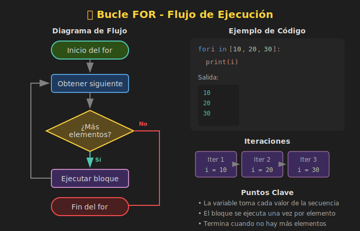

# 🔄 Bucle For

## 🎯 Objetivos

- Comprender la sintaxis del bucle `for`
- Iterar sobre strings, listas y otros iterables
- Usar `enumerate()` para obtener índices
- Conocer patrones comunes de iteración

---

## 📋 Contenido

### 1. ¿Qué es un Bucle?

Un **bucle** (loop) es una estructura que repite un bloque de código múltiples veces. En lugar de escribir código repetitivo, usamos bucles para automatizar tareas.



```python
# ❌ Sin bucle - repetitivo
print("Hola 1")
print("Hola 2")
print("Hola 3")
print("Hola 4")
print("Hola 5")

# ✅ Con bucle - elegante
for i in range(1, 6):
    print(f"Hola {i}")
```

---

### 2. Sintaxis del Bucle For

El bucle `for` itera sobre cada elemento de una **secuencia** (string, lista, rango, etc.).

```python
for variable in secuencia:
    # código que se ejecuta para cada elemento
    print(variable)
```

**Componentes:**
- `for`: palabra clave que inicia el bucle
- `variable`: nombre que toma el valor de cada elemento
- `in`: palabra clave que conecta variable con secuencia
- `secuencia`: colección sobre la que se itera
- `:`: indica inicio del bloque
- **Bloque indentado**: código que se repite

---

### 3. Iterando sobre Strings

Un string es una secuencia de caracteres, podemos iterar sobre cada uno:

```python
word: str = "Python"

for letter in word:
    print(letter)

# Salida:
# P
# y
# t
# h
# o
# n
```

#### Ejemplo: Contar Vocales

```python
def count_vowels(text: str) -> int:
    """Cuenta las vocales en un texto."""
    vowels: str = "aeiouAEIOU"
    count: int = 0

    for char in text:
        if char in vowels:
            count += 1

    return count

print(count_vowels("Python"))      # 1
print(count_vowels("Programación")) # 5
```

---

### 4. Iterando sobre Rangos con range()

`range()` genera una secuencia de números (se verá en detalle en el siguiente archivo):

```python
# range(stop) - de 0 a stop-1
for i in range(5):
    print(i)  # 0, 1, 2, 3, 4

# range(start, stop) - de start a stop-1
for i in range(1, 6):
    print(i)  # 1, 2, 3, 4, 5

# range(start, stop, step) - con incremento
for i in range(0, 10, 2):
    print(i)  # 0, 2, 4, 6, 8
```

---

### 5. Usando enumerate()

`enumerate()` retorna tanto el **índice** como el **valor** de cada elemento:

```python
fruits: list[str] = ["manzana", "banana", "cereza"]

# Sin enumerate - solo valores
for fruit in fruits:
    print(fruit)

# Con enumerate - índice y valor
for index, fruit in enumerate(fruits):
    print(f"{index}: {fruit}")

# Salida:
# 0: manzana
# 1: banana
# 2: cereza
```

#### Iniciar desde otro índice

```python
# Empezar desde 1 en lugar de 0
for index, fruit in enumerate(fruits, start=1):
    print(f"{index}. {fruit}")

# Salida:
# 1. manzana
# 2. banana
# 3. cereza
```

---

### 6. Acumuladores y Contadores

Patrones muy comunes con bucles:

#### Contador

```python
def count_uppercase(text: str) -> int:
    """Cuenta letras mayúsculas."""
    count: int = 0  # Inicializar contador

    for char in text:
        if char.isupper():
            count += 1  # Incrementar

    return count

print(count_uppercase("HoLa MuNdO"))  # 4
```

#### Acumulador

```python
def sum_digits(number: int) -> int:
    """Suma los dígitos de un número."""
    total: int = 0  # Inicializar acumulador

    for digit in str(number):
        total += int(digit)  # Acumular

    return total

print(sum_digits(12345))  # 15 (1+2+3+4+5)
```

---

### 7. Construir Strings con Bucles

```python
def reverse_string(text: str) -> str:
    """Invierte un string."""
    result: str = ""  # String vacío

    for char in text:
        result = char + result  # Agregar al inicio

    return result

print(reverse_string("Python"))  # "nohtyP"
```

#### Alternativa: Construir lista y unir

```python
def to_uppercase_spaced(text: str) -> str:
    """Convierte a mayúsculas con espacios."""
    chars: list[str] = []

    for char in text:
        chars.append(char.upper())

    return " ".join(chars)

print(to_uppercase_spaced("hola"))  # "H O L A"
```

---

### 8. Bucles Anidados

Un bucle dentro de otro:

```python
# Tabla de multiplicar simple
for i in range(1, 4):
    for j in range(1, 4):
        print(f"{i} x {j} = {i * j}")
    print("---")

# Salida:
# 1 x 1 = 1
# 1 x 2 = 2
# 1 x 3 = 3
# ---
# 2 x 1 = 2
# ...
```

#### Patrón de asteriscos

```python
def print_triangle(rows: int) -> None:
    """Imprime un triángulo de asteriscos."""
    for i in range(1, rows + 1):
        print("*" * i)

print_triangle(5)
# *
# **
# ***
# ****
# *****
```

---

### 9. Errores Comunes

#### ❌ Modificar la secuencia mientras se itera

```python
# ❌ MAL - puede causar comportamiento inesperado
numbers = [1, 2, 3, 4, 5]
for num in numbers:
    if num % 2 == 0:
        numbers.remove(num)  # ¡No hacer esto!

# ✅ BIEN - usar copia o list comprehension
numbers = [1, 2, 3, 4, 5]
numbers = [num for num in numbers if num % 2 != 0]
```

#### ❌ No usar la variable del bucle

```python
# ❌ Desperdicia la variable
for i in range(5):
    print("Hola")  # 'i' no se usa

# ✅ Usar _ para indicar que no se necesita
for _ in range(5):
    print("Hola")
```

---

## 🧪 Ejercicio Rápido

Implementa una función que cuente palabras que empiezan con mayúscula:

```python
def count_capitalized(sentence: str) -> int:
    """
    Cuenta palabras que empiezan con mayúscula.

    >>> count_capitalized("Hola Mundo Python")
    3
    >>> count_capitalized("hola mundo")
    0
    """
    # Tu código aquí
    pass
```

<details>
<summary>Ver solución</summary>

```python
def count_capitalized(sentence: str) -> int:
    count: int = 0
    words = sentence.split()

    for word in words:
        if word[0].isupper():
            count += 1

    return count
```

</details>

---

## 📚 Recursos Adicionales

- [Python Docs - for Statements](https://docs.python.org/3/tutorial/controlflow.html#for-statements)
- [Real Python - Python for Loop](https://realpython.com/python-for-loop/)

---

## ✅ Checklist de Verificación

- [ ] Entiendo la sintaxis básica de `for`
- [ ] Puedo iterar sobre strings y rangos
- [ ] Sé usar `enumerate()` para obtener índices
- [ ] Puedo implementar contadores y acumuladores
- [ ] Conozco el patrón de bucles anidados
