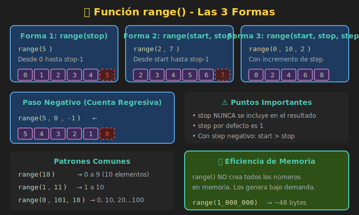

# 🔢 Función range()

## 🎯 Objetivos

- Dominar la función `range()` con sus tres formas
- Entender la diferencia entre `range()` y listas
- Usar rangos para generar secuencias numéricas
- Aplicar rangos con paso negativo para contar hacia atrás

---

## 📋 Contenido

### 1. ¿Qué es range()?

`range()` es una función que genera una **secuencia de números enteros**. Es muy eficiente porque no crea todos los números en memoria de una vez.



```python
# range() genera números bajo demanda
r = range(5)
print(r)        # range(0, 5)
print(type(r))  # <class 'range'>

# Convertir a lista para ver los valores
print(list(r))  # [0, 1, 2, 3, 4]
```

---

### 2. Tres Formas de range()

#### Forma 1: `range(stop)`

Genera números desde **0** hasta **stop - 1**.

```python
# range(5) → 0, 1, 2, 3, 4
for i in range(5):
    print(i, end=" ")
# Salida: 0 1 2 3 4

# ¡Cuidado! No incluye el 5
print(list(range(5)))  # [0, 1, 2, 3, 4]
```

#### Forma 2: `range(start, stop)`

Genera números desde **start** hasta **stop - 1**.

```python
# range(1, 6) → 1, 2, 3, 4, 5
for i in range(1, 6):
    print(i, end=" ")
# Salida: 1 2 3 4 5

# range(10, 15) → 10, 11, 12, 13, 14
print(list(range(10, 15)))  # [10, 11, 12, 13, 14]
```

#### Forma 3: `range(start, stop, step)`

Genera números desde **start** hasta **stop - 1**, incrementando de **step** en **step**.

```python
# range(0, 10, 2) → números pares
for i in range(0, 10, 2):
    print(i, end=" ")
# Salida: 0 2 4 6 8

# range(1, 10, 2) → números impares
print(list(range(1, 10, 2)))  # [1, 3, 5, 7, 9]

# range(0, 100, 10) → decenas
print(list(range(0, 100, 10)))  # [0, 10, 20, 30, 40, 50, 60, 70, 80, 90]
```

---

### 3. Rangos con Paso Negativo

Usar `step` negativo para contar hacia atrás:

```python
# Cuenta regresiva: 10, 9, 8, 7, 6, 5, 4, 3, 2, 1
for i in range(10, 0, -1):
    print(i, end=" ")
# Salida: 10 9 8 7 6 5 4 3 2 1

# range(5, 0, -1) → 5, 4, 3, 2, 1
print(list(range(5, 0, -1)))  # [5, 4, 3, 2, 1]

# range(100, 0, -10) → 100, 90, 80, ...
print(list(range(100, 0, -10)))  # [100, 90, 80, 70, 60, 50, 40, 30, 20, 10]
```

> ⚠️ **Importante**: Con paso negativo, `start` debe ser **mayor** que `stop`.

```python
# ❌ Esto genera un rango vacío
print(list(range(0, 10, -1)))  # []

# ✅ Correcto
print(list(range(10, 0, -1)))  # [10, 9, 8, 7, 6, 5, 4, 3, 2, 1]
```

---

### 4. Longitud de un range()

Puedes usar `len()` para saber cuántos elementos tiene:

```python
r1 = range(10)
print(len(r1))  # 10

r2 = range(5, 15)
print(len(r2))  # 10

r3 = range(0, 100, 5)
print(len(r3))  # 20
```

---

### 5. Comprobación de Pertenencia

Puedes verificar si un número está en un rango (muy eficiente):

```python
r = range(0, 100, 2)  # Números pares del 0 al 98

print(50 in r)   # True (50 es par y está en el rango)
print(51 in r)   # False (51 es impar)
print(100 in r)  # False (100 no se incluye, es el stop)
```

---

### 6. Casos de Uso Comunes

#### Repetir N veces

```python
# Repetir 5 veces (no necesitamos el índice)
for _ in range(5):
    print("¡Hola!")
```

#### Índices de una lista

```python
colors: list[str] = ["rojo", "verde", "azul"]

# Por índice
for i in range(len(colors)):
    print(f"Índice {i}: {colors[i]}")

# Mejor: usar enumerate()
for i, color in enumerate(colors):
    print(f"Índice {i}: {color}")
```

#### Tabla de multiplicar

```python
def multiplication_table(n: int) -> None:
    """Imprime la tabla de multiplicar de n."""
    print(f"Tabla del {n}:")
    for i in range(1, 11):
        print(f"{n} x {i} = {n * i}")

multiplication_table(7)
```

#### Secuencia de Fibonacci (primeros N)

```python
def fibonacci(n: int) -> None:
    """Imprime los primeros n números de Fibonacci."""
    a, b = 0, 1
    for _ in range(n):
        print(a, end=" ")
        a, b = b, a + b

fibonacci(10)  # 0 1 1 2 3 5 8 13 21 34
```

---

### 7. range() vs Lista

| Característica | `range()` | Lista |
|---------------|-----------|-------|
| Memoria | Muy eficiente | Almacena todos los valores |
| Tipo | `range` | `list` |
| Mutabilidad | Inmutable | Mutable |
| Uso | Iteración, índices | Almacenamiento |

```python
import sys

# range() usa muy poca memoria
r = range(1_000_000)
print(sys.getsizeof(r))  # ~48 bytes

# Lista usa mucha más memoria
# l = list(range(1_000_000))
# print(sys.getsizeof(l))  # ~8,000,000+ bytes
```

---

### 8. Patrones Comunes

#### Sumar números del 1 al N

```python
def sum_to_n(n: int) -> int:
    """Suma números del 1 al n."""
    total: int = 0
    for i in range(1, n + 1):
        total += i
    return total

print(sum_to_n(100))  # 5050
```

#### Generar números pares/impares

```python
# Pares del 0 al 20
pares = list(range(0, 21, 2))
print(pares)  # [0, 2, 4, 6, 8, 10, 12, 14, 16, 18, 20]

# Impares del 1 al 19
impares = list(range(1, 20, 2))
print(impares)  # [1, 3, 5, 7, 9, 11, 13, 15, 17, 19]
```

#### Recorrer en reversa

```python
numbers = [10, 20, 30, 40, 50]

# Usando range con índices
for i in range(len(numbers) - 1, -1, -1):
    print(numbers[i], end=" ")
# Salida: 50 40 30 20 10

# Mejor: usar reversed()
for num in reversed(numbers):
    print(num, end=" ")
# Salida: 50 40 30 20 10
```

---

### 9. Errores Comunes

#### ❌ Off-by-one (error de uno)

```python
# Quiero números del 1 al 10
for i in range(10):  # ❌ Da 0-9
    print(i)

for i in range(1, 10):  # ❌ Da 1-9
    print(i)

for i in range(1, 11):  # ✅ Da 1-10
    print(i)
```

#### ❌ Paso incorrecto con negativos

```python
# Quiero cuenta regresiva del 5 al 1
for i in range(5, 1):  # ❌ Rango vacío (paso default es +1)
    print(i)

for i in range(5, 0, -1):  # ✅ Correcto
    print(i)  # 5, 4, 3, 2, 1
```

---

## 🧪 Ejercicio Rápido

Implementa una función que genere una lista de múltiplos:

```python
def multiples(n: int, count: int) -> list[int]:
    """
    Retorna los primeros 'count' múltiplos de n.

    >>> multiples(3, 5)
    [3, 6, 9, 12, 15]
    >>> multiples(7, 4)
    [7, 14, 21, 28]
    """
    # Tu código aquí
    pass
```

<details>
<summary>Ver solución</summary>

```python
def multiples(n: int, count: int) -> list[int]:
    result: list[int] = []
    for i in range(1, count + 1):
        result.append(n * i)
    return result

# O más elegante con range:
def multiples_v2(n: int, count: int) -> list[int]:
    return list(range(n, n * count + 1, n))
```

</details>

---

## 📚 Recursos Adicionales

- [Python Docs - range()](https://docs.python.org/3/library/stdtypes.html#range)
- [Real Python - Python range()](https://realpython.com/python-range/)

---

## ✅ Checklist de Verificación

- [ ] Conozco las tres formas de `range()`
- [ ] Entiendo que `range()` no incluye el `stop`
- [ ] Sé usar paso negativo para contar hacia atrás
- [ ] Comprendo la eficiencia de `range()` vs listas
- [ ] Puedo evitar errores off-by-one
