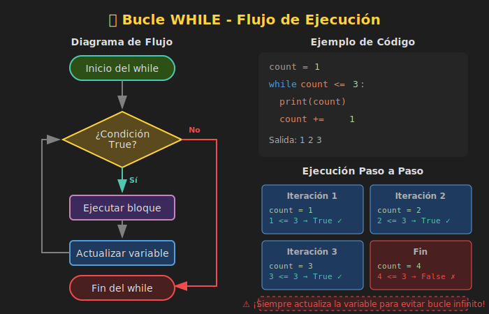

# 🔁 Bucle While

## 🎯 Objetivos

- Comprender la sintaxis del bucle `while`
- Diferenciar cuándo usar `while` vs `for`
- Evitar bucles infinitos
- Implementar validación de entrada con `while`

---

## 📋 Contenido

### 1. ¿Qué es el Bucle While?

El bucle `while` repite un bloque de código **mientras** una condición sea verdadera. A diferencia de `for`, no sabemos de antemano cuántas veces se ejecutará.



```python
# Sintaxis básica
while condicion:
    # código que se repite
    # mientras condicion sea True
    pass
```

---

### 2. Ejemplo Básico

```python
count: int = 1

while count <= 5:
    print(f"Iteración {count}")
    count += 1  # ¡Importante! Actualizar la variable

print("Fin del bucle")

# Salida:
# Iteración 1
# Iteración 2
# Iteración 3
# Iteración 4
# Iteración 5
# Fin del bucle
```

**Flujo de ejecución:**
1. Evaluar condición (`count <= 5`)
2. Si es `True`, ejecutar el bloque
3. Volver al paso 1
4. Si es `False`, salir del bucle

---

### 3. Cuenta Regresiva

```python
def countdown(n: int) -> None:
    """Cuenta regresiva desde n hasta 1."""
    while n > 0:
        print(n)
        n -= 1
    print("¡Despegue! 🚀")

countdown(5)
# 5
# 4
# 3
# 2
# 1
# ¡Despegue! 🚀
```

---

### 4. Validación de Entrada

Uno de los usos más comunes de `while` es **validar entrada del usuario**:

```python
def get_positive_number() -> int:
    """Solicita un número positivo hasta que sea válido."""
    number: int = -1

    while number <= 0:
        try:
            number = int(input("Ingresa un número positivo: "))
            if number <= 0:
                print("❌ Debe ser mayor que cero.")
        except ValueError:
            print("❌ Ingresa un número válido.")

    return number

result = get_positive_number()
print(f"✅ Número válido: {result}")
```

#### Patrón con flag (bandera)

```python
def get_valid_age() -> int:
    """Solicita una edad válida (0-120)."""
    valid: bool = False
    age: int = 0

    while not valid:
        try:
            age = int(input("Ingresa tu edad: "))
            if 0 <= age <= 120:
                valid = True
            else:
                print("❌ La edad debe estar entre 0 y 120.")
        except ValueError:
            print("❌ Ingresa un número válido.")

    return age
```

---

### 5. Menú Interactivo

```python
def show_menu() -> None:
    """Muestra un menú interactivo."""
    option: str = ""

    while option != "4":
        print("\n=== MENÚ ===")
        print("1. Saludar")
        print("2. Calcular")
        print("3. Información")
        print("4. Salir")

        option = input("Elige una opción: ")

        match option:
            case "1":
                print("¡Hola! 👋")
            case "2":
                print("2 + 2 =", 2 + 2)
            case "3":
                print("Python 3.13")
            case "4":
                print("¡Hasta luego! 👋")
            case _:
                print("❌ Opción no válida")

show_menu()
```

---

### 6. While vs For

| Característica | `for` | `while` |
|----------------|-------|---------|
| Uso principal | Iterar sobre secuencias | Repetir mientras condición |
| Iteraciones | Conocidas de antemano | Desconocidas |
| Riesgo de infinito | Bajo | Alto |
| Ejemplo típico | Recorrer lista | Validar entrada |

```python
# ✅ Usar FOR cuando conoces las iteraciones
for i in range(10):
    print(i)

# ✅ Usar WHILE cuando dependes de una condición
password: str = ""
while password != "secreto":
    password = input("Contraseña: ")
```

---

### 7. Bucles Infinitos

Un bucle infinito ocurre cuando la condición **nunca** se vuelve `False`:

```python
# ❌ PELIGRO - Bucle infinito (no ejecutar)
# while True:
#     print("Esto nunca termina")

# ❌ PELIGRO - La condición nunca cambia
# x = 5
# while x > 0:
#     print(x)  # Falta: x -= 1
```

#### Cómo detectar bucles infinitos

1. ¿La variable de la condición se modifica dentro del bucle?
2. ¿La modificación eventualmente hace la condición `False`?
3. ¿Hay algún camino de ejecución que no modifique la variable?

#### Bucle infinito controlado (con break)

```python
# ✅ Bucle infinito CON salida controlada
while True:
    user_input = input("Escribe 'salir' para terminar: ")
    if user_input.lower() == "salir":
        break  # Sale del bucle
    print(f"Escribiste: {user_input}")
```

---

### 8. Patrón: Buscar hasta Encontrar

```python
def find_first_vowel(text: str) -> int:
    """Encuentra el índice de la primera vocal."""
    vowels: str = "aeiouAEIOU"
    index: int = 0

    while index < len(text):
        if text[index] in vowels:
            return index
        index += 1

    return -1  # No encontrada

print(find_first_vowel("Python"))  # 4 (la 'o')
print(find_first_vowel("xyz"))     # -1
```

---

### 9. Patrón: Acumulador con Condición

```python
def sum_until_negative() -> int:
    """Suma números hasta ingresar uno negativo."""
    total: int = 0

    while True:
        try:
            num = int(input("Número (negativo para terminar): "))
            if num < 0:
                break
            total += num
        except ValueError:
            print("Ingresa un número válido")

    return total

print(f"Suma total: {sum_until_negative()}")
```

---

### 10. Simulación: Adivina el Número

```python
import random

def guess_the_number() -> None:
    """Juego de adivinar el número."""
    secret: int = random.randint(1, 100)
    attempts: int = 0
    guessed: bool = False

    print("🎮 Adivina el número (1-100)")

    while not guessed:
        try:
            guess = int(input("Tu intento: "))
            attempts += 1

            if guess < secret:
                print("📈 Más alto")
            elif guess > secret:
                print("📉 Más bajo")
            else:
                guessed = True
                print(f"🎉 ¡Correcto! Lo lograste en {attempts} intentos")
        except ValueError:
            print("Ingresa un número válido")

# guess_the_number()  # Descomentar para jugar
```

---

### 11. Errores Comunes

#### ❌ Olvidar actualizar la variable de control

```python
# ❌ MAL - bucle infinito
i = 0
while i < 5:
    print(i)
    # Falta: i += 1

# ✅ BIEN
i = 0
while i < 5:
    print(i)
    i += 1
```

#### ❌ Condición inicial ya es falsa

```python
# ❌ El bucle nunca se ejecuta
x = 10
while x < 5:
    print(x)
    x += 1
# No imprime nada porque 10 < 5 es False desde el inicio
```

---

## 🧪 Ejercicio Rápido

Implementa una función que calcule potencias mediante multiplicaciones sucesivas:

```python
def power(base: int, exponent: int) -> int:
    """
    Calcula base elevado a exponent usando while.

    >>> power(2, 3)
    8
    >>> power(5, 0)
    1
    >>> power(3, 4)
    81
    """
    # Tu código aquí
    pass
```

<details>
<summary>Ver solución</summary>

```python
def power(base: int, exponent: int) -> int:
    result: int = 1
    count: int = 0

    while count < exponent:
        result *= base
        count += 1

    return result
```

</details>

---

## 📚 Recursos Adicionales

- [Python Docs - while Statements](https://docs.python.org/3/reference/compound_stmts.html#while)
- [Real Python - Python while Loop](https://realpython.com/python-while-loop/)

---

## ✅ Checklist de Verificación

- [ ] Entiendo la sintaxis de `while`
- [ ] Sé cuándo usar `while` vs `for`
- [ ] Puedo evitar bucles infinitos
- [ ] Sé implementar validación de entrada
- [ ] Puedo crear menús interactivos con `while`
