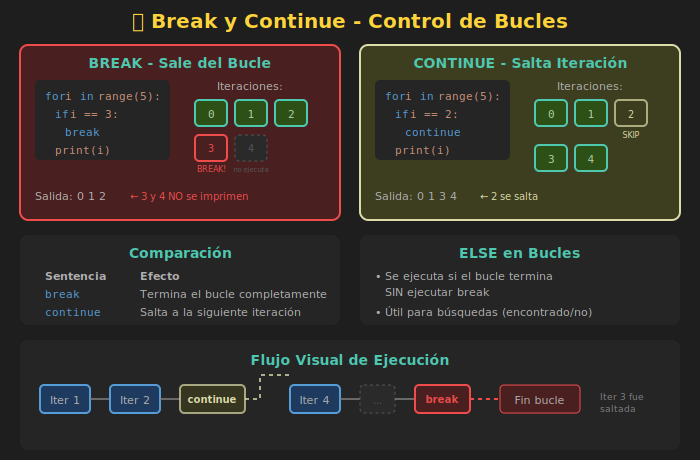

# ⏹️ Break, Continue y Else en Bucles

## 🎯 Objetivos

- Usar `break` para salir de un bucle prematuramente
- Usar `continue` para saltar a la siguiente iteración
- Entender la cláusula `else` en bucles
- Aplicar estos conceptos en patrones de búsqueda

---

## 📋 Contenido

### 1. La Sentencia break

`break` **termina el bucle inmediatamente** y continúa con el código después del bucle.



```python
# Buscar el primer número negativo
numbers: list[int] = [5, 3, 8, -2, 9, 1]

for num in numbers:
    if num < 0:
        print(f"Encontrado: {num}")
        break  # Sale del bucle
    print(f"Revisando: {num}")

print("Fin")

# Salida:
# Revisando: 5
# Revisando: 3
# Revisando: 8
# Encontrado: -2
# Fin
```

#### Ejemplo: Búsqueda con Límite

```python
def find_divisor(n: int, max_attempts: int = 100) -> int | None:
    """Encuentra el primer divisor de n mayor que 1."""
    for i in range(2, max_attempts + 1):
        if n % i == 0:
            return i  # return también sale del bucle
    return None

print(find_divisor(17))  # None (17 es primo)
print(find_divisor(15))  # 3
```

---

### 2. La Sentencia continue

`continue` **salta el resto de la iteración actual** y pasa a la siguiente.

```python
# Imprimir solo números pares
for i in range(1, 11):
    if i % 2 != 0:  # Si es impar
        continue    # Salta a la siguiente iteración
    print(i)

# Salida: 2, 4, 6, 8, 10
```

#### Ejemplo: Filtrar Valores Inválidos

```python
def process_scores(scores: list[int]) -> float:
    """Calcula promedio ignorando valores negativos."""
    total: int = 0
    count: int = 0

    for score in scores:
        if score < 0:
            print(f"Ignorando valor inválido: {score}")
            continue
        total += score
        count += 1

    return total / count if count > 0 else 0.0

scores = [85, 90, -1, 78, -5, 92]
print(f"Promedio: {process_scores(scores)}")
# Ignorando valor inválido: -1
# Ignorando valor inválido: -5
# Promedio: 86.25
```

---

### 3. Break vs Continue

| Sentencia | Efecto |
|-----------|--------|
| `break` | Termina el bucle completamente |
| `continue` | Salta a la siguiente iteración |

```python
print("=== BREAK ===")
for i in range(5):
    if i == 3:
        break
    print(i)
# Salida: 0, 1, 2

print("\n=== CONTINUE ===")
for i in range(5):
    if i == 3:
        continue
    print(i)
# Salida: 0, 1, 2, 4
```

---

### 4. La Cláusula else en Bucles

Python tiene una característica única: los bucles pueden tener una cláusula `else` que se ejecuta **solo si el bucle termina normalmente** (sin `break`).

```python
# else se ejecuta cuando el bucle termina sin break
for i in range(5):
    print(i)
else:
    print("Bucle completado normalmente")

# Salida:
# 0, 1, 2, 3, 4
# Bucle completado normalmente
```

```python
# else NO se ejecuta cuando hay break
for i in range(5):
    if i == 3:
        print("Break en", i)
        break
    print(i)
else:
    print("Esto NO se imprime")

# Salida:
# 0, 1, 2
# Break en 3
```

---

### 5. Patrón: Búsqueda con else

El `else` es muy útil para detectar si **encontramos** o **no** algo:

```python
def is_prime(n: int) -> bool:
    """Determina si n es primo."""
    if n < 2:
        return False

    for i in range(2, int(n ** 0.5) + 1):
        if n % i == 0:
            return False  # Encontró divisor, no es primo
    else:
        return True  # No encontró divisor, es primo

print(is_prime(17))  # True
print(is_prime(15))  # False
```

#### Ejemplo: Buscar Usuario

```python
def find_user(users: list[dict], target_id: int) -> dict | None:
    """Busca un usuario por ID."""
    for user in users:
        if user["id"] == target_id:
            print(f"Usuario encontrado: {user['name']}")
            return user
    else:
        print(f"Usuario con ID {target_id} no encontrado")
        return None

users = [
    {"id": 1, "name": "Ana"},
    {"id": 2, "name": "Bob"},
    {"id": 3, "name": "Carlos"},
]

find_user(users, 2)   # Usuario encontrado: Bob
find_user(users, 99)  # Usuario con ID 99 no encontrado
```

---

### 6. else en Bucles while

También funciona con `while`:

```python
def find_in_range(target: int, limit: int) -> bool:
    """Busca target en rango 0..limit."""
    i: int = 0

    while i <= limit:
        if i == target:
            print(f"Encontrado {target}")
            break
        i += 1
    else:
        print(f"{target} no está en el rango 0..{limit}")
        return False

    return True

find_in_range(5, 10)   # Encontrado 5
find_in_range(15, 10)  # 15 no está en el rango 0..10
```

---

### 7. Bucles Anidados con break

`break` solo sale del bucle **más interno**:

```python
# break solo sale del bucle interno
for i in range(3):
    print(f"Externo: {i}")
    for j in range(3):
        if j == 1:
            break  # Solo sale del bucle interno
        print(f"  Interno: {j}")

# Salida:
# Externo: 0
#   Interno: 0
# Externo: 1
#   Interno: 0
# Externo: 2
#   Interno: 0
```

#### Patrón: Salir de Bucles Anidados con Flag

```python
def find_in_matrix(matrix: list[list[int]], target: int) -> tuple[int, int] | None:
    """Encuentra la posición de target en una matriz."""
    found: bool = False
    result: tuple[int, int] | None = None

    for i, row in enumerate(matrix):
        if found:
            break
        for j, value in enumerate(row):
            if value == target:
                result = (i, j)
                found = True
                break

    return result

matrix = [
    [1, 2, 3],
    [4, 5, 6],
    [7, 8, 9],
]

print(find_in_matrix(matrix, 5))   # (1, 1)
print(find_in_matrix(matrix, 99))  # None
```

---

### 8. Casos de Uso Reales

#### Validación con Límite de Intentos

```python
def login(max_attempts: int = 3) -> bool:
    """Simula login con intentos limitados."""
    correct_password: str = "python123"

    for attempt in range(1, max_attempts + 1):
        password = input(f"Intento {attempt}/{max_attempts}: ")

        if password == correct_password:
            print("✅ Acceso concedido")
            return True
    else:
        print("❌ Demasiados intentos fallidos")
        return False

# login()  # Descomentar para probar
```

#### Procesar hasta Encontrar Fin

```python
def read_until_end() -> list[str]:
    """Lee líneas hasta encontrar 'FIN'."""
    lines: list[str] = []

    while True:
        line = input("Ingresa línea (FIN para terminar): ")

        if line.upper() == "FIN":
            break

        if not line.strip():  # Línea vacía
            continue

        lines.append(line)

    return lines

# lines = read_until_end()
# print(f"Líneas capturadas: {lines}")
```

---

### 9. Resumen Visual

```
┌─────────────────────────────────────────────────────────────┐
│                    CONTROL DE FLUJO                         │
├─────────────────────────────────────────────────────────────┤
│  break     → Sale del bucle COMPLETAMENTE                   │
│  continue  → Salta a la SIGUIENTE iteración                 │
│  else      → Se ejecuta si NO hubo break                    │
├─────────────────────────────────────────────────────────────┤
│  for item in items:          │  while condition:            │
│      if found:               │      if done:                │
│          break               │          break               │
│      if skip:                │      if skip:                │
│          continue            │          continue            │
│  else:                       │  else:                       │
│      # no break              │      # no break              │
└─────────────────────────────────────────────────────────────┘
```

---

## 🧪 Ejercicio Rápido

Implementa una función que encuentre el primer número primo en una lista:

```python
def first_prime(numbers: list[int]) -> int | None:
    """
    Encuentra el primer número primo en la lista.

    >>> first_prime([4, 6, 8, 9, 11, 12])
    11
    >>> first_prime([4, 6, 8, 9])
    None
    """
    # Tu código aquí
    pass
```

<details>
<summary>Ver solución</summary>

```python
def is_prime(n: int) -> bool:
    if n < 2:
        return False
    for i in range(2, int(n ** 0.5) + 1):
        if n % i == 0:
            return False
    return True

def first_prime(numbers: list[int]) -> int | None:
    for num in numbers:
        if is_prime(num):
            return num
    return None
```

</details>

---

## 📚 Recursos Adicionales

- [Python Docs - break and continue](https://docs.python.org/3/tutorial/controlflow.html#break-and-continue-statements-and-else-clauses-on-loops)
- [Real Python - Python break and continue](https://realpython.com/python-while-loop/#the-break-and-continue-statements)

---

## ✅ Checklist de Verificación

- [ ] Sé usar `break` para salir de un bucle
- [ ] Sé usar `continue` para saltar iteraciones
- [ ] Entiendo cuándo se ejecuta `else` en bucles
- [ ] Puedo aplicar estos conceptos en búsquedas
- [ ] Entiendo que `break` solo sale del bucle más interno
