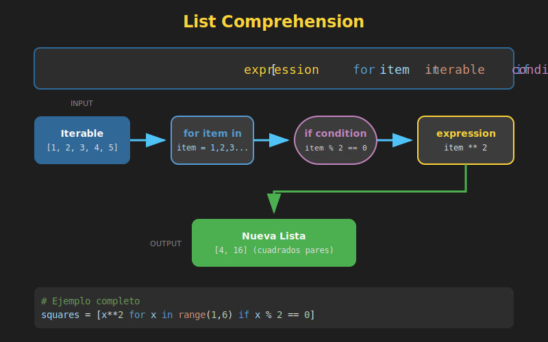

# 📋 List Comprehensions

## 🎯 Objetivos de Aprendizaje

- Entender la sintaxis de list comprehensions
- Crear listas con transformaciones
- Aplicar filtros con condiciones
- Usar comprehensions anidados
- Comparar con bucles tradicionales

---

## 1. ¿Qué es un List Comprehension?

Un **list comprehension** es una forma concisa y elegante de crear listas en Python. Permite generar una nueva lista aplicando una expresión a cada elemento de un iterable, todo en una sola línea.



### Sintaxis Básica

```python
# Sintaxis general
nueva_lista = [expresion for elemento in iterable]

# Equivalente con bucle for
nueva_lista = []
for elemento in iterable:
    nueva_lista.append(expresion)
```

### Ejemplo Simple

```python
# Con bucle tradicional
squares = []
for x in range(10):
    squares.append(x ** 2)
print(squares)  # [0, 1, 4, 9, 16, 25, 36, 49, 64, 81]

# Con list comprehension (¡una línea!)
squares = [x ** 2 for x in range(10)]
print(squares)  # [0, 1, 4, 9, 16, 25, 36, 49, 64, 81]
```

---

## 2. Transformaciones

La **expresión** al inicio del comprehension define cómo transformar cada elemento:

```python
# Transformar strings a mayúsculas
names = ["ana", "bob", "carlos"]
upper_names = [name.upper() for name in names]
print(upper_names)  # ['ANA', 'BOB', 'CARLOS']

# Obtener longitudes
lengths = [len(name) for name in names]
print(lengths)  # [3, 3, 6]

# Aplicar fórmula matemática
celsius = [0, 10, 20, 30, 40]
fahrenheit = [(c * 9/5) + 32 for c in celsius]
print(fahrenheit)  # [32.0, 50.0, 68.0, 86.0, 104.0]

# Formatear strings
formatted = [f"Hola, {name.title()}!" for name in names]
print(formatted)  # ['Hola, Ana!', 'Hola, Bob!', 'Hola, Carlos!']
```

---

## 3. Filtros con Condiciones

Puedes agregar una condición `if` para filtrar elementos:

```python
# Sintaxis con filtro
nueva_lista = [expresion for elemento in iterable if condicion]
```

### Ejemplos de Filtrado

```python
# Solo números pares
numbers = range(20)
evens = [n for n in numbers if n % 2 == 0]
print(evens)  # [0, 2, 4, 6, 8, 10, 12, 14, 16, 18]

# Solo números impares, elevados al cuadrado
odd_squares = [n ** 2 for n in range(10) if n % 2 != 0]
print(odd_squares)  # [1, 9, 25, 49, 81]

# Filtrar strings por longitud
words = ["python", "es", "un", "lenguaje", "genial"]
long_words = [word for word in words if len(word) > 3]
print(long_words)  # ['python', 'lenguaje', 'genial']

# Filtrar y transformar
short_upper = [w.upper() for w in words if len(w) <= 3]
print(short_upper)  # ['ES', 'UN']
```

---

## 4. Condiciones if-else en la Expresión

Si necesitas una expresión condicional (no un filtro), usa el operador ternario **antes** del `for`:

```python
# Sintaxis con expresión condicional
nueva_lista = [valor_si_true if condicion else valor_si_false for elemento in iterable]
```

### Ejemplos

```python
# Clasificar números
numbers = [1, 2, 3, 4, 5, 6, 7, 8, 9, 10]
labels = ["par" if n % 2 == 0 else "impar" for n in numbers]
print(labels)  # ['impar', 'par', 'impar', 'par', ...]

# Valores absolutos manuales
values = [-3, -1, 0, 2, 5, -4]
absolutes = [x if x >= 0 else -x for x in values]
print(absolutes)  # [3, 1, 0, 2, 5, 4]

# Reemplazar valores
scores = [85, 42, 91, 55, 78, 38]
passing = ["PASS" if s >= 60 else "FAIL" for s in scores]
print(passing)  # ['PASS', 'FAIL', 'PASS', 'FAIL', 'PASS', 'FAIL']

# Limitar valores (capping)
capped = [min(x, 100) for x in [50, 120, 80, 150, 90]]
print(capped)  # [50, 100, 80, 100, 90]
```

### ⚠️ Diferencia Importante

```python
numbers = range(10)

# FILTRO: if al FINAL (excluye elementos)
result1 = [n for n in numbers if n > 5]
print(result1)  # [6, 7, 8, 9] - Solo 4 elementos

# EXPRESIÓN CONDICIONAL: if-else al INICIO (transforma todos)
result2 = [n if n > 5 else 0 for n in numbers]
print(result2)  # [0, 0, 0, 0, 0, 0, 6, 7, 8, 9] - 10 elementos
```

---

## 5. Múltiples Condiciones

Puedes combinar condiciones con operadores lógicos:

```python
# AND lógico
numbers = range(100)
divisible_by_3_and_5 = [n for n in numbers if n % 3 == 0 and n % 5 == 0]
print(divisible_by_3_and_5)  # [0, 15, 30, 45, 60, 75, 90]

# OR lógico
divisible_by_3_or_5 = [n for n in range(20) if n % 3 == 0 or n % 5 == 0]
print(divisible_by_3_or_5)  # [0, 3, 5, 6, 9, 10, 12, 15, 18]

# Condiciones complejas
words = ["Python", "java", "C++", "rust", "Go"]
filtered = [w for w in words if len(w) > 2 and w[0].isupper()]
print(filtered)  # ['Python', 'Go'] - Nota: C++ tiene len=3, pero empieza con mayúscula
```

---

## 6. Comprehensions Anidados

Puedes anidar múltiples `for` en un comprehension:

```python
# Sintaxis anidada
nueva_lista = [expresion for x in iterable1 for y in iterable2]

# Equivalente con bucles
nueva_lista = []
for x in iterable1:
    for y in iterable2:
        nueva_lista.append(expresion)
```

### Ejemplos

```python
# Producto cartesiano
colors = ["rojo", "verde"]
sizes = ["S", "M", "L"]
combinations = [(color, size) for color in colors for size in sizes]
print(combinations)
# [('rojo', 'S'), ('rojo', 'M'), ('rojo', 'L'),
#  ('verde', 'S'), ('verde', 'M'), ('verde', 'L')]

# Aplanar lista de listas
matrix = [[1, 2, 3], [4, 5, 6], [7, 8, 9]]
flat = [num for row in matrix for num in row]
print(flat)  # [1, 2, 3, 4, 5, 6, 7, 8, 9]

# Crear matriz
matrix_3x3 = [[i * 3 + j for j in range(3)] for i in range(3)]
print(matrix_3x3)  # [[0, 1, 2], [3, 4, 5], [6, 7, 8]]
```

---

## 7. Comprehensions vs Bucles

### Cuándo Usar Comprehensions ✅

```python
# ✅ Transformaciones simples
squares = [x ** 2 for x in range(10)]

# ✅ Filtrado básico
adults = [p for p in people if p.age >= 18]

# ✅ Crear diccionarios o sets rápidamente
word_lengths = {w: len(w) for w in words}
```

### Cuándo Usar Bucles Tradicionales ✅

```python
# ✅ Lógica compleja con múltiples pasos
result = []
for item in items:
    processed = complex_function(item)
    if validate(processed):
        result.append(transform(processed))

# ✅ Efectos secundarios (print, modificar variables externas)
for item in items:
    print(f"Processing: {item}")
    database.save(item)

# ✅ Cuando la legibilidad sufre
# ❌ MAL - Demasiado complejo
result = [func(x) if cond1(x) else other(x) for x in items if valid(x) and check(x)]

# ✅ BIEN - Más legible como bucle
result = []
for x in items:
    if valid(x) and check(x):
        if cond1(x):
            result.append(func(x))
        else:
            result.append(other(x))
```

---

## 8. Rendimiento

Los comprehensions son generalmente más rápidos que los bucles equivalentes:

```python
import timeit

# Bucle tradicional
def with_loop():
    result = []
    for i in range(1000):
        result.append(i ** 2)
    return result

# List comprehension
def with_comprehension():
    return [i ** 2 for i in range(1000)]

# El comprehension suele ser ~20-30% más rápido
print(timeit.timeit(with_loop, number=10000))         # ~0.8s
print(timeit.timeit(with_comprehension, number=10000)) # ~0.6s
```

**¿Por qué?** Los comprehensions están optimizados internamente en Python y evitan la búsqueda repetida del método `append`.

---

## 9. Patrones Comunes

### Mapeo (transformar cada elemento)

```python
# Convertir tipos
strings = ["1", "2", "3"]
integers = [int(s) for s in strings]

# Extraer atributos
class Person:
    def __init__(self, name: str):
        self.name = name

people = [Person("Ana"), Person("Bob")]
names = [p.name for p in people]
```

### Filtrado

```python
# Remover None
items = [1, None, 2, None, 3]
valid = [x for x in items if x is not None]

# Filtrar por tipo
mixed = [1, "hello", 2.5, "world", 3]
only_strings = [x for x in mixed if isinstance(x, str)]
```

### Aplanamiento

```python
# Aplanar un nivel
nested = [[1, 2], [3, 4], [5, 6]]
flat = [item for sublist in nested for item in sublist]
# [1, 2, 3, 4, 5, 6]
```

### Extracción

```python
# Obtener claves/valores de diccionarios
users = [{"name": "Ana", "age": 25}, {"name": "Bob", "age": 30}]
names = [user["name"] for user in users]
# ['Ana', 'Bob']
```

---

## 10. Errores Comunes

### ❌ Comprehension demasiado largo

```python
# ❌ MAL - Ilegible
result = [process(transform(validate(x))) for x in data if check1(x) and check2(x) and check3(x)]

# ✅ BIEN - Separar en pasos
valid_items = [x for x in data if check1(x) and check2(x) and check3(x)]
result = [process(transform(validate(x))) for x in valid_items]
```

### ❌ Olvidar que crea una NUEVA lista

```python
numbers = [1, 2, 3, 4, 5]

# ❌ Esto NO modifica 'numbers'
[n * 2 for n in numbers]  # Se pierde el resultado

# ✅ Guardar en variable
doubled = [n * 2 for n in numbers]
```

### ❌ Usar para efectos secundarios

```python
# ❌ MAL - Comprehension para imprimir
[print(x) for x in items]  # Crea lista de None innecesariamente

# ✅ BIEN - Usar bucle for
for x in items:
    print(x)
```

---

## ✅ Checklist de Verificación

- [ ] Entiendo la sintaxis básica `[expresion for elemento in iterable]`
- [ ] Puedo aplicar transformaciones a cada elemento
- [ ] Sé agregar filtros con `if` al final
- [ ] Distingo entre filtro (`if` al final) y expresión condicional (`if-else` al inicio)
- [ ] Puedo usar múltiples condiciones con `and`/`or`
- [ ] Entiendo cuándo usar comprehension vs bucle tradicional
- [ ] Evito comprehensions demasiado complejos

---

## 📚 Recursos Adicionales

- [Python Docs - List Comprehensions](https://docs.python.org/3/tutorial/datastructures.html#list-comprehensions)
- [PEP 202 - List Comprehensions](https://peps.python.org/pep-0202/)
- [Real Python - List Comprehension](https://realpython.com/list-comprehension-python/)

---

*Siguiente: [Dict y Set Comprehensions](02-dict-set-comprehensions.md)* ➡️
