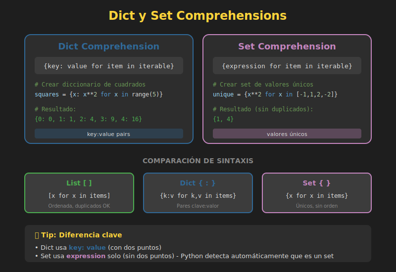

# 📖 Dict y Set Comprehensions

## 🎯 Objetivos de Aprendizaje

- Crear diccionarios con dict comprehensions
- Generar sets con set comprehensions
- Aplicar transformaciones y filtros
- Conocer casos de uso para cada tipo
- Diferenciar entre list, dict y set comprehensions

---

## 1. Dict Comprehensions

Un **dict comprehension** permite crear diccionarios de forma concisa, similar a los list comprehensions pero generando pares clave-valor.



### Sintaxis Básica

```python
# Sintaxis general
nuevo_dict = {clave: valor for elemento in iterable}

# Equivalente con bucle
nuevo_dict = {}
for elemento in iterable:
    nuevo_dict[clave] = valor
```

### Ejemplo Simple

```python
# Con bucle tradicional
squares = {}
for x in range(6):
    squares[x] = x ** 2
print(squares)  # {0: 0, 1: 1, 2: 4, 3: 9, 4: 16, 5: 25}

# Con dict comprehension
squares = {x: x ** 2 for x in range(6)}
print(squares)  # {0: 0, 1: 1, 2: 4, 3: 9, 4: 16, 5: 25}
```

---

## 2. Transformaciones en Dict Comprehensions

```python
# Longitud de palabras
words = ["python", "es", "genial"]
word_lengths = {word: len(word) for word in words}
print(word_lengths)  # {'python': 6, 'es': 2, 'genial': 6}

# Transformar claves a mayúsculas
original = {"name": "Ana", "city": "Madrid"}
upper_keys = {k.upper(): v for k, v in original.items()}
print(upper_keys)  # {'NAME': 'Ana', 'CITY': 'Madrid'}

# Transformar valores
prices = {"apple": 1.5, "banana": 0.75, "orange": 2.0}
with_tax = {item: round(price * 1.21, 2) for item, price in prices.items()}
print(with_tax)  # {'apple': 1.82, 'banana': 0.91, 'orange': 2.42}

# Enumerar elementos
fruits = ["apple", "banana", "cherry"]
indexed = {i: fruit for i, fruit in enumerate(fruits)}
print(indexed)  # {0: 'apple', 1: 'banana', 2: 'cherry'}
```

---

## 3. Dict Comprehensions con Filtros

```python
# Sintaxis con filtro
nuevo_dict = {clave: valor for elemento in iterable if condicion}
```

### Ejemplos

```python
# Solo números pares
even_squares = {x: x ** 2 for x in range(10) if x % 2 == 0}
print(even_squares)  # {0: 0, 2: 4, 4: 16, 6: 36, 8: 64}

# Filtrar por valor
scores = {"Ana": 85, "Bob": 42, "Carlos": 91, "Diana": 58}
passing = {name: score for name, score in scores.items() if score >= 60}
print(passing)  # {'Ana': 85, 'Carlos': 91}

# Filtrar por clave
data = {"name": "Python", "version": 3.13, "type": "language", "year": 1991}
string_values = {k: v for k, v in data.items() if isinstance(v, str)}
print(string_values)  # {'name': 'Python', 'type': 'language'}

# Múltiples condiciones
numbers = range(20)
special = {n: n ** 2 for n in numbers if n % 2 == 0 and n > 5}
print(special)  # {6: 36, 8: 64, 10: 100, 12: 144, 14: 196, 16: 256, 18: 324}
```

---

## 4. Patrones Comunes con Dict Comprehensions

### Invertir un Diccionario

```python
original = {"a": 1, "b": 2, "c": 3}
inverted = {v: k for k, v in original.items()}
print(inverted)  # {1: 'a', 2: 'b', 3: 'c'}

# ⚠️ Cuidado: si hay valores duplicados, solo queda el último
duplicate_values = {"a": 1, "b": 1, "c": 2}
inverted = {v: k for k, v in duplicate_values.items()}
print(inverted)  # {1: 'b', 2: 'c'} - 'a' se perdió
```

### Crear Diccionario desde Dos Listas

```python
keys = ["name", "age", "city"]
values = ["Ana", 25, "Madrid"]

# Usando zip
person = {k: v for k, v in zip(keys, values)}
print(person)  # {'name': 'Ana', 'age': 25, 'city': 'Madrid'}

# Equivalente más simple con dict()
person = dict(zip(keys, values))
```

### Agrupar por Propiedad

```python
words = ["apple", "ant", "banana", "berry", "cherry"]
by_first_letter = {}
for word in words:
    key = word[0]
    if key not in by_first_letter:
        by_first_letter[key] = []
    by_first_letter[key].append(word)
print(by_first_letter)
# {'a': ['apple', 'ant'], 'b': ['banana', 'berry'], 'c': ['cherry']}

# Nota: Para agrupar, los bucles son más claros que comprehensions
```

### Valores por Defecto con get()

```python
# Contar ocurrencias (mejor usar Counter, pero para ilustrar)
text = "hello world"
char_count = {char: text.count(char) for char in set(text)}
print(char_count)  # {'h': 1, 'e': 1, 'l': 3, 'o': 2, ' ': 1, 'w': 1, 'r': 1, 'd': 1}
```

---

## 5. Set Comprehensions

Un **set comprehension** crea un conjunto (set), que automáticamente elimina duplicados y no mantiene orden.

### Sintaxis Básica

```python
# Sintaxis general
nuevo_set = {expresion for elemento in iterable}

# Con llaves {} pero SIN clave:valor = SET (no dict)
```

### Ejemplos

```python
# Crear set de cuadrados
squares_set = {x ** 2 for x in range(-5, 6)}
print(squares_set)  # {0, 1, 4, 9, 16, 25} - Sin duplicados, sin orden

# Letras únicas de una palabra
word = "mississippi"
unique_letters = {char for char in word}
print(unique_letters)  # {'m', 'i', 's', 'p'}

# Equivalente más simple
unique_letters = set(word)
```

---

## 6. Set Comprehensions con Filtros

```python
# Solo vocales
text = "Hello World"
vowels = {char.lower() for char in text if char.lower() in "aeiou"}
print(vowels)  # {'e', 'o'}

# Números divisibles por 3
divisible_by_3 = {n for n in range(30) if n % 3 == 0}
print(divisible_by_3)  # {0, 3, 6, 9, 12, 15, 18, 21, 24, 27}

# Palabras largas únicas
sentences = ["Python es genial", "Python es fácil", "Python es popular"]
long_words = {word for sentence in sentences for word in sentence.split() if len(word) > 3}
print(long_words)  # {'Python', 'genial', 'fácil', 'popular'}
```

---

## 7. Casos de Uso para Sets

### Eliminar Duplicados con Transformación

```python
# Emails únicos en minúsculas
emails = ["Ana@Mail.com", "bob@mail.com", "ANA@MAIL.COM", "carlos@mail.com"]
unique_emails = {email.lower() for email in emails}
print(unique_emails)  # {'ana@mail.com', 'bob@mail.com', 'carlos@mail.com'}
```

### Encontrar Elementos Comunes

```python
list1 = [1, 2, 3, 4, 5, 1, 2]
list2 = [4, 5, 6, 7, 8, 4, 5]

set1 = {x for x in list1}
set2 = {x for x in list2}

common = set1 & set2  # Intersección
print(common)  # {4, 5}

only_in_first = set1 - set2  # Diferencia
print(only_in_first)  # {1, 2, 3}
```

### Validar Elementos Únicos

```python
usernames = ["alice", "bob", "alice", "charlie"]
unique_usernames = {name for name in usernames}

if len(unique_usernames) != len(usernames):
    print("¡Hay usernames duplicados!")
```

---

## 8. Comparación: List vs Dict vs Set

| Aspecto | List `[]` | Dict `{k: v}` | Set `{}` |
|---------|-----------|---------------|----------|
| **Sintaxis** | `[expr for x in iter]` | `{k: v for x in iter}` | `{expr for x in iter}` |
| **Resultado** | Lista ordenada | Diccionario clave-valor | Conjunto único |
| **Duplicados** | Permitidos | Claves únicas | No permitidos |
| **Orden** | Preservado | Preservado (3.7+) | No garantizado |
| **Acceso** | Por índice `[0]` | Por clave `["key"]` | No hay acceso directo |

### Ejemplos Comparativos

```python
numbers = [1, 2, 2, 3, 3, 3, 4]

# List comprehension - mantiene duplicados y orden
list_result = [n ** 2 for n in numbers]
print(list_result)  # [1, 4, 4, 9, 9, 9, 16]

# Dict comprehension - claves únicas
dict_result = {n: n ** 2 for n in numbers}
print(dict_result)  # {1: 1, 2: 4, 3: 9, 4: 16}

# Set comprehension - valores únicos
set_result = {n ** 2 for n in numbers}
print(set_result)  # {1, 4, 9, 16}
```

---

## 9. Comprehensions Anidados

### Dict con List Values

```python
# Agrupar palabras por longitud
words = ["a", "be", "cat", "dog", "elephant", "fox"]
by_length = {length: [w for w in words if len(w) == length]
             for length in {len(w) for w in words}}
print(by_length)
# {1: ['a'], 2: ['be'], 3: ['cat', 'dog', 'fox'], 8: ['elephant']}
```

### Dict de Dicts

```python
# Tabla de multiplicar
multiplication_table = {
    i: {j: i * j for j in range(1, 6)}
    for i in range(1, 6)
}
print(multiplication_table[3][4])  # 12 (3 * 4)
```

---

## 10. Cuándo Usar Cada Tipo

### Usa List Comprehension cuando:
```python
# ✅ Necesitas orden
# ✅ Puedes tener duplicados
# ✅ Accederás por índice
ordered_results = [process(x) for x in data]
```

### Usa Dict Comprehension cuando:
```python
# ✅ Necesitas mapear claves a valores
# ✅ Buscarás por clave frecuentemente
# ✅ Quieres acceso O(1) por clave
lookup_table = {item.id: item for item in items}
```

### Usa Set Comprehension cuando:
```python
# ✅ Solo necesitas valores únicos
# ✅ Harás operaciones de conjuntos (unión, intersección)
# ✅ No te importa el orden
unique_ids = {item.id for item in items}
```

---

## 11. Errores Comunes

### ❌ Confundir {} vacío

```python
# {} vacío es un DICT, no un set
empty_dict = {}
print(type(empty_dict))  # <class 'dict'>

# Para set vacío, usar set()
empty_set = set()
print(type(empty_set))  # <class 'set'>
```

### ❌ Olvidar que sets no tienen orden

```python
# ❌ No confiar en el orden
my_set = {3, 1, 4, 1, 5, 9}
# El orden al iterar puede variar

# ✅ Si necesitas orden, usa lista y luego set
ordered_unique = list(dict.fromkeys([3, 1, 4, 1, 5, 9]))
print(ordered_unique)  # [3, 1, 4, 5, 9] - Orden preservado, únicos
```

### ❌ Sets con elementos mutables

```python
# ❌ Los sets no pueden contener listas
# my_set = {[1, 2], [3, 4]}  # TypeError!

# ✅ Usar tuplas (inmutables)
my_set = {(1, 2), (3, 4)}
```

---

## ✅ Checklist de Verificación

- [ ] Puedo crear dict comprehensions con `{k: v for ...}`
- [ ] Sé agregar filtros a dict comprehensions
- [ ] Puedo invertir diccionarios con comprehensions
- [ ] Entiendo la sintaxis de set comprehensions `{expr for ...}`
- [ ] Sé cuándo usar list vs dict vs set comprehension
- [ ] Entiendo que `{}` vacío es dict, no set
- [ ] Sé que los sets no mantienen orden

---

## 📚 Recursos Adicionales

- [Python Docs - Dictionary Comprehensions](https://docs.python.org/3/tutorial/datastructures.html#dictionaries)
- [Python Docs - Sets](https://docs.python.org/3/tutorial/datastructures.html#sets)
- [Real Python - Dictionary Comprehension](https://realpython.com/python-dictionary-comprehension/)

---

*Siguiente: [Funciones Básicas](03-funciones-basicas.md)* ➡️
