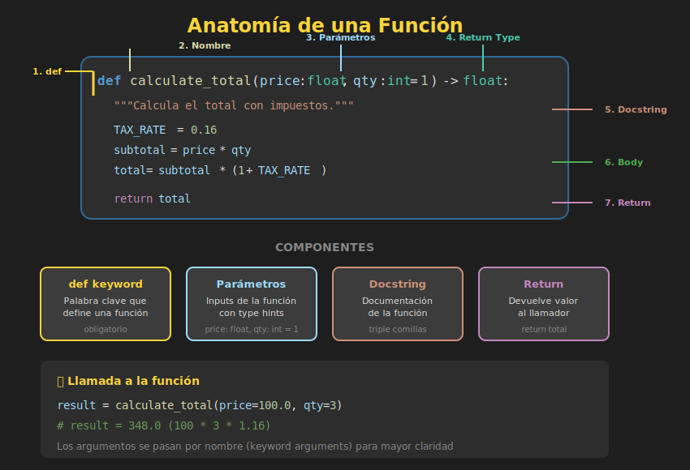

# 🔧 Funciones Básicas

## 🎯 Objetivos de Aprendizaje

- Entender qué es una función y por qué usarlas
- Definir funciones con `def`
- Usar type hints para documentar tipos
- Escribir docstrings efectivos
- Llamar funciones correctamente

---

## 1. ¿Qué es una Función?

Una **función** es un bloque de código reutilizable que realiza una tarea específica. Las funciones permiten:

- **Reutilizar código**: Escribir una vez, usar muchas veces
- **Organizar**: Dividir programas complejos en partes manejables
- **Abstraer**: Ocultar detalles de implementación
- **Testear**: Probar unidades de código de forma aislada



---

## 2. Sintaxis Básica

```python
def nombre_funcion(parametro1, parametro2):
    """Docstring: describe qué hace la función."""
    # Cuerpo de la función
    resultado = parametro1 + parametro2
    return resultado
```

### Componentes

| Componente | Descripción |
|------------|-------------|
| `def` | Palabra clave para definir función |
| `nombre_funcion` | Nombre en snake_case |
| `(parametros)` | Inputs de la función |
| `"""Docstring"""` | Documentación de la función |
| `return` | Valor que devuelve la función |

---

## 3. Tu Primera Función

```python
# Definición de la función
def greet(name: str) -> str:
    """Genera un saludo personalizado.

    Args:
        name: El nombre de la persona a saludar.

    Returns:
        String con el saludo.
    """
    return f"¡Hola, {name}!"

# Llamar a la función
message = greet("Ana")
print(message)  # ¡Hola, Ana!

# Usar directamente
print(greet("Carlos"))  # ¡Hola, Carlos!
```

---

## 4. Type Hints

Los **type hints** indican los tipos esperados de parámetros y retorno. Son opcionales pero muy recomendados:

```python
# Sin type hints (funciona pero menos claro)
def add(a, b):
    return a + b

# Con type hints (más claro y profesional)
def add(a: int, b: int) -> int:
    return a + b
```

### Tipos Comunes

```python
from typing import Any

# Tipos básicos
def process_string(text: str) -> str:
    return text.upper()

def calculate(x: float, y: float) -> float:
    return x * y

def is_valid(value: int) -> bool:
    return value > 0

# Tipos de colecciones (Python 3.9+)
def sum_numbers(numbers: list[int]) -> int:
    return sum(numbers)

def get_config(settings: dict[str, str]) -> str:
    return settings.get("theme", "default")

# Tipos opcionales (puede ser None)
def find_user(user_id: int) -> str | None:
    users = {1: "Ana", 2: "Bob"}
    return users.get(user_id)

# Múltiples tipos posibles
def process(value: int | str) -> str:
    return str(value)
```

### Beneficios de Type Hints

1. **Documentación**: Claridad sobre qué espera y retorna
2. **IDE Support**: Autocompletado y detección de errores
3. **Mantenibilidad**: Código más fácil de entender
4. **Herramientas**: mypy puede verificar tipos estáticamente

---

## 5. Docstrings

Los **docstrings** documentan qué hace una función. Usa el formato Google Style:

```python
def calculate_discount(price: float, percentage: float) -> float:
    """Calcula el precio con descuento aplicado.

    Aplica un porcentaje de descuento al precio original
    y retorna el precio final.

    Args:
        price: Precio original del producto (debe ser > 0).
        percentage: Porcentaje de descuento (0-100).

    Returns:
        El precio final después de aplicar el descuento.

    Raises:
        ValueError: Si el precio es negativo o el porcentaje
            está fuera del rango 0-100.

    Examples:
        >>> calculate_discount(100, 20)
        80.0
        >>> calculate_discount(50, 10)
        45.0
    """
    if price < 0:
        raise ValueError("El precio no puede ser negativo")
    if not 0 <= percentage <= 100:
        raise ValueError("El porcentaje debe estar entre 0 y 100")

    discount = price * (percentage / 100)
    return price - discount
```

### Acceder al Docstring

```python
# Ver documentación
print(calculate_discount.__doc__)

# Con help()
help(calculate_discount)
```

---

## 6. Funciones sin Return

Si una función no tiene `return`, devuelve `None` implícitamente:

```python
def print_greeting(name: str) -> None:
    """Imprime un saludo. No retorna nada."""
    print(f"Hola, {name}!")

result = print_greeting("Ana")  # Imprime: Hola, Ana!
print(result)  # None
```

### Return vs Print

```python
# ❌ Función que solo imprime (difícil de testear y reusar)
def bad_add(a: int, b: int) -> None:
    print(a + b)  # Solo imprime, no retorna

# ✅ Función que retorna (flexible y testeable)
def good_add(a: int, b: int) -> int:
    return a + b  # Retorna el valor

# La segunda permite:
result = good_add(5, 3)  # Guardar resultado
total = good_add(1, 2) + good_add(3, 4)  # Componer
print(good_add(10, 20))  # Imprimir cuando queramos
```

---

## 7. Return Múltiple

Python permite retornar múltiples valores como tupla:

```python
def get_min_max(numbers: list[int]) -> tuple[int, int]:
    """Retorna el mínimo y máximo de una lista."""
    return min(numbers), max(numbers)

# Desempaquetar resultados
minimum, maximum = get_min_max([3, 1, 4, 1, 5, 9])
print(f"Min: {minimum}, Max: {maximum}")  # Min: 1, Max: 9

# También como tupla
result = get_min_max([3, 1, 4, 1, 5, 9])
print(result)  # (1, 9)
print(result[0])  # 1
```

### Ejemplo Práctico

```python
def analyze_text(text: str) -> tuple[int, int, int]:
    """Analiza un texto y retorna estadísticas.

    Returns:
        Tupla con (caracteres, palabras, líneas).
    """
    chars = len(text)
    words = len(text.split())
    lines = len(text.splitlines())
    return chars, words, lines

# Uso
text = """Python es genial.
Me encanta programar."""

chars, words, lines = analyze_text(text)
print(f"Caracteres: {chars}, Palabras: {words}, Líneas: {lines}")
# Caracteres: 43, Palabras: 6, Líneas: 2
```

---

## 8. Early Return

Usa `return` temprano para simplificar lógica:

```python
# ❌ Sin early return (anidado y difícil de leer)
def process_user(user: dict) -> str:
    if user is not None:
        if "name" in user:
            if user["name"] != "":
                return f"Procesando: {user['name']}"
            else:
                return "Error: nombre vacío"
        else:
            return "Error: sin nombre"
    else:
        return "Error: usuario nulo"

# ✅ Con early return (claro y plano)
def process_user(user: dict | None) -> str:
    if user is None:
        return "Error: usuario nulo"

    if "name" not in user:
        return "Error: sin nombre"

    if user["name"] == "":
        return "Error: nombre vacío"

    return f"Procesando: {user['name']}"
```

---

## 9. Funciones como Objetos

En Python, las funciones son objetos de primera clase:

```python
def add(a: int, b: int) -> int:
    return a + b

def subtract(a: int, b: int) -> int:
    return a - b

# Asignar función a variable
operation = add
print(operation(5, 3))  # 8

operation = subtract
print(operation(5, 3))  # 2

# Funciones en listas
operations = [add, subtract]
for op in operations:
    print(op(10, 4))  # 14, 6

# Función como argumento
def apply_operation(func, a: int, b: int) -> int:
    return func(a, b)

print(apply_operation(add, 5, 3))  # 8
```

---

## 10. Convenciones de Nombrado

### Nombres Descriptivos

```python
# ❌ MAL - Nombres vagos
def f(x):
    return x * 2

def process(data):
    pass

# ✅ BIEN - Nombres descriptivos
def double_value(number: int) -> int:
    return number * 2

def validate_email(email: str) -> bool:
    return "@" in email and "." in email
```

### Verbos para Acciones

```python
# Usar verbos que describan la acción
def get_user(user_id: int) -> dict:
    """Obtiene un usuario por ID."""
    pass

def calculate_total(items: list[float]) -> float:
    """Calcula el total de una lista."""
    pass

def is_valid_email(email: str) -> bool:
    """Verifica si un email es válido."""
    pass

def format_date(date: str) -> str:
    """Formatea una fecha."""
    pass
```

### Convenciones Comunes

| Prefijo | Uso | Ejemplo |
|---------|-----|---------|
| `get_` | Obtener valor | `get_user()` |
| `set_` | Establecer valor | `set_config()` |
| `is_` / `has_` | Retorna bool | `is_active()`, `has_permission()` |
| `calculate_` | Computar valor | `calculate_tax()` |
| `validate_` | Verificar validez | `validate_input()` |
| `create_` | Crear algo nuevo | `create_report()` |
| `parse_` | Analizar/convertir | `parse_json()` |
| `format_` | Dar formato | `format_currency()` |

---

## 11. Ejemplo Completo

```python
def calculate_bmi(weight_kg: float, height_m: float) -> tuple[float, str]:
    """Calcula el Índice de Masa Corporal (BMI).

    El BMI es una medida que relaciona peso y altura para
    estimar si una persona tiene un peso saludable.

    Args:
        weight_kg: Peso en kilogramos (debe ser > 0).
        height_m: Altura en metros (debe ser > 0).

    Returns:
        Tupla con (valor_bmi, categoría).

    Raises:
        ValueError: Si peso o altura son <= 0.

    Examples:
        >>> calculate_bmi(70, 1.75)
        (22.86, 'Normal')
    """
    if weight_kg <= 0 or height_m <= 0:
        raise ValueError("Peso y altura deben ser positivos")

    bmi = weight_kg / (height_m ** 2)
    bmi = round(bmi, 2)

    if bmi < 18.5:
        category = "Bajo peso"
    elif bmi < 25:
        category = "Normal"
    elif bmi < 30:
        category = "Sobrepeso"
    else:
        category = "Obesidad"

    return bmi, category


# Uso de la función
weight = 70
height = 1.75

bmi_value, bmi_category = calculate_bmi(weight, height)
print(f"BMI: {bmi_value} - Categoría: {bmi_category}")
# BMI: 22.86 - Categoría: Normal
```

---

## ✅ Checklist de Verificación

- [ ] Sé definir funciones con `def`
- [ ] Uso type hints para parámetros y retorno
- [ ] Escribo docstrings descriptivos
- [ ] Entiendo la diferencia entre `return` y `print`
- [ ] Puedo retornar múltiples valores
- [ ] Uso nombres descriptivos para funciones
- [ ] Aplico early return para simplificar código

---

## 📚 Recursos Adicionales

- [Python Docs - Defining Functions](https://docs.python.org/3/tutorial/controlflow.html#defining-functions)
- [PEP 257 - Docstring Conventions](https://peps.python.org/pep-0257/)
- [PEP 484 - Type Hints](https://peps.python.org/pep-0484/)
- [Google Python Style Guide - Docstrings](https://google.github.io/styleguide/pyguide.html#38-comments-and-docstrings)

---

*Siguiente: [Parámetros Avanzados](04-parametros-avanzados.md)* ➡️
