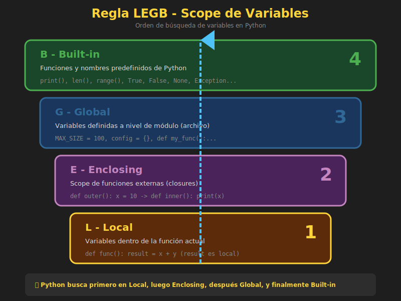

# 🔄 Return y Scope

## 🎯 Objetivos de Aprendizaje

- Dominar la sentencia `return`
- Entender el scope de variables (LEGB)
- Usar `global` y `nonlocal` correctamente
- Conocer closures básicos
- Evitar errores comunes de scope

---

## 1. La Sentencia Return

`return` hace dos cosas:
1. **Devuelve un valor** al código que llamó la función
2. **Termina la ejecución** de la función inmediatamente

```python
def add(a: int, b: int) -> int:
    return a + b  # Devuelve el resultado y termina
    print("Esto nunca se ejecuta")  # Código inalcanzable

result = add(5, 3)
print(result)  # 8
```

---

## 2. Return Implícito

Si una función no tiene `return`, devuelve `None`:

```python
def say_hello(name: str) -> None:
    print(f"Hello, {name}!")
    # return None implícito

result = say_hello("Ana")  # Imprime: Hello, Ana!
print(result)  # None
```

---

## 3. Return Temprano (Early Return)

Usa `return` al inicio para manejar casos especiales:

```python
def divide(a: float, b: float) -> float | None:
    """Divide a entre b, retorna None si b es cero."""
    if b == 0:
        return None  # Early return para caso especial

    return a / b

print(divide(10, 2))   # 5.0
print(divide(10, 0))   # None
```

### Patrón Guard Clause

```python
def process_order(order: dict | None) -> str:
    # Guard clauses al inicio
    if order is None:
        return "Error: orden nula"

    if "items" not in order:
        return "Error: sin items"

    if len(order["items"]) == 0:
        return "Error: lista vacía"

    # Lógica principal (sin anidamiento)
    total = sum(item["price"] for item in order["items"])
    return f"Total: ${total}"
```

---

## 4. Return Múltiple

Python permite retornar múltiples valores como tupla:

```python
def get_stats(numbers: list[int]) -> tuple[int, int, float]:
    """Retorna mínimo, máximo y promedio."""
    return min(numbers), max(numbers), sum(numbers) / len(numbers)

# Desempaquetar
minimum, maximum, average = get_stats([1, 2, 3, 4, 5])
print(f"Min: {minimum}, Max: {maximum}, Avg: {average}")
# Min: 1, Max: 5, Avg: 3.0

# Como tupla
result = get_stats([1, 2, 3, 4, 5])
print(result)  # (1, 5, 3.0)
```

### Retornar Diccionario para Claridad

```python
def analyze_text(text: str) -> dict[str, int]:
    """Analiza texto y retorna estadísticas."""
    return {
        "characters": len(text),
        "words": len(text.split()),
        "lines": len(text.splitlines()),
        "spaces": text.count(" ")
    }

stats = analyze_text("Hello World\nPython")
print(stats["words"])  # 3
```

---

## 5. Scope de Variables (LEGB)



Python busca variables en este orden (**LEGB**):

| Nivel | Nombre | Descripción |
|-------|--------|-------------|
| **L** | Local | Dentro de la función actual |
| **E** | Enclosing | Funciones que contienen la actual |
| **G** | Global | Nivel del módulo |
| **B** | Built-in | Funciones integradas de Python |

```python
# BUILT-IN: print, len, sum, etc. están siempre disponibles

# GLOBAL: definidas a nivel de módulo
x = "global"

def outer():
    # ENCLOSING: para funciones anidadas
    x = "enclosing"

    def inner():
        # LOCAL: definidas dentro de la función
        x = "local"
        print(x)  # Busca en L -> E -> G -> B

    inner()

outer()  # Imprime: local
```

---

## 6. Variables Locales

Las variables creadas dentro de una función son **locales**:

```python
def my_function():
    local_var = "Solo existo dentro de esta función"
    print(local_var)

my_function()  # Solo existo dentro de esta función
# print(local_var)  # NameError: local_var no está definida
```

### Shadowing (Sombreado)

Una variable local puede "ocultar" una global:

```python
name = "Global"

def greet():
    name = "Local"  # Esta es una NUEVA variable local
    print(name)  # Local

greet()
print(name)  # Global (no se modificó)
```

---

## 7. La Palabra Clave `global`

Para **modificar** una variable global desde una función:

```python
counter = 0

def increment():
    global counter  # Declara que usamos la global
    counter += 1

print(counter)  # 0
increment()
print(counter)  # 1
increment()
print(counter)  # 2
```

### ⚠️ Evitar `global`

El uso de `global` hace el código difícil de seguir y testear:

```python
# ❌ MAL - estado global
total = 0

def add_to_total(value):
    global total
    total += value

# ✅ BIEN - pasar y retornar valores
def add_to_total(current_total: int, value: int) -> int:
    return current_total + value

total = 0
total = add_to_total(total, 5)
total = add_to_total(total, 3)
```

---

## 8. La Palabra Clave `nonlocal`

Para modificar variables del scope **enclosing** (funciones anidadas):

```python
def counter():
    count = 0

    def increment():
        nonlocal count  # Modifica la variable del scope exterior
        count += 1
        return count

    return increment

# Crear un contador
my_counter = counter()
print(my_counter())  # 1
print(my_counter())  # 2
print(my_counter())  # 3

# Otro contador independiente
other_counter = counter()
print(other_counter())  # 1 (cuenta separada)
```

---

## 9. Closures

Un **closure** es una función que "recuerda" variables del scope donde fue creada:

```python
def make_multiplier(factor: int):
    """Crea una función que multiplica por factor."""
    def multiplier(number: int) -> int:
        return number * factor  # 'factor' viene del scope exterior
    return multiplier

# Crear funciones especializadas
double = make_multiplier(2)
triple = make_multiplier(3)

print(double(5))  # 10
print(triple(5))  # 15

# El closure "recuerda" el factor
print(double(10))  # 20
```

### Ejemplo Práctico: Logger

```python
def create_logger(prefix: str):
    """Crea un logger con prefijo personalizado."""
    def log(message: str) -> None:
        print(f"[{prefix}] {message}")
    return log

# Loggers especializados
info_log = create_logger("INFO")
error_log = create_logger("ERROR")
debug_log = create_logger("DEBUG")

info_log("Usuario conectado")    # [INFO] Usuario conectado
error_log("Conexión fallida")    # [ERROR] Conexión fallida
debug_log("Variable x = 5")      # [DEBUG] Variable x = 5
```

---

## 10. Errores Comunes de Scope

### Error 1: UnboundLocalError

```python
count = 10

def increment():
    # Python ve que count se asigna, así que la trata como local
    count += 1  # UnboundLocalError: count no está definida localmente
    return count

# Solución 1: usar global (no recomendado)
def increment():
    global count
    count += 1
    return count

# Solución 2: pasar como parámetro (recomendado)
def increment(count: int) -> int:
    return count + 1

count = increment(count)
```

### Error 2: Modificar lista global

```python
# Las listas son mutables, así que esto funciona sin global
items = []

def add_item(item: str) -> None:
    items.append(item)  # Modifica el objeto, no reasigna la variable

add_item("a")
print(items)  # ['a']

# Pero reasignar requiere global
def reset_items():
    global items
    items = []  # Reasignar necesita global
```

### Error 3: Closure captura por referencia

```python
# ❌ Problema: todas las funciones capturan el mismo 'i'
functions = []
for i in range(3):
    functions.append(lambda: i)

print([f() for f in functions])  # [2, 2, 2] (¡todas retornan 2!)

# ✅ Solución: capturar valor con parámetro default
functions = []
for i in range(3):
    functions.append(lambda x=i: x)

print([f() for f in functions])  # [0, 1, 2]
```

---

## 11. Buenas Prácticas

### 1. Evitar Estado Global

```python
# ❌ MAL - estado global
config = {"debug": False}

def process():
    if config["debug"]:
        print("Debug mode")

# ✅ BIEN - pasar configuración
def process(debug: bool = False) -> None:
    if debug:
        print("Debug mode")
```

### 2. Funciones Puras

Una función **pura** solo depende de sus argumentos y no tiene efectos secundarios:

```python
# ✅ Función pura - mismo input siempre da mismo output
def add(a: int, b: int) -> int:
    return a + b

# ❌ Función impura - depende de estado externo
counter = 0
def impure_add(a: int) -> int:
    global counter
    counter += 1
    return a + counter
```

### 3. Minimizar Scope

```python
# ❌ Variable con scope más amplio de lo necesario
result = None
for item in items:
    if condition(item):
        result = process(item)
        break
use(result)

# ✅ Encapsular en función
def find_and_process(items):
    for item in items:
        if condition(item):
            return process(item)
    return None

use(find_and_process(items))
```

---

## 12. Ejemplo Completo

```python
def create_bank_account(initial_balance: float = 0):
    """Crea una cuenta bancaria con closure.

    Demuestra scope, closures y nonlocal.

    Args:
        initial_balance: Balance inicial de la cuenta.

    Returns:
        Diccionario con funciones para operar la cuenta.
    """
    balance = initial_balance  # Variable del enclosing scope
    transactions: list[str] = []

    def deposit(amount: float) -> float:
        """Deposita dinero en la cuenta."""
        nonlocal balance
        if amount <= 0:
            raise ValueError("El monto debe ser positivo")
        balance += amount
        transactions.append(f"+${amount}")
        return balance

    def withdraw(amount: float) -> float:
        """Retira dinero de la cuenta."""
        nonlocal balance
        if amount <= 0:
            raise ValueError("El monto debe ser positivo")
        if amount > balance:
            raise ValueError("Fondos insuficientes")
        balance -= amount
        transactions.append(f"-${amount}")
        return balance

    def get_balance() -> float:
        """Retorna el balance actual."""
        return balance

    def get_statement() -> str:
        """Retorna el estado de cuenta."""
        return f"Balance: ${balance}\nTransacciones: {', '.join(transactions)}"

    # Retornar interfaz pública
    return {
        "deposit": deposit,
        "withdraw": withdraw,
        "balance": get_balance,
        "statement": get_statement
    }


# Uso
account = create_bank_account(100)

print(account["balance"]())  # 100
account["deposit"](50)
print(account["balance"]())  # 150
account["withdraw"](30)
print(account["balance"]())  # 120

print(account["statement"]())
# Balance: $120
# Transacciones: +$50, -$30

# Otra cuenta independiente
savings = create_bank_account(500)
print(savings["balance"]())  # 500 (cuenta separada)
```

---

## ✅ Checklist de Verificación

- [ ] Entiendo que `return` devuelve valor y termina la función
- [ ] Sé que funciones sin return devuelven `None`
- [ ] Puedo usar early return para simplificar código
- [ ] Entiendo el orden LEGB de búsqueda de variables
- [ ] Sé la diferencia entre `global` y `nonlocal`
- [ ] Comprendo qué es un closure y cuándo usarlo
- [ ] Evito usar `global` cuando es posible
- [ ] Prefiero funciones puras sin efectos secundarios

---

## 📚 Recursos Adicionales

- [Python Docs - Scopes and Namespaces](https://docs.python.org/3/tutorial/classes.html#python-scopes-and-namespaces)
- [Real Python - Python Scope & LEGB Rule](https://realpython.com/python-scope-legb-rule/)
- [Real Python - Python Closures](https://realpython.com/python-closure/)

---

*Fin de la teoría de Semana 04* ✅

*Siguiente: [Ejercicio 01 - Comprehensions Básicos](../2-ejercicios/01-comprehensions-basicos/)* ➡️
