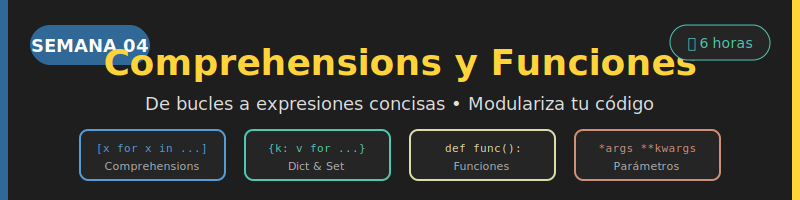

# 🐍 Semana 04: Comprehensions y Funciones



## 🎯 Objetivos de Aprendizaje

Al finalizar esta semana, serás capaz de:

- ✅ Crear listas usando list comprehensions
- ✅ Generar diccionarios con dict comprehensions
- ✅ Construir sets mediante set comprehensions
- ✅ Aplicar condiciones y transformaciones en comprehensions
- ✅ Definir funciones con `def` y documentarlas
- ✅ Usar parámetros posicionales, por nombre y con valores por defecto
- ✅ Trabajar con `*args` y `**kwargs`
- ✅ Entender el scope de variables y la sentencia `return`
- ✅ Aplicar type hints en funciones

---

## 📚 Requisitos Previos

Antes de comenzar, asegúrate de dominar:

- [x] Bucles `for` y `while` (Semana 03)
- [x] Estructuras de datos básicas: listas, diccionarios, sets
- [x] Operadores y expresiones condicionales
- [x] Formateo de strings con f-strings

---

## 🗂️ Estructura de la Semana

```
week-04/
├── README.md                    # Este archivo
├── rubrica-evaluacion.md        # Criterios de evaluación
├── 0-assets/                    # Recursos visuales
│   ├── week-04-header.svg
│   ├── 01-list-comprehension.svg
│   ├── 02-dict-set-comprehension.svg
│   ├── 03-function-anatomy.svg
│   └── 04-scope-variables.svg
├── 1-teoria/                    # Material teórico
│   ├── 01-list-comprehensions.md
│   ├── 02-dict-set-comprehensions.md
│   ├── 03-funciones-basicas.md
│   ├── 04-parametros-avanzados.md
│   └── 05-return-scope.md
├── 2-ejercicios/                # Ejercicios guiados
│   ├── 01-comprehensions-basicos/
│   ├── 02-funciones-parametros/
│   └── 03-funciones-avanzadas/
├── 3-proyecto/                  # Proyecto integrador
│   ├── README.md
│   ├── starter/
│   └── solution/               # ⚠️ Solo instructores
├── 4-recursos/                  # Material adicional
│   ├── ebooks-free/
│   ├── videografia/
│   └── webgrafia/
└── 5-glosario/                  # Términos clave
    └── README.md
```

---

## 📝 Contenidos

### 1️⃣ Teoría

| Archivo | Tema | Duración |
|---------|------|----------|
| [01-list-comprehensions.md](1-teoria/01-list-comprehensions.md) | List Comprehensions | 25 min |
| [02-dict-set-comprehensions.md](1-teoria/02-dict-set-comprehensions.md) | Dict y Set Comprehensions | 20 min |
| [03-funciones-basicas.md](1-teoria/03-funciones-basicas.md) | Definición de Funciones | 25 min |
| [04-parametros-avanzados.md](1-teoria/04-parametros-avanzados.md) | Parámetros y Argumentos | 25 min |
| [05-return-scope.md](1-teoria/05-return-scope.md) | Return y Scope | 20 min |

### 2️⃣ Ejercicios Guiados

| Ejercicio | Tema | Dificultad |
|-----------|------|------------|
| [01-comprehensions-basicos](2-ejercicios/01-comprehensions-basicos/) | Comprehensions de listas, dicts y sets | ⭐⭐ |
| [02-funciones-parametros](2-ejercicios/02-funciones-parametros/) | Funciones con diferentes tipos de parámetros | ⭐⭐ |
| [03-funciones-avanzadas](2-ejercicios/03-funciones-avanzadas/) | Args, kwargs, scope y closures básicos | ⭐⭐⭐ |

### 3️⃣ Proyecto Integrador

| Proyecto | Descripción |
|----------|-------------|
| [Procesador de Datos](3-proyecto/) | Sistema de funciones para transformar y filtrar colecciones de datos |

---

## ⏱️ Distribución del Tiempo

| Actividad | Tiempo Estimado |
|-----------|-----------------|
| 📖 Teoría (5 archivos) | 2 horas |
| 💻 Ejercicios (3) | 2.5 horas |
| 🚀 Proyecto | 1.5 horas |
| **Total** | **6 horas** |

---

## 📌 Entregables

### Ejercicios
- [ ] `01-comprehensions-basicos/starter/main.py` - Código descomentado y funcionando
- [ ] `02-funciones-parametros/starter/main.py` - Código descomentado y funcionando
- [ ] `03-funciones-avanzadas/starter/main.py` - Código descomentado y funcionando

### Proyecto
- [ ] `3-proyecto/starter/main.py` - Proyecto completado con TODOs implementados
- [ ] Todas las funciones con type hints
- [ ] Docstrings en todas las funciones
- [ ] Tests pasando (si aplica)

---

## 🎓 Criterios de Evaluación

Consulta la [rúbrica de evaluación](rubrica-evaluacion.md) para conocer los criterios detallados.

### Resumen de Evaluación

| Tipo | Peso | Descripción |
|------|------|-------------|
| 🧠 Conocimiento | 30% | Quiz sobre comprehensions y funciones |
| 💪 Desempeño | 40% | Ejercicios completados correctamente |
| 📦 Producto | 30% | Proyecto "Procesador de Datos" funcional |

---

## 💡 Conceptos Clave de la Semana

### Comprehensions
```python
# List comprehension
squares = [x ** 2 for x in range(10)]

# Con condición (filtro)
evens = [x for x in range(20) if x % 2 == 0]

# Dict comprehension
word_lengths = {word: len(word) for word in ["Python", "es", "genial"]}

# Set comprehension
unique_letters = {char.lower() for char in "Hello World" if char.isalpha()}
```

### Funciones
```python
def greet(name: str, greeting: str = "Hola") -> str:
    """Genera un saludo personalizado.

    Args:
        name: Nombre de la persona
        greeting: Saludo a usar (default: "Hola")

    Returns:
        String con el saludo completo
    """
    return f"{greeting}, {name}!"

# Uso
print(greet("Ana"))              # "Hola, Ana!"
print(greet("Bob", "Hi"))        # "Hi, Bob!"
print(greet(greeting="Hey", name="Carlos"))  # "Hey, Carlos!"
```

---

## 🔗 Navegación

| ⬅️ Anterior | 🏠 Inicio | Siguiente ➡️ |
|:------------|:---------:|-------------:|
| [Semana 03: Bucles](../week-03/) | [Índice](../../README.md) | [Semana 05: Listas](../week-05/) |

---

## 📚 Recursos Adicionales

- 📖 [4-recursos/ebooks-free/](4-recursos/ebooks-free/) - Libros gratuitos
- 🎥 [4-recursos/videografia/](4-recursos/videografia/) - Videos recomendados
- 🌐 [4-recursos/webgrafia/](4-recursos/webgrafia/) - Enlaces útiles
- 📝 [5-glosario/](5-glosario/) - Términos clave de la semana

---

*Semana 04 de 14 - Bootcamp Python Zero to Hero* 🚀
