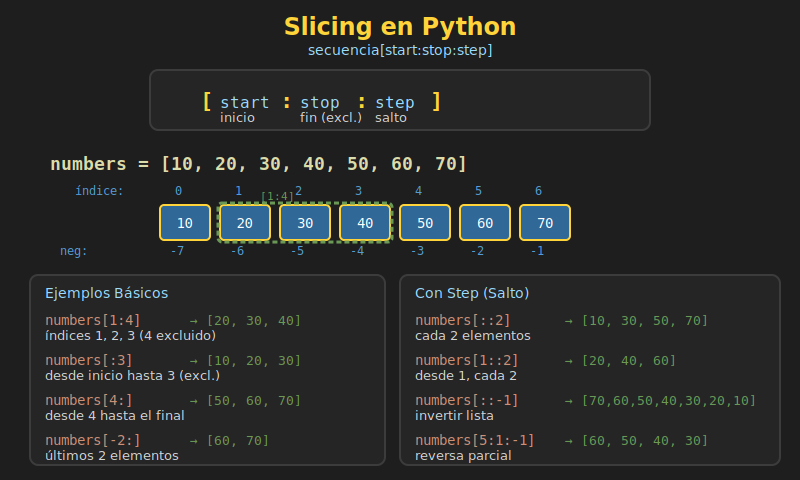

# 🔪 Slicing en Python



## 🎯 Objetivos

- Dominar la sintaxis de slicing `[start:stop:step]`
- Usar índices negativos para acceso desde el final
- Aplicar slicing para copiar, invertir y modificar secuencias
- Entender que slicing funciona con listas, strings, tuplas y más

---

## 1. ¿Qué es Slicing?

**Slicing** (rebanado) es una técnica para extraer porciones de una secuencia. Funciona con cualquier tipo secuencial: listas, strings, tuplas, etc.

```python
# Sintaxis básica
sequence[start:stop:step]

# start: índice inicial (incluido)
# stop:  índice final (excluido)
# step:  incremento entre elementos
```

### Índices en Python

```
Positivos:   0   1   2   3   4   5
           +---+---+---+---+---+---+
           | P | y | t | h | o | n |
           +---+---+---+---+---+---+
Negativos:  -6  -5  -4  -3  -2  -1
```

---

## 2. Slicing Básico `[start:stop]`

### Extraer un Rango

```python
letters: list[str] = ["a", "b", "c", "d", "e", "f"]
#                      0    1    2    3    4    5
#                     -6   -5   -4   -3   -2   -1

# Desde índice 1 hasta 4 (excluido)
print(letters[1:4])  # ['b', 'c', 'd']

# Desde índice 2 hasta 5 (excluido)
print(letters[2:5])  # ['c', 'd', 'e']

# El índice stop NO está incluido
print(letters[0:3])  # ['a', 'b', 'c'] (no incluye índice 3)
```

### Omitir Start o Stop

```python
numbers: list[int] = [0, 1, 2, 3, 4, 5, 6, 7, 8, 9]

# Omitir start: desde el inicio
print(numbers[:5])   # [0, 1, 2, 3, 4]

# Omitir stop: hasta el final
print(numbers[5:])   # [5, 6, 7, 8, 9]

# Omitir ambos: copia completa
print(numbers[:])    # [0, 1, 2, 3, 4, 5, 6, 7, 8, 9]
```

### Índices Negativos

```python
letters: list[str] = ["a", "b", "c", "d", "e"]

# Últimos 3 elementos
print(letters[-3:])   # ['c', 'd', 'e']

# Todo excepto los últimos 2
print(letters[:-2])   # ['a', 'b', 'c']

# Desde -4 hasta -1 (excluido)
print(letters[-4:-1]) # ['b', 'c', 'd']

# Combinando positivos y negativos
print(letters[1:-1])  # ['b', 'c', 'd'] (sin primero ni último)
```

---

## 3. Slicing con Step `[start:stop:step]`

### Usar Step (Paso)

```python
numbers: list[int] = [0, 1, 2, 3, 4, 5, 6, 7, 8, 9]

# Cada 2 elementos
print(numbers[::2])    # [0, 2, 4, 6, 8]

# Cada 3 elementos
print(numbers[::3])    # [0, 3, 6, 9]

# Cada 2 elementos desde índice 1
print(numbers[1::2])   # [1, 3, 5, 7, 9]

# Cada 2 elementos hasta índice 6
print(numbers[:6:2])   # [0, 2, 4]

# Rango con step
print(numbers[1:8:2])  # [1, 3, 5, 7]
```

### Step Negativo (Invertir)

```python
numbers: list[int] = [0, 1, 2, 3, 4, 5]

# Invertir lista completa
print(numbers[::-1])   # [5, 4, 3, 2, 1, 0]

# Invertir un rango
print(numbers[4:1:-1]) # [4, 3, 2]

# Cada 2 elementos, invertido
print(numbers[::-2])   # [5, 3, 1]

# ⚠️ Con step negativo, start debe ser mayor que stop
print(numbers[5:2:-1]) # [5, 4, 3]
print(numbers[2:5:-1]) # [] (vacío, no hay camino)
```

---

## 4. Slicing con Strings

Las mismas reglas aplican a strings.

```python
text: str = "Python Programming"
#            0123456789...

# Primeras 6 letras
print(text[:6])      # "Python"

# Desde posición 7
print(text[7:])      # "Programming"

# Invertir string
print(text[::-1])    # "gnimmargorP nohtyP"

# Cada segunda letra
print(text[::2])     # "Pto rgamn"

# Verificar palíndromo
word = "radar"
is_palindrome = word == word[::-1]
print(is_palindrome)  # True
```

---

## 5. Modificar Listas con Slicing

A diferencia de strings (inmutables), las listas pueden modificarse con slicing.

### Reemplazar Elementos

```python
numbers: list[int] = [0, 1, 2, 3, 4, 5]

# Reemplazar rango con nuevos valores
numbers[1:4] = [10, 20, 30]
print(numbers)  # [0, 10, 20, 30, 4, 5]

# Reemplazar con diferente cantidad de elementos
numbers[1:4] = [99]
print(numbers)  # [0, 99, 4, 5]

# Insertar elementos (slice vacío)
numbers[2:2] = [100, 200, 300]
print(numbers)  # [0, 99, 100, 200, 300, 4, 5]
```

### Eliminar Elementos

```python
letters: list[str] = ["a", "b", "c", "d", "e"]

# Eliminar rango asignando lista vacía
letters[1:3] = []
print(letters)  # ['a', 'd', 'e']

# Equivalente con del
letters = ["a", "b", "c", "d", "e"]
del letters[1:3]
print(letters)  # ['a', 'd', 'e']

# Eliminar todos los elementos
letters[:] = []
print(letters)  # []
```

### Reemplazar con Step

```python
numbers: list[int] = [0, 1, 2, 3, 4, 5, 6, 7, 8, 9]

# Reemplazar cada segundo elemento (índices pares)
numbers[::2] = [10, 20, 30, 40, 50]
print(numbers)  # [10, 1, 20, 3, 30, 5, 40, 7, 50, 9]

# ⚠️ Debe coincidir la cantidad de elementos
# numbers[::2] = [1, 2]  # ValueError: attempt to assign sequence of size 2
#                        # to extended slice of size 5
```

---

## 6. Copiar con Slicing

### Copia Superficial

```python
original: list[int] = [1, 2, 3, 4, 5]

# Copiar con slicing
copy = original[:]

# Modificar copia no afecta original
copy[0] = 99
print(original)  # [1, 2, 3, 4, 5]
print(copy)      # [99, 2, 3, 4, 5]
```

### ⚠️ Cuidado: Asignación vs Copia

```python
# ❌ INCORRECTO: Esto NO copia, crea otra referencia
original: list[int] = [1, 2, 3]
not_a_copy = original

not_a_copy[0] = 99
print(original)    # [99, 2, 3] ← También cambió!
print(not_a_copy)  # [99, 2, 3]

# ✅ CORRECTO: Usar slicing para copiar
original = [1, 2, 3]
actual_copy = original[:]

actual_copy[0] = 99
print(original)    # [1, 2, 3] ← Sin cambios
print(actual_copy) # [99, 2, 3]
```

---

## 7. Casos de Uso Comunes

### Obtener Primeros/Últimos N Elementos

```python
data: list[int] = [10, 20, 30, 40, 50, 60, 70, 80, 90, 100]

# Primeros 3
first_three = data[:3]
print(first_three)  # [10, 20, 30]

# Últimos 3
last_three = data[-3:]
print(last_three)   # [80, 90, 100]

# Todo excepto el primero
without_first = data[1:]
print(without_first)  # [20, 30, 40, 50, 60, 70, 80, 90, 100]

# Todo excepto el último
without_last = data[:-1]
print(without_last)  # [10, 20, 30, 40, 50, 60, 70, 80, 90]
```

### Dividir Lista en Partes

```python
numbers: list[int] = [1, 2, 3, 4, 5, 6, 7, 8, 9, 10]

# Dividir en mitades
mid = len(numbers) // 2
first_half = numbers[:mid]
second_half = numbers[mid:]

print(first_half)   # [1, 2, 3, 4, 5]
print(second_half)  # [6, 7, 8, 9, 10]

# Dividir en tercios
third = len(numbers) // 3
part1 = numbers[:third]
part2 = numbers[third:2*third]
part3 = numbers[2*third:]
```

### Rotar Elementos

```python
def rotate_left(lst: list, n: int) -> list:
    """Rota los elementos n posiciones a la izquierda."""
    n = n % len(lst)  # Manejar rotaciones mayores que la longitud
    return lst[n:] + lst[:n]

def rotate_right(lst: list, n: int) -> list:
    """Rota los elementos n posiciones a la derecha."""
    n = n % len(lst)
    return lst[-n:] + lst[:-n]

numbers = [1, 2, 3, 4, 5]
print(rotate_left(numbers, 2))   # [3, 4, 5, 1, 2]
print(rotate_right(numbers, 2))  # [4, 5, 1, 2, 3]
```

### Extraer Elementos Pares/Impares

```python
numbers: list[int] = [0, 1, 2, 3, 4, 5, 6, 7, 8, 9]

# Elementos en índices pares (0, 2, 4, ...)
even_indices = numbers[::2]
print(even_indices)  # [0, 2, 4, 6, 8]

# Elementos en índices impares (1, 3, 5, ...)
odd_indices = numbers[1::2]
print(odd_indices)   # [1, 3, 5, 7, 9]
```

---

## 8. Slicing vs Indexing

| Operación | Sintaxis | Retorna | Error si fuera de rango |
|-----------|----------|---------|-------------------------|
| Indexing | `list[i]` | Un elemento | ✅ IndexError |
| Slicing | `list[i:j]` | Nueva lista | ❌ Lista vacía |

```python
numbers: list[int] = [1, 2, 3]

# Indexing: error si índice no existe
# numbers[10]  # IndexError: list index out of range

# Slicing: retorna lista vacía si rango no existe
print(numbers[10:20])  # [] (sin error)
print(numbers[5:])     # [] (sin error)

# Slicing con índices "fuera de rango" es válido
print(numbers[0:100])  # [1, 2, 3] (toma hasta donde puede)
```

---

## 9. Tabla de Referencia Rápida

| Expresión | Descripción | Ejemplo con `[0,1,2,3,4,5]` |
|-----------|-------------|----------------------------|
| `a[2:5]` | Desde 2 hasta 5 (excl.) | `[2, 3, 4]` |
| `a[:3]` | Primeros 3 | `[0, 1, 2]` |
| `a[3:]` | Desde índice 3 | `[3, 4, 5]` |
| `a[:]` | Copia completa | `[0, 1, 2, 3, 4, 5]` |
| `a[-3:]` | Últimos 3 | `[3, 4, 5]` |
| `a[:-2]` | Todo menos últimos 2 | `[0, 1, 2, 3]` |
| `a[::2]` | Cada 2 elementos | `[0, 2, 4]` |
| `a[1::2]` | Cada 2, desde índice 1 | `[1, 3, 5]` |
| `a[::-1]` | Invertir | `[5, 4, 3, 2, 1, 0]` |
| `a[4:1:-1]` | Rango invertido | `[4, 3, 2]` |

---

## 10. Ejercicio Rápido

```python
data: list[int] = [10, 20, 30, 40, 50, 60, 70, 80, 90, 100]

# 1. Obtener [30, 40, 50]
result1 = data[2:5]

# 2. Obtener los últimos 4 elementos
result2 = data[-4:]

# 3. Obtener elementos en índices pares
result3 = data[::2]

# 4. Invertir la lista
result4 = data[::-1]

# 5. Obtener [50, 40, 30] (invertido de un rango)
result5 = data[4:1:-1]

print(result1)  # [30, 40, 50]
print(result2)  # [70, 80, 90, 100]
print(result3)  # [10, 30, 50, 70, 90]
print(result4)  # [100, 90, 80, 70, 60, 50, 40, 30, 20, 10]
print(result5)  # [50, 40, 30]
```

---

## 📚 Recursos

- [Python Slice Notation](https://docs.python.org/3/library/functions.html#slice)
- [Understanding Slicing](https://stackoverflow.com/questions/509211/understanding-slice-notation)

---

[← Métodos de Listas](01-listas-metodos.md) | [Volver a Semana 05](../README.md) | [Siguiente: Tuplas →](03-tuplas.md)
