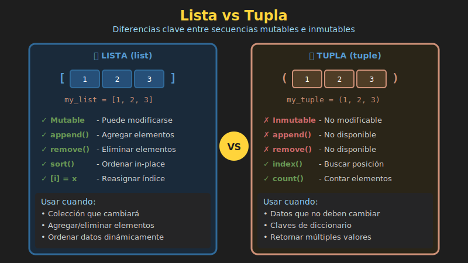

# 📦 Tuplas en Python



## 🎯 Objetivos

- Comprender qué son las tuplas y su inmutabilidad
- Aprender a crear y acceder a elementos de tuplas
- Dominar tuple unpacking y sus aplicaciones
- Conocer cuándo usar tuplas vs listas
- Explorar Named Tuples para código más legible

---

## 1. ¿Qué es una Tupla?

Una **tupla** es una secuencia ordenada e **inmutable** de elementos. Una vez creada, no puede modificarse.

```python
# Crear tuplas con paréntesis
point: tuple[int, int] = (10, 20)
colors: tuple[str, str, str] = ("red", "green", "blue")

# Los paréntesis son opcionales (pero recomendados)
coordinates = 3, 4, 5
print(type(coordinates))  # <class 'tuple'>

# Tupla vacía
empty: tuple = ()

# ⚠️ Tupla de un solo elemento (coma obligatoria)
single = (42,)     # ✅ Tupla
not_tuple = (42)   # ❌ Solo un int entre paréntesis

print(type(single))      # <class 'tuple'>
print(type(not_tuple))   # <class 'int'>
```

---

## 2. Acceso a Elementos

Las tuplas soportan indexing y slicing igual que las listas.

```python
person: tuple[str, int, str] = ("Alice", 30, "NYC")

# Indexing
print(person[0])   # "Alice"
print(person[1])   # 30
print(person[-1])  # "NYC"

# Slicing
print(person[0:2])  # ('Alice', 30)
print(person[1:])   # (30, 'NYC')

# Iteración
for item in person:
    print(item)

# Longitud
print(len(person))  # 3

# Verificar existencia
print("Alice" in person)  # True
print(25 in person)       # False
```

---

## 3. Inmutabilidad

La característica clave de las tuplas: **no pueden modificarse**.

```python
point: tuple[int, int] = (10, 20)

# ❌ ERROR: No se pueden modificar elementos
# point[0] = 15  # TypeError: 'tuple' object does not support item assignment

# ❌ ERROR: No se pueden agregar elementos
# point.append(30)  # AttributeError: 'tuple' object has no attribute 'append'

# ❌ ERROR: No se pueden eliminar elementos
# del point[0]  # TypeError: 'tuple' object doesn't support item deletion

# ✅ Pero sí se puede reasignar la variable completa
point = (15, 25)  # Nueva tupla
print(point)  # (15, 25)
```

### ⚠️ Tuplas con Objetos Mutables

```python
# La tupla es inmutable, pero puede contener objetos mutables
data: tuple[str, list[int]] = ("scores", [85, 90, 78])

# ❌ No se puede cambiar el elemento de la tupla
# data[0] = "grades"  # Error

# ✅ Pero sí se puede modificar el objeto mutable interno
data[1].append(95)
print(data)  # ('scores', [85, 90, 78, 95])

data[1][0] = 100
print(data)  # ('scores', [100, 90, 78, 95])
```

---

## 4. Tuple Unpacking

**Unpacking** permite extraer los elementos de una tupla en variables individuales.

### Unpacking Básico

```python
# Asignar cada elemento a una variable
point: tuple[int, int, int] = (10, 20, 30)
x, y, z = point

print(x)  # 10
print(y)  # 20
print(z)  # 30

# Funciona en una línea
person = ("Alice", 30, "NYC")
name, age, city = person
print(f"{name} is {age} years old from {city}")
```

### Unpacking con `*` (Extended Unpacking)

```python
numbers: tuple[int, ...] = (1, 2, 3, 4, 5, 6, 7)

# Primer elemento y el resto
first, *rest = numbers
print(first)  # 1
print(rest)   # [2, 3, 4, 5, 6, 7] (lista!)

# Último elemento y el resto
*rest, last = numbers
print(rest)   # [1, 2, 3, 4, 5, 6]
print(last)   # 7

# Primero, último y el resto
first, *middle, last = numbers
print(first)   # 1
print(middle)  # [2, 3, 4, 5, 6]
print(last)    # 7

# Primeros dos y últimos dos
a, b, *rest, y, z = numbers
print(a, b)    # 1 2
print(rest)    # [3, 4, 5]
print(y, z)    # 6 7
```

### Ignorar Valores con `_`

```python
# Convención: usar _ para valores que no necesitas
data = ("Alice", 30, "alice@email.com", "NYC")

# Solo queremos nombre y ciudad
name, _, _, city = data
print(f"{name} from {city}")

# Ignorar múltiples con *_
name, *_, city = data
print(f"{name} from {city}")
```

### Swap de Variables

```python
# Forma tradicional (otros lenguajes)
a = 10
b = 20
temp = a
a = b
b = temp

# Forma Pythonic con tuple unpacking
a = 10
b = 20
a, b = b, a  # Swap en una línea!
print(a, b)  # 20 10
```

---

## 5. Tuplas en Funciones

### Retornar Múltiples Valores

```python
def get_min_max(numbers: list[int]) -> tuple[int, int]:
    """Retorna el mínimo y máximo de una lista."""
    return min(numbers), max(numbers)

# Recibir como tupla
result = get_min_max([3, 1, 4, 1, 5, 9])
print(result)      # (1, 9)
print(result[0])   # 1
print(result[1])   # 9

# Unpacking directo
minimum, maximum = get_min_max([3, 1, 4, 1, 5, 9])
print(f"Min: {minimum}, Max: {maximum}")
```

### Funciones con Múltiples Retornos

```python
def analyze_text(text: str) -> tuple[int, int, int]:
    """
    Analiza un texto y retorna estadísticas.

    Returns:
        tuple: (palabras, caracteres, lineas)
    """
    words = len(text.split())
    chars = len(text)
    lines = text.count('\n') + 1
    return words, chars, lines

# Uso con unpacking
content = "Hello World\nThis is Python"
words, chars, lines = analyze_text(content)
print(f"Words: {words}, Chars: {chars}, Lines: {lines}")
```

---

## 6. Métodos de Tuplas

Las tuplas solo tienen dos métodos (debido a su inmutabilidad):

```python
numbers: tuple[int, ...] = (1, 2, 3, 2, 4, 2, 5)

# count(): contar ocurrencias
count = numbers.count(2)
print(count)  # 3

# index(): encontrar posición de primera ocurrencia
idx = numbers.index(2)
print(idx)    # 1

# index() con rango
idx = numbers.index(2, 2)  # Buscar desde índice 2
print(idx)    # 3
```

---

## 7. Tuplas vs Listas

| Característica | Tupla | Lista |
|----------------|-------|-------|
| Sintaxis | `(1, 2, 3)` | `[1, 2, 3]` |
| Mutabilidad | ❌ Inmutable | ✅ Mutable |
| Métodos | 2 (count, index) | 11+ |
| Performance | Más rápida | Más lenta |
| Memoria | Menos | Más |
| Hasheable | ✅ Sí* | ❌ No |
| Clave de dict | ✅ Sí* | ❌ No |

*Solo si todos sus elementos son hasheables

### Cuándo Usar Cada Una

```python
# ✅ Usar TUPLA cuando:
# - Los datos no deben cambiar (coordenadas, fechas)
# - Necesitas una clave de diccionario
# - Retornas múltiples valores de una función
# - Quieres proteger datos de modificaciones accidentales

coordinates = (40.7128, -74.0060)  # NYC coordinates
rgb_red = (255, 0, 0)
date = (2024, 1, 15)

# ✅ Usar LISTA cuando:
# - Necesitas agregar/eliminar elementos
# - Los datos cambiarán durante la ejecución
# - Necesitas métodos como sort(), reverse(), append()

shopping_cart = ["apple", "banana"]
shopping_cart.append("orange")  # Necesitas modificar
```

### Tuplas como Claves de Diccionario

```python
# Las tuplas pueden ser claves de diccionario
locations: dict[tuple[float, float], str] = {
    (40.7128, -74.0060): "New York",
    (51.5074, -0.1278): "London",
    (35.6762, 139.6503): "Tokyo"
}

print(locations[(40.7128, -74.0060)])  # "New York"

# ❌ Las listas NO pueden ser claves
# invalid = {[1, 2]: "value"}  # TypeError: unhashable type: 'list'
```

---

## 8. Named Tuples

`NamedTuple` crea tuplas con campos nombrados, mejorando la legibilidad.

### Usando `typing.NamedTuple` (Recomendado)

```python
from typing import NamedTuple

class Point(NamedTuple):
    x: float
    y: float

class Person(NamedTuple):
    name: str
    age: int
    city: str = "Unknown"  # Valor por defecto

# Crear instancias
p1 = Point(10.5, 20.3)
p2 = Point(x=5.0, y=15.0)

alice = Person("Alice", 30, "NYC")
bob = Person("Bob", 25)  # city = "Unknown"

# Acceso por nombre (más legible)
print(p1.x)        # 10.5
print(alice.name)  # "Alice"
print(bob.city)    # "Unknown"

# También funciona por índice
print(p1[0])       # 10.5
print(alice[1])    # 30

# Sigue siendo inmutable
# p1.x = 20  # AttributeError: can't set attribute

# Unpacking sigue funcionando
x, y = p1
print(f"x={x}, y={y}")
```

### Usando `collections.namedtuple`

```python
from collections import namedtuple

# Definir tipo
Point = namedtuple('Point', ['x', 'y'])
Person = namedtuple('Person', 'name age city')  # String también funciona

# Crear instancias
p = Point(10, 20)
alice = Person("Alice", 30, "NYC")

print(p.x, p.y)           # 10 20
print(alice.name)         # Alice

# Convertir a diccionario
print(p._asdict())        # {'x': 10, 'y': 20}

# Crear nuevo con valores modificados
p2 = p._replace(x=100)
print(p2)                 # Point(x=100, y=20)
```

---

## 9. Casos de Uso Comunes

### Coordenadas y Puntos

```python
from typing import NamedTuple

class Coordinate(NamedTuple):
    latitude: float
    longitude: float

def calculate_distance(p1: Coordinate, p2: Coordinate) -> float:
    """Calcula distancia euclidiana simple."""
    return ((p2.latitude - p1.latitude)**2 +
            (p2.longitude - p1.longitude)**2)**0.5

nyc = Coordinate(40.7128, -74.0060)
la = Coordinate(34.0522, -118.2437)
print(f"Distance: {calculate_distance(nyc, la):.2f}")
```

### Registros de Datos

```python
from typing import NamedTuple

class Student(NamedTuple):
    id: int
    name: str
    grade: float

students: list[Student] = [
    Student(1, "Alice", 95.5),
    Student(2, "Bob", 87.0),
    Student(3, "Charlie", 92.3)
]

# Ordenar por grade
sorted_students = sorted(students, key=lambda s: s.grade, reverse=True)
for s in sorted_students:
    print(f"{s.name}: {s.grade}")
```

### Iterar con enumerate()

```python
fruits = ["apple", "banana", "cherry"]

# enumerate retorna tuplas (índice, elemento)
for index, fruit in enumerate(fruits):
    print(f"{index}: {fruit}")

# 0: apple
# 1: banana
# 2: cherry

# Con start personalizado
for num, fruit in enumerate(fruits, start=1):
    print(f"{num}. {fruit}")
```

### Iterar con zip()

```python
names = ["Alice", "Bob", "Charlie"]
scores = [95, 87, 92]

# zip combina iterables en tuplas
for name, score in zip(names, scores):
    print(f"{name}: {score}")

# Crear diccionario desde dos listas
students = dict(zip(names, scores))
print(students)  # {'Alice': 95, 'Bob': 87, 'Charlie': 92}
```

---

## 10. Ejercicio Rápido

```python
from typing import NamedTuple

# 1. Crear tupla de coordenadas
location: tuple[float, float] = (40.7128, -74.0060)

# 2. Extraer latitud y longitud
lat, lon = location
print(f"Lat: {lat}, Lon: {lon}")

# 3. Crear Named Tuple para producto
class Product(NamedTuple):
    name: str
    price: float
    quantity: int

# 4. Crear lista de productos
inventory: list[Product] = [
    Product("Laptop", 999.99, 10),
    Product("Mouse", 29.99, 50),
    Product("Keyboard", 79.99, 30)
]

# 5. Calcular valor total del inventario
total = sum(p.price * p.quantity for p in inventory)
print(f"Total inventory value: ${total:.2f}")
```

---

## 📚 Recursos

- [Documentación oficial - Tuplas](https://docs.python.org/3/tutorial/datastructures.html#tuples-and-sequences)
- [typing.NamedTuple](https://docs.python.org/3/library/typing.html#typing.NamedTuple)
- [collections.namedtuple](https://docs.python.org/3/library/collections.html#collections.namedtuple)

---

[← Slicing](02-listas-slicing.md) | [Volver a Semana 05](../README.md) | [Siguiente: Estructuras Anidadas →](04-estructuras-anidadas.md)
