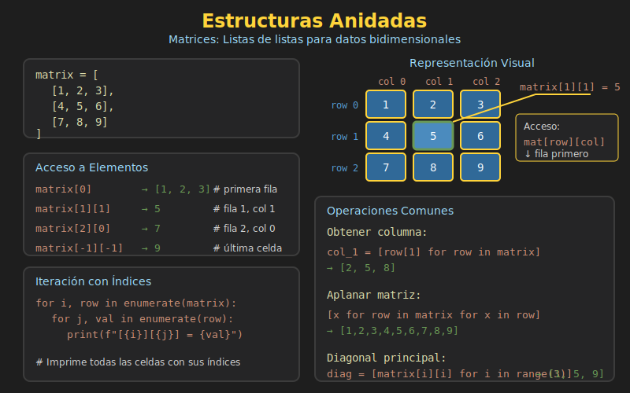

# 🏗️ Estructuras Anidadas



## 🎯 Objetivos

- Comprender listas de listas (matrices)
- Acceder y modificar elementos en estructuras anidadas
- Iterar sobre estructuras multidimensionales
- Aplicar comprehensions a estructuras anidadas
- Trabajar con datos del mundo real (tablas, grids)

---

## 1. Listas de Listas (Matrices)

Una **matriz** es una lista que contiene otras listas como elementos.

```python
# Matriz 3x3
matrix: list[list[int]] = [
    [1, 2, 3],
    [4, 5, 6],
    [7, 8, 9]
]

# Visualización:
#     Col 0  Col 1  Col 2
# Row 0  [1,     2,     3]
# Row 1  [4,     5,     6]
# Row 2  [7,     8,     9]

# Cada elemento de matrix es una lista (fila)
print(matrix[0])  # [1, 2, 3] (primera fila)
print(matrix[1])  # [4, 5, 6] (segunda fila)
```

---

## 2. Acceso a Elementos

### Acceso por Índices

```python
matrix: list[list[int]] = [
    [1, 2, 3],
    [4, 5, 6],
    [7, 8, 9]
]

# Acceso: matrix[fila][columna]
print(matrix[0][0])  # 1 (fila 0, columna 0)
print(matrix[0][2])  # 3 (fila 0, columna 2)
print(matrix[1][1])  # 5 (fila 1, columna 1)
print(matrix[2][0])  # 7 (fila 2, columna 0)

# Con índices negativos
print(matrix[-1][-1])  # 9 (última fila, última columna)
print(matrix[-1][0])   # 7 (última fila, primera columna)
```

### Modificar Elementos

```python
matrix: list[list[int]] = [
    [1, 2, 3],
    [4, 5, 6],
    [7, 8, 9]
]

# Modificar un elemento
matrix[1][1] = 99
print(matrix[1])  # [4, 99, 6]

# Modificar una fila completa
matrix[0] = [10, 20, 30]
print(matrix[0])  # [10, 20, 30]

# Agregar una nueva fila
matrix.append([10, 11, 12])
print(len(matrix))  # 4
```

---

## 3. Iterar Estructuras Anidadas

### Iterar Filas

```python
matrix: list[list[int]] = [
    [1, 2, 3],
    [4, 5, 6],
    [7, 8, 9]
]

# Iterar cada fila
for row in matrix:
    print(row)

# Output:
# [1, 2, 3]
# [4, 5, 6]
# [7, 8, 9]
```

### Iterar Todos los Elementos

```python
matrix: list[list[int]] = [
    [1, 2, 3],
    [4, 5, 6],
    [7, 8, 9]
]

# Bucles anidados
for row in matrix:
    for element in row:
        print(element, end=" ")
    print()  # Nueva línea después de cada fila

# Output:
# 1 2 3
# 4 5 6
# 7 8 9
```

### Iterar con Índices

```python
matrix: list[list[int]] = [
    [1, 2, 3],
    [4, 5, 6],
    [7, 8, 9]
]

# Con enumerate para obtener índices
for i, row in enumerate(matrix):
    for j, value in enumerate(row):
        print(f"matrix[{i}][{j}] = {value}")

# Output:
# matrix[0][0] = 1
# matrix[0][1] = 2
# ...
```

### Iterar Columnas

```python
matrix: list[list[int]] = [
    [1, 2, 3],
    [4, 5, 6],
    [7, 8, 9]
]

# Obtener una columna específica
def get_column(matrix: list[list[int]], col_idx: int) -> list[int]:
    return [row[col_idx] for row in matrix]

column_0 = get_column(matrix, 0)
print(column_0)  # [1, 4, 7]

column_2 = get_column(matrix, 2)
print(column_2)  # [3, 6, 9]

# Iterar todas las columnas
num_cols = len(matrix[0])
for col_idx in range(num_cols):
    column = get_column(matrix, col_idx)
    print(f"Column {col_idx}: {column}")
```

---

## 4. Comprehensions con Estructuras Anidadas

### Aplanar Lista (Flatten)

```python
nested: list[list[int]] = [[1, 2, 3], [4, 5, 6], [7, 8, 9]]

# Aplanar a una sola lista
flat = [item for row in nested for item in row]
print(flat)  # [1, 2, 3, 4, 5, 6, 7, 8, 9]

# Equivalente con bucles:
flat = []
for row in nested:
    for item in row:
        flat.append(item)
```

### Crear Matriz con Comprehension

```python
# Matriz 3x4 de ceros
rows, cols = 3, 4
zeros: list[list[int]] = [[0 for _ in range(cols)] for _ in range(rows)]
print(zeros)
# [[0, 0, 0, 0],
#  [0, 0, 0, 0],
#  [0, 0, 0, 0]]

# Matriz con valores calculados
multiplication_table = [[i * j for j in range(1, 6)] for i in range(1, 6)]
# [[1, 2, 3, 4, 5],
#  [2, 4, 6, 8, 10],
#  [3, 6, 9, 12, 15],
#  [4, 8, 12, 16, 20],
#  [5, 10, 15, 20, 25]]

# Matriz identidad 3x3
identity = [[1 if i == j else 0 for j in range(3)] for i in range(3)]
# [[1, 0, 0],
#  [0, 1, 0],
#  [0, 0, 1]]
```

### Transformar Elementos

```python
matrix: list[list[int]] = [
    [1, 2, 3],
    [4, 5, 6],
    [7, 8, 9]
]

# Elevar al cuadrado cada elemento
squared = [[x**2 for x in row] for row in matrix]
print(squared)
# [[1, 4, 9],
#  [16, 25, 36],
#  [49, 64, 81]]

# Filtrar: solo pares
only_evens = [[x for x in row if x % 2 == 0] for row in matrix]
print(only_evens)
# [[2], [4, 6], [8]]
```

---

## 5. Operaciones Comunes con Matrices

### Transponer Matriz

```python
matrix: list[list[int]] = [
    [1, 2, 3],
    [4, 5, 6]
]

# Transponer (filas ↔ columnas)
transposed = [[row[i] for row in matrix] for i in range(len(matrix[0]))]
print(transposed)
# [[1, 4],
#  [2, 5],
#  [3, 6]]

# Con zip (más elegante)
transposed = [list(row) for row in zip(*matrix)]
print(transposed)
# [[1, 4],
#  [2, 5],
#  [3, 6]]
```

### Sumar Filas y Columnas

```python
matrix: list[list[int]] = [
    [1, 2, 3],
    [4, 5, 6],
    [7, 8, 9]
]

# Suma de cada fila
row_sums = [sum(row) for row in matrix]
print(row_sums)  # [6, 15, 24]

# Suma de cada columna
col_sums = [sum(row[i] for row in matrix) for i in range(len(matrix[0]))]
print(col_sums)  # [12, 15, 18]

# Suma total de todos los elementos
total = sum(sum(row) for row in matrix)
print(total)  # 45
```

### Buscar en Matriz

```python
matrix: list[list[int]] = [
    [1, 2, 3],
    [4, 5, 6],
    [7, 8, 9]
]

def find_element(matrix: list[list[int]], target: int) -> tuple[int, int] | None:
    """Encuentra la posición de un elemento en la matriz."""
    for i, row in enumerate(matrix):
        for j, value in enumerate(row):
            if value == target:
                return (i, j)
    return None

pos = find_element(matrix, 5)
print(pos)  # (1, 1)

pos = find_element(matrix, 99)
print(pos)  # None
```

---

## 6. ⚠️ Cuidado: Crear Matrices

### ❌ Error Común

```python
# ❌ INCORRECTO: Todas las filas son la misma referencia
rows, cols = 3, 3
bad_matrix = [[0] * cols] * rows

bad_matrix[0][0] = 99
print(bad_matrix)
# [[99, 0, 0],
#  [99, 0, 0],
#  [99, 0, 0]]  # ¡Todas las filas cambiaron!
```

### ✅ Forma Correcta

```python
# ✅ CORRECTO: Cada fila es una lista independiente
rows, cols = 3, 3
good_matrix = [[0] * cols for _ in range(rows)]

good_matrix[0][0] = 99
print(good_matrix)
# [[99, 0, 0],
#  [0, 0, 0],
#  [0, 0, 0]]  # Solo la primera fila cambió
```

### ¿Por qué ocurre?

```python
# * rows crea referencias a la MISMA lista
row = [0, 0, 0]
bad = [row, row, row]  # 3 referencias al mismo objeto

# La comprehension crea NUEVAS listas
good = [[0, 0, 0] for _ in range(3)]  # 3 listas diferentes
```

---

## 7. Listas de Tuplas

Combinar listas y tuplas es muy común para representar datos estructurados.

```python
from typing import NamedTuple

# Lista de coordenadas (tuplas)
points: list[tuple[int, int]] = [
    (0, 0),
    (10, 20),
    (30, 40)
]

# Acceso
print(points[0])     # (0, 0)
print(points[1][0])  # 10 (x del segundo punto)

# Iterar con unpacking
for x, y in points:
    print(f"x={x}, y={y}")

# Con Named Tuples
class Student(NamedTuple):
    name: str
    grade: float

students: list[Student] = [
    Student("Alice", 95.5),
    Student("Bob", 87.0),
    Student("Charlie", 92.3)
]

# Filtrar y ordenar
top_students = sorted(
    [s for s in students if s.grade >= 90],
    key=lambda s: s.grade,
    reverse=True
)
```

---

## 8. Datos del Mundo Real

### Tabla de Datos

```python
# Tabla como lista de listas
# Primera fila es encabezado
table: list[list[str | int | float]] = [
    ["Name", "Age", "Score"],
    ["Alice", 25, 95.5],
    ["Bob", 30, 87.0],
    ["Charlie", 22, 92.3]
]

# Obtener encabezados
headers = table[0]
print(headers)  # ['Name', 'Age', 'Score']

# Obtener datos (sin encabezado)
data = table[1:]

# Buscar por nombre
def find_by_name(table: list[list], name: str) -> list | None:
    for row in table[1:]:  # Skip header
        if row[0] == name:
            return row
    return None

alice = find_by_name(table, "Alice")
print(alice)  # ['Alice', 25, 95.5]
```

### Grid de Juego

```python
# Tablero de Tic-Tac-Toe
board: list[list[str]] = [
    ["X", "O", "X"],
    [" ", "X", "O"],
    ["O", " ", " "]
]

def print_board(board: list[list[str]]) -> None:
    """Imprime el tablero de forma visual."""
    for i, row in enumerate(board):
        print(" | ".join(row))
        if i < len(board) - 1:
            print("-" * 9)

print_board(board)
# X | O | X
# ---------
#   | X | O
# ---------
# O |   |

def check_winner(board: list[list[str]], player: str) -> bool:
    """Verifica si un jugador ganó."""
    # Verificar filas
    for row in board:
        if all(cell == player for cell in row):
            return True

    # Verificar columnas
    for col in range(3):
        if all(board[row][col] == player for row in range(3)):
            return True

    # Verificar diagonales
    if all(board[i][i] == player for i in range(3)):
        return True
    if all(board[i][2-i] == player for i in range(3)):
        return True

    return False
```

### Imagen como Matriz de Píxeles

```python
# Imagen en escala de grises (valores 0-255)
image: list[list[int]] = [
    [100, 150, 200],
    [50, 100, 150],
    [0, 50, 100]
]

# Invertir colores
inverted = [[255 - pixel for pixel in row] for row in image]
print(inverted)
# [[155, 105, 55],
#  [205, 155, 105],
#  [255, 205, 155]]

# Aumentar brillo
def increase_brightness(img: list[list[int]], amount: int) -> list[list[int]]:
    return [[min(255, pixel + amount) for pixel in row] for row in img]

brighter = increase_brightness(image, 50)
```

---

## 9. Ejercicio Rápido

```python
# Matriz de calificaciones: filas=estudiantes, columnas=materias
grades: list[list[float]] = [
    [85, 90, 78],   # Estudiante 0
    [92, 88, 95],   # Estudiante 1
    [78, 82, 80],   # Estudiante 2
]
subjects = ["Math", "Science", "English"]

# 1. Promedio de cada estudiante
student_avg = [sum(row) / len(row) for row in grades]
print(student_avg)  # [84.33..., 91.66..., 80.0]

# 2. Promedio de cada materia
subject_avg = [
    sum(grades[s][m] for s in range(len(grades))) / len(grades)
    for m in range(len(subjects))
]
print(subject_avg)  # [85.0, 86.66..., 84.33...]

# 3. Mejor calificación por materia
best_per_subject = [max(grades[s][m] for s in range(len(grades)))
                    for m in range(len(subjects))]
print(best_per_subject)  # [92, 90, 95]

# 4. Estudiante con mejor promedio
best_student = student_avg.index(max(student_avg))
print(f"Best student: {best_student}")  # 1
```

---

## 📚 Recursos

- [Nested Lists](https://docs.python.org/3/tutorial/datastructures.html#nested-list-comprehensions)
- [Working with 2D Arrays](https://realpython.com/python-lists-tuples/#lists-can-contain-arbitrary-objects)

---

[← Tuplas](03-tuplas.md) | [Volver a Semana 05](../README.md)
