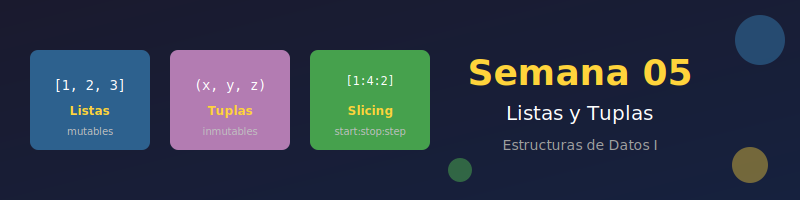

# 📚 Semana 05: Listas y Tuplas



## 🎯 Objetivos de Aprendizaje

Al finalizar esta semana, serás capaz de:

- ✅ Dominar los métodos de listas en Python
- ✅ Aplicar slicing avanzado para manipular secuencias
- ✅ Comprender la inmutabilidad de las tuplas
- ✅ Elegir la estructura de datos correcta para cada caso
- ✅ Trabajar con estructuras anidadas (listas de listas)
- ✅ Implementar operaciones comunes de manipulación de datos

---

## 📋 Requisitos Previos

Antes de comenzar, asegúrate de haber completado:

- [x] Semana 04: Comprehensions y Funciones
- [x] Comprensión de bucles y condicionales
- [x] Conocimiento básico de listas y tipos de datos

---

## 🗂️ Estructura de la Semana

```
week-05/
├── README.md                    # Este archivo
├── rubrica-evaluacion.md        # Criterios de evaluación
├── 0-assets/                    # Recursos visuales
│   ├── week-05-header.svg
│   ├── 01-list-methods.svg
│   ├── 02-slicing-syntax.svg
│   ├── 03-tuple-vs-list.svg
│   └── 04-nested-structures.svg
├── 1-teoria/                    # Material teórico
│   ├── 01-listas-metodos.md
│   ├── 02-listas-slicing.md
│   ├── 03-tuplas.md
│   └── 04-estructuras-anidadas.md
├── 2-ejercicios/                # Ejercicios guiados
│   ├── 01-metodos-listas/
│   ├── 02-slicing-avanzado/
│   └── 03-tuplas-estructuras/
├── 3-proyecto/                  # Proyecto integrador
│   ├── README.md
│   └── starter/
├── 4-recursos/                  # Material adicional
│   ├── ebooks-free/
│   ├── videografia/
│   └── webgrafia/
└── 5-glosario/                  # Términos clave
    └── README.md
```

---

## 📚 Contenido

### 1. Teoría

| # | Tema | Archivo | Duración |
|---|------|---------|----------|
| 1 | Métodos de Listas | [01-listas-metodos.md](1-teoria/01-listas-metodos.md) | 30 min |
| 2 | Slicing Avanzado | [02-listas-slicing.md](1-teoria/02-listas-slicing.md) | 25 min |
| 3 | Tuplas e Inmutabilidad | [03-tuplas.md](1-teoria/03-tuplas.md) | 25 min |
| 4 | Estructuras Anidadas | [04-estructuras-anidadas.md](1-teoria/04-estructuras-anidadas.md) | 20 min |

### 2. Ejercicios Guiados

| # | Ejercicio | Descripción | Duración |
|---|-----------|-------------|----------|
| 1 | [Métodos de Listas](2-ejercicios/01-metodos-listas/) | Dominar append, extend, insert, remove, pop | 45 min |
| 2 | [Slicing Avanzado](2-ejercicios/02-slicing-avanzado/) | Manipulación de secuencias con slicing | 45 min |
| 3 | [Tuplas y Estructuras](2-ejercicios/03-tuplas-estructuras/) | Trabajar con tuplas y datos anidados | 45 min |

### 3. Proyecto Integrador

| Proyecto | Descripción | Duración |
|----------|-------------|----------|
| [Gestor de Playlist](3-proyecto/) | Sistema para gestionar playlists de música | 90 min |

---

## ⏱️ Distribución del Tiempo

| Actividad | Tiempo |
|-----------|--------|
| 📖 Teoría | 1.5-2 horas |
| 💻 Ejercicios | 2-2.5 horas |
| 🚀 Proyecto | 1.5-2 horas |
| **Total** | **~6 horas** |

---

## 📌 Entregables

1. **Ejercicios completados** - Código funcional de los 3 ejercicios
2. **Proyecto Playlist Manager** - Sistema completo con todas las funciones
3. **Reflexión** - Diferencias entre listas y tuplas (cuándo usar cada una)

---

## 🔑 Conceptos Clave

### Listas (Mutables)
```python
# Métodos principales
fruits = ["apple", "banana"]
fruits.append("orange")      # Agregar al final
fruits.insert(0, "mango")    # Insertar en posición
fruits.extend(["kiwi"])      # Agregar múltiples
fruits.remove("banana")      # Eliminar por valor
last = fruits.pop()          # Eliminar y retornar último

# Slicing
numbers = [0, 1, 2, 3, 4, 5]
numbers[1:4]     # [1, 2, 3]
numbers[::2]     # [0, 2, 4]
numbers[::-1]    # [5, 4, 3, 2, 1, 0]
```

### Tuplas (Inmutables)
```python
# Crear tuplas
point = (10, 20)
single = (42,)  # Tupla de un elemento (coma obligatoria)
coords = 3, 4   # Sin paréntesis también funciona

# Unpacking
x, y = point
name, *rest, last = ("Alice", 1, 2, 3, "end")

# Casos de uso
# - Coordenadas: (x, y, z)
# - Registros: ("John", 30, "NYC")
# - Claves de diccionario
# - Retorno múltiple de funciones
```

### Estructuras Anidadas
```python
# Matriz (lista de listas)
matrix = [
    [1, 2, 3],
    [4, 5, 6],
    [7, 8, 9]
]

# Acceso
matrix[0][1]  # 2 (fila 0, columna 1)

# Iterar
for row in matrix:
    for cell in row:
        print(cell)
```

---

## 💡 Tips de la Semana

> 🔹 **Mutabilidad**: Las listas pueden cambiar, las tuplas no
>
> 🔹 **Performance**: Las tuplas son más rápidas y usan menos memoria
>
> 🔹 **Slicing**: Siempre retorna una nueva secuencia, no modifica la original
>
> 🔹 **Unpacking**: Úsalo para código más legible y Pythonic

---

## 🔗 Navegación

| ← Anterior | Índice | Siguiente → |
|------------|--------|-------------|
| [Semana 04: Comprehensions](../week-04/README.md) | [Bootcamp](../../README.md) | [Semana 06: Diccionarios](../week-06/README.md) |

---

## 📚 Recursos Adicionales

- [4-recursos/ebooks-free/](4-recursos/ebooks-free/) - Libros gratuitos
- [4-recursos/videografia/](4-recursos/videografia/) - Videos recomendados
- [4-recursos/webgrafia/](4-recursos/webgrafia/) - Artículos y documentación

---

*Semana 05 de 14 | Bootcamp Python Zero to Hero*
