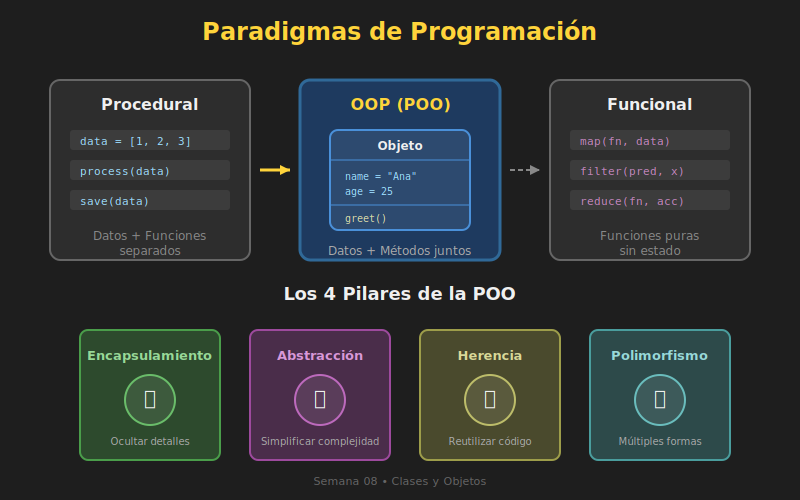

# 🎭 Introducción a la Programación Orientada a Objetos

## 🎯 Objetivos

- Entender qué es la Programación Orientada a Objetos (POO)
- Conocer los paradigmas de programación
- Comprender los cuatro pilares de POO
- Identificar cuándo usar POO vs programación procedural

---

## 1. ¿Qué es un Paradigma de Programación?

Un **paradigma de programación** es una forma de pensar y estructurar el código. Es como un "estilo" o "filosofía" para resolver problemas.



### Paradigmas Principales

| Paradigma | Descripción | Ejemplo |
|-----------|-------------|---------|
| **Imperativo** | Secuencia de instrucciones paso a paso | C, Assembly |
| **Procedural** | Organiza código en funciones/procedimientos | C, Pascal |
| **Orientado a Objetos** | Organiza código en objetos que combinan datos y comportamiento | Python, Java |
| **Funcional** | Basado en funciones puras sin efectos secundarios | Haskell, Lisp |

> 💡 **Python es multiparadigma**: Puedes usar procedural, POO y funcional según lo que necesites.

---

## 2. ¿Qué es la Programación Orientada a Objetos?

La **POO** es un paradigma que organiza el código alrededor de **objetos** que representan entidades del mundo real o conceptos abstractos.

### Analogía del Mundo Real

Piensa en un **automóvil**:

```
🚗 Automóvil (Objeto)
├── Características (Atributos)
│   ├── marca = "Toyota"
│   ├── modelo = "Corolla"
│   ├── color = "rojo"
│   └── velocidad_actual = 0
│
└── Comportamientos (Métodos)
    ├── acelerar()
    ├── frenar()
    ├── encender()
    └── apagar()
```

En POO, modelamos esto como:

```python
class Car:
    """Representa un automóvil."""

    def __init__(self, brand: str, model: str, color: str) -> None:
        self.brand = brand
        self.model = model
        self.color = color
        self.current_speed = 0

    def accelerate(self, amount: int) -> None:
        self.current_speed += amount
        print(f"Velocidad: {self.current_speed} km/h")

    def brake(self) -> None:
        self.current_speed = 0
        print("Vehículo detenido")


# Crear un objeto (instancia)
my_car = Car("Toyota", "Corolla", "rojo")
my_car.accelerate(50)  # Velocidad: 50 km/h
```

---

## 3. Conceptos Fundamentales

### Clase vs Objeto

| Concepto | Descripción | Analogía |
|----------|-------------|----------|
| **Clase** | Plantilla/molde que define estructura y comportamiento | Plano de una casa |
| **Objeto** | Instancia específica creada a partir de una clase | Casa construida |
| **Instancia** | Sinónimo de objeto | - |

```python
# Clase = Plantilla
class Dog:
    def __init__(self, name: str, breed: str) -> None:
        self.name = name
        self.breed = breed

    def bark(self) -> str:
        return f"{self.name} dice: ¡Guau!"


# Objetos = Instancias específicas
dog1 = Dog("Max", "Labrador")      # Objeto 1
dog2 = Dog("Luna", "Golden")       # Objeto 2
dog3 = Dog("Rocky", "Bulldog")     # Objeto 3

# Cada objeto tiene sus propios datos
print(dog1.name)  # Max
print(dog2.name)  # Luna
print(dog3.bark())  # Rocky dice: ¡Guau!
```

### Atributos y Métodos

| Término | Descripción | Ejemplo |
|---------|-------------|---------|
| **Atributo** | Variable que pertenece a un objeto | `dog.name` |
| **Método** | Función que pertenece a un objeto | `dog.bark()` |

---

## 4. Los Cuatro Pilares de POO

La POO se basa en cuatro principios fundamentales:

### 4.1 Encapsulamiento 📦

**Ocultar los detalles internos** y exponer solo lo necesario.

```python
class BankAccount:
    def __init__(self, owner: str, initial_balance: float) -> None:
        self.owner = owner
        self._balance = initial_balance  # "_" indica "privado"

    def deposit(self, amount: float) -> None:
        if amount > 0:
            self._balance += amount

    def get_balance(self) -> float:
        return self._balance


account = BankAccount("Ana", 1000)
account.deposit(500)
print(account.get_balance())  # 1500
# No accedemos directamente a _balance
```

### 4.2 Abstracción 🎨

**Simplificar la complejidad** mostrando solo lo esencial.

```python
class EmailSender:
    def send(self, to: str, subject: str, body: str) -> bool:
        # El usuario no necesita saber cómo funciona internamente
        # Solo llama a send() y obtiene True/False
        self._connect_to_server()
        self._authenticate()
        self._compose_message(to, subject, body)
        return self._transmit()
```

### 4.3 Herencia 🧬

**Crear nuevas clases basadas en existentes**, reutilizando código.

```python
class Animal:
    def __init__(self, name: str) -> None:
        self.name = name

    def speak(self) -> str:
        return "Hace un sonido"


class Dog(Animal):  # Dog HEREDA de Animal
    def speak(self) -> str:
        return f"{self.name} dice: ¡Guau!"


class Cat(Animal):  # Cat HEREDA de Animal
    def speak(self) -> str:
        return f"{self.name} dice: ¡Miau!"


dog = Dog("Max")
cat = Cat("Luna")
print(dog.speak())  # Max dice: ¡Guau!
print(cat.speak())  # Luna dice: ¡Miau!
```

### 4.4 Polimorfismo 🔄

**Diferentes objetos responden al mismo método** de formas distintas.

```python
def make_animal_speak(animal: Animal) -> None:
    # Funciona con cualquier Animal (Dog, Cat, etc.)
    print(animal.speak())


animals = [Dog("Max"), Cat("Luna"), Dog("Rocky")]

for animal in animals:
    make_animal_speak(animal)
# Max dice: ¡Guau!
# Luna dice: ¡Miau!
# Rocky dice: ¡Guau!
```

---

## 5. POO vs Programación Procedural

### Enfoque Procedural

```python
# Datos separados de funciones
user_data = {
    "name": "Ana",
    "email": "ana@example.com",
    "balance": 1000
}

def deposit(user: dict, amount: float) -> None:
    user["balance"] += amount

def withdraw(user: dict, amount: float) -> bool:
    if user["balance"] >= amount:
        user["balance"] -= amount
        return True
    return False

# Uso
deposit(user_data, 500)
withdraw(user_data, 200)
```

### Enfoque POO

```python
class User:
    def __init__(self, name: str, email: str, balance: float) -> None:
        self.name = name
        self.email = email
        self._balance = balance

    def deposit(self, amount: float) -> None:
        self._balance += amount

    def withdraw(self, amount: float) -> bool:
        if self._balance >= amount:
            self._balance -= amount
            return True
        return False

# Uso
user = User("Ana", "ana@example.com", 1000)
user.deposit(500)
user.withdraw(200)
```

### ¿Cuándo Usar Cada Enfoque?

| Usar Procedural | Usar POO |
|-----------------|----------|
| Scripts simples y cortos | Aplicaciones medianas/grandes |
| Tareas de automatización | Modelar entidades del mundo real |
| Procesamiento de datos lineal | Código que se reutilizará |
| Prototipos rápidos | Múltiples desarrolladores |

---

## 6. Beneficios de POO

### ✅ Organización

```python
# Todo lo relacionado con User está en un lugar
class User:
    # Atributos
    # Métodos
    # Validaciones
    pass
```

### ✅ Reutilización

```python
# Crear múltiples usuarios fácilmente
users = [
    User("Ana", "ana@email.com", 1000),
    User("Bob", "bob@email.com", 500),
    User("Carlos", "carlos@email.com", 750),
]
```

### ✅ Mantenimiento

```python
# Cambiar la implementación interna sin afectar el uso
class User:
    def deposit(self, amount: float) -> None:
        # Podemos agregar validación, logging, etc.
        # sin cambiar cómo se llama el método
        if amount <= 0:
            raise ValueError("Amount must be positive")
        self._balance += amount
        self._log_transaction("deposit", amount)
```

### ✅ Testabilidad

```python
# Fácil de probar en aislamiento
def test_user_deposit():
    user = User("Test", "test@email.com", 100)
    user.deposit(50)
    assert user.get_balance() == 150
```

---

## 7. Terminología Esencial

| Término | Definición |
|---------|------------|
| **Clase** | Plantilla que define atributos y métodos |
| **Objeto** | Instancia de una clase |
| **Instancia** | Objeto creado a partir de una clase |
| **Atributo** | Variable que pertenece a un objeto |
| **Método** | Función que pertenece a un objeto |
| **Constructor** | Método que inicializa un objeto (`__init__`) |
| **self** | Referencia al objeto actual |
| **Instanciar** | Crear un objeto a partir de una clase |

---

## ✅ Resumen

1. **POO** organiza código en objetos que combinan datos y comportamiento
2. Una **clase** es una plantilla; un **objeto** es una instancia
3. Los **4 pilares**: Encapsulamiento, Abstracción, Herencia, Polimorfismo
4. POO es ideal para aplicaciones medianas/grandes con entidades claras
5. Python permite combinar paradigmas según la necesidad

---

## 🔗 Siguiente

Ahora que entiendes los conceptos, aprende a crear clases en:
➡️ [02-clases-objetos.md](02-clases-objetos.md)
