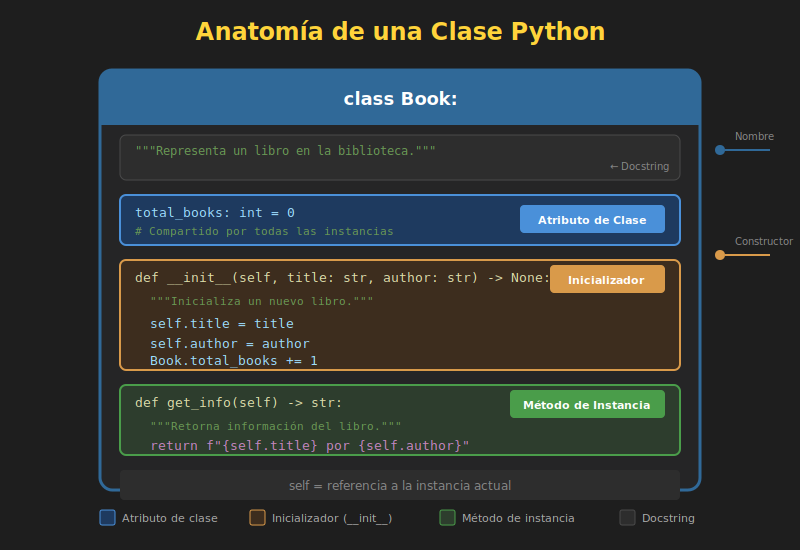

# 🏗️ Clases y Objetos en Python

## 🎯 Objetivos

- Crear clases usando la sintaxis de Python
- Entender el método `__init__` (constructor)
- Usar `self` correctamente
- Crear e interactuar con objetos
- Aplicar type hints en clases

---

## 1. Sintaxis Básica de una Clase



### Estructura Mínima

```python
class ClassName:
    """Docstring describiendo la clase."""
    pass
```

### Convenciones de Nomenclatura

| Elemento | Convención | Ejemplo |
|----------|------------|---------|
| Clase | PascalCase | `UserAccount`, `ShoppingCart` |
| Método | snake_case | `get_balance`, `add_item` |
| Atributo | snake_case | `first_name`, `total_price` |
| Constante | UPPER_SNAKE | `MAX_ITEMS`, `DEFAULT_VALUE` |

---

## 2. El Método `__init__` (Constructor)

El método `__init__` se ejecuta **automáticamente** cuando creas un objeto. Su propósito es **inicializar los atributos** del objeto.

### Sintaxis Básica

```python
class Person:
    """Representa una persona."""

    def __init__(self, name: str, age: int) -> None:
        """
        Inicializa una nueva persona.

        Args:
            name: Nombre de la persona
            age: Edad en años
        """
        self.name = name
        self.age = age


# Crear objeto (Python llama __init__ automáticamente)
person = Person("Ana", 28)
print(person.name)  # Ana
print(person.age)   # 28
```

### Con Valores por Defecto

```python
class Product:
    """Representa un producto en inventario."""

    def __init__(
        self,
        name: str,
        price: float,
        quantity: int = 0,
        category: str = "general"
    ) -> None:
        self.name = name
        self.price = price
        self.quantity = quantity
        self.category = category


# Diferentes formas de crear objetos
product1 = Product("Laptop", 999.99)
product2 = Product("Mouse", 29.99, quantity=50)
product3 = Product("Teclado", 79.99, 30, "periféricos")

print(product1.quantity)  # 0 (valor por defecto)
print(product2.quantity)  # 50
```

---

## 3. Entendiendo `self`

`self` es una referencia al **objeto actual**. Es el primer parámetro de todos los métodos de instancia.

### ¿Por Qué `self`?

```python
class Counter:
    def __init__(self) -> None:
        self.count = 0

    def increment(self) -> None:
        # self.count se refiere al count de ESTE objeto específico
        self.count += 1

    def get_count(self) -> int:
        return self.count


# Dos objetos independientes
counter1 = Counter()
counter2 = Counter()

counter1.increment()
counter1.increment()
counter2.increment()

print(counter1.get_count())  # 2
print(counter2.get_count())  # 1
# Cada objeto tiene su propio count
```

### Visualización de `self`

```python
class Demo:
    def __init__(self, value: int) -> None:
        print(f"self es: {self}")
        print(f"id(self): {id(self)}")
        self.value = value


obj1 = Demo(10)
# self es: <__main__.Demo object at 0x7f...>
# id(self): 140234567890

obj2 = Demo(20)
# self es: <__main__.Demo object at 0x7f...>  (diferente)
# id(self): 140234567999  (diferente)

print(f"obj1 id: {id(obj1)}")  # Mismo que self en Demo(10)
print(f"obj2 id: {id(obj2)}")  # Mismo que self en Demo(20)
```

---

## 4. Creando Objetos (Instanciación)

### Sintaxis

```python
# Clase
class Book:
    def __init__(self, title: str, author: str, pages: int) -> None:
        self.title = title
        self.author = author
        self.pages = pages


# Instanciación (crear objetos)
book1 = Book("1984", "George Orwell", 328)
book2 = Book("El Quijote", "Cervantes", 863)
book3 = Book("Python Crash Course", "Eric Matthes", 544)
```

### Acceder a Atributos

```python
# Leer atributos
print(book1.title)   # 1984
print(book1.author)  # George Orwell
print(book1.pages)   # 328

# Modificar atributos
book1.pages = 330
print(book1.pages)   # 330

# Los objetos son independientes
print(book2.pages)   # 863 (no cambió)
```

---

## 5. Definiendo Métodos

Los **métodos** son funciones que pertenecen a una clase y operan sobre los datos del objeto.

### Métodos de Instancia

```python
class Rectangle:
    """Representa un rectángulo."""

    def __init__(self, width: float, height: float) -> None:
        self.width = width
        self.height = height

    def area(self) -> float:
        """Calcula el área del rectángulo."""
        return self.width * self.height

    def perimeter(self) -> float:
        """Calcula el perímetro del rectángulo."""
        return 2 * (self.width + self.height)

    def is_square(self) -> bool:
        """Verifica si es un cuadrado."""
        return self.width == self.height

    def scale(self, factor: float) -> None:
        """Escala el rectángulo por un factor."""
        self.width *= factor
        self.height *= factor


# Uso
rect = Rectangle(10, 5)
print(rect.area())       # 50.0
print(rect.perimeter())  # 30.0
print(rect.is_square())  # False

rect.scale(2)
print(rect.area())       # 200.0 (10*2 * 5*2)
```

### Métodos que Retornan Objetos

```python
class Point:
    """Representa un punto en 2D."""

    def __init__(self, x: float, y: float) -> None:
        self.x = x
        self.y = y

    def distance_to(self, other: "Point") -> float:
        """Calcula la distancia a otro punto."""
        dx = self.x - other.x
        dy = self.y - other.y
        return (dx**2 + dy**2) ** 0.5

    def move(self, dx: float, dy: float) -> "Point":
        """Retorna un nuevo punto desplazado."""
        return Point(self.x + dx, self.y + dy)


p1 = Point(0, 0)
p2 = Point(3, 4)

print(p1.distance_to(p2))  # 5.0

p3 = p1.move(10, 20)
print(p3.x, p3.y)  # 10 20
print(p1.x, p1.y)  # 0 0 (p1 no cambió)
```

---

## 6. Type Hints en Clases

### Anotaciones de Atributos

```python
class Student:
    """Representa un estudiante."""

    # Atributos de clase con tipo
    school_name: str = "Python Academy"

    def __init__(self, name: str, grades: list[float]) -> None:
        # Atributos de instancia con tipo inferido
        self.name: str = name
        self.grades: list[float] = grades
        self.is_active: bool = True

    def average(self) -> float:
        """Calcula el promedio de calificaciones."""
        if not self.grades:
            return 0.0
        return sum(self.grades) / len(self.grades)

    def add_grade(self, grade: float) -> None:
        """Agrega una calificación."""
        self.grades.append(grade)


student = Student("Ana", [85.5, 90.0, 78.5])
print(student.average())  # 84.67
```

### Type Hints para el Mismo Tipo de Clase

```python
from __future__ import annotations  # Permite usar el nombre de la clase antes de definirla


class Node:
    """Nodo de una lista enlazada."""

    def __init__(self, value: int, next_node: Node | None = None) -> None:
        self.value = value
        self.next = next_node

    def append(self, value: int) -> Node:
        """Agrega un nodo al final y lo retorna."""
        new_node = Node(value)
        current = self
        while current.next:
            current = current.next
        current.next = new_node
        return new_node
```

---

## 7. Ejemplo Completo: Sistema de Tareas

```python
from datetime import datetime


class Task:
    """Representa una tarea por hacer."""

    def __init__(
        self,
        title: str,
        description: str = "",
        priority: int = 1
    ) -> None:
        """
        Crea una nueva tarea.

        Args:
            title: Título de la tarea
            description: Descripción detallada
            priority: Prioridad (1-5, mayor es más urgente)
        """
        self.title = title
        self.description = description
        self.priority = priority
        self.completed = False
        self.created_at = datetime.now()
        self.completed_at: datetime | None = None

    def complete(self) -> None:
        """Marca la tarea como completada."""
        self.completed = True
        self.completed_at = datetime.now()

    def is_high_priority(self) -> bool:
        """Verifica si es de alta prioridad."""
        return self.priority >= 4

    def time_to_complete(self) -> str:
        """Retorna el tiempo que tomó completar la tarea."""
        if not self.completed_at:
            return "No completada"

        delta = self.completed_at - self.created_at
        return f"{delta.seconds // 60} minutos"

    def summary(self) -> str:
        """Retorna un resumen de la tarea."""
        status = "✅" if self.completed else "⏳"
        priority_stars = "⭐" * self.priority
        return f"{status} [{priority_stars}] {self.title}"


# Uso del sistema
task1 = Task("Aprender POO", "Completar semana 8", priority=5)
task2 = Task("Hacer ejercicios", priority=3)
task3 = Task("Revisar notas")

print(task1.summary())  # ⏳ [⭐⭐⭐⭐⭐] Aprender POO
print(task1.is_high_priority())  # True

task1.complete()
print(task1.summary())  # ✅ [⭐⭐⭐⭐⭐] Aprender POO

# Lista de tareas
tasks = [task1, task2, task3]

print("\n--- Todas las tareas ---")
for task in tasks:
    print(task.summary())

print("\n--- Tareas de alta prioridad ---")
high_priority = [t for t in tasks if t.is_high_priority()]
for task in high_priority:
    print(task.summary())
```

---

## 8. Errores Comunes

### ❌ Olvidar `self`

```python
class Wrong:
    def __init__(self, value):
        value = value  # ❌ No guarda nada en el objeto

    def get_value(self):
        return value  # ❌ NameError: value no definido


class Correct:
    def __init__(self, value: int) -> None:
        self.value = value  # ✅ Guarda en el objeto

    def get_value(self) -> int:
        return self.value  # ✅ Accede al atributo del objeto
```

### ❌ Olvidar `self` en Parámetros

```python
class Wrong:
    def greet():  # ❌ Falta self
        print("Hola")


class Correct:
    def greet(self) -> None:  # ✅ self como primer parámetro
        print("Hola")
```

### ❌ Modificar Atributos de Clase por Error

```python
class Wrong:
    items = []  # ❌ Lista compartida entre TODAS las instancias

    def add(self, item):
        self.items.append(item)


w1 = Wrong()
w2 = Wrong()
w1.add("A")
print(w2.items)  # ['A'] - ¡También se agregó a w2!


class Correct:
    def __init__(self):
        self.items = []  # ✅ Lista única por instancia

    def add(self, item):
        self.items.append(item)
```

---

## ✅ Resumen

1. **Clase**: Plantilla definida con `class ClassName:`
2. **`__init__`**: Constructor que inicializa atributos
3. **`self`**: Referencia al objeto actual (siempre primer parámetro)
4. **Instanciar**: Crear objeto con `obj = ClassName(args)`
5. **Métodos**: Funciones dentro de la clase que usan `self`
6. **Type hints**: Usar en parámetros y retornos de métodos

---

## 🔗 Siguiente

Aprende sobre los diferentes tipos de atributos y métodos:
➡️ [03-atributos-metodos.md](03-atributos-metodos.md)
