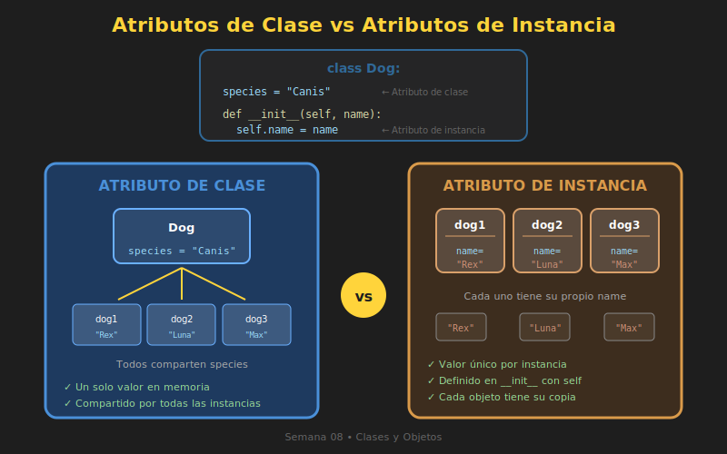

# 🎯 Atributos y Métodos en Profundidad

## 🎯 Objetivos

- Diferenciar atributos de instancia vs atributos de clase
- Entender métodos de instancia, clase y estáticos
- Usar decoradores `@classmethod` y `@staticmethod`
- Aplicar convenciones para atributos privados

---

## 1. Tipos de Atributos



### 1.1 Atributos de Instancia

Son **únicos para cada objeto**. Se definen en `__init__` usando `self`.

```python
class Player:
    def __init__(self, name: str, level: int = 1) -> None:
        # Atributos de instancia - cada jugador tiene los suyos
        self.name = name
        self.level = level
        self.health = 100
        self.inventory: list[str] = []


# Cada objeto tiene sus propios valores
player1 = Player("Ana", 5)
player2 = Player("Bob", 3)

player1.health = 80
print(player1.health)  # 80
print(player2.health)  # 100 (independiente)

player1.inventory.append("Espada")
print(player1.inventory)  # ['Espada']
print(player2.inventory)  # [] (independiente)
```

### 1.2 Atributos de Clase

Son **compartidos por todas las instancias**. Se definen fuera de `__init__`.

```python
class Player:
    # Atributos de clase - compartidos por TODOS los jugadores
    game_name: str = "Python Quest"
    max_level: int = 100
    total_players: int = 0

    def __init__(self, name: str) -> None:
        self.name = name
        # Modificar atributo de clase desde instancia
        Player.total_players += 1


# Acceder desde la clase
print(Player.game_name)     # Python Quest
print(Player.total_players) # 0

# Crear jugadores
p1 = Player("Ana")
p2 = Player("Bob")
p3 = Player("Carlos")

# El contador se actualiza para todos
print(Player.total_players)    # 3
print(p1.total_players)        # 3 (acceso desde instancia)
print(p2.total_players)        # 3

# Modificar desde la clase afecta a todos
Player.game_name = "Python Quest 2"
print(p1.game_name)  # Python Quest 2
print(p2.game_name)  # Python Quest 2
```

### ⚠️ Cuidado con Mutables en Atributos de Clase

```python
class Wrong:
    # ❌ Lista compartida - BUG común
    items: list[str] = []

    def add_item(self, item: str) -> None:
        self.items.append(item)


w1 = Wrong()
w2 = Wrong()
w1.add_item("A")
print(w2.items)  # ['A'] - ¡Se agregó a w2 también!


class Correct:
    def __init__(self) -> None:
        # ✅ Lista única por instancia
        self.items: list[str] = []

    def add_item(self, item: str) -> None:
        self.items.append(item)
```

### Resumen de Atributos

| Tipo | Definición | Acceso | Uso |
|------|------------|--------|-----|
| **Instancia** | En `__init__` con `self.` | `objeto.atributo` | Datos únicos por objeto |
| **Clase** | Fuera de métodos | `Clase.atributo` o `objeto.atributo` | Datos compartidos, constantes, contadores |

---

## 2. Tipos de Métodos

### 2.1 Métodos de Instancia

Son los más comunes. Reciben `self` como primer parámetro y pueden acceder a atributos de instancia y clase.

```python
class BankAccount:
    interest_rate: float = 0.05  # Atributo de clase

    def __init__(self, owner: str, balance: float = 0) -> None:
        self.owner = owner
        self.balance = balance

    # Método de instancia
    def deposit(self, amount: float) -> None:
        """Deposita dinero en la cuenta."""
        if amount > 0:
            self.balance += amount

    # Método de instancia que usa atributo de clase
    def add_interest(self) -> float:
        """Aplica interés y retorna el monto ganado."""
        interest = self.balance * BankAccount.interest_rate
        self.balance += interest
        return interest


account = BankAccount("Ana", 1000)
account.deposit(500)
gained = account.add_interest()
print(f"Interés ganado: ${gained:.2f}")  # $75.00
```

### 2.2 Métodos de Clase (`@classmethod`)

Reciben `cls` (la clase) como primer parámetro. Útiles para:
- Factory methods (crear instancias de formas alternativas)
- Modificar atributos de clase

```python
class User:
    total_users: int = 0

    def __init__(self, username: str, email: str) -> None:
        self.username = username
        self.email = email
        User.total_users += 1

    @classmethod
    def get_total_users(cls) -> int:
        """Retorna el total de usuarios creados."""
        return cls.total_users

    @classmethod
    def from_string(cls, data: str) -> "User":
        """
        Factory method: crea User desde string.
        Formato: "username:email"
        """
        username, email = data.split(":")
        return cls(username, email)

    @classmethod
    def from_dict(cls, data: dict) -> "User":
        """Factory method: crea User desde diccionario."""
        return cls(
            username=data["username"],
            email=data["email"]
        )


# Crear de forma normal
user1 = User("ana", "ana@email.com")

# Crear usando factory methods
user2 = User.from_string("bob:bob@email.com")
user3 = User.from_dict({"username": "carlos", "email": "carlos@email.com"})

print(User.get_total_users())  # 3
print(user2.username)  # bob
```

### 2.3 Métodos Estáticos (`@staticmethod`)

No reciben `self` ni `cls`. Son funciones que pertenecen a la clase por organización, pero no necesitan acceso a datos de instancia ni de clase.

```python
class MathUtils:
    """Utilidades matemáticas."""

    @staticmethod
    def is_even(number: int) -> bool:
        """Verifica si un número es par."""
        return number % 2 == 0

    @staticmethod
    def factorial(n: int) -> int:
        """Calcula el factorial de n."""
        if n <= 1:
            return 1
        result = 1
        for i in range(2, n + 1):
            result *= i
        return result

    @staticmethod
    def is_prime(n: int) -> bool:
        """Verifica si n es primo."""
        if n < 2:
            return False
        for i in range(2, int(n ** 0.5) + 1):
            if n % i == 0:
                return False
        return True


# Llamar sin crear instancia
print(MathUtils.is_even(4))    # True
print(MathUtils.factorial(5))  # 120
print(MathUtils.is_prime(17))  # True

# También funciona desde instancia (pero no es común)
utils = MathUtils()
print(utils.is_even(3))  # False
```

### Comparación de Métodos

| Tipo | Decorador | Primer Param | Acceso a | Uso Principal |
|------|-----------|--------------|----------|---------------|
| **Instancia** | (ninguno) | `self` | Instancia + Clase | Operaciones con datos del objeto |
| **Clase** | `@classmethod` | `cls` | Solo Clase | Factory methods, modificar estado de clase |
| **Estático** | `@staticmethod` | (ninguno) | Nada | Utilidades relacionadas con la clase |

---

## 3. Ejemplo Combinado

```python
from datetime import date


class Employee:
    """Representa un empleado de la empresa."""

    # Atributos de clase
    company_name: str = "TechCorp"
    employee_count: int = 0
    raise_percentage: float = 0.05

    def __init__(self, name: str, salary: float, birth_year: int) -> None:
        # Atributos de instancia
        self.name = name
        self.salary = salary
        self.birth_year = birth_year

        # Incrementar contador de clase
        Employee.employee_count += 1

    # Método de instancia
    def apply_raise(self) -> float:
        """Aplica aumento de sueldo."""
        increase = self.salary * Employee.raise_percentage
        self.salary += increase
        return increase

    # Método de instancia
    def get_age(self) -> int:
        """Calcula la edad del empleado."""
        return date.today().year - self.birth_year

    # Método de clase - Factory method
    @classmethod
    def from_string(cls, emp_string: str) -> "Employee":
        """
        Crea empleado desde string.
        Formato: "nombre,salario,año_nacimiento"
        """
        name, salary, birth_year = emp_string.split(",")
        return cls(name, float(salary), int(birth_year))

    # Método de clase - Modificar estado de clase
    @classmethod
    def set_raise_percentage(cls, percentage: float) -> None:
        """Cambia el porcentaje de aumento para todos."""
        cls.raise_percentage = percentage

    @classmethod
    def get_employee_count(cls) -> int:
        """Retorna el número total de empleados."""
        return cls.employee_count

    # Método estático - Utilidad
    @staticmethod
    def is_workday(day: date) -> bool:
        """Verifica si un día es laborable (L-V)."""
        # weekday(): 0=Lunes, 6=Domingo
        return day.weekday() < 5


# Uso de diferentes tipos de métodos
emp1 = Employee("Ana García", 50000, 1990)
emp2 = Employee.from_string("Bob Smith,45000,1985")

# Métodos de instancia
print(emp1.get_age())       # 36 (en 2026)
emp1.apply_raise()
print(f"Nuevo salario: ${emp1.salary:,.2f}")  # $52,500.00

# Métodos de clase
print(Employee.get_employee_count())  # 2
Employee.set_raise_percentage(0.10)   # Aumentar a 10%

# Método estático
today = date.today()
print(f"¿Hoy es día laboral? {Employee.is_workday(today)}")
```

---

## 4. Atributos Privados (Convención)

Python no tiene modificadores de acceso como otros lenguajes, pero usa **convenciones** con guiones bajos.

### Convenciones

| Prefijo | Significado | Ejemplo |
|---------|-------------|---------|
| `name` | Público | `self.name` |
| `_name` | "Privado" (uso interno) | `self._balance` |
| `__name` | Name mangling (evitar colisiones) | `self.__secret` |

### Ejemplo Práctico

```python
class BankAccount:
    def __init__(self, owner: str, initial_balance: float) -> None:
        self.owner = owner           # Público
        self._balance = initial_balance  # "Privado" por convención
        self._transactions: list[str] = []

    # Acceso controlado al balance
    def get_balance(self) -> float:
        """Retorna el balance actual."""
        return self._balance

    def deposit(self, amount: float) -> bool:
        """Deposita dinero con validación."""
        if amount <= 0:
            return False
        self._balance += amount
        self._log_transaction(f"Depósito: +${amount}")
        return True

    def withdraw(self, amount: float) -> bool:
        """Retira dinero con validación."""
        if amount <= 0 or amount > self._balance:
            return False
        self._balance -= amount
        self._log_transaction(f"Retiro: -${amount}")
        return True

    def _log_transaction(self, message: str) -> None:
        """Método interno para registrar transacciones."""
        from datetime import datetime
        timestamp = datetime.now().strftime("%Y-%m-%d %H:%M")
        self._transactions.append(f"[{timestamp}] {message}")

    def get_statement(self) -> list[str]:
        """Retorna el historial de transacciones."""
        return self._transactions.copy()


account = BankAccount("Ana", 1000)
account.deposit(500)
account.withdraw(200)

# Acceso recomendado
print(account.get_balance())  # 1300

# Técnicamente posible pero NO recomendado
print(account._balance)  # 1300 - funciona pero viola la convención
```

### Name Mangling (`__`)

```python
class Secret:
    def __init__(self) -> None:
        self.__hidden = "soy secreto"

    def reveal(self) -> str:
        return self.__hidden


s = Secret()
print(s.reveal())  # soy secreto

# No funciona directamente
# print(s.__hidden)  # AttributeError

# Python lo renombra a _NombreClase__atributo
print(s._Secret__hidden)  # soy secreto (¡pero no hagas esto!)
```

---

## 5. Properties (Propiedades)

Las **properties** permiten controlar el acceso a atributos con métodos getter/setter, manteniendo una sintaxis limpia.

```python
class Temperature:
    """Temperatura con conversión automática."""

    def __init__(self, celsius: float = 0) -> None:
        self._celsius = celsius

    @property
    def celsius(self) -> float:
        """Getter para celsius."""
        return self._celsius

    @celsius.setter
    def celsius(self, value: float) -> None:
        """Setter para celsius con validación."""
        if value < -273.15:
            raise ValueError("Temperature below absolute zero!")
        self._celsius = value

    @property
    def fahrenheit(self) -> float:
        """Getter para fahrenheit (calculado)."""
        return self._celsius * 9/5 + 32

    @fahrenheit.setter
    def fahrenheit(self, value: float) -> None:
        """Setter para fahrenheit."""
        self.celsius = (value - 32) * 5/9  # Usa el setter de celsius


# Uso limpio como atributos normales
temp = Temperature(25)
print(temp.celsius)     # 25
print(temp.fahrenheit)  # 77.0

temp.fahrenheit = 100
print(temp.celsius)     # 37.78

# La validación funciona
# temp.celsius = -300  # ValueError: Temperature below absolute zero!
```

---

## ✅ Resumen

| Concepto | Descripción |
|----------|-------------|
| **Atributo de instancia** | Único por objeto, definido con `self.` |
| **Atributo de clase** | Compartido, definido fuera de métodos |
| **Método de instancia** | Usa `self`, accede a todo |
| **`@classmethod`** | Usa `cls`, factory methods |
| **`@staticmethod`** | Sin `self`/`cls`, utilidades |
| **`_atributo`** | Convención de "privado" |
| **`@property`** | Getter/setter con sintaxis de atributo |

---

## 🔗 Siguiente

Aprende sobre métodos especiales (dunder methods):
➡️ [04-metodos-especiales.md](04-metodos-especiales.md)
