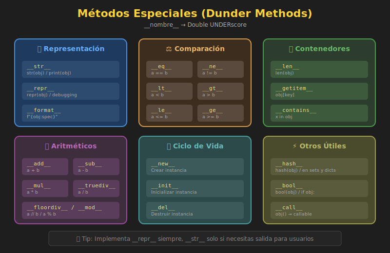

# ✨ Métodos Especiales (Dunder Methods)

## 🎯 Objetivos

- Entender qué son los métodos especiales
- Implementar representación de objetos (`__str__`, `__repr__`)
- Crear objetos comparables (`__eq__`, `__lt__`, etc.)
- Hacer objetos iterables y con longitud
- Implementar comportamiento de contenedores

---

## 1. ¿Qué son los Métodos Especiales?

Los **métodos especiales** (también llamados **dunder methods** por "double underscore") son métodos con nombres que empiezan y terminan con `__`. Python los llama automáticamente en situaciones específicas.



```python
class Book:
    def __init__(self, title: str) -> None:
        self.title = title

    def __str__(self) -> str:
        return self.title


book = Book("1984")
print(book)  # Python llama book.__str__() automáticamente
# Salida: 1984
```

### Métodos Especiales Más Comunes

| Método | Se llama cuando... | Ejemplo |
|--------|---------------------|---------|
| `__init__` | Se crea un objeto | `obj = Class()` |
| `__str__` | `str(obj)` o `print(obj)` | `print(book)` |
| `__repr__` | `repr(obj)` o en REPL | `>>> book` |
| `__len__` | `len(obj)` | `len(cart)` |
| `__eq__` | `obj1 == obj2` | `book1 == book2` |
| `__lt__` | `obj1 < obj2` | `sorted(books)` |
| `__bool__` | `if obj:` o `bool(obj)` | `if cart:` |
| `__getitem__` | `obj[key]` | `playlist[0]` |
| `__iter__` | `for x in obj:` | `for song in playlist:` |

---

## 2. Representación de Objetos

### 2.1 `__str__`: Representación para Usuarios

Se usa cuando quieres mostrar el objeto de forma legible.

```python
class Product:
    def __init__(self, name: str, price: float) -> None:
        self.name = name
        self.price = price

    def __str__(self) -> str:
        return f"{self.name} - ${self.price:.2f}"


product = Product("Laptop", 999.99)
print(product)        # Laptop - $999.99
print(str(product))   # Laptop - $999.99
```

### 2.2 `__repr__`: Representación Técnica

Se usa para debugging. Idealmente debería retornar una cadena que pueda recrear el objeto.

```python
class Product:
    def __init__(self, name: str, price: float) -> None:
        self.name = name
        self.price = price

    def __str__(self) -> str:
        return f"{self.name} - ${self.price:.2f}"

    def __repr__(self) -> str:
        return f"Product(name='{self.name}', price={self.price})"


product = Product("Laptop", 999.99)

print(str(product))   # Laptop - $999.99
print(repr(product))  # Product(name='Laptop', price=999.99)

# En una lista, Python usa __repr__
products = [Product("Mouse", 29.99), Product("Teclado", 79.99)]
print(products)
# [Product(name='Mouse', price=29.99), Product(name='Teclado', price=79.99)]
```

### Regla General

- **`__str__`**: Para usuarios finales (legible)
- **`__repr__`**: Para desarrolladores (debug, reproducible)

```python
# Si solo defines __repr__, Python lo usa también para __str__
class Simple:
    def __init__(self, value: int) -> None:
        self.value = value

    def __repr__(self) -> str:
        return f"Simple({self.value})"


s = Simple(42)
print(s)      # Simple(42) - usa __repr__ porque no hay __str__
print(repr(s))  # Simple(42)
```

---

## 3. Comparación de Objetos

### 3.1 `__eq__`: Igualdad

Sin `__eq__`, Python compara por **identidad** (si son el mismo objeto en memoria).

```python
class Point:
    def __init__(self, x: int, y: int) -> None:
        self.x = x
        self.y = y


p1 = Point(3, 4)
p2 = Point(3, 4)
print(p1 == p2)  # False (son objetos diferentes en memoria)


class PointWithEq:
    def __init__(self, x: int, y: int) -> None:
        self.x = x
        self.y = y

    def __eq__(self, other: object) -> bool:
        if not isinstance(other, PointWithEq):
            return NotImplemented
        return self.x == other.x and self.y == other.y


p1 = PointWithEq(3, 4)
p2 = PointWithEq(3, 4)
print(p1 == p2)  # True (mismas coordenadas)
```

### 3.2 `__hash__`: Para Usar en Sets y Dict Keys

Si implementas `__eq__`, debes implementar `__hash__` para usar objetos en sets o como keys de diccionarios.

```python
class Point:
    def __init__(self, x: int, y: int) -> None:
        self.x = x
        self.y = y

    def __eq__(self, other: object) -> bool:
        if not isinstance(other, Point):
            return NotImplemented
        return self.x == other.x and self.y == other.y

    def __hash__(self) -> int:
        return hash((self.x, self.y))

    def __repr__(self) -> str:
        return f"Point({self.x}, {self.y})"


# Ahora funciona en sets
points = {Point(0, 0), Point(1, 1), Point(0, 0)}
print(points)  # {Point(0, 0), Point(1, 1)} - sin duplicados

# Y como keys de dict
distances = {Point(0, 0): 0, Point(3, 4): 5}
print(distances[Point(3, 4)])  # 5
```

### 3.3 Operadores de Comparación

```python
from functools import total_ordering


@total_ordering  # Genera los demás comparadores automáticamente
class Version:
    def __init__(self, major: int, minor: int, patch: int) -> None:
        self.major = major
        self.minor = minor
        self.patch = patch

    def __eq__(self, other: object) -> bool:
        if not isinstance(other, Version):
            return NotImplemented
        return (self.major, self.minor, self.patch) == \
               (other.major, other.minor, other.patch)

    def __lt__(self, other: "Version") -> bool:
        if not isinstance(other, Version):
            return NotImplemented
        return (self.major, self.minor, self.patch) < \
               (other.major, other.minor, other.patch)

    def __repr__(self) -> str:
        return f"v{self.major}.{self.minor}.{self.patch}"


v1 = Version(1, 0, 0)
v2 = Version(2, 0, 0)
v3 = Version(1, 5, 0)

print(v1 < v2)   # True
print(v1 <= v3)  # True (generado por @total_ordering)
print(v2 > v3)   # True

# Ordenar versiones
versions = [v2, v1, v3]
print(sorted(versions))  # [v1.0.0, v1.5.0, v2.0.0]
```

---

## 4. Longitud y Booleanos

### 4.1 `__len__`: Longitud del Objeto

```python
class Playlist:
    def __init__(self, name: str) -> None:
        self.name = name
        self.songs: list[str] = []

    def add(self, song: str) -> None:
        self.songs.append(song)

    def __len__(self) -> int:
        return len(self.songs)


playlist = Playlist("Rock Classics")
playlist.add("Bohemian Rhapsody")
playlist.add("Stairway to Heaven")
playlist.add("Hotel California")

print(len(playlist))  # 3
```

### 4.2 `__bool__`: Evaluación Booleana

```python
class ShoppingCart:
    def __init__(self) -> None:
        self.items: list[str] = []

    def add(self, item: str) -> None:
        self.items.append(item)

    def __len__(self) -> int:
        return len(self.items)

    def __bool__(self) -> bool:
        # Carrito es "truthy" si tiene items
        return len(self.items) > 0


cart = ShoppingCart()
print(bool(cart))  # False

if not cart:
    print("Carrito vacío")  # Se imprime

cart.add("Laptop")
if cart:
    print("Carrito con productos")  # Se imprime
```

> 💡 Si defines `__len__` pero no `__bool__`, Python usa `len(obj) != 0` para la evaluación booleana.

---

## 5. Acceso a Elementos

### 5.1 `__getitem__`: Indexación

```python
class Playlist:
    def __init__(self, name: str) -> None:
        self.name = name
        self.songs: list[str] = []

    def add(self, song: str) -> None:
        self.songs.append(song)

    def __getitem__(self, index: int) -> str:
        return self.songs[index]

    def __len__(self) -> int:
        return len(self.songs)


playlist = Playlist("Favorites")
playlist.add("Song A")
playlist.add("Song B")
playlist.add("Song C")

print(playlist[0])   # Song A
print(playlist[-1])  # Song C
print(playlist[1:])  # ['Song B', 'Song C'] - slicing funciona!
```

### 5.2 `__setitem__` y `__delitem__`

```python
class Inventory:
    def __init__(self) -> None:
        self._items: dict[str, int] = {}

    def __getitem__(self, item: str) -> int:
        return self._items.get(item, 0)

    def __setitem__(self, item: str, quantity: int) -> None:
        if quantity < 0:
            raise ValueError("Quantity cannot be negative")
        self._items[item] = quantity

    def __delitem__(self, item: str) -> None:
        if item in self._items:
            del self._items[item]

    def __contains__(self, item: str) -> bool:
        return item in self._items and self._items[item] > 0


inv = Inventory()
inv["apples"] = 10    # __setitem__
inv["bananas"] = 5

print(inv["apples"])  # 10 - __getitem__
print("apples" in inv)  # True - __contains__

del inv["bananas"]    # __delitem__
print(inv["bananas"])  # 0 (no existe)
```

---

## 6. Iteración

### 6.1 `__iter__`: Hacer Objeto Iterable

```python
class NumberRange:
    def __init__(self, start: int, end: int) -> None:
        self.start = start
        self.end = end

    def __iter__(self):
        current = self.start
        while current <= self.end:
            yield current
            current += 1


# Iterar con for
for num in NumberRange(1, 5):
    print(num)  # 1, 2, 3, 4, 5

# Convertir a lista
print(list(NumberRange(10, 15)))  # [10, 11, 12, 13, 14, 15]
```

### 6.2 Ejemplo: Playlist Iterable

```python
class Playlist:
    def __init__(self, name: str) -> None:
        self.name = name
        self.songs: list[str] = []

    def add(self, song: str) -> None:
        self.songs.append(song)

    def __iter__(self):
        return iter(self.songs)

    def __len__(self) -> int:
        return len(self.songs)

    def __getitem__(self, index: int) -> str:
        return self.songs[index]


playlist = Playlist("Road Trip")
playlist.add("Highway to Hell")
playlist.add("Born to Run")
playlist.add("Life is a Highway")

for song in playlist:
    print(f"♪ {song}")

# También funciona con otras operaciones de iterables
print("Highway to Hell" in playlist)  # True
```

---

## 7. Ejemplo Completo: Clase Money

```python
from functools import total_ordering


@total_ordering
class Money:
    """Representa una cantidad de dinero."""

    def __init__(self, amount: float, currency: str = "USD") -> None:
        self.amount = round(amount, 2)
        self.currency = currency

    # Representación
    def __str__(self) -> str:
        return f"${self.amount:,.2f} {self.currency}"

    def __repr__(self) -> str:
        return f"Money({self.amount}, '{self.currency}')"

    # Comparación
    def __eq__(self, other: object) -> bool:
        if not isinstance(other, Money):
            return NotImplemented
        return self.amount == other.amount and self.currency == other.currency

    def __lt__(self, other: "Money") -> bool:
        if not isinstance(other, Money):
            return NotImplemented
        if self.currency != other.currency:
            raise ValueError("Cannot compare different currencies")
        return self.amount < other.amount

    def __hash__(self) -> int:
        return hash((self.amount, self.currency))

    # Operaciones aritméticas
    def __add__(self, other: "Money") -> "Money":
        if not isinstance(other, Money):
            return NotImplemented
        if self.currency != other.currency:
            raise ValueError("Cannot add different currencies")
        return Money(self.amount + other.amount, self.currency)

    def __sub__(self, other: "Money") -> "Money":
        if not isinstance(other, Money):
            return NotImplemented
        if self.currency != other.currency:
            raise ValueError("Cannot subtract different currencies")
        return Money(self.amount - other.amount, self.currency)

    def __mul__(self, factor: float) -> "Money":
        if not isinstance(factor, (int, float)):
            return NotImplemented
        return Money(self.amount * factor, self.currency)

    def __rmul__(self, factor: float) -> "Money":
        return self.__mul__(factor)

    # Booleano
    def __bool__(self) -> bool:
        return self.amount != 0

    # Negación
    def __neg__(self) -> "Money":
        return Money(-self.amount, self.currency)


# Uso
price = Money(99.99)
tax = Money(8.50)
discount = Money(10.00)

total = price + tax - discount
print(total)  # $98.49 USD

# Multiplicación
tip = total * 0.15
print(tip)  # $14.77 USD

# Comparación
print(price > tax)  # True

# Ordenar
prices = [Money(50), Money(100), Money(25), Money(75)]
print(sorted(prices))
# [Money(25.0, 'USD'), Money(50.0, 'USD'), Money(75.0, 'USD'), Money(100.0, 'USD')]

# Booleano
zero = Money(0)
if not zero:
    print("Sin dinero")  # Se imprime
```

---

## 8. Tabla de Referencia

### Representación

| Método | Operador/Función | Descripción |
|--------|------------------|-------------|
| `__str__` | `str(obj)`, `print(obj)` | Representación legible |
| `__repr__` | `repr(obj)` | Representación técnica |

### Comparación

| Método | Operador | Descripción |
|--------|----------|-------------|
| `__eq__` | `==` | Igualdad |
| `__ne__` | `!=` | Desigualdad |
| `__lt__` | `<` | Menor que |
| `__le__` | `<=` | Menor o igual |
| `__gt__` | `>` | Mayor que |
| `__ge__` | `>=` | Mayor o igual |

### Aritmética

| Método | Operador | Descripción |
|--------|----------|-------------|
| `__add__` | `+` | Suma |
| `__sub__` | `-` | Resta |
| `__mul__` | `*` | Multiplicación |
| `__truediv__` | `/` | División |
| `__floordiv__` | `//` | División entera |
| `__mod__` | `%` | Módulo |
| `__pow__` | `**` | Potencia |
| `__neg__` | `-obj` | Negación unaria |

### Contenedores

| Método | Operador/Función | Descripción |
|--------|------------------|-------------|
| `__len__` | `len(obj)` | Longitud |
| `__getitem__` | `obj[key]` | Obtener elemento |
| `__setitem__` | `obj[key] = val` | Asignar elemento |
| `__delitem__` | `del obj[key]` | Eliminar elemento |
| `__contains__` | `x in obj` | Pertenencia |
| `__iter__` | `for x in obj` | Iteración |

---

## ✅ Resumen

1. **Dunder methods** permiten que tus clases se comporten como tipos nativos
2. **`__str__`** para usuarios, **`__repr__`** para developers
3. **`__eq__`** + **`__hash__`** para usar en sets/dicts
4. **`@total_ordering`** genera comparadores automáticamente
5. **`__len__`** y **`__bool__`** para `len()` y evaluación booleana
6. **`__getitem__`** e **`__iter__`** para indexación e iteración

---

## 🔗 Siguiente

Practica estos conceptos en los ejercicios:
➡️ [../2-ejercicios/01-primera-clase/](../2-ejercicios/01-primera-clase/)
