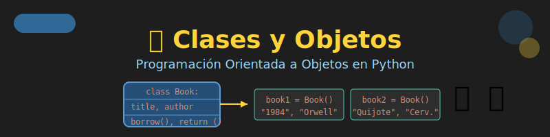

# 🎭 Semana 8: Clases y Objetos



## 🎯 Objetivos de Aprendizaje

Al finalizar esta semana, serás capaz de:

- ✅ Entender los principios de la Programación Orientada a Objetos (POO)
- ✅ Crear clases con atributos de instancia y de clase
- ✅ Definir métodos de instancia, clase y estáticos
- ✅ Usar el método `__init__` para inicializar objetos
- ✅ Implementar métodos especiales (`__str__`, `__repr__`, etc.)
- ✅ Aplicar type hints en clases y métodos

---

## 📚 Requisitos Previos

Antes de comenzar esta semana, debes dominar:

- ✅ Funciones con parámetros y retorno (Week 04)
- ✅ Estructuras de datos: listas, diccionarios, sets (Weeks 05-07)
- ✅ Type hints básicos
- ✅ Manejo de módulos y imports

---

## 🗂️ Estructura de la Semana

```
week-08/
├── README.md                    # Este archivo
├── rubrica-evaluacion.md        # Criterios de evaluación
├── 0-assets/                    # Recursos visuales
│   ├── week-08-header.svg
│   ├── 01-oop-paradigm.svg
│   ├── 02-class-anatomy.svg
│   ├── 03-instance-vs-class.svg
│   └── 04-special-methods.svg
├── 1-teoria/                    # Material teórico
│   ├── 01-intro-poo.md
│   ├── 02-clases-objetos.md
│   ├── 03-atributos-metodos.md
│   └── 04-metodos-especiales.md
├── 2-ejercicios/                # Ejercicios guiados
│   ├── 01-primera-clase/
│   ├── 02-atributos-metodos/
│   └── 03-metodos-especiales/
├── 3-proyecto/                  # Proyecto semanal
│   ├── README.md
│   ├── starter/
│   └── solution/               # ⚠️ Solo instructores
├── 4-recursos/                  # Material adicional
│   ├── ebooks-free/
│   ├── videografia/
│   └── webgrafia/
└── 5-glosario/                  # Términos clave
    └── README.md
```

---

## 📝 Contenidos

### 1. Teoría (1.5-2 horas)

| # | Tema | Archivo | Duración |
|---|------|---------|----------|
| 1 | Introducción a POO | [01-intro-poo.md](1-teoria/01-intro-poo.md) | 25 min |
| 2 | Clases y Objetos | [02-clases-objetos.md](1-teoria/02-clases-objetos.md) | 30 min |
| 3 | Atributos y Métodos | [03-atributos-metodos.md](1-teoria/03-atributos-metodos.md) | 30 min |
| 4 | Métodos Especiales | [04-metodos-especiales.md](1-teoria/04-metodos-especiales.md) | 25 min |

### 2. Ejercicios Guiados (2.5-3 horas)

| # | Ejercicio | Carpeta | Duración |
|---|-----------|---------|----------|
| 1 | Mi Primera Clase | [01-primera-clase/](2-ejercicios/01-primera-clase/) | 45 min |
| 2 | Atributos y Métodos | [02-atributos-metodos/](2-ejercicios/02-atributos-metodos/) | 55 min |
| 3 | Métodos Especiales | [03-metodos-especiales/](2-ejercicios/03-metodos-especiales/) | 50 min |

### 3. Proyecto Semanal (1.5-2 horas)

**📚 Sistema de Biblioteca**

Sistema de gestión de una biblioteca con clases para libros, usuarios y préstamos.

➡️ [Ver instrucciones del proyecto](3-proyecto/README.md)

---

## ⏱️ Distribución del Tiempo (6 horas)

| Actividad | Tiempo | Porcentaje |
|-----------|--------|------------|
| 📖 Teoría | 1.5-2h | 25-33% |
| 💻 Ejercicios | 2.5-3h | 42-50% |
| 🚀 Proyecto | 1.5-2h | 25-33% |

---

## 📌 Entregables

1. **Ejercicios completados** - Código funcional de los 3 ejercicios
2. **Proyecto "Sistema de Biblioteca"** - Sistema completo con:
   - Clases `Book`, `User`, `Loan`
   - Métodos para gestión de préstamos
   - Métodos especiales implementados
3. **Reflexión** - Responder: ¿Qué ventajas tiene POO sobre programación procedural?

---

## 🎯 Criterios de Evaluación

| Criterio | Peso |
|----------|------|
| Definición correcta de clases | 25% |
| Uso apropiado de atributos y métodos | 25% |
| Implementación de métodos especiales | 20% |
| Type hints y documentación | 15% |
| Proyecto funcional | 15% |

Ver [rúbrica detallada](rubrica-evaluacion.md) para más información.

---

## 💡 Conceptos Clave

```python
# Definición de clase
class Book:
    """Representa un libro en la biblioteca."""

    # Atributo de clase (compartido)
    library_name: str = "Biblioteca Central"

    def __init__(self, title: str, author: str, pages: int) -> None:
        """Inicializa un nuevo libro."""
        # Atributos de instancia (únicos por objeto)
        self.title = title
        self.author = author
        self.pages = pages
        self.is_available = True

    def __str__(self) -> str:
        """Representación legible del libro."""
        return f"{self.title} por {self.author}"

    def __repr__(self) -> str:
        """Representación técnica del libro."""
        return f"Book(title='{self.title}', author='{self.author}')"

    def borrow(self) -> bool:
        """Marca el libro como prestado."""
        if self.is_available:
            self.is_available = False
            return True
        return False

# Crear instancias (objetos)
book1 = Book("El Quijote", "Cervantes", 863)
book2 = Book("1984", "Orwell", 328)

# Usar métodos
print(book1)              # El Quijote por Cervantes
book1.borrow()            # Prestar libro
print(book1.is_available) # False
```

---

## 🔗 Navegación

| ⬅️ Anterior | 🏠 Inicio | Siguiente ➡️ |
|-------------|-----------|---------------|
| [Week 07: Sets y Algoritmos](../week-07/README.md) | [Bootcamp](../../README.md) | [Week 09: Herencia y Encapsulamiento](../week-09/README.md) |

---

## 📚 Recursos Adicionales

- 📖 [Python OOP - Real Python](https://realpython.com/python3-object-oriented-programming/)
- 📖 [Classes - Python Docs](https://docs.python.org/3/tutorial/classes.html)
- 🎥 [OOP in Python - Corey Schafer](https://www.youtube.com/playlist?list=PL-osiE80TeTsqhIuOqKhwlXsIBIdSeYtc)
- 📖 [Special Methods - Python Docs](https://docs.python.org/3/reference/datamodel.html#special-method-names)

---

*Semana 8 de 14 - Bootcamp Python Zero to Hero*
