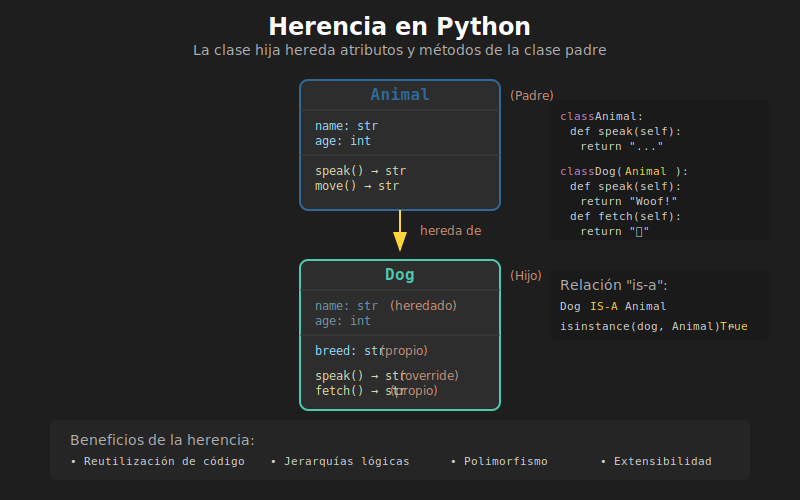

# 🧬 Herencia Básica en Python

## 🎯 Objetivos

- Entender qué es la herencia y por qué usarla
- Crear clases que heredan de otras clases
- Acceder a atributos y métodos heredados
- Identificar relaciones "es un" (is-a)

---

## 1. ¿Qué es la Herencia?

La **herencia** es un mecanismo de POO que permite crear nuevas clases basadas en clases existentes. La nueva clase **hereda** atributos y métodos de la clase original.



### Terminología

| Término | Sinónimos | Descripción |
|---------|-----------|-------------|
| **Clase Padre** | Base, Superclass | Clase de la que se hereda |
| **Clase Hija** | Derivada, Subclass | Clase que hereda |
| **Herencia** | Extensión | Relación entre padre e hija |

### Analogía del Mundo Real

```
🚗 Vehículo (Clase Padre)
├── ruedas
├── marca
├── acelerar()
└── frenar()

    ↓ heredan de Vehículo

🏎️ Coche          🏍️ Moto           🚌 Bus
├── ruedas=4      ├── ruedas=2      ├── ruedas=6
├── puertas       ├── tipo_manillar ├── capacidad
└── abrir_maletero() └── hacer_caballito() └── abrir_puertas()
```

---

## 2. Sintaxis de Herencia

### 2.1 Herencia Simple

```python
class Parent:
    """Clase padre/base."""
    pass


class Child(Parent):
    """Clase hija que hereda de Parent."""
    pass
```

La clase hija se define poniendo la clase padre entre paréntesis.

### 2.2 Ejemplo Completo

```python
class Animal:
    """Clase base para todos los animales."""

    def __init__(self, name: str, age: int) -> None:
        self.name = name
        self.age = age

    def speak(self) -> str:
        return "Some sound"

    def info(self) -> str:
        return f"{self.name}, {self.age} años"


class Dog(Animal):
    """Perro hereda de Animal."""
    pass  # Por ahora no añade nada


class Cat(Animal):
    """Gato hereda de Animal."""
    pass


# Crear instancias
dog = Dog("Rex", 3)
cat = Cat("Michi", 2)

# Heredan atributos del padre
print(dog.name)     # Rex
print(cat.age)      # 2

# Heredan métodos del padre
print(dog.info())   # Rex, 3 años
print(cat.speak())  # Some sound
```

---

## 3. Verificar Herencia

### 3.1 `isinstance()`

Verifica si un objeto es instancia de una clase (o sus padres).

```python
dog = Dog("Rex", 3)

print(isinstance(dog, Dog))     # True - es un Dog
print(isinstance(dog, Animal))  # True - también es un Animal
print(isinstance(dog, Cat))     # False - no es un Cat
print(isinstance(dog, object))  # True - todo hereda de object
```

### 3.2 `issubclass()`

Verifica si una clase hereda de otra.

```python
print(issubclass(Dog, Animal))   # True
print(issubclass(Cat, Animal))   # True
print(issubclass(Dog, Cat))      # False
print(issubclass(Animal, object))  # True
```

### 3.3 `type()` vs `isinstance()`

```python
dog = Dog("Rex", 3)

# type() es exacto
print(type(dog) == Dog)      # True
print(type(dog) == Animal)   # False (!)

# isinstance() considera herencia
print(isinstance(dog, Dog))     # True
print(isinstance(dog, Animal))  # True ✓
```

> 💡 **Tip**: Usa `isinstance()` para verificaciones de tipo, ya que respeta la herencia.

---

## 4. La Relación "Es Un" (Is-A)

La herencia modela relaciones **"es un"**:

```python
# ✅ CORRECTO - Relación "es un"
class Employee:
    pass

class Manager(Employee):  # Un Manager ES UN Employee
    pass

class Developer(Employee):  # Un Developer ES UN Employee
    pass


# ❌ INCORRECTO - No es relación "es un"
class Car:
    pass

class Engine(Car):  # ¡Un Engine NO ES UN Car!
    pass  # Debería ser composición, no herencia
```

### Pregunta Clave

Antes de usar herencia, pregúntate:

> "¿Es [ClaseHija] un tipo de [ClasePadre]?"

```python
# ¿Es un Dog un Animal? → SÍ → Herencia ✅
class Dog(Animal): pass

# ¿Es un Car un Engine? → NO → Composición
class Car:
    def __init__(self) -> None:
        self.engine = Engine()  # Tiene un Engine
```

---

## 5. Añadir Atributos en la Clase Hija

### 5.1 Sin Nuevos Atributos

Si no necesitas atributos extra, la clase hija puede estar vacía:

```python
class Animal:
    def __init__(self, name: str) -> None:
        self.name = name


class Dog(Animal):
    pass  # Hereda todo de Animal


dog = Dog("Rex")
print(dog.name)  # Rex
```

### 5.2 Con Nuevos Atributos (Usando super())

Para añadir atributos, sobrescribe `__init__` y llama al padre:

```python
class Animal:
    def __init__(self, name: str, age: int) -> None:
        self.name = name
        self.age = age


class Dog(Animal):
    def __init__(self, name: str, age: int, breed: str) -> None:
        # Llamar al __init__ del padre
        super().__init__(name, age)
        # Añadir atributo propio
        self.breed = breed


dog = Dog("Rex", 3, "Labrador")
print(dog.name)   # Rex (heredado)
print(dog.age)    # 3 (heredado)
print(dog.breed)  # Labrador (propio)
```

> 📌 **Nota**: `super()` se explica en detalle en el siguiente archivo.

---

## 6. Añadir Métodos en la Clase Hija

La clase hija puede tener sus propios métodos:

```python
class Animal:
    def __init__(self, name: str) -> None:
        self.name = name

    def speak(self) -> str:
        return "Some sound"


class Dog(Animal):
    def __init__(self, name: str, breed: str) -> None:
        super().__init__(name)
        self.breed = breed

    # Método propio de Dog
    def fetch(self, item: str) -> str:
        return f"{self.name} fetches the {item}"

    # Otro método propio
    def wag_tail(self) -> str:
        return f"{self.name} is wagging tail!"


dog = Dog("Rex", "Labrador")

# Métodos heredados
print(dog.speak())        # Some sound

# Métodos propios
print(dog.fetch("ball"))  # Rex fetches the ball
print(dog.wag_tail())     # Rex is wagging tail!
```

---

## 7. Jerarquías de Clases

Puedes crear múltiples niveles de herencia:

```python
class Animal:
    """Nivel 1: Clase base."""

    def __init__(self, name: str) -> None:
        self.name = name

    def breathe(self) -> str:
        return f"{self.name} is breathing"


class Mammal(Animal):
    """Nivel 2: Mamífero hereda de Animal."""

    def __init__(self, name: str, warm_blooded: bool = True) -> None:
        super().__init__(name)
        self.warm_blooded = warm_blooded

    def feed_milk(self) -> str:
        return f"{self.name} feeds milk to young"


class Dog(Mammal):
    """Nivel 3: Perro hereda de Mamífero."""

    def __init__(self, name: str, breed: str) -> None:
        super().__init__(name)
        self.breed = breed

    def bark(self) -> str:
        return f"{self.name} says Woof!"


# Dog tiene acceso a todo
dog = Dog("Rex", "Labrador")

print(dog.breathe())    # De Animal
print(dog.feed_milk())  # De Mammal
print(dog.bark())       # De Dog

print(dog.name)         # De Animal
print(dog.warm_blooded) # De Mammal (True)
print(dog.breed)        # De Dog
```

### Verificar la Jerarquía

```python
print(isinstance(dog, Dog))     # True
print(isinstance(dog, Mammal))  # True
print(isinstance(dog, Animal))  # True
print(isinstance(dog, object))  # True

# Method Resolution Order (MRO)
print(Dog.__mro__)
# (<class 'Dog'>, <class 'Mammal'>, <class 'Animal'>, <class 'object'>)
```

---

## 8. Herencia de `object`

En Python, **todas las clases heredan de `object`** implícitamente:

```python
# Estas dos definiciones son equivalentes:
class MyClass:
    pass

class MyClass(object):
    pass


# object proporciona métodos base
print(dir(object))
# ['__class__', '__delattr__', '__doc__', '__eq__', '__hash__', ...]
```

---

## 9. Ejemplo Práctico: Sistema de Vehículos

```python
class Vehicle:
    """Clase base para vehículos."""

    def __init__(self, brand: str, model: str, year: int) -> None:
        self.brand = brand
        self.model = model
        self.year = year
        self.is_running = False

    def start(self) -> str:
        self.is_running = True
        return f"{self.brand} {self.model} started"

    def stop(self) -> str:
        self.is_running = False
        return f"{self.brand} {self.model} stopped"

    def info(self) -> str:
        return f"{self.year} {self.brand} {self.model}"


class Car(Vehicle):
    """Coche hereda de Vehicle."""

    def __init__(
        self,
        brand: str,
        model: str,
        year: int,
        doors: int = 4
    ) -> None:
        super().__init__(brand, model, year)
        self.doors = doors

    def honk(self) -> str:
        return "Beep beep!"


class Motorcycle(Vehicle):
    """Moto hereda de Vehicle."""

    def __init__(
        self,
        brand: str,
        model: str,
        year: int,
        cc: int
    ) -> None:
        super().__init__(brand, model, year)
        self.cc = cc

    def wheelie(self) -> str:
        return f"{self.brand} does a wheelie!"


# Uso
car = Car("Toyota", "Corolla", 2023, doors=4)
moto = Motorcycle("Yamaha", "R1", 2022, cc=1000)

print(car.info())      # 2023 Toyota Corolla
print(car.start())     # Toyota Corolla started
print(car.honk())      # Beep beep!

print(moto.info())     # 2022 Yamaha R1
print(moto.wheelie())  # Yamaha does a wheelie!
```

---

## ✅ Checklist de Verificación

Antes de continuar, asegúrate de:

- [ ] Entender la sintaxis `class Child(Parent)`
- [ ] Saber usar `isinstance()` e `issubclass()`
- [ ] Identificar relaciones "es un"
- [ ] Poder crear jerarquías de clases
- [ ] Entender que todas las clases heredan de `object`

---

## 🔗 Siguiente

Continúa con [02-super-y-override.md](02-super-y-override.md) para aprender a sobrescribir métodos y usar `super()`.
