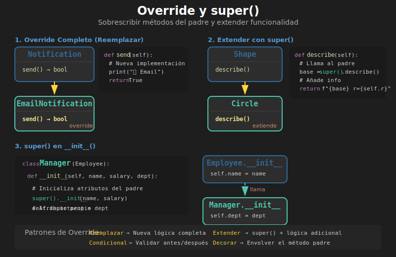

# 🔄 Super y Override (Sobrescritura de Métodos)

## 🎯 Objetivos

- Entender qué es la sobrescritura de métodos (override)
- Dominar el uso de `super()` para llamar al padre
- Aplicar patrones comunes de override
- Evitar errores comunes en herencia

---

## 1. ¿Qué es Override?

**Override** (sobrescritura) es cuando una clase hija define un método con el **mismo nombre** que existe en la clase padre. El método de la hija "reemplaza" al del padre.



```python
class Animal:
    def speak(self) -> str:
        return "Some sound"


class Dog(Animal):
    def speak(self) -> str:  # Override del método speak
        return "Woof!"


class Cat(Animal):
    def speak(self) -> str:  # Override del método speak
        return "Meow!"


# Cada clase usa SU versión del método
animal = Animal()
dog = Dog()
cat = Cat()

print(animal.speak())  # Some sound
print(dog.speak())     # Woof!
print(cat.speak())     # Meow!
```

---

## 2. La Función `super()`

`super()` retorna un objeto proxy que delega llamadas a la clase padre. Es la forma correcta de acceder a métodos del padre desde la clase hija.

### 2.1 Sintaxis Básica

```python
class Parent:
    def greet(self) -> str:
        return "Hello from Parent"


class Child(Parent):
    def greet(self) -> str:
        # Llamar al método del padre
        parent_greeting = super().greet()
        return f"{parent_greeting} and Child"


child = Child()
print(child.greet())  # Hello from Parent and Child
```

### 2.2 `super()` en `__init__`

El uso más común de `super()` es en el constructor:

```python
class Person:
    def __init__(self, name: str, age: int) -> None:
        self.name = name
        self.age = age


class Employee(Person):
    def __init__(
        self,
        name: str,
        age: int,
        employee_id: str,
        salary: float
    ) -> None:
        # Primero inicializar atributos del padre
        super().__init__(name, age)
        # Luego los propios
        self.employee_id = employee_id
        self.salary = salary


emp = Employee("Ana", 30, "EMP001", 50000)
print(emp.name)        # Ana (del padre)
print(emp.age)         # 30 (del padre)
print(emp.employee_id) # EMP001 (propio)
print(emp.salary)      # 50000 (propio)
```

### 2.3 ¿Por qué usar `super()`?

```python
# ❌ MAL: Llamar al padre directamente por nombre
class Child(Parent):
    def __init__(self, x: int) -> None:
        Parent.__init__(self, x)  # Funciona pero es frágil

# ✅ BIEN: Usar super()
class Child(Parent):
    def __init__(self, x: int) -> None:
        super().__init__(x)  # Más flexible y mantenible
```

**Ventajas de `super()`:**

1. No necesitas saber el nombre del padre
2. Funciona correctamente con herencia múltiple
3. Si cambias el padre, el código sigue funcionando

---

## 3. Patrones Comunes de Override

### 3.1 Extender el Comportamiento

Añadir funcionalidad al método del padre:

```python
class Logger:
    def log(self, message: str) -> None:
        print(f"[LOG] {message}")


class TimestampLogger(Logger):
    def log(self, message: str) -> None:
        from datetime import datetime
        timestamp = datetime.now().strftime("%Y-%m-%d %H:%M:%S")
        # Llamar al padre con mensaje modificado
        super().log(f"[{timestamp}] {message}")


logger = TimestampLogger()
logger.log("User logged in")
# [LOG] [2026-01-02 10:30:45] User logged in
```

### 3.2 Reemplazar Completamente

A veces no necesitas el comportamiento del padre:

```python
class Shape:
    def area(self) -> float:
        return 0.0


class Circle(Shape):
    def __init__(self, radius: float) -> None:
        self.radius = radius

    def area(self) -> float:
        # Reemplaza completamente, no llama a super()
        return 3.14159 * self.radius ** 2


class Rectangle(Shape):
    def __init__(self, width: float, height: float) -> None:
        self.width = width
        self.height = height

    def area(self) -> float:
        return self.width * self.height
```

### 3.3 Condicional: A Veces Usar el Padre

```python
class DataProcessor:
    def process(self, data: str) -> str:
        return data.strip().lower()


class AdvancedProcessor(DataProcessor):
    def __init__(self, preserve_case: bool = False) -> None:
        self.preserve_case = preserve_case

    def process(self, data: str) -> str:
        if self.preserve_case:
            return data.strip()  # Solo strip, mantener case
        else:
            return super().process(data)  # Comportamiento normal


proc1 = AdvancedProcessor(preserve_case=False)
proc2 = AdvancedProcessor(preserve_case=True)

print(proc1.process("  HELLO  "))  # hello
print(proc2.process("  HELLO  "))  # HELLO
```

---

## 4. Override de `__init__` - Casos Especiales

### 4.1 Padre sin Argumentos

```python
class Counter:
    def __init__(self) -> None:
        self.count = 0


class NamedCounter(Counter):
    def __init__(self, name: str) -> None:
        super().__init__()  # Sin argumentos
        self.name = name
```

### 4.2 Argumentos por Defecto

```python
class Config:
    def __init__(self, debug: bool = False) -> None:
        self.debug = debug


class AppConfig(Config):
    def __init__(
        self,
        app_name: str,
        debug: bool = False,
        version: str = "1.0"
    ) -> None:
        super().__init__(debug)
        self.app_name = app_name
        self.version = version
```

### 4.3 Usando **kwargs

Para flexibilidad máxima:

```python
class Base:
    def __init__(self, x: int, y: int) -> None:
        self.x = x
        self.y = y


class Extended(Base):
    def __init__(self, z: int, **kwargs) -> None:
        super().__init__(**kwargs)  # Pasa x, y al padre
        self.z = z


obj = Extended(z=3, x=1, y=2)
print(obj.x, obj.y, obj.z)  # 1 2 3
```

---

## 5. Override de Métodos Especiales

### 5.1 Override de `__str__`

```python
class Product:
    def __init__(self, name: str, price: float) -> None:
        self.name = name
        self.price = price

    def __str__(self) -> str:
        return f"{self.name}: ${self.price}"


class DiscountedProduct(Product):
    def __init__(
        self,
        name: str,
        price: float,
        discount: float
    ) -> None:
        super().__init__(name, price)
        self.discount = discount

    def __str__(self) -> str:
        original = super().__str__()
        final_price = self.price * (1 - self.discount)
        return f"{original} → ${final_price:.2f} ({self.discount*100:.0f}% off)"


product = Product("Laptop", 1000)
discounted = DiscountedProduct("Laptop", 1000, 0.2)

print(product)    # Laptop: $1000
print(discounted) # Laptop: $1000 → $800.00 (20% off)
```

### 5.2 Override de `__eq__`

```python
class Point:
    def __init__(self, x: int, y: int) -> None:
        self.x = x
        self.y = y

    def __eq__(self, other: object) -> bool:
        if not isinstance(other, Point):
            return NotImplemented
        return self.x == other.x and self.y == other.y


class Point3D(Point):
    def __init__(self, x: int, y: int, z: int) -> None:
        super().__init__(x, y)
        self.z = z

    def __eq__(self, other: object) -> bool:
        if not isinstance(other, Point3D):
            return NotImplemented
        # Verificar x, y del padre Y z propio
        return super().__eq__(other) and self.z == other.z


p1 = Point3D(1, 2, 3)
p2 = Point3D(1, 2, 3)
p3 = Point3D(1, 2, 4)

print(p1 == p2)  # True
print(p1 == p3)  # False (z diferente)
```

---

## 6. Errores Comunes

### 6.1 Olvidar Llamar a `super().__init__()`

```python
# ❌ MAL: No llama al padre
class Employee(Person):
    def __init__(self, employee_id: str) -> None:
        self.employee_id = employee_id
        # ¡Falta super().__init__()!
        # self.name y self.age NO existen


# ✅ BIEN
class Employee(Person):
    def __init__(self, name: str, age: int, employee_id: str) -> None:
        super().__init__(name, age)
        self.employee_id = employee_id
```

### 6.2 Orden Incorrecto de Inicialización

```python
# ⚠️ CUIDADO: Acceder a atributos antes de inicializarlos
class Child(Parent):
    def __init__(self, x: int) -> None:
        # ❌ MAL: Usar self.value antes de que exista
        print(self.value)  # AttributeError!
        super().__init__(x)


# ✅ BIEN: Primero super(), luego usar atributos
class Child(Parent):
    def __init__(self, x: int) -> None:
        super().__init__(x)
        print(self.value)  # Ahora sí existe
```

### 6.3 Override Accidental

```python
class FileHandler:
    def open(self, filename: str) -> None:
        """Abre un archivo."""
        self.file = open(filename, 'r')


class AdvancedFileHandler(FileHandler):
    def open(self, filename: str) -> None:
        """Abre archivo con logging."""
        print(f"Opening: {filename}")
        super().open(filename)  # ¡No olvides llamar al padre!
```

---

## 7. Ejemplo Completo: Sistema de Notificaciones

```python
from datetime import datetime


class Notification:
    """Clase base para notificaciones."""

    def __init__(self, message: str, recipient: str) -> None:
        self.message = message
        self.recipient = recipient
        self.created_at = datetime.now()
        self.sent = False

    def send(self) -> str:
        """Envía la notificación."""
        self.sent = True
        return f"Notification sent to {self.recipient}"

    def __str__(self) -> str:
        status = "✓" if self.sent else "○"
        return f"[{status}] To: {self.recipient} - {self.message}"


class EmailNotification(Notification):
    """Notificación por email."""

    def __init__(
        self,
        message: str,
        recipient: str,
        subject: str
    ) -> None:
        super().__init__(message, recipient)
        self.subject = subject

    def send(self) -> str:
        # Extender comportamiento del padre
        result = super().send()
        return f"📧 Email: {result} | Subject: {self.subject}"

    def __str__(self) -> str:
        base = super().__str__()
        return f"{base}\n    Subject: {self.subject}"


class SMSNotification(Notification):
    """Notificación por SMS."""

    MAX_LENGTH: int = 160

    def __init__(self, message: str, phone: str) -> None:
        # Truncar mensaje si es muy largo
        truncated = message[:self.MAX_LENGTH]
        super().__init__(truncated, phone)

    def send(self) -> str:
        result = super().send()
        return f"📱 SMS: {result}"


class PushNotification(Notification):
    """Notificación push."""

    def __init__(
        self,
        message: str,
        device_id: str,
        title: str,
        icon: str = "🔔"
    ) -> None:
        super().__init__(message, device_id)
        self.title = title
        self.icon = icon

    def send(self) -> str:
        result = super().send()
        return f"{self.icon} Push: {result}"

    def __str__(self) -> str:
        base = super().__str__()
        return f"{self.icon} {self.title}\n{base}"


# Uso
email = EmailNotification(
    message="Your order has shipped!",
    recipient="user@email.com",
    subject="Order Update"
)

sms = SMSNotification(
    message="Your code is 123456",
    phone="+1234567890"
)

push = PushNotification(
    message="New message from John",
    device_id="device_abc123",
    title="New Message"
)

# Enviar todas
notifications = [email, sms, push]
for notif in notifications:
    print(notif.send())
    print(notif)
    print()
```

**Salida:**
```
📧 Email: Notification sent to user@email.com | Subject: Order Update
[✓] To: user@email.com - Your order has shipped!
    Subject: Order Update

📱 SMS: Notification sent to +1234567890
[✓] To: +1234567890 - Your code is 123456

🔔 Push: Notification sent to device_abc123
🔔 New Message
[✓] To: device_abc123 - New message from John
```

---

## ✅ Checklist de Verificación

Antes de continuar, asegúrate de:

- [ ] Entender qué es override
- [ ] Saber cuándo y cómo usar `super()`
- [ ] Poder extender métodos del padre
- [ ] Evitar errores comunes de inicialización
- [ ] Aplicar override en métodos especiales

---

## 🔗 Siguiente

Continúa con [03-polimorfismo.md](03-polimorfismo.md) para aprender cómo el polimorfismo hace tu código más flexible.
