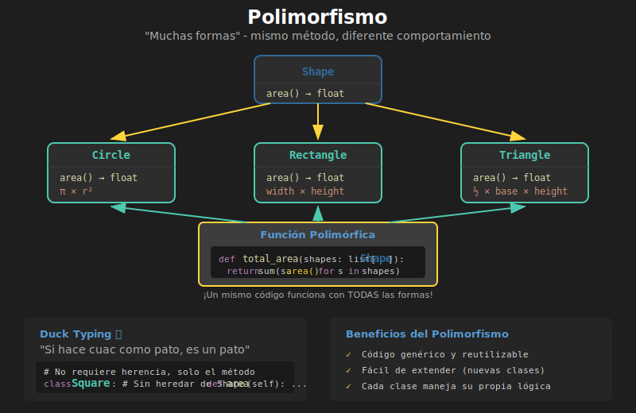

# 🎭 Polimorfismo en Python

## 🎯 Objetivos

- Entender qué es el polimorfismo y sus beneficios
- Aplicar polimorfismo con herencia
- Usar Duck Typing en Python
- Diseñar código flexible y extensible

---

## 1. ¿Qué es el Polimorfismo?

**Polimorfismo** significa "muchas formas". En POO, permite que objetos de diferentes clases respondan al **mismo método** de formas distintas.



### Analogía

Imagina el botón "Play" ▶️ en diferentes apps:

| App | Acción de "Play" |
|-----|------------------|
| Spotify | Reproduce música |
| YouTube | Reproduce video |
| Podcast | Reproduce audio |
| Game | Inicia el juego |

Mismo concepto ("play"), diferentes implementaciones.

---

## 2. Polimorfismo con Herencia

El tipo más común: clases hijas sobrescriben métodos del padre.

```python
class Shape:
    """Clase base para formas geométricas."""

    def area(self) -> float:
        raise NotImplementedError("Subclasses must implement area()")

    def describe(self) -> str:
        return f"A shape with area {self.area():.2f}"


class Circle(Shape):
    def __init__(self, radius: float) -> None:
        self.radius = radius

    def area(self) -> float:
        return 3.14159 * self.radius ** 2


class Rectangle(Shape):
    def __init__(self, width: float, height: float) -> None:
        self.width = width
        self.height = height

    def area(self) -> float:
        return self.width * self.height


class Triangle(Shape):
    def __init__(self, base: float, height: float) -> None:
        self.base = base
        self.height = height

    def area(self) -> float:
        return 0.5 * self.base * self.height


# POLIMORFISMO EN ACCIÓN
# Lista de diferentes formas, mismo tipo base
shapes: list[Shape] = [
    Circle(5),
    Rectangle(4, 6),
    Triangle(3, 8)
]

# Mismo método, diferente comportamiento
for shape in shapes:
    print(shape.describe())

# Salida:
# A shape with area 78.54
# A shape with area 24.00
# A shape with area 12.00
```

### Beneficios

1. **Código genérico**: Funciones que trabajan con el tipo base
2. **Extensibilidad**: Añadir nuevas formas sin modificar código existente
3. **Mantenibilidad**: Cada clase maneja su propia lógica

---

## 3. Funciones Polimórficas

Funciones que aceptan el tipo padre funcionan con cualquier hijo:

```python
def print_total_area(shapes: list[Shape]) -> None:
    """Calcula e imprime el área total de todas las formas."""
    total = sum(shape.area() for shape in shapes)
    print(f"Total area: {total:.2f}")


def find_largest(shapes: list[Shape]) -> Shape:
    """Encuentra la forma con mayor área."""
    return max(shapes, key=lambda s: s.area())


# Funciona con cualquier combinación de formas
shapes = [Circle(3), Rectangle(2, 5), Triangle(4, 6)]

print_total_area(shapes)  # Total area: 50.27

largest = find_largest(shapes)
print(f"Largest: {type(largest).__name__}")  # Largest: Circle
```

---

## 4. Duck Typing

Python usa **Duck Typing**: "Si camina como pato y hace cuac como pato, es un pato."

No importa el tipo de la clase, solo que tenga los métodos necesarios.

```python
# No hay clase padre común
class Dog:
    def speak(self) -> str:
        return "Woof!"

class Cat:
    def speak(self) -> str:
        return "Meow!"

class Duck:
    def speak(self) -> str:
        return "Quack!"

class Robot:
    def speak(self) -> str:
        return "Beep boop!"


# Función que NO requiere herencia
def make_speak(entity) -> None:
    """Funciona con CUALQUIER objeto que tenga speak()."""
    print(entity.speak())


# Todos funcionan aunque no tienen padre común
make_speak(Dog())    # Woof!
make_speak(Cat())    # Meow!
make_speak(Duck())   # Quack!
make_speak(Robot())  # Beep boop!
```

### Duck Typing vs Herencia

```python
# CON HERENCIA (explícito)
class Speaker:
    def speak(self) -> str:
        raise NotImplementedError

class Dog(Speaker):
    def speak(self) -> str:
        return "Woof!"


# CON DUCK TYPING (implícito)
class Dog:
    def speak(self) -> str:
        return "Woof!"


# Ambos funcionan igual en Python
# Duck typing es más flexible pero menos explícito
```

---

## 5. Protocols (Python 3.8+)

Para combinar Duck Typing con type hints, usa `Protocol`:

```python
from typing import Protocol


class Speakable(Protocol):
    """Protocolo: cualquier cosa que pueda hablar."""

    def speak(self) -> str:
        ...


class Dog:
    def speak(self) -> str:
        return "Woof!"


class Cat:
    def speak(self) -> str:
        return "Meow!"


class Rock:
    pass  # No tiene speak()


def make_speak(entity: Speakable) -> None:
    """Type hint indica que necesita speak()."""
    print(entity.speak())


# Type checker acepta Dog y Cat
make_speak(Dog())  # ✓
make_speak(Cat())  # ✓

# Type checker rechaza Rock (no tiene speak)
# make_speak(Rock())  # ✗ Error de tipo
```

---

## 6. Polimorfismo con Operadores

Los operadores también son polimórficos:

```python
# El operador + funciona diferente según el tipo
print(5 + 3)           # 8 (suma números)
print("Hello" + " ")   # Hello World (concatena strings)
print([1, 2] + [3, 4]) # [1, 2, 3, 4] (concatena listas)


# Puedes definir + para tus clases
class Vector:
    def __init__(self, x: float, y: float) -> None:
        self.x = x
        self.y = y

    def __add__(self, other: "Vector") -> "Vector":
        return Vector(self.x + other.x, self.y + other.y)

    def __str__(self) -> str:
        return f"Vector({self.x}, {self.y})"


v1 = Vector(1, 2)
v2 = Vector(3, 4)
v3 = v1 + v2  # Usa __add__
print(v3)  # Vector(4, 6)
```

---

## 7. Ejemplo Práctico: Sistema de Pagos

```python
from datetime import datetime


class Payment:
    """Clase base para métodos de pago."""

    def __init__(self, amount: float) -> None:
        self.amount = amount
        self.timestamp = datetime.now()
        self.processed = False

    def process(self) -> bool:
        """Procesa el pago. Override en subclases."""
        raise NotImplementedError("Subclasses must implement process()")

    def get_receipt(self) -> str:
        status = "✓ Completed" if self.processed else "⏳ Pending"
        return f"Payment of ${self.amount:.2f} - {status}"


class CreditCardPayment(Payment):
    """Pago con tarjeta de crédito."""

    def __init__(
        self,
        amount: float,
        card_number: str,
        cvv: str
    ) -> None:
        super().__init__(amount)
        self.card_number = card_number[-4:]  # Solo últimos 4 dígitos
        self.cvv = cvv

    def process(self) -> bool:
        # Simular procesamiento de tarjeta
        print(f"Processing credit card ending in {self.card_number}...")
        self.processed = True
        return True

    def get_receipt(self) -> str:
        base = super().get_receipt()
        return f"💳 Credit Card {base} (****{self.card_number})"


class PayPalPayment(Payment):
    """Pago con PayPal."""

    def __init__(self, amount: float, email: str) -> None:
        super().__init__(amount)
        self.email = email

    def process(self) -> bool:
        print(f"Redirecting to PayPal for {self.email}...")
        self.processed = True
        return True

    def get_receipt(self) -> str:
        base = super().get_receipt()
        return f"🅿️ PayPal {base} ({self.email})"


class CryptoPayment(Payment):
    """Pago con criptomonedas."""

    def __init__(
        self,
        amount: float,
        wallet: str,
        currency: str = "BTC"
    ) -> None:
        super().__init__(amount)
        self.wallet = wallet[:8] + "..."
        self.currency = currency

    def process(self) -> bool:
        print(f"Waiting for {self.currency} blockchain confirmation...")
        self.processed = True
        return True

    def get_receipt(self) -> str:
        base = super().get_receipt()
        return f"₿ {self.currency} {base} (Wallet: {self.wallet})"


# POLIMORFISMO: Procesar diferentes tipos de pago uniformemente
def checkout(payments: list[Payment]) -> float:
    """Procesa una lista de pagos de cualquier tipo."""
    total = 0.0

    for payment in payments:
        if payment.process():  # Cada uno usa SU implementación
            total += payment.amount
            print(payment.get_receipt())
        print()

    return total


# Uso
payments: list[Payment] = [
    CreditCardPayment(99.99, "1234567890123456", "123"),
    PayPalPayment(49.99, "user@email.com"),
    CryptoPayment(199.99, "abc123xyz789", "ETH")
]

total = checkout(payments)
print(f"Total processed: ${total:.2f}")
```

**Salida:**
```
Processing credit card ending in 3456...
💳 Credit Card Payment of $99.99 - ✓ Completed (****3456)

Redirecting to PayPal for user@email.com...
🅿️ PayPal Payment of $49.99 - ✓ Completed (user@email.com)

Waiting for ETH blockchain confirmation...
₿ ETH Payment of $199.99 - ✓ Completed (Wallet: abc123xy...)

Total processed: $349.97
```

---

## 8. Principio Open/Closed

El polimorfismo sigue el **Principio Open/Closed**:

> "El software debe estar **abierto para extensión**, pero **cerrado para modificación**."

```python
# checkout() está CERRADO - no necesita cambiar
def checkout(payments: list[Payment]) -> float:
    total = 0.0
    for payment in payments:
        if payment.process():
            total += payment.amount
    return total


# Pero está ABIERTO - podemos añadir nuevos tipos de pago
class ApplePayPayment(Payment):
    def process(self) -> bool:
        print("Processing with Apple Pay...")
        self.processed = True
        return True


# checkout() funciona con ApplePayPayment sin modificaciones!
```

---

## 9. Antipatrón: Verificar Tipos

❌ **MAL**: Código que verifica tipos específicos:

```python
# ❌ ANTIPATRÓN: No hagas esto
def process_payment(payment):
    if isinstance(payment, CreditCardPayment):
        # lógica específica de tarjeta
        pass
    elif isinstance(payment, PayPalPayment):
        # lógica específica de PayPal
        pass
    elif isinstance(payment, CryptoPayment):
        # lógica específica de crypto
        pass
    # Hay que modificar cada vez que añades un tipo
```

✅ **BIEN**: Usar polimorfismo:

```python
# ✅ CORRECTO: Cada clase sabe cómo procesarse
def process_payment(payment: Payment) -> bool:
    return payment.process()  # Polimórfico
```

---

## ✅ Checklist de Verificación

Antes de continuar, asegúrate de:

- [ ] Entender qué es polimorfismo
- [ ] Crear funciones que trabajen con tipos base
- [ ] Aplicar Duck Typing
- [ ] Conocer Protocols para type hints
- [ ] Evitar verificaciones de tipo con isinstance

---

## 🔗 Siguiente

Continúa con [04-herencia-multiple.md](04-herencia-multiple.md) para aprender sobre herencia múltiple y MRO.
