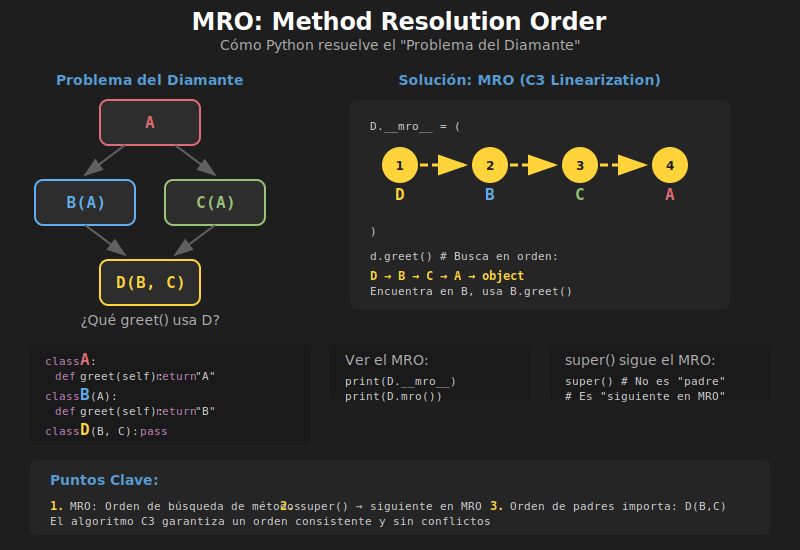

# 🔀 Herencia Múltiple y MRO

## 🎯 Objetivos

- Entender la herencia múltiple en Python
- Dominar el Method Resolution Order (MRO)
- Aplicar Mixins correctamente
- Evitar el "Problema del Diamante"

---

## 1. ¿Qué es la Herencia Múltiple?

En Python, una clase puede heredar de **múltiples clases padre**:

```python
class Parent1:
    def method1(self) -> str:
        return "From Parent1"


class Parent2:
    def method2(self) -> str:
        return "From Parent2"


class Child(Parent1, Parent2):
    """Hereda de AMBOS padres."""
    pass


child = Child()
print(child.method1())  # From Parent1
print(child.method2())  # From Parent2
```

### Sintaxis

```python
class Child(Parent1, Parent2, Parent3):
    pass
```

El orden de los padres importa (se explica en MRO).

---

## 2. El Problema del Diamante

¿Qué pasa cuando dos padres tienen el mismo método?



```python
class A:
    def greet(self) -> str:
        return "Hello from A"


class B(A):
    def greet(self) -> str:
        return "Hello from B"


class C(A):
    def greet(self) -> str:
        return "Hello from C"


class D(B, C):
    """D hereda de B y C, ambos heredan de A."""
    pass


# ¿Cuál greet() se usa?
d = D()
print(d.greet())  # Hello from B
```

Python resuelve esto con el **MRO** (Method Resolution Order).

---

## 3. MRO: Method Resolution Order

El **MRO** es el orden en que Python busca métodos en la jerarquía de clases.

### Ver el MRO

```python
class A:
    pass

class B(A):
    pass

class C(A):
    pass

class D(B, C):
    pass


# Tres formas de ver el MRO
print(D.__mro__)
# (<class 'D'>, <class 'B'>, <class 'C'>, <class 'A'>, <class 'object'>)

print(D.mro())
# [<class 'D'>, <class 'B'>, <class 'C'>, <class 'A'>, <class 'object'>]

from pprint import pprint
pprint(D.__mro__)
```

### Cómo Funciona el MRO

Python usa el algoritmo **C3 Linearization**:

1. La clase actual primero
2. Luego los padres en orden (izquierda a derecha)
3. Finalmente la clase base común
4. `object` siempre al final

```python
# Para class D(B, C) donde B(A) y C(A):
# MRO: D → B → C → A → object

d = D()
d.greet()  # Busca en orden: D → B → C → A → object
           # Encuentra en B, usa B.greet()
```

---

## 4. `super()` con Herencia Múltiple

Con herencia múltiple, `super()` sigue el MRO:

```python
class A:
    def __init__(self) -> None:
        print("A.__init__")
        self.a = "A"


class B(A):
    def __init__(self) -> None:
        print("B.__init__")
        super().__init__()  # Llama al siguiente en MRO
        self.b = "B"


class C(A):
    def __init__(self) -> None:
        print("C.__init__")
        super().__init__()  # Llama al siguiente en MRO
        self.c = "C"


class D(B, C):
    def __init__(self) -> None:
        print("D.__init__")
        super().__init__()  # Sigue el MRO
        self.d = "D"


# MRO: D → B → C → A → object
d = D()
# Output:
# D.__init__
# B.__init__
# C.__init__
# A.__init__
```

> 💡 **Importante**: `super()` NO llama al "padre directo", llama al **siguiente en el MRO**.

---

## 5. Mixins

Un **Mixin** es una clase diseñada para añadir funcionalidad a otras clases mediante herencia múltiple.

### Características de un Mixin

- Nombre termina en `Mixin`
- No se instancia directamente
- Proporciona métodos específicos
- No define `__init__` propio (generalmente)

### Ejemplo: Logging Mixin

```python
from datetime import datetime


class LoggingMixin:
    """Mixin que añade capacidad de logging."""

    def log(self, message: str) -> None:
        timestamp = datetime.now().strftime("%H:%M:%S")
        class_name = self.__class__.__name__
        print(f"[{timestamp}] {class_name}: {message}")


class SerializeMixin:
    """Mixin que añade serialización a JSON."""

    def to_dict(self) -> dict:
        return {
            key: value
            for key, value in self.__dict__.items()
            if not key.startswith('_')
        }

    def to_json(self) -> str:
        import json
        return json.dumps(self.to_dict(), indent=2)


class User(LoggingMixin, SerializeMixin):
    """Usuario con logging y serialización."""

    def __init__(self, name: str, email: str) -> None:
        self.name = name
        self.email = email
        self.log(f"Created user: {name}")

    def update_email(self, new_email: str) -> None:
        old = self.email
        self.email = new_email
        self.log(f"Email changed: {old} → {new_email}")


# Uso
user = User("Ana", "ana@email.com")
# [10:30:45] User: Created user: Ana

user.update_email("ana.new@email.com")
# [10:30:46] User: Email changed: ana@email.com → ana.new@email.com

print(user.to_json())
# {
#   "name": "Ana",
#   "email": "ana.new@email.com"
# }
```

---

## 6. Patrón: Orden de Mixins

Los Mixins van **antes** de la clase base principal:

```python
# ✅ CORRECTO: Mixins primero, clase base al final
class MyClass(MixinA, MixinB, BaseClass):
    pass

# ❌ INCORRECTO: Clase base antes de mixins
class MyClass(BaseClass, MixinA, MixinB):
    pass
```

Esto asegura que los métodos de los Mixins se encuentren primero en el MRO.

---

## 7. Mixins Prácticos

### 7.1 ComparableMixin

```python
from typing import Any


class ComparableMixin:
    """Mixin para hacer objetos comparables por un atributo."""

    def _get_comparison_key(self) -> Any:
        """Override para definir el atributo de comparación."""
        raise NotImplementedError

    def __eq__(self, other: object) -> bool:
        if not isinstance(other, self.__class__):
            return NotImplemented
        return self._get_comparison_key() == other._get_comparison_key()

    def __lt__(self, other: "ComparableMixin") -> bool:
        return self._get_comparison_key() < other._get_comparison_key()

    def __le__(self, other: "ComparableMixin") -> bool:
        return self._get_comparison_key() <= other._get_comparison_key()

    def __gt__(self, other: "ComparableMixin") -> bool:
        return self._get_comparison_key() > other._get_comparison_key()

    def __ge__(self, other: "ComparableMixin") -> bool:
        return self._get_comparison_key() >= other._get_comparison_key()


class Product(ComparableMixin):
    def __init__(self, name: str, price: float) -> None:
        self.name = name
        self.price = price

    def _get_comparison_key(self) -> float:
        return self.price  # Comparar por precio


products = [
    Product("Laptop", 999),
    Product("Mouse", 29),
    Product("Keyboard", 79)
]

# Ahora podemos ordenar
products.sort()
for p in products:
    print(f"{p.name}: ${p.price}")
# Mouse: $29
# Keyboard: $79
# Laptop: $999
```

### 7.2 ReprMixin

```python
class ReprMixin:
    """Mixin que genera __repr__ automáticamente."""

    def __repr__(self) -> str:
        class_name = self.__class__.__name__
        attrs = ", ".join(
            f"{k}={v!r}"
            for k, v in self.__dict__.items()
            if not k.startswith('_')
        )
        return f"{class_name}({attrs})"


class Person(ReprMixin):
    def __init__(self, name: str, age: int) -> None:
        self.name = name
        self.age = age


person = Person("Ana", 30)
print(repr(person))  # Person(name='Ana', age=30)
```

---

## 8. Cuándo Usar Herencia Múltiple

### ✅ Usar cuando:

- Necesitas combinar funcionalidades independientes (Mixins)
- Las clases padre son ortogonales (no se superponen)
- Implementas interfaces/protocolos múltiples

### ❌ Evitar cuando:

- Las clases padre tienen métodos con mismo nombre
- La jerarquía se vuelve confusa
- Puedes usar composición en su lugar

---

## 9. Alternativa: Composición

A veces, **composición** es mejor que herencia múltiple:

```python
# CON HERENCIA MÚLTIPLE
class FlyingCar(Car, Airplane):
    pass


# CON COMPOSICIÓN (más flexible)
class FlyingCar:
    def __init__(self) -> None:
        self.car_mode = Car()
        self.airplane_mode = Airplane()

    def drive(self) -> str:
        return self.car_mode.drive()

    def fly(self) -> str:
        return self.airplane_mode.fly()
```

### Regla General

> "Favorece composición sobre herencia" - Gang of Four

Usa herencia múltiple principalmente para **Mixins**.

---

## 10. Ejemplo Completo: Sistema de Documentos

```python
from datetime import datetime
from typing import Any
import json


# ==================== MIXINS ====================

class TimestampMixin:
    """Añade timestamps de creación y modificación."""

    def __init__(self, *args, **kwargs) -> None:
        super().__init__(*args, **kwargs)
        self.created_at = datetime.now()
        self.modified_at = datetime.now()

    def touch(self) -> None:
        """Actualiza el timestamp de modificación."""
        self.modified_at = datetime.now()


class SerializeMixin:
    """Añade serialización JSON."""

    def to_dict(self) -> dict[str, Any]:
        result = {}
        for key, value in self.__dict__.items():
            if key.startswith('_'):
                continue
            if isinstance(value, datetime):
                result[key] = value.isoformat()
            else:
                result[key] = value
        return result

    def to_json(self) -> str:
        return json.dumps(self.to_dict(), indent=2)


class ValidationMixin:
    """Añade validación de campos requeridos."""

    required_fields: list[str] = []

    def validate(self) -> bool:
        for field in self.required_fields:
            if not hasattr(self, field) or getattr(self, field) is None:
                raise ValueError(f"Missing required field: {field}")
        return True


# ==================== CLASE BASE ====================

class Document:
    """Clase base para documentos."""

    def __init__(self, title: str, content: str) -> None:
        self.title = title
        self.content = content

    def word_count(self) -> int:
        return len(self.content.split())

    def __str__(self) -> str:
        return f"{self.title} ({self.word_count()} words)"


# ==================== CLASES CONCRETAS ====================

class Article(TimestampMixin, SerializeMixin, ValidationMixin, Document):
    """Artículo con timestamps, serialización y validación."""

    required_fields = ["title", "content", "author"]

    def __init__(
        self,
        title: str,
        content: str,
        author: str,
        tags: list[str] | None = None
    ) -> None:
        super().__init__(title, content)
        self.author = author
        self.tags = tags or []

    def add_tag(self, tag: str) -> None:
        if tag not in self.tags:
            self.tags.append(tag)
            self.touch()  # Del TimestampMixin


class Report(TimestampMixin, SerializeMixin, Document):
    """Reporte con timestamps y serialización."""

    def __init__(
        self,
        title: str,
        content: str,
        department: str
    ) -> None:
        super().__init__(title, content)
        self.department = department
        self.approved = False

    def approve(self) -> None:
        self.approved = True
        self.touch()


# ==================== USO ====================

# Crear artículo
article = Article(
    title="Python Inheritance",
    content="This is a comprehensive guide to Python inheritance...",
    author="Ana Developer",
    tags=["python", "oop"]
)

article.validate()  # Del ValidationMixin
article.add_tag("tutorial")

print(article)
print(article.to_json())

# Crear reporte
report = Report(
    title="Q4 Sales Report",
    content="Sales increased by 20% this quarter...",
    department="Sales"
)

report.approve()
print(report.to_json())

# Ver MRO
print("\nArticle MRO:")
for cls in Article.__mro__:
    print(f"  {cls.__name__}")
```

**Salida MRO:**
```
Article MRO:
  Article
  TimestampMixin
  SerializeMixin
  ValidationMixin
  Document
  object
```

---

## ✅ Checklist de Verificación

Antes de continuar, asegúrate de:

- [ ] Entender la sintaxis de herencia múltiple
- [ ] Saber ver e interpretar el MRO
- [ ] Crear y usar Mixins correctamente
- [ ] Conocer el problema del diamante y su solución
- [ ] Saber cuándo usar composición en lugar de herencia

---

## 🔗 Siguiente

Continúa con los [ejercicios prácticos](../2-ejercicios/) para aplicar estos conceptos.
