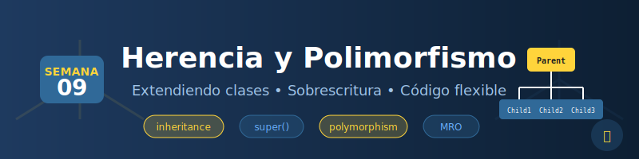

# 📚 Semana 09: Herencia y Polimorfismo



## 🎯 Objetivos de Aprendizaje

Al finalizar esta semana, serás capaz de:

- ✅ Implementar herencia entre clases
- ✅ Usar `super()` para acceder a la clase padre
- ✅ Sobrescribir métodos correctamente (override)
- ✅ Aplicar polimorfismo en diseños orientados a objetos
- ✅ Entender herencia múltiple y MRO (Method Resolution Order)
- ✅ Diseñar jerarquías de clases efectivas

---

## 📋 Requisitos Previos

Antes de comenzar, asegúrate de haber completado:

- [x] Semana 08: Clases y Objetos
- [x] Comprensión de `__init__` y `self`
- [x] Métodos de instancia, clase y estáticos
- [x] Métodos especiales (dunder methods)

---

## 🗂️ Estructura de la Semana

```
week-09/
├── README.md                    # Este archivo
├── rubrica-evaluacion.md        # Criterios de evaluación
├── 0-assets/                    # Recursos visuales
│   ├── week-09-header.svg
│   ├── 01-inheritance-basics.svg
│   ├── 02-method-override.svg
│   ├── 03-polymorphism.svg
│   └── 04-mro-diagram.svg
├── 1-teoria/
│   ├── 01-herencia-basica.md
│   ├── 02-super-y-override.md
│   ├── 03-polimorfismo.md
│   └── 04-herencia-multiple.md
├── 2-ejercicios/
│   ├── 01-herencia-simple/
│   ├── 02-override-y-super/
│   └── 03-polimorfismo/
├── 3-proyecto/
│   ├── README.md
│   ├── starter/
│   └── solution/                # ⚠️ Solo instructores
├── 4-recursos/
│   ├── ebooks-free/
│   ├── videografia/
│   └── webgrafia/
└── 5-glosario/
    └── README.md
```

---

## 📝 Contenidos

### 1. Teoría

| # | Tema | Archivo | Tiempo |
|---|------|---------|--------|
| 1 | Herencia Básica | [01-herencia-basica.md](1-teoria/01-herencia-basica.md) | 30 min |
| 2 | Super y Override | [02-super-y-override.md](1-teoria/02-super-y-override.md) | 30 min |
| 3 | Polimorfismo | [03-polimorfismo.md](1-teoria/03-polimorfismo.md) | 30 min |
| 4 | Herencia Múltiple | [04-herencia-multiple.md](1-teoria/04-herencia-multiple.md) | 30 min |

### 2. Ejercicios Guiados

| # | Ejercicio | Carpeta | Tiempo |
|---|-----------|---------|--------|
| 1 | Herencia Simple | [01-herencia-simple/](2-ejercicios/01-herencia-simple/) | 45 min |
| 2 | Override y Super | [02-override-y-super/](2-ejercicios/02-override-y-super/) | 45 min |
| 3 | Polimorfismo Práctico | [03-polimorfismo/](2-ejercicios/03-polimorfismo/) | 45 min |

### 3. Proyecto Semanal

| Proyecto | Descripción | Tiempo |
|----------|-------------|--------|
| [Sistema de Empleados](3-proyecto/) | Jerarquía de clases Employee con diferentes roles | 2 horas |

---

## ⏱️ Distribución del Tiempo (6 horas)

| Actividad | Tiempo | Porcentaje |
|-----------|--------|------------|
| Teoría | 2 horas | 33% |
| Ejercicios | 2.25 horas | 37.5% |
| Proyecto | 1.75 horas | 29.5% |

---

## 📌 Entregables

1. **Ejercicios completados** - Código funcional de los 3 ejercicios
2. **Proyecto Sistema de Empleados** - Implementación completa
3. **Quiz de conceptos** - Evaluación teórica sobre herencia y polimorfismo

---

## 💡 Conceptos Clave de la Semana

```python
# Herencia básica
class Employee:
    def __init__(self, name: str, salary: float) -> None:
        self.name = name
        self.salary = salary

    def work(self) -> str:
        return f"{self.name} is working"


# Clase hija hereda de Employee
class Developer(Employee):
    def __init__(self, name: str, salary: float, language: str) -> None:
        super().__init__(name, salary)  # Llamar al padre
        self.language = language

    # Override del método work
    def work(self) -> str:
        return f"{self.name} is coding in {self.language}"


# Polimorfismo: mismo método, diferente comportamiento
employees: list[Employee] = [
    Employee("Ana", 50000),
    Developer("Bob", 70000, "Python")
]

for emp in employees:
    print(emp.work())  # Cada uno ejecuta su versión
```

---

## 🔗 Navegación

| ⬅️ Anterior | 🏠 Inicio | ➡️ Siguiente |
|-------------|-----------|--------------|
| [Semana 08: Clases y Objetos](../week-08/README.md) | [Bootcamp](../../README.md) | [Semana 10: Abstracción y Módulos](../week-10/README.md) |

---

## 📚 Recursos Adicionales

- [Python Official: Inheritance](https://docs.python.org/3/tutorial/classes.html#inheritance)
- [Real Python: Inheritance and Composition](https://realpython.com/inheritance-composition-python/)
- [Python MRO Explained](https://www.python.org/download/releases/2.3/mro/)
