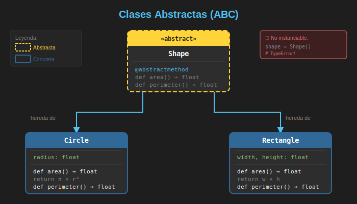

# 🎭 Clases Abstractas con ABC

## 🎯 Objetivos de Aprendizaje

- Comprender qué son las clases abstractas y su propósito
- Usar el módulo `abc` para crear clases abstractas
- Implementar métodos abstractos con `@abstractmethod`
- Combinar métodos abstractos con métodos concretos
- Aplicar propiedades abstractas
- Conocer cuándo usar ABC vs otras alternativas

---

## 📋 Contenido

### 1. ¿Qué es una Clase Abstracta?

Una **clase abstracta** es una clase que no puede ser instanciada directamente. Su propósito es servir como **plantilla** o **contrato** para otras clases que la hereden.



#### ¿Por qué usar Clases Abstractas?

```python
# ❌ Problema: Sin abstracción, nada obliga a implementar métodos
class PaymentProcessor:
    def process_payment(self, amount: float) -> bool:
        pass  # Fácil olvidar implementar

class CreditCardProcessor(PaymentProcessor):
    pass  # No hay error, pero el método no hace nada!

processor = CreditCardProcessor()
result = processor.process_payment(100.0)  # Retorna None, no True/False
```

```python
# ✅ Solución: ABC obliga a implementar métodos abstractos
from abc import ABC, abstractmethod

class PaymentProcessor(ABC):
    @abstractmethod
    def process_payment(self, amount: float) -> bool:
        """Procesa un pago y retorna True si fue exitoso."""
        ...

class CreditCardProcessor(PaymentProcessor):
    pass  # TypeError al instanciar!

# TypeError: Can't instantiate abstract class CreditCardProcessor
# with abstract method process_payment
processor = CreditCardProcessor()
```

---

### 2. El Módulo `abc`

Python proporciona el módulo `abc` (Abstract Base Classes) para crear clases abstractas.

#### Componentes Principales

```python
from abc import ABC, abstractmethod, abstractproperty  # deprecated
from abc import ABCMeta  # Metaclase alternativa

# ABC es simplemente una clase que usa ABCMeta
class MiClaseAbstracta(ABC):
    pass

# Equivalente usando metaclase directamente
class MiClaseAbstracta(metaclass=ABCMeta):
    pass
```

#### Sintaxis Básica

```python
from abc import ABC, abstractmethod

class Shape(ABC):
    """Clase abstracta que define la interfaz de una figura."""

    @abstractmethod
    def area(self) -> float:
        """Calcula el área de la figura."""
        ...

    @abstractmethod
    def perimeter(self) -> float:
        """Calcula el perímetro de la figura."""
        ...

# Intentar instanciar Shape directamente causa error
# shape = Shape()  # TypeError!
```

---

### 3. Implementando Clases Abstractas

#### Ejemplo Completo: Sistema de Figuras

```python
from abc import ABC, abstractmethod
import math

class Shape(ABC):
    """Clase abstracta base para todas las figuras geométricas."""

    def __init__(self, color: str = "black"):
        self.color = color

    @abstractmethod
    def area(self) -> float:
        """Retorna el área de la figura."""
        ...

    @abstractmethod
    def perimeter(self) -> float:
        """Retorna el perímetro de la figura."""
        ...

    # Método concreto - compartido por todas las subclases
    def describe(self) -> str:
        """Descripción genérica de la figura."""
        return f"{self.__class__.__name__} de color {self.color}"


class Circle(Shape):
    """Implementación concreta de un círculo."""

    def __init__(self, radius: float, color: str = "black"):
        super().__init__(color)
        self.radius = radius

    def area(self) -> float:
        return math.pi * self.radius ** 2

    def perimeter(self) -> float:
        return 2 * math.pi * self.radius


class Rectangle(Shape):
    """Implementación concreta de un rectángulo."""

    def __init__(self, width: float, height: float, color: str = "black"):
        super().__init__(color)
        self.width = width
        self.height = height

    def area(self) -> float:
        return self.width * self.height

    def perimeter(self) -> float:
        return 2 * (self.width + self.height)


# Uso
circle = Circle(5, "red")
rectangle = Rectangle(4, 6, "blue")

print(circle.describe())      # Circle de color red
print(f"Área: {circle.area():.2f}")  # Área: 78.54

print(rectangle.describe())   # Rectangle de color blue
print(f"Área: {rectangle.area()}")   # Área: 24
```

---

### 4. Métodos Abstractos y Concretos

Una clase abstracta puede tener **ambos tipos** de métodos:

```python
from abc import ABC, abstractmethod

class DataProcessor(ABC):
    """Procesador de datos con métodos abstractos y concretos."""

    def __init__(self, name: str):
        self.name = name
        self._processed_count = 0

    # Método ABSTRACTO - debe ser implementado
    @abstractmethod
    def process(self, data: list[dict]) -> list[dict]:
        """Procesa los datos. Cada subclase define su lógica."""
        ...

    # Método CONCRETO - implementación compartida
    def validate(self, data: list[dict]) -> bool:
        """Valida que los datos no estén vacíos."""
        if not data:
            print("Error: Datos vacíos")
            return False
        return True

    # Método CONCRETO que usa el abstracto
    def run(self, data: list[dict]) -> list[dict] | None:
        """Ejecuta validación y procesamiento."""
        if not self.validate(data):
            return None

        result = self.process(data)  # Llama al método abstracto
        self._processed_count += 1
        print(f"[{self.name}] Procesamiento #{self._processed_count} completado")
        return result


class FilterProcessor(DataProcessor):
    """Filtra datos que cumplan una condición."""

    def __init__(self, name: str, key: str, value: str):
        super().__init__(name)
        self.key = key
        self.value = value

    def process(self, data: list[dict]) -> list[dict]:
        return [item for item in data if item.get(self.key) == self.value]


class TransformProcessor(DataProcessor):
    """Transforma datos aplicando una función a una clave."""

    def __init__(self, name: str, key: str, transform_fn):
        super().__init__(name)
        self.key = key
        self.transform_fn = transform_fn

    def process(self, data: list[dict]) -> list[dict]:
        result = []
        for item in data.copy():
            if self.key in item:
                item[self.key] = self.transform_fn(item[self.key])
            result.append(item)
        return result


# Uso
data = [
    {"name": "alice", "role": "admin"},
    {"name": "bob", "role": "user"},
    {"name": "charlie", "role": "admin"},
]

# Filtrar solo admins
admin_filter = FilterProcessor("AdminFilter", "role", "admin")
admins = admin_filter.run(data)
print(admins)  # [{'name': 'alice', 'role': 'admin'}, {'name': 'charlie', 'role': 'admin'}]

# Transformar nombres a mayúsculas
upper_transform = TransformProcessor("UpperCase", "name", str.upper)
transformed = upper_transform.run(data)
print(transformed)  # [{'name': 'ALICE', ...}, {'name': 'BOB', ...}, ...]
```

---

### 5. Propiedades Abstractas

También puedes definir **propiedades abstractas**:

```python
from abc import ABC, abstractmethod

class Vehicle(ABC):
    """Vehículo con propiedades abstractas."""

    @property
    @abstractmethod
    def max_speed(self) -> int:
        """Velocidad máxima en km/h."""
        ...

    @property
    @abstractmethod
    def fuel_type(self) -> str:
        """Tipo de combustible."""
        ...

    def describe(self) -> str:
        return f"{self.__class__.__name__}: {self.max_speed} km/h, {self.fuel_type}"


class Car(Vehicle):
    """Coche con propiedades concretas."""

    @property
    def max_speed(self) -> int:
        return 200

    @property
    def fuel_type(self) -> str:
        return "gasoline"


class ElectricBike(Vehicle):
    """Bicicleta eléctrica."""

    @property
    def max_speed(self) -> int:
        return 45

    @property
    def fuel_type(self) -> str:
        return "electric"


car = Car()
bike = ElectricBike()

print(car.describe())   # Car: 200 km/h, gasoline
print(bike.describe())  # ElectricBike: 45 km/h, electric
```

---

### 6. Métodos Abstractos con Implementación Base

Un método abstracto puede tener implementación que las subclases pueden usar con `super()`:

```python
from abc import ABC, abstractmethod

class Logger(ABC):
    """Logger abstracto con implementación base."""

    @abstractmethod
    def log(self, message: str) -> None:
        """Registra un mensaje. Subclases deben llamar super()."""
        # Implementación base: añade timestamp
        from datetime import datetime
        timestamp = datetime.now().strftime("%Y-%m-%d %H:%M:%S")
        self._formatted_message = f"[{timestamp}] {message}"


class ConsoleLogger(Logger):
    """Logger que imprime en consola."""

    def log(self, message: str) -> None:
        super().log(message)  # Llama implementación base
        print(f"CONSOLE: {self._formatted_message}")


class FileLogger(Logger):
    """Logger que escribe en archivo."""

    def __init__(self, filename: str):
        self.filename = filename

    def log(self, message: str) -> None:
        super().log(message)  # Llama implementación base
        # En un caso real, escribiría al archivo
        print(f"FILE[{self.filename}]: {self._formatted_message}")


console = ConsoleLogger()
console.log("Usuario conectado")
# CONSOLE: [2026-01-02 10:30:45] Usuario conectado

file_logger = FileLogger("app.log")
file_logger.log("Error crítico")
# FILE[app.log]: [2026-01-02 10:30:45] Error crítico
```

---

### 7. Verificar si una Clase es Abstracta

```python
from abc import ABC, abstractmethod
import inspect

class Animal(ABC):
    @abstractmethod
    def speak(self) -> str:
        ...

class Dog(Animal):
    def speak(self) -> str:
        return "Woof!"

# Verificar métodos abstractos pendientes
print(Animal.__abstractmethods__)  # frozenset({'speak'})
print(Dog.__abstractmethods__)     # frozenset() - vacío, todos implementados

# Verificar si es subclase de ABC
print(issubclass(Animal, ABC))  # True
print(issubclass(Dog, ABC))     # True (hereda de Animal que hereda de ABC)

# Verificar si se puede instanciar
print(inspect.isabstract(Animal))  # True
print(inspect.isabstract(Dog))     # False
```

---

### 8. Patrones Comunes con ABC

#### Template Method Pattern

```python
from abc import ABC, abstractmethod

class ReportGenerator(ABC):
    """Generador de reportes usando Template Method."""

    def generate(self, data: list[dict]) -> str:
        """Template method - define el algoritmo."""
        header = self.create_header()
        body = self.create_body(data)
        footer = self.create_footer()
        return f"{header}\n{body}\n{footer}"

    @abstractmethod
    def create_header(self) -> str:
        """Crea el encabezado del reporte."""
        ...

    @abstractmethod
    def create_body(self, data: list[dict]) -> str:
        """Crea el cuerpo del reporte."""
        ...

    def create_footer(self) -> str:
        """Footer por defecto (puede ser sobrescrito)."""
        return "--- Fin del Reporte ---"


class HTMLReport(ReportGenerator):
    def create_header(self) -> str:
        return "<html><head><title>Report</title></head><body>"

    def create_body(self, data: list[dict]) -> str:
        rows = "".join(f"<p>{item}</p>" for item in data)
        return f"<div>{rows}</div>"

    def create_footer(self) -> str:
        return "</body></html>"


class MarkdownReport(ReportGenerator):
    def create_header(self) -> str:
        return "# Reporte\n"

    def create_body(self, data: list[dict]) -> str:
        return "\n".join(f"- {item}" for item in data)


# Uso
data = [{"name": "Alice"}, {"name": "Bob"}]

html = HTMLReport()
print(html.generate(data))

md = MarkdownReport()
print(md.generate(data))
```

#### Factory Pattern con ABC

```python
from abc import ABC, abstractmethod

class Notification(ABC):
    @abstractmethod
    def send(self, message: str) -> bool:
        ...

class EmailNotification(Notification):
    def send(self, message: str) -> bool:
        print(f"📧 Email: {message}")
        return True

class SMSNotification(Notification):
    def send(self, message: str) -> bool:
        print(f"📱 SMS: {message}")
        return True

class PushNotification(Notification):
    def send(self, message: str) -> bool:
        print(f"🔔 Push: {message}")
        return True

class NotificationFactory:
    """Factory que crea notificaciones según el tipo."""

    _registry: dict[str, type[Notification]] = {
        "email": EmailNotification,
        "sms": SMSNotification,
        "push": PushNotification,
    }

    @classmethod
    def create(cls, notification_type: str) -> Notification:
        if notification_type not in cls._registry:
            raise ValueError(f"Tipo desconocido: {notification_type}")
        return cls._registry[notification_type]()

    @classmethod
    def register(cls, name: str, notification_class: type[Notification]) -> None:
        """Registra un nuevo tipo de notificación."""
        cls._registry[name] = notification_class


# Uso
notifier = NotificationFactory.create("email")
notifier.send("Hola!")  # 📧 Email: Hola!
```

---

### 9. ABC vs Otras Alternativas

| Característica | ABC | Protocol | Duck Typing |
|----------------|-----|----------|-------------|
| Requiere herencia | ✅ Sí | ❌ No | ❌ No |
| Verificación en runtime | ✅ Al instanciar | ❌ Solo type checker | ❌ Al usar |
| Métodos compartidos | ✅ Sí | ❌ No | ❌ No |
| Tipado estructural | ❌ No | ✅ Sí | ✅ Sí (implícito) |

```python
from abc import ABC, abstractmethod
from typing import Protocol

# ABC - Requiere herencia explícita
class DrawableABC(ABC):
    @abstractmethod
    def draw(self) -> None: ...

# Protocol - Solo necesita implementar el método
class DrawableProtocol(Protocol):
    def draw(self) -> None: ...

# Esta clase NO hereda de nada
class Square:
    def draw(self) -> None:
        print("Drawing square")

# Con ABC: NO funciona (no hereda)
# isinstance(Square(), DrawableABC)  # False

# Con Protocol: SÍ funciona (tiene el método)
def render(item: DrawableProtocol) -> None:
    item.draw()

render(Square())  # ✅ Funciona - typing estructural
```

---

## 💡 Cuándo Usar ABC

### ✅ Usa ABC cuando:

1. Necesitas **compartir implementación** entre subclases
2. Quieres **error inmediato** si falta implementar un método
3. Tienes una **jerarquía de clases** bien definida
4. Necesitas **métodos template** con pasos definidos

### ❌ Evita ABC cuando:

1. Solo defines una **interfaz simple** (usa Protocol)
2. Quieres **flexibilidad** sin forzar herencia
3. Las clases vienen de **librerías externas**
4. Priorizas **composición sobre herencia**

---

## 📚 Ejercicios Propuestos

### Ejercicio 1: Sistema de Plugins

Crea una clase abstracta `Plugin` con métodos `activate()`, `deactivate()` y `execute()`. Implementa al menos dos plugins concretos.

### Ejercicio 2: Calculadora de Impuestos

Crea una clase abstracta `TaxCalculator` con método abstracto `calculate(amount)`. Implementa versiones para diferentes países.

### Ejercicio 3: Sistema de Caché

Crea una clase abstracta `Cache` con métodos `get()`, `set()` y `delete()`. Implementa `MemoryCache` y `FileCache`.

---

## ✅ Checklist de Verificación

Antes de continuar, asegúrate de poder:

- [ ] Crear una clase abstracta con `ABC`
- [ ] Definir métodos abstractos con `@abstractmethod`
- [ ] Combinar métodos abstractos y concretos
- [ ] Crear propiedades abstractas
- [ ] Implementar el patrón Template Method
- [ ] Decidir cuándo usar ABC vs Protocol

---

## 🔗 Recursos Adicionales

- 📖 [PEP 3119 - Abstract Base Classes](https://peps.python.org/pep-3119/)
- 📖 [Python abc module documentation](https://docs.python.org/3/library/abc.html)
- 📖 [Real Python - Abstract Base Classes](https://realpython.com/python-interface/)

---

## 🔗 Navegación

| ← Anterior | Actual | Siguiente → |
|------------|--------|-------------|
| [README](../README.md) | **01 - Clases Abstractas** | [02 - Protocols](02-protocols-interfaces.md) |
