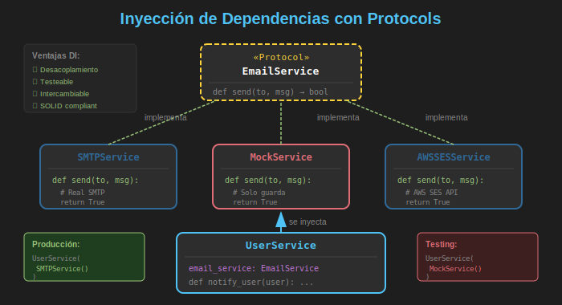

# 🔌 Protocols e Interfaces

## 🎯 Objetivos de Aprendizaje

- Comprender el concepto de **tipado estructural** vs **nominal**
- Crear interfaces con `typing.Protocol`
- Implementar **duck typing** con verificación de tipos
- Usar `runtime_checkable` para verificación en tiempo de ejecución
- Combinar Protocols con type hints avanzados
- Elegir entre Protocol y ABC según el caso de uso

---

## 📋 Contenido

### 1. Tipado Nominal vs Estructural

Python soporta dos formas de tipado:

#### Tipado Nominal (ABC)

Las clases deben **heredar explícitamente** de una clase base.

```python
from abc import ABC, abstractmethod

class Flyable(ABC):
    @abstractmethod
    def fly(self) -> None: ...

class Bird(Flyable):  # ✅ Hereda de Flyable
    def fly(self) -> None:
        print("Bird flying")

class Airplane:  # ❌ NO hereda de Flyable
    def fly(self) -> None:
        print("Airplane flying")

def make_fly(item: Flyable) -> None:
    item.fly()

make_fly(Bird())      # ✅ OK - hereda de Flyable
make_fly(Airplane())  # ❌ Type error - no hereda de Flyable
```

#### Tipado Estructural (Protocol)

Las clases solo necesitan **tener los métodos requeridos**.

```python
from typing import Protocol

class Flyable(Protocol):
    def fly(self) -> None: ...

class Bird:  # NO hereda de nada
    def fly(self) -> None:
        print("Bird flying")

class Airplane:  # NO hereda de nada
    def fly(self) -> None:
        print("Airplane flying")

def make_fly(item: Flyable) -> None:
    item.fly()

make_fly(Bird())      # ✅ OK - tiene método fly()
make_fly(Airplane())  # ✅ OK - tiene método fly()
```

---

### 2. Creando Protocols

#### Sintaxis Básica

```python
from typing import Protocol

class Drawable(Protocol):
    """Protocol para objetos que pueden ser dibujados."""

    def draw(self) -> None:
        """Dibuja el objeto."""
        ...

class Resizable(Protocol):
    """Protocol para objetos redimensionables."""

    def resize(self, factor: float) -> None:
        """Redimensiona por un factor."""
        ...
```

#### Protocol con Múltiples Métodos

```python
from typing import Protocol

class DataSource(Protocol):
    """Protocol para fuentes de datos."""

    def connect(self) -> bool:
        """Establece conexión."""
        ...

    def read(self) -> list[dict]:
        """Lee datos."""
        ...

    def close(self) -> None:
        """Cierra conexión."""
        ...


# Cualquier clase con estos 3 métodos es compatible
class DatabaseSource:
    def connect(self) -> bool:
        print("Connecting to database...")
        return True

    def read(self) -> list[dict]:
        return [{"id": 1, "name": "Alice"}]

    def close(self) -> None:
        print("Closing database connection")


class APISource:
    def connect(self) -> bool:
        print("Connecting to API...")
        return True

    def read(self) -> list[dict]:
        return [{"id": 2, "name": "Bob"}]

    def close(self) -> None:
        print("Closing API connection")


def fetch_data(source: DataSource) -> list[dict]:
    """Funciona con cualquier DataSource."""
    if source.connect():
        data = source.read()
        source.close()
        return data
    return []


# Ambas funcionan sin heredar de DataSource
print(fetch_data(DatabaseSource()))
print(fetch_data(APISource()))
```

---

### 3. Protocol con Atributos

Los Protocols también pueden definir **atributos requeridos**:

```python
from typing import Protocol

class Named(Protocol):
    """Protocol para objetos con nombre."""
    name: str

class Identified(Protocol):
    """Protocol para objetos con ID y nombre."""
    id: int
    name: str

class User:
    def __init__(self, id: int, name: str):
        self.id = id
        self.name = name

class Product:
    def __init__(self, id: int, name: str, price: float):
        self.id = id
        self.name = name
        self.price = price

def greet(entity: Named) -> str:
    return f"Hello, {entity.name}!"

def get_identifier(entity: Identified) -> str:
    return f"{entity.name} (ID: {entity.id})"

user = User(1, "Alice")
product = Product(100, "Laptop", 999.99)

print(greet(user))         # Hello, Alice!
print(greet(product))      # Hello, Laptop!
print(get_identifier(user))     # Alice (ID: 1)
print(get_identifier(product))  # Laptop (ID: 100)
```

---

### 4. @runtime_checkable

Por defecto, los Protocols solo son verificados por el **type checker** (mypy, pyright). Para verificar en tiempo de ejecución, usa `@runtime_checkable`:

```python
from typing import Protocol, runtime_checkable

@runtime_checkable
class Closeable(Protocol):
    """Protocol verificable en runtime."""
    def close(self) -> None: ...

class FileHandler:
    def close(self) -> None:
        print("Closing file")

class DatabaseConnection:
    def close(self) -> None:
        print("Closing DB connection")

class SimpleObject:
    pass  # No tiene close()

# Verificación en runtime con isinstance
file = FileHandler()
db = DatabaseConnection()
obj = SimpleObject()

print(isinstance(file, Closeable))  # True
print(isinstance(db, Closeable))    # True
print(isinstance(obj, Closeable))   # False

# Uso práctico: cerrar recursos de forma segura
def safe_close(resource: object) -> None:
    if isinstance(resource, Closeable):
        resource.close()
        print("Resource closed successfully")
    else:
        print("Resource is not closeable")

safe_close(file)  # Closing file / Resource closed successfully
safe_close(obj)   # Resource is not closeable
```

#### ⚠️ Limitaciones de runtime_checkable

```python
from typing import Protocol, runtime_checkable

@runtime_checkable
class Calculator(Protocol):
    def add(self, a: int, b: int) -> int: ...

class GoodCalc:
    def add(self, a: int, b: int) -> int:
        return a + b

class BadCalc:
    def add(self, a: str, b: str) -> str:  # ¡Tipos incorrectos!
        return a + b

# isinstance solo verifica que el MÉTODO EXISTE, no la firma
print(isinstance(GoodCalc(), Calculator))  # True
print(isinstance(BadCalc(), Calculator))   # True! (solo verifica nombre)
```

---

### 5. Protocols Genéricos

Los Protocols pueden ser genéricos usando `TypeVar`:

```python
from typing import Protocol, TypeVar

T = TypeVar('T')
T_co = TypeVar('T_co', covariant=True)

class Container(Protocol[T]):
    """Protocol genérico para contenedores."""

    def add(self, item: T) -> None: ...
    def get(self) -> T | None: ...
    def count(self) -> int: ...


class Stack(Protocol[T]):
    """Protocol para estructura tipo pila."""

    def push(self, item: T) -> None: ...
    def pop(self) -> T: ...
    def peek(self) -> T: ...
    def is_empty(self) -> bool: ...


# Implementación que cumple el Protocol Stack
class ListStack[T]:
    def __init__(self):
        self._items: list[T] = []

    def push(self, item: T) -> None:
        self._items.append(item)

    def pop(self) -> T:
        if self.is_empty():
            raise IndexError("Stack is empty")
        return self._items.pop()

    def peek(self) -> T:
        if self.is_empty():
            raise IndexError("Stack is empty")
        return self._items[-1]

    def is_empty(self) -> bool:
        return len(self._items) == 0


def process_stack(stack: Stack[int]) -> int:
    """Suma todos los elementos del stack."""
    total = 0
    while not stack.is_empty():
        total += stack.pop()
    return total


int_stack = ListStack[int]()
int_stack.push(1)
int_stack.push(2)
int_stack.push(3)
print(process_stack(int_stack))  # 6
```

---

### 6. Combinando Múltiples Protocols

Puedes crear un Protocol que herede de otros:

```python
from typing import Protocol

class Readable(Protocol):
    def read(self) -> str: ...

class Writable(Protocol):
    def write(self, data: str) -> None: ...

class Closeable(Protocol):
    def close(self) -> None: ...

# Protocol combinado
class ReadWriteCloseable(Readable, Writable, Closeable, Protocol):
    """Combina múltiples protocols."""
    ...


class File:
    def __init__(self, name: str):
        self.name = name
        self._content = ""
        self._closed = False

    def read(self) -> str:
        return self._content

    def write(self, data: str) -> None:
        self._content += data

    def close(self) -> None:
        self._closed = True
        print(f"File {self.name} closed")


def process_file(f: ReadWriteCloseable) -> None:
    """Requiere que el objeto sea legible, escribible y cerrable."""
    f.write("Hello, World!")
    content = f.read()
    print(f"Content: {content}")
    f.close()


file = File("test.txt")
process_file(file)
# Content: Hello, World!
# File test.txt closed
```

---

### 7. Callable Protocol

Un caso especial es el Protocol para objetos llamables:

```python
from typing import Protocol, Callable

# Usando Callable (forma simple)
Handler = Callable[[str], bool]

def process_with_handler(data: str, handler: Handler) -> bool:
    return handler(data)

# Usando Protocol (más expresivo)
class MessageHandler(Protocol):
    """Protocol para manejadores de mensajes."""

    def __call__(self, message: str) -> bool:
        """Procesa un mensaje y retorna éxito."""
        ...


class EmailHandler:
    def __init__(self, email: str):
        self.email = email

    def __call__(self, message: str) -> bool:
        print(f"Sending to {self.email}: {message}")
        return True


class SlackHandler:
    def __init__(self, channel: str):
        self.channel = channel

    def __call__(self, message: str) -> bool:
        print(f"Posting to #{self.channel}: {message}")
        return True


def notify(handler: MessageHandler, message: str) -> None:
    if handler(message):
        print("Notification sent successfully")


email = EmailHandler("user@example.com")
slack = SlackHandler("general")

notify(email, "Hello!")  # Sending to user@example.com: Hello!
notify(slack, "Hello!")  # Posting to #general: Hello!
```

---

### 8. Protocols vs ABC: Comparación Completa

| Aspecto | Protocol | ABC |
|---------|----------|-----|
| **Tipado** | Estructural | Nominal |
| **Herencia** | No requerida | Requerida |
| **Verificación** | Type checker (+ runtime_checkable) | Runtime al instanciar |
| **Métodos compartidos** | ❌ No | ✅ Sí |
| **Librerías externas** | ✅ Funciona | ❌ No (requiere herencia) |
| **Flexibilidad** | Alta | Media |
| **Error temprano** | En type checking | Al instanciar |

#### Cuándo usar Protocol

```python
from typing import Protocol

# ✅ Protocol: Interfaz simple, sin implementación compartida
class Serializable(Protocol):
    def to_json(self) -> str: ...
    def to_xml(self) -> str: ...

# ✅ Protocol: Para clases de terceros
class HttpClient(Protocol):
    def get(self, url: str) -> dict: ...
    def post(self, url: str, data: dict) -> dict: ...

# Puedes usar requests.Session que ya tiene estos métodos
# sin necesidad de que requests herede de HttpClient
```

#### Cuándo usar ABC

```python
from abc import ABC, abstractmethod

# ✅ ABC: Necesitas compartir implementación
class BaseRepository(ABC):
    def __init__(self, connection_string: str):
        self.connection_string = connection_string
        self._connected = False

    def connect(self) -> None:
        """Implementación compartida."""
        print(f"Connecting to {self.connection_string}")
        self._connected = True

    @abstractmethod
    def save(self, entity: dict) -> int:
        """Cada subclase implementa su lógica de guardado."""
        ...

    @abstractmethod
    def find_by_id(self, id: int) -> dict | None:
        """Cada subclase implementa su lógica de búsqueda."""
        ...
```

---

### 9. Patrón de Inyección de Dependencias



Los Protocols son ideales para **inyección de dependencias**:

```python
from typing import Protocol
from dataclasses import dataclass

# Definir interfaces con Protocol
class EmailService(Protocol):
    def send(self, to: str, subject: str, body: str) -> bool: ...

class Logger(Protocol):
    def info(self, message: str) -> None: ...
    def error(self, message: str) -> None: ...

# Implementaciones concretas
class SMTPEmailService:
    def send(self, to: str, subject: str, body: str) -> bool:
        print(f"SMTP: Sending '{subject}' to {to}")
        return True

class ConsoleLogger:
    def info(self, message: str) -> None:
        print(f"[INFO] {message}")

    def error(self, message: str) -> None:
        print(f"[ERROR] {message}")

# Mock para testing
class MockEmailService:
    def __init__(self):
        self.sent_emails: list[dict] = []

    def send(self, to: str, subject: str, body: str) -> bool:
        self.sent_emails.append({"to": to, "subject": subject, "body": body})
        return True

# Servicio que depende de las interfaces
@dataclass
class UserService:
    email_service: EmailService
    logger: Logger

    def register_user(self, email: str, name: str) -> bool:
        self.logger.info(f"Registering user: {name}")

        # Enviar email de bienvenida
        success = self.email_service.send(
            to=email,
            subject="Welcome!",
            body=f"Hello {name}, welcome to our platform!"
        )

        if success:
            self.logger.info(f"Welcome email sent to {email}")
        else:
            self.logger.error(f"Failed to send email to {email}")

        return success


# Producción: usar implementaciones reales
production_service = UserService(
    email_service=SMTPEmailService(),
    logger=ConsoleLogger()
)
production_service.register_user("alice@example.com", "Alice")

# Testing: usar mocks
mock_email = MockEmailService()
test_service = UserService(
    email_service=mock_email,
    logger=ConsoleLogger()
)
test_service.register_user("test@test.com", "Test")
print(f"Emails sent: {mock_email.sent_emails}")
```

---

### 10. Protocols en la Biblioteca Estándar

Python incluye varios Protocols útiles en `typing`:

```python
from typing import (
    Iterable,
    Iterator,
    Sequence,
    Mapping,
    MutableMapping,
    Callable,
    Hashable,
    Sized,
    SupportsInt,
    SupportsFloat,
    SupportsStr,
    SupportsBytes,
    SupportsAbs,
    SupportsRound,
)

# Ejemplos de uso
def process_items(items: Iterable[str]) -> list[str]:
    """Acepta cualquier iterable de strings."""
    return [item.upper() for item in items]

def get_length(obj: Sized) -> int:
    """Acepta cualquier objeto con __len__."""
    return len(obj)

def to_integer(value: SupportsInt) -> int:
    """Acepta cualquier objeto convertible a int."""
    return int(value)

# Funciona con diferentes tipos
print(process_items(["a", "b"]))       # Lista
print(process_items({"x", "y", "z"}))  # Set
print(process_items("hello"))          # String

print(get_length([1, 2, 3]))     # 3
print(get_length("hello"))       # 5
print(get_length({"a": 1}))      # 1

print(to_integer(3.7))    # 3
print(to_integer("42"))   # 42 (si SupportsInt)
```

---

## 💡 Mejores Prácticas

### 1. Nombrar Protocols con Sufijo o Prefijo Claro

```python
# ✅ Buenos nombres
class Drawable(Protocol): ...
class Serializable(Protocol): ...
class CanFly(Protocol): ...

# ❌ Nombres confusos
class Draw(Protocol): ...  # ¿Es un verbo o un sustantivo?
class Data(Protocol): ...  # Muy genérico
```

### 2. Mantener Protocols Pequeños (Interface Segregation)

```python
# ❌ Protocol muy grande
class DoEverything(Protocol):
    def read(self) -> str: ...
    def write(self, data: str) -> None: ...
    def delete(self) -> None: ...
    def validate(self) -> bool: ...
    def transform(self) -> str: ...

# ✅ Protocols pequeños y enfocados
class Readable(Protocol):
    def read(self) -> str: ...

class Writable(Protocol):
    def write(self, data: str) -> None: ...

class Deletable(Protocol):
    def delete(self) -> None: ...
```

### 3. Documentar el Contrato

```python
class Repository(Protocol):
    """
    Protocol para repositorios de datos.

    Implementaciones deben garantizar:
    - save() retorna el ID del objeto guardado
    - find_by_id() retorna None si no existe
    - delete() es idempotente (no falla si no existe)
    """

    def save(self, entity: dict) -> int:
        """Guarda entidad y retorna su ID."""
        ...

    def find_by_id(self, id: int) -> dict | None:
        """Busca por ID, retorna None si no existe."""
        ...

    def delete(self, id: int) -> None:
        """Elimina por ID. Idempotente."""
        ...
```

---

## 📚 Ejercicios Propuestos

### Ejercicio 1: Sistema de Caché

Crea un Protocol `Cache` con métodos `get`, `set`, `delete`. Implementa `MemoryCache` y `FileCache`.

### Ejercicio 2: Sistema de Eventos

Crea Protocols `EventEmitter` y `EventListener`. Implementa un sistema de pub/sub simple.

### Ejercicio 3: Validadores

Crea un Protocol `Validator` con método `validate(data) -> tuple[bool, list[str]]`. Implementa validadores para email, teléfono y edad.

---

## ✅ Checklist de Verificación

Antes de continuar, asegúrate de poder:

- [ ] Explicar tipado nominal vs estructural
- [ ] Crear Protocols con métodos y atributos
- [ ] Usar `@runtime_checkable` correctamente
- [ ] Crear Protocols genéricos
- [ ] Combinar múltiples Protocols
- [ ] Implementar inyección de dependencias con Protocols
- [ ] Elegir entre Protocol y ABC según el caso

---

## 🔗 Recursos Adicionales

- 📖 [PEP 544 - Protocols: Structural subtyping](https://peps.python.org/pep-0544/)
- 📖 [typing.Protocol documentation](https://docs.python.org/3/library/typing.html#typing.Protocol)
- 📖 [Real Python - Duck Typing](https://realpython.com/lessons/duck-typing/)

---

## 🔗 Navegación

| ← Anterior | Actual | Siguiente → |
|------------|--------|-------------|
| [01 - Clases Abstractas](01-clases-abstractas.md) | **02 - Protocols** | [03 - Módulos](03-modulos-imports.md) |
