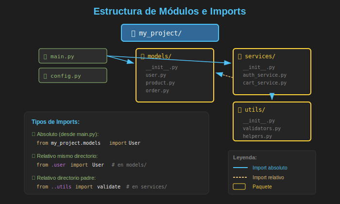

# 📂 Módulos e Imports

## 🎯 Objetivos de Aprendizaje

- Comprender qué es un **módulo** en Python
- Dominar las diferentes formas de **importar** módulos
- Diferenciar entre imports **absolutos** y **relativos**
- Organizar código en múltiples archivos
- Usar `__init__.py` correctamente
- Evitar **imports circulares**
- Aplicar buenas prácticas de organización modular

---

## 📋 Contenido

### 1. ¿Qué es un Módulo?

Un **módulo** es simplemente un archivo Python (`.py`) que contiene código reutilizable.



```python
# math_utils.py - Este archivo ES un módulo
"""Utilidades matemáticas."""

PI = 3.14159

def circle_area(radius: float) -> float:
    """Calcula el área de un círculo."""
    return PI * radius ** 2

def circle_perimeter(radius: float) -> float:
    """Calcula el perímetro de un círculo."""
    return 2 * PI * radius

class Calculator:
    """Calculadora simple."""

    def add(self, a: float, b: float) -> float:
        return a + b

    def subtract(self, a: float, b: float) -> float:
        return a - b
```

```python
# main.py - Usando el módulo
import math_utils

area = math_utils.circle_area(5)
print(f"Área: {area}")  # Área: 78.53975

calc = math_utils.Calculator()
print(calc.add(10, 5))  # 15
```

---

### 2. Formas de Importar

#### Import Básico

```python
# Importa el módulo completo
import math

result = math.sqrt(16)  # Necesitas prefijo math.
print(result)  # 4.0
```

#### Import con Alias

```python
# Importa con un nombre más corto
import numpy as np
import pandas as pd

array = np.array([1, 2, 3])
df = pd.DataFrame({"col": [1, 2, 3]})
```

#### Import Específico

```python
# Importa elementos específicos
from math import sqrt, pi, ceil

result = sqrt(16)  # Sin prefijo
print(pi)          # 3.141592653589793
print(ceil(4.2))   # 5
```

#### Import Específico con Alias

```python
from datetime import datetime as dt
from collections import defaultdict as dd

now = dt.now()
counts = dd(int)
```

#### Import de Todo (⚠️ Evitar)

```python
# ❌ MAL - Contamina el namespace
from math import *

# No sabes de dónde viene sqrt
result = sqrt(16)

# ✅ BIEN - Explícito
from math import sqrt, pi
```

---

### 3. Imports Absolutos vs Relativos

Considera esta estructura de proyecto:

```
my_project/
├── main.py
└── src/
    ├── __init__.py
    ├── core/
    │   ├── __init__.py
    │   ├── models.py
    │   └── services.py
    └── utils/
        ├── __init__.py
        ├── helpers.py
        └── validators.py
```

#### Imports Absolutos

Especifican la **ruta completa** desde la raíz del proyecto:

```python
# src/core/services.py
from src.core.models import User
from src.utils.helpers import format_date
from src.utils.validators import validate_email

class UserService:
    def create_user(self, name: str, email: str) -> User:
        if not validate_email(email):
            raise ValueError("Invalid email")
        return User(name=name, email=email)
```

#### Imports Relativos

Usan **puntos** para indicar ubicación relativa:

```python
# src/core/services.py
from .models import User           # Mismo directorio (core/)
from ..utils.helpers import format_date      # Directorio padre, luego utils/
from ..utils.validators import validate_email

# Un punto (.) = directorio actual
# Dos puntos (..) = directorio padre
# Tres puntos (...) = dos niveles arriba
```

#### ¿Cuándo Usar Cada Uno?

| Tipo | Cuándo Usar | Ejemplo |
|------|-------------|---------|
| **Absoluto** | Librerías externas, módulos de la stdlib | `from datetime import datetime` |
| **Absoluto** | Cuando el código se ejecuta como script | `from my_project.utils import helper` |
| **Relativo** | Dentro de un paquete, entre submódulos | `from .models import User` |
| **Relativo** | Código que siempre se importa, nunca se ejecuta directo | `from ..config import settings` |

---

### 4. El Archivo `__init__.py`

El archivo `__init__.py` convierte un directorio en un **paquete Python**.

#### Paquete Vacío

```python
# utils/__init__.py
# Archivo vacío - solo marca el directorio como paquete
```

#### Exportando Elementos Públicos

```python
# utils/__init__.py
"""Utilidades del proyecto."""

from .helpers import format_date, format_currency
from .validators import validate_email, validate_phone

# Define qué se exporta con "from utils import *"
__all__ = [
    "format_date",
    "format_currency",
    "validate_email",
    "validate_phone",
]
```

```python
# Ahora puedes importar directamente desde utils
from utils import format_date, validate_email

# En lugar de:
from utils.helpers import format_date
from utils.validators import validate_email
```

#### Inicialización del Paquete

```python
# database/__init__.py
"""Módulo de base de datos."""

from .connection import DatabaseConnection
from .models import User, Product
from .repository import UserRepository, ProductRepository

# Código que se ejecuta al importar el paquete
print("Initializing database module...")

# Configuración por defecto
DEFAULT_DATABASE = "sqlite:///app.db"

def get_connection(url: str = DEFAULT_DATABASE) -> DatabaseConnection:
    """Factory function para obtener conexión."""
    return DatabaseConnection(url)
```

---

### 5. La Variable `__name__`

Cada módulo tiene una variable especial `__name__`:

```python
# greetings.py
print(f"__name__ is: {__name__}")

def say_hello(name: str) -> str:
    return f"Hello, {name}!"

if __name__ == "__main__":
    # Este código solo se ejecuta si el archivo se corre directamente
    print(say_hello("World"))
```

```bash
# Si ejecutas directamente:
$ python greetings.py
__name__ is: __main__
Hello, World!

# Si lo importas desde otro archivo:
$ python -c "import greetings"
__name__ is: greetings
```

#### Patrón Común: Script y Módulo

```python
# calculator.py
"""Calculadora que funciona como módulo y como script."""

def add(a: float, b: float) -> float:
    return a + b

def subtract(a: float, b: float) -> float:
    return a - b

def multiply(a: float, b: float) -> float:
    return a * b

def divide(a: float, b: float) -> float:
    if b == 0:
        raise ValueError("Cannot divide by zero")
    return a / b

def main() -> None:
    """Punto de entrada cuando se ejecuta como script."""
    print("Calculator Demo")
    print(f"5 + 3 = {add(5, 3)}")
    print(f"10 / 2 = {divide(10, 2)}")

if __name__ == "__main__":
    main()
```

---

### 6. Orden de Búsqueda de Módulos

Python busca módulos en este orden:

1. **Directorio actual** (del script que se ejecuta)
2. **PYTHONPATH** (variable de entorno)
3. **Site-packages** (paquetes instalados)
4. **Biblioteca estándar**

```python
import sys

# Ver las rutas de búsqueda
for path in sys.path:
    print(path)

# Agregar una ruta personalizada
sys.path.insert(0, "/path/to/my/modules")
```

#### Ver de Dónde Viene un Módulo

```python
import os
import requests  # Terceros
import my_module  # Local

print(os.__file__)        # /usr/lib/python3.13/os.py
print(requests.__file__)  # /path/to/venv/lib/.../requests/__init__.py
print(my_module.__file__) # /path/to/project/my_module.py
```

---

### 7. Imports Circulares

Un **import circular** ocurre cuando dos módulos se importan mutuamente:

```python
# ❌ PROBLEMA: Import circular

# models.py
from services import UserService  # Importa services

class User:
    def __init__(self, name: str):
        self.name = name

    def get_service(self) -> UserService:
        return UserService(self)

# services.py
from models import User  # Importa models ← CIRCULAR!

class UserService:
    def __init__(self, user: User):
        self.user = user
```

#### Soluciones

**1. Mover import dentro de la función:**

```python
# models.py
class User:
    def __init__(self, name: str):
        self.name = name

    def get_service(self):  # Sin type hint para evitar import
        from services import UserService  # Import local
        return UserService(self)
```

**2. Usar TYPE_CHECKING:**

```python
# models.py
from typing import TYPE_CHECKING

if TYPE_CHECKING:
    # Solo se importa durante type checking, no en runtime
    from services import UserService

class User:
    def __init__(self, name: str):
        self.name = name

    def get_service(self) -> "UserService":  # String para forward reference
        from services import UserService
        return UserService(self)
```

**3. Reorganizar la arquitectura:**

```python
# La mejor solución: extraer a un tercer módulo

# interfaces.py (nuevo)
from typing import Protocol

class UserServiceProtocol(Protocol):
    def process(self) -> None: ...

# models.py
from interfaces import UserServiceProtocol

class User:
    def get_service(self) -> UserServiceProtocol:
        from services import UserService
        return UserService(self)

# services.py
from models import User

class UserService:
    def __init__(self, user: User):
        self.user = user

    def process(self) -> None:
        print(f"Processing {self.user.name}")
```

---

### 8. Organización de Imports

Sigue el estándar PEP 8 para organizar imports:

```python
# 1. Biblioteca estándar (stdlib)
import os
import sys
from datetime import datetime
from pathlib import Path

# 2. Librerías de terceros
import requests
import numpy as np
from pydantic import BaseModel

# 3. Imports locales/del proyecto
from .models import User, Product
from .services import UserService
from ..utils import format_date

# Cada grupo separado por una línea en blanco
# Dentro de cada grupo, ordenar alfabéticamente
```

#### Herramientas de Formateo

```bash
# isort - Ordena imports automáticamente
uv add --dev isort
isort my_module.py

# ruff - Linter moderno que incluye ordenamiento
uv add --dev ruff
ruff check --fix my_module.py
```

---

### 9. Módulos como Namespaces

Los módulos actúan como **namespaces** para evitar colisiones:

```python
# Dos módulos pueden tener funciones con el mismo nombre

# graphics/draw.py
def render(shape):
    print(f"Rendering {shape} with graphics engine")

# text/draw.py
def render(content):
    print(f"Rendering text: {content}")

# main.py
from graphics import draw as graphics_draw
from text import draw as text_draw

graphics_draw.render("circle")  # Rendering circle with graphics engine
text_draw.render("Hello")       # Rendering text: Hello
```

---

### 10. Recargar Módulos (Development)

Durante desarrollo, puedes necesitar recargar un módulo:

```python
import importlib
import my_module

# Después de modificar my_module.py
importlib.reload(my_module)

# Nota: Los objetos ya creados NO se actualizan
# Solo las nuevas importaciones usan el código nuevo
```

---

### 11. Ejemplo Práctico: Estructura Modular

```
ecommerce/
├── __init__.py
├── main.py
├── config.py
├── models/
│   ├── __init__.py
│   ├── user.py
│   ├── product.py
│   └── order.py
├── services/
│   ├── __init__.py
│   ├── auth_service.py
│   ├── cart_service.py
│   └── payment_service.py
├── repositories/
│   ├── __init__.py
│   ├── base.py
│   ├── user_repository.py
│   └── product_repository.py
└── utils/
    ├── __init__.py
    ├── validators.py
    └── formatters.py
```

```python
# models/__init__.py
from .user import User
from .product import Product
from .order import Order

__all__ = ["User", "Product", "Order"]
```

```python
# models/user.py
from dataclasses import dataclass
from datetime import datetime

@dataclass
class User:
    id: int
    email: str
    name: str
    created_at: datetime = None

    def __post_init__(self):
        if self.created_at is None:
            self.created_at = datetime.now()
```

```python
# services/auth_service.py
from ..models import User
from ..repositories import UserRepository
from ..utils.validators import validate_email

class AuthService:
    def __init__(self, user_repo: UserRepository):
        self.user_repo = user_repo

    def register(self, email: str, name: str) -> User:
        if not validate_email(email):
            raise ValueError("Invalid email")

        user = User(id=0, email=email, name=name)
        return self.user_repo.save(user)
```

```python
# main.py
from ecommerce.models import User, Product
from ecommerce.services import AuthService, CartService
from ecommerce.repositories import UserRepository

def main():
    user_repo = UserRepository()
    auth = AuthService(user_repo)

    user = auth.register("alice@example.com", "Alice")
    print(f"Registered: {user}")

if __name__ == "__main__":
    main()
```

---

## 💡 Buenas Prácticas

### ✅ Hacer

1. **Imports explícitos**: `from module import specific_thing`
2. **Organizar imports**: stdlib → third-party → local
3. **Usar `__all__`** en `__init__.py` para definir API pública
4. **Imports absolutos** para claridad en proyectos grandes
5. **Imports relativos** dentro de paquetes cohesivos

### ❌ Evitar

1. **`from module import *`**: Contamina namespace
2. **Imports circulares**: Reorganiza la arquitectura
3. **Imports en medio del código**: Mantén todos arriba
4. **Nombres genéricos**: `from utils import helper` (¿cuál helper?)

---

## 📚 Ejercicios Propuestos

### Ejercicio 1: Refactorizar Monolito

Toma un archivo de 500+ líneas y divídelo en módulos lógicos.

### Ejercicio 2: Sistema de Plugins

Crea un sistema que descubra y cargue módulos dinámicamente desde un directorio `plugins/`.

### Ejercicio 3: Resolver Import Circular

Dado un código con import circular, refactorízalo usando las técnicas aprendidas.

---

## ✅ Checklist de Verificación

Antes de continuar, asegúrate de poder:

- [ ] Crear módulos Python
- [ ] Usar las diferentes formas de import
- [ ] Diferenciar imports absolutos y relativos
- [ ] Configurar `__init__.py` correctamente
- [ ] Usar `if __name__ == "__main__"`
- [ ] Resolver imports circulares
- [ ] Organizar imports según PEP 8

---

## 🔗 Navegación

| ← Anterior | Actual | Siguiente → |
|------------|--------|-------------|
| [02 - Protocols](02-protocols-interfaces.md) | **03 - Módulos** | [04 - Paquetes](04-paquetes-dependencias.md) |
