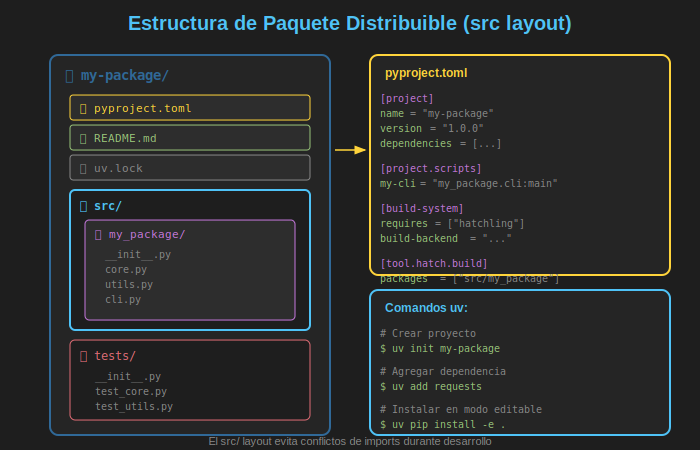

# 📦 Paquetes y Dependencias

## 🎯 Objetivos de Aprendizaje

- Comprender la estructura de un **paquete Python** distribuible
- Configurar proyectos con **pyproject.toml**
- Gestionar dependencias con **uv**
- Usar el **src layout** para proyectos
- Crear **entry points** para comandos CLI
- Publicar paquetes en **PyPI/TestPyPI**
- Manejar versiones y **lock files**

---

## 📋 Contenido

### 1. Anatomía de un Paquete Python



Un paquete Python moderno tiene esta estructura:

```
mi_paquete/
├── pyproject.toml          # Configuración del proyecto
├── README.md               # Documentación
├── LICENSE                 # Licencia
├── uv.lock                 # Lock de dependencias
├── src/
│   └── mi_paquete/
│       ├── __init__.py     # Punto de entrada del paquete
│       ├── core.py         # Módulo principal
│       ├── utils.py        # Utilidades
│       └── cli.py          # Comandos CLI (opcional)
└── tests/
    ├── __init__.py
    ├── test_core.py
    └── test_utils.py
```

#### ¿Por qué `src/` layout?

```
# ❌ Flat layout - puede causar problemas
mi_paquete/
├── mi_paquete/     # El paquete
│   └── __init__.py
├── tests/
└── pyproject.toml

# Problema: Python puede importar el directorio local
# en lugar del paquete instalado durante desarrollo
```

```
# ✅ src layout - recomendado
mi_paquete/
├── src/
│   └── mi_paquete/    # El paquete está "escondido"
│       └── __init__.py
├── tests/
└── pyproject.toml

# Ventaja: Fuerza a instalar el paquete para importarlo
# Evita confusiones entre código fuente e instalado
```

---

### 2. El Archivo pyproject.toml

`pyproject.toml` es el **estándar moderno** para configurar proyectos Python (PEP 518, 621).

#### Configuración Mínima

```toml
[project]
name = "mi-paquete"
version = "0.1.0"
description = "Un paquete de ejemplo"
readme = "README.md"
requires-python = ">=3.11"
license = {text = "MIT"}
authors = [
    {name = "Tu Nombre", email = "tu@email.com"}
]

dependencies = [
    "requests>=2.28.0",
    "pydantic>=2.0.0",
]

[build-system]
requires = ["hatchling"]
build-backend = "hatchling.build"
```

#### Configuración Completa

```toml
[project]
name = "data-processor"
version = "1.0.0"
description = "Framework de procesamiento de datos extensible"
readme = "README.md"
requires-python = ">=3.11"
license = {text = "MIT"}
authors = [
    {name = "Alice Developer", email = "alice@example.com"}
]
maintainers = [
    {name = "Bob Maintainer", email = "bob@example.com"}
]
keywords = ["data", "processing", "etl", "plugins"]
classifiers = [
    "Development Status :: 4 - Beta",
    "Intended Audience :: Developers",
    "License :: OSI Approved :: MIT License",
    "Programming Language :: Python :: 3",
    "Programming Language :: Python :: 3.11",
    "Programming Language :: Python :: 3.12",
    "Programming Language :: Python :: 3.13",
    "Topic :: Software Development :: Libraries",
]

# Dependencias de producción
dependencies = [
    "requests>=2.28.0,<3.0.0",
    "pydantic>=2.0.0",
    "click>=8.0.0",
]

# Dependencias opcionales (extras)
[project.optional-dependencies]
dev = [
    "pytest>=7.0.0",
    "pytest-cov>=4.0.0",
    "ruff>=0.1.0",
    "mypy>=1.0.0",
]
docs = [
    "mkdocs>=1.5.0",
    "mkdocs-material>=9.0.0",
]

# URLs del proyecto
[project.urls]
Homepage = "https://github.com/user/data-processor"
Documentation = "https://data-processor.readthedocs.io"
Repository = "https://github.com/user/data-processor.git"
Issues = "https://github.com/user/data-processor/issues"

# Entry points para CLI
[project.scripts]
data-processor = "data_processor.cli:main"
dp = "data_processor.cli:main"

# Entry points para plugins
[project.entry-points."data_processor.plugins"]
csv = "data_processor.plugins.csv:CSVPlugin"
json = "data_processor.plugins.json:JSONPlugin"

# Configuración del build system
[build-system]
requires = ["hatchling"]
build-backend = "hatchling.build"

# Configuración de herramientas
[tool.ruff]
line-length = 88
select = ["E", "F", "I", "N", "W"]

[tool.mypy]
python_version = "3.11"
strict = true

[tool.pytest.ini_options]
testpaths = ["tests"]
addopts = "-v --cov=src"
```

---

### 3. Gestión de Dependencias con uv

**uv** es el gestor de paquetes moderno recomendado (reemplaza pip + pip-tools + virtualenv).

#### Instalación de uv

```bash
# Linux/macOS
curl -LsSf https://astral.sh/uv/install.sh | sh

# O con pip (menos recomendado)
pip install uv
```

#### Comandos Esenciales

```bash
# Crear un nuevo proyecto
uv init mi_proyecto
cd mi_proyecto

# Estructura creada:
# mi_proyecto/
# ├── pyproject.toml
# ├── README.md
# └── src/
#     └── mi_proyecto/
#         └── __init__.py

# Agregar dependencias
uv add requests           # Producción
uv add pydantic click     # Múltiples a la vez
uv add --dev pytest ruff  # Desarrollo

# Ver dependencias instaladas
uv pip list

# Sincronizar entorno (instalar desde lock)
uv sync

# Ejecutar código
uv run python src/mi_proyecto/main.py
uv run pytest

# Actualizar dependencias
uv lock --upgrade          # Actualiza lock file
uv lock --upgrade-package requests  # Solo un paquete
```

#### El Archivo uv.lock

```toml
# uv.lock - Generado automáticamente, NO editar manualmente
# Contiene versiones exactas de TODAS las dependencias (directas + transitivas)

[[package]]
name = "requests"
version = "2.31.0"
source = { registry = "https://pypi.org/simple" }
dependencies = [
    { name = "certifi" },
    { name = "charset-normalizer" },
    { name = "idna" },
    { name = "urllib3" },
]

[[package]]
name = "certifi"
version = "2024.2.2"
source = { registry = "https://pypi.org/simple" }
```

**¿Por qué usar lock file?**

```bash
# Sin lock file:
# - Cada instalación puede usar versiones diferentes
# - "Funciona en mi máquina" pero falla en producción
# - Dependencias transitivas impredecibles

# Con lock file:
# - Versiones exactas garantizadas
# - Builds reproducibles
# - Mismo resultado en cualquier máquina
```

---

### 4. Entornos Virtuales

uv maneja entornos virtuales automáticamente:

```bash
# uv crea .venv automáticamente al ejecutar comandos
uv run python --version  # Crea .venv si no existe

# Activar manualmente (opcional)
source .venv/bin/activate  # Linux/macOS
.venv\Scripts\activate     # Windows

# Ver información del entorno
uv run python -c "import sys; print(sys.prefix)"
```

#### Múltiples Versiones de Python

```bash
# Instalar Python con uv
uv python install 3.11 3.12 3.13

# Usar versión específica
uv run --python 3.12 python --version

# Crear proyecto con versión específica
uv init --python 3.12 mi_proyecto
```

---

### 5. Entry Points y CLI

Los entry points permiten crear **comandos ejecutables**.

#### Definir Entry Points

```toml
# pyproject.toml
[project.scripts]
# nombre-comando = "paquete.modulo:funcion"
mi-cli = "mi_paquete.cli:main"
mi-cli-alias = "mi_paquete.cli:main"
```

```python
# src/mi_paquete/cli.py
import click

@click.group()
def main():
    """Mi herramienta CLI."""
    pass

@main.command()
@click.argument("name")
def hello(name: str):
    """Saluda a alguien."""
    click.echo(f"Hello, {name}!")

@main.command()
@click.option("--count", "-c", default=1, help="Número de veces")
def repeat(count: int):
    """Repite un mensaje."""
    for i in range(count):
        click.echo(f"Message {i + 1}")

if __name__ == "__main__":
    main()
```

```bash
# Después de instalar el paquete
uv pip install -e .

# Usar el comando
mi-cli hello World     # Hello, World!
mi-cli repeat -c 3     # Message 1, Message 2, Message 3
```

---

### 6. Instalación en Modo Desarrollo

```bash
# Instalar en modo editable (los cambios se reflejan inmediatamente)
uv pip install -e .

# Con dependencias de desarrollo
uv pip install -e ".[dev]"

# Con múltiples extras
uv pip install -e ".[dev,docs]"
```

---

### 7. Ejemplo Completo: Crear un Paquete

#### Paso 1: Inicializar Proyecto

```bash
uv init calculator
cd calculator
```

#### Paso 2: Configurar pyproject.toml

```toml
[project]
name = "py-calculator"
version = "0.1.0"
description = "Una calculadora simple en Python"
readme = "README.md"
requires-python = ">=3.11"
license = {text = "MIT"}
authors = [
    {name = "Tu Nombre", email = "tu@email.com"}
]

dependencies = []

[project.optional-dependencies]
dev = [
    "pytest>=7.0.0",
    "ruff>=0.1.0",
]

[project.scripts]
calc = "py_calculator.cli:main"

[build-system]
requires = ["hatchling"]
build-backend = "hatchling.build"

[tool.hatch.build.targets.wheel]
packages = ["src/py_calculator"]
```

#### Paso 3: Crear Estructura

```bash
mkdir -p src/py_calculator tests
touch src/py_calculator/__init__.py
touch src/py_calculator/core.py
touch src/py_calculator/cli.py
touch tests/__init__.py
touch tests/test_core.py
```

#### Paso 4: Implementar el Código

```python
# src/py_calculator/__init__.py
"""Calculadora Python."""

from .core import Calculator

__version__ = "0.1.0"
__all__ = ["Calculator"]
```

```python
# src/py_calculator/core.py
"""Funcionalidad principal de la calculadora."""

class Calculator:
    """Calculadora con operaciones básicas."""

    def __init__(self, precision: int = 2):
        self.precision = precision
        self._history: list[str] = []

    def add(self, a: float, b: float) -> float:
        """Suma dos números."""
        result = round(a + b, self.precision)
        self._log(f"{a} + {b} = {result}")
        return result

    def subtract(self, a: float, b: float) -> float:
        """Resta dos números."""
        result = round(a - b, self.precision)
        self._log(f"{a} - {b} = {result}")
        return result

    def multiply(self, a: float, b: float) -> float:
        """Multiplica dos números."""
        result = round(a * b, self.precision)
        self._log(f"{a} * {b} = {result}")
        return result

    def divide(self, a: float, b: float) -> float:
        """Divide dos números."""
        if b == 0:
            raise ZeroDivisionError("Cannot divide by zero")
        result = round(a / b, self.precision)
        self._log(f"{a} / {b} = {result}")
        return result

    def _log(self, operation: str) -> None:
        """Registra operación en historial."""
        self._history.append(operation)

    @property
    def history(self) -> list[str]:
        """Retorna historial de operaciones."""
        return self._history.copy()

    def clear_history(self) -> None:
        """Limpia el historial."""
        self._history.clear()
```

```python
# src/py_calculator/cli.py
"""Interfaz de línea de comandos."""

import sys

def main() -> None:
    """Punto de entrada del CLI."""
    from py_calculator import Calculator

    calc = Calculator()

    print("🧮 Python Calculator")
    print("Commands: add, sub, mul, div, history, quit")
    print()

    while True:
        try:
            line = input("calc> ").strip().lower()

            if line in ("quit", "exit", "q"):
                print("Goodbye!")
                break

            if line == "history":
                for op in calc.history:
                    print(f"  {op}")
                continue

            parts = line.split()
            if len(parts) != 3:
                print("Usage: <operation> <num1> <num2>")
                continue

            op, a, b = parts[0], float(parts[1]), float(parts[2])

            operations = {
                "add": calc.add,
                "sub": calc.subtract,
                "mul": calc.multiply,
                "div": calc.divide,
            }

            if op not in operations:
                print(f"Unknown operation: {op}")
                continue

            result = operations[op](a, b)
            print(f"  = {result}")

        except ValueError as e:
            print(f"Error: {e}")
        except ZeroDivisionError as e:
            print(f"Error: {e}")
        except KeyboardInterrupt:
            print("\nGoodbye!")
            break

if __name__ == "__main__":
    main()
```

#### Paso 5: Escribir Tests

```python
# tests/test_core.py
import pytest
from py_calculator import Calculator

class TestCalculator:
    def setup_method(self):
        self.calc = Calculator()

    def test_add(self):
        assert self.calc.add(2, 3) == 5
        assert self.calc.add(-1, 1) == 0
        assert self.calc.add(0.1, 0.2) == 0.3

    def test_subtract(self):
        assert self.calc.subtract(5, 3) == 2
        assert self.calc.subtract(0, 5) == -5

    def test_multiply(self):
        assert self.calc.multiply(3, 4) == 12
        assert self.calc.multiply(-2, 3) == -6

    def test_divide(self):
        assert self.calc.divide(10, 2) == 5
        assert self.calc.divide(7, 2) == 3.5

    def test_divide_by_zero(self):
        with pytest.raises(ZeroDivisionError):
            self.calc.divide(10, 0)

    def test_history(self):
        self.calc.add(1, 2)
        self.calc.multiply(3, 4)

        history = self.calc.history
        assert len(history) == 2
        assert "1 + 2 = 3" in history[0]

    def test_precision(self):
        calc = Calculator(precision=4)
        result = calc.divide(1, 3)
        assert result == 0.3333
```

#### Paso 6: Instalar y Probar

```bash
# Instalar dependencias de desarrollo
uv add --dev pytest

# Instalar paquete en modo editable
uv pip install -e .

# Ejecutar tests
uv run pytest

# Probar CLI
calc
# calc> add 5 3
#   = 8
# calc> history
#   5 + 3 = 8
# calc> quit
```

---

### 8. Publicar en PyPI

#### Preparar para Publicación

```bash
# Construir el paquete
uv build

# Crea:
# dist/
# ├── py_calculator-0.1.0-py3-none-any.whl
# └── py_calculator-0.1.0.tar.gz
```

#### Publicar en TestPyPI (Práctica)

```bash
# Configurar token de TestPyPI
# Obtén token en: https://test.pypi.org/manage/account/token/

# Publicar
uv publish --repository testpypi

# Instalar desde TestPyPI
uv pip install --index-url https://test.pypi.org/simple/ py-calculator
```

#### Publicar en PyPI (Producción)

```bash
# Configurar token de PyPI
# Obtén token en: https://pypi.org/manage/account/token/

# Publicar
uv publish
```

---

### 9. Versionado Semántico

Usa **SemVer** (MAJOR.MINOR.PATCH):

| Cambio | Versión | Cuándo |
|--------|---------|--------|
| MAJOR | 1.0.0 → 2.0.0 | Breaking changes |
| MINOR | 1.0.0 → 1.1.0 | Nueva funcionalidad (compatible) |
| PATCH | 1.0.0 → 1.0.1 | Bug fixes |

```python
# src/mi_paquete/__init__.py
__version__ = "1.2.3"

# Acceder desde código
import mi_paquete
print(mi_paquete.__version__)  # 1.2.3
```

---

### 10. Dependencias: Rangos de Versiones

```toml
[project]
dependencies = [
    # Versión exacta (evitar en librerías)
    "package==1.2.3",

    # Mínimo (más común)
    "package>=1.2.0",

    # Rango (recomendado para librerías)
    "package>=1.2.0,<2.0.0",

    # Compatible (~= es equivalente a >=X.Y,<X+1.0)
    "package~=1.2",     # >=1.2,<2.0
    "package~=1.2.3",   # >=1.2.3,<1.3.0
]
```

---

## 💡 Buenas Prácticas

### ✅ Hacer

1. **Usar src layout** para evitar problemas de imports
2. **Siempre usar lock file** para builds reproducibles
3. **Versionado semántico** para comunicar cambios
4. **Tests antes de publicar** (`uv run pytest`)
5. **README.md descriptivo** con ejemplos de uso

### ❌ Evitar

1. **Editar uv.lock manualmente** - Es autogenerado
2. **Versiones exactas en dependencias** de librerías
3. **Publicar sin tests** que pasen
4. **Olvidar `__init__.py`** en paquetes

---

## 📚 Ejercicios Propuestos

### Ejercicio 1: Mi Primer Paquete

Crea un paquete `text_utils` con funciones de manipulación de texto y publícalo en TestPyPI.

### Ejercicio 2: CLI con Click

Extiende el ejemplo de calculadora con más operaciones y opciones de configuración.

### Ejercicio 3: Sistema de Plugins

Crea un paquete que descubra y cargue plugins usando entry points.

---

## ✅ Checklist de Verificación

Antes de continuar, asegúrate de poder:

- [ ] Estructurar un proyecto con src layout
- [ ] Configurar pyproject.toml completo
- [ ] Usar uv para gestionar dependencias
- [ ] Crear entry points para CLI
- [ ] Instalar paquete en modo editable
- [ ] Construir y publicar paquetes
- [ ] Entender versionado semántico

---

## 🔗 Recursos Adicionales

- 📖 [Python Packaging User Guide](https://packaging.python.org/)
- 📖 [uv Documentation](https://docs.astral.sh/uv/)
- 📖 [PEP 621 - pyproject.toml metadata](https://peps.python.org/pep-0621/)
- 📖 [Semantic Versioning](https://semver.org/)

---

## 🔗 Navegación

| ← Anterior | Actual | Siguiente → |
|------------|--------|-------------|
| [03 - Módulos](03-modulos-imports.md) | **04 - Paquetes** | [Ejercicios](../2-ejercicios/01-clases-abstractas/) |
