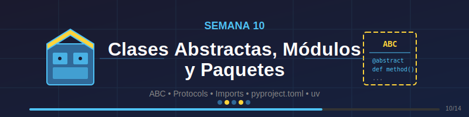

# 📦 Semana 10: Clases Abstractas, Módulos y Paquetes



## 🎯 Objetivos de Aprendizaje

Al finalizar esta semana, serás capaz de:

- ✅ Crear y utilizar **clases abstractas** con el módulo `abc`
- ✅ Implementar **interfaces** mediante Protocols (tipado estructural)
- ✅ Organizar código en **módulos** reutilizables
- ✅ Estructurar proyectos con **paquetes** Python
- ✅ Gestionar **imports** relativos y absolutos
- ✅ Manejar **dependencias** con `uv` (gestor moderno)
- ✅ Crear tu propio **paquete distribuible**
- ✅ Aplicar el patrón de **inyección de dependencias**

---

## 📚 Requisitos Previos

Antes de comenzar esta semana, debes:

- ✅ Dominar clases, herencia y polimorfismo (Week-09)
- ✅ Entender duck typing y Protocols
- ✅ Conocer el MRO y herencia múltiple
- ✅ Tener experiencia con type hints

---

## 🗂️ Estructura de la Semana

```
week-10/
├── README.md                    # Este archivo
├── rubrica-evaluacion.md        # Criterios de evaluación
├── 0-assets/                    # Recursos visuales
│   ├── week-10-header.svg
│   ├── 01-abstract-classes.svg
│   ├── 02-modules-structure.svg
│   ├── 03-packages-layout.svg
│   └── 04-dependency-injection.svg
├── 1-teoria/                    # Material teórico
│   ├── 01-clases-abstractas.md
│   ├── 02-protocols-interfaces.md
│   ├── 03-modulos-imports.md
│   └── 04-paquetes-dependencias.md
├── 2-ejercicios/                # Ejercicios guiados
│   ├── 01-clases-abstractas/
│   ├── 02-modulos-organizacion/
│   └── 03-paquete-completo/
├── 3-proyecto/                  # Proyecto integrador
│   ├── README.md
│   ├── starter/
│   └── solution/
├── 4-recursos/                  # Material adicional
│   ├── ebooks-free/
│   ├── videografia/
│   └── webgrafia/
└── 5-glosario/                  # Términos clave
    └── README.md
```

---

## 📝 Contenidos

### 1. Teoría (1.5-2 horas)

| # | Tema | Archivo | Duración |
|---|------|---------|----------|
| 1 | Clases Abstractas con ABC | [01-clases-abstractas.md](1-teoria/01-clases-abstractas.md) | 30 min |
| 2 | Protocols e Interfaces | [02-protocols-interfaces.md](1-teoria/02-protocols-interfaces.md) | 25 min |
| 3 | Módulos e Imports | [03-modulos-imports.md](1-teoria/03-modulos-imports.md) | 30 min |
| 4 | Paquetes y Dependencias | [04-paquetes-dependencias.md](1-teoria/04-paquetes-dependencias.md) | 35 min |

### 2. Ejercicios (2.5-3 horas)

| # | Ejercicio | Carpeta | Duración |
|---|-----------|---------|----------|
| 1 | Sistema de Plugins con ABC | [01-clases-abstractas/](2-ejercicios/01-clases-abstractas/) | 50 min |
| 2 | Organización en Módulos | [02-modulos-organizacion/](2-ejercicios/02-modulos-organizacion/) | 50 min |
| 3 | Crear un Paquete Completo | [03-paquete-completo/](2-ejercicios/03-paquete-completo/) | 60 min |

### 3. Proyecto (1.5-2 horas)

| Proyecto | Descripción | Carpeta |
|----------|-------------|---------|
| 🔌 Sistema de Procesamiento de Datos | Framework extensible con plugins | [3-proyecto/](3-proyecto/) |

---

## ⏱️ Distribución del Tiempo

```
Total: 6 horas semanales

┌─────────────────────────────────────────────────────────┐
│ Teoría        ████████░░░░░░░░░░░░░░  2.0h (33%)       │
│ Ejercicios    ████████████████░░░░░░  2.5h (42%)       │
│ Proyecto      ██████████░░░░░░░░░░░░  1.5h (25%)       │
└─────────────────────────────────────────────────────────┘
```

---

## 🎓 Conceptos Clave

### Clases Abstractas vs Protocols

```python
from abc import ABC, abstractmethod
from typing import Protocol

# Clase Abstracta - Herencia nominal
class DataProcessor(ABC):
    @abstractmethod
    def process(self, data: list[dict]) -> list[dict]:
        """Procesa datos y retorna resultado."""
        ...

    def validate(self, data: list[dict]) -> bool:
        """Método concreto compartido."""
        return len(data) > 0

# Protocol - Tipado estructural
class Serializable(Protocol):
    def to_json(self) -> str: ...
    def from_json(self, data: str) -> None: ...
```

### Estructura de Paquete

```
mi_paquete/
├── pyproject.toml       # Configuración del proyecto
├── src/
│   └── mi_paquete/
│       ├── __init__.py  # Exports públicos
│       ├── core.py      # Funcionalidad principal
│       ├── utils/       # Submódulo de utilidades
│       │   ├── __init__.py
│       │   └── helpers.py
│       └── plugins/     # Sistema de plugins
│           ├── __init__.py
│           └── base.py
├── tests/
│   └── test_core.py
└── uv.lock              # Lock de dependencias
```

### Gestión con uv

```bash
# Crear proyecto nuevo
uv init mi_proyecto

# Agregar dependencias
uv add requests pydantic

# Dependencias de desarrollo
uv add --dev pytest ruff

# Sincronizar entorno
uv sync

# Ejecutar código
uv run python src/main.py
```

---

## 📌 Entregables

Al finalizar la semana, deberás entregar:

1. **Ejercicios completados** (3 ejercicios)
   - Código funcional descomentado
   - Ejecución exitosa sin errores

2. **Proyecto: Sistema de Procesamiento de Datos**
   - Clases abstractas implementadas
   - Al menos 3 plugins concretos
   - Paquete estructurado correctamente
   - Archivo `pyproject.toml` configurado
   - Tests con pytest pasando

3. **Documentación**
   - Docstrings en todas las clases y métodos públicos
   - README del proyecto con instrucciones de uso

---

## 🏆 Criterios de Evaluación

| Criterio | Puntos |
|----------|--------|
| Clases abstractas correctamente implementadas | 20 |
| Uso apropiado de Protocols | 15 |
| Estructura de módulos y paquetes | 20 |
| Gestión de imports (absolutos/relativos) | 15 |
| pyproject.toml bien configurado | 10 |
| Proyecto funcional y extensible | 15 |
| Código limpio y documentado | 5 |
| **Total** | **100** |

Ver [rubrica-evaluacion.md](rubrica-evaluacion.md) para detalles completos.

---

## 💡 Tips de la Semana

> 🎯 **ABC vs Protocol**: Usa ABC cuando necesites compartir implementación entre subclases. Usa Protocol para definir interfaces sin imponer herencia.

> 📦 **Imports circulares**: Evítalos moviendo imports dentro de funciones o reorganizando módulos.

> 🔧 **uv**: Siempre usa `uv sync` después de clonar un proyecto para instalar las dependencias exactas del lock file.

> 🏗️ **src layout**: Usar `src/mi_paquete/` evita conflictos de imports durante desarrollo.

---

## 🔗 Navegación

| ← Anterior | Actual | Siguiente → |
|------------|--------|-------------|
| [Week-09: Herencia y Polimorfismo](../week-09/README.md) | **Week-10** | [Week-11: Manejo de Archivos](../week-11/README.md) |

---

## 📚 Recursos de la Semana

- 📖 [PEP 3119 - Abstract Base Classes](https://peps.python.org/pep-3119/)
- 📖 [PEP 544 - Protocols: Structural subtyping](https://peps.python.org/pep-0544/)
- 📖 [Python Packaging User Guide](https://packaging.python.org/)
- 🔧 [uv Documentation](https://docs.astral.sh/uv/)
- 📝 [Real Python - Modules and Packages](https://realpython.com/python-modules-packages/)

---

**¡Felicidades por llegar a la última semana de POO y Modularidad!** 🎉

Esta semana cierra el bloque de Programación Orientada a Objetos con los conceptos más avanzados de abstracción y organización de código. Dominar estos temas te preparará para crear proyectos Python profesionales y mantenibles.
