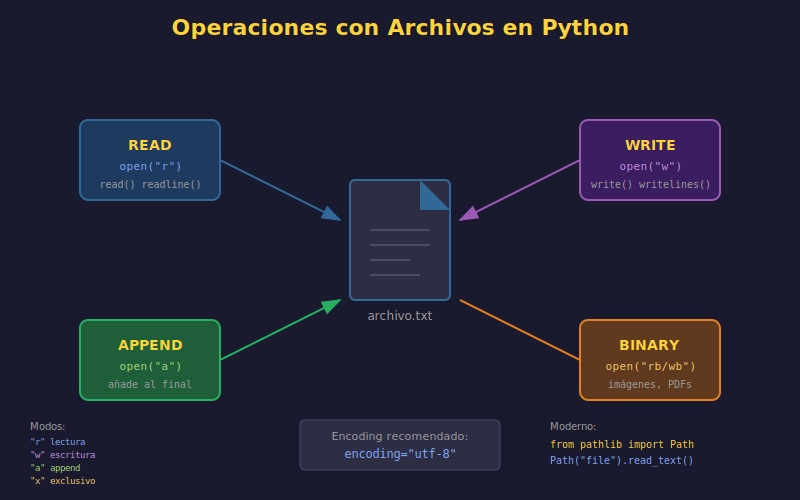

# 📄 Manejo de Archivos en Python

## 🎯 Objetivos de Aprendizaje

- Comprender cómo Python interactúa con el sistema de archivos
- Dominar los diferentes modos de apertura de archivos
- Trabajar con encodings correctamente
- Implementar lectura y escritura eficiente

---

## 1. Introducción al Manejo de Archivos

### ¿Por qué es Importante?

Los archivos son la forma más común de **persistir datos** en programación:

- 📝 Configuraciones de aplicación
- 📊 Datos de usuario
- 📋 Logs y registros
- 💾 Exportación/importación de información

```python
# Flujo básico de trabajo con archivos
# 1. Abrir archivo
# 2. Operar (leer/escribir)
# 3. Cerrar archivo (¡CRÍTICO!)
```



---

## 2. Apertura de Archivos

### La Función `open()`

```python
# Sintaxis básica
file = open(filename, mode, encoding)
```

### Modos de Apertura

| Modo | Descripción | Crear | Truncar | Posición |
|------|-------------|-------|---------|----------|
| `'r'` | Solo lectura (default) | ❌ | ❌ | Inicio |
| `'w'` | Solo escritura | ✅ | ✅ | Inicio |
| `'a'` | Append (agregar) | ✅ | ❌ | Final |
| `'x'` | Creación exclusiva | ✅ | - | Inicio |
| `'r+'` | Lectura y escritura | ❌ | ❌ | Inicio |
| `'w+'` | Escritura y lectura | ✅ | ✅ | Inicio |
| `'a+'` | Append y lectura | ✅ | ❌ | Final |

### Modificadores de Modo

| Modificador | Descripción |
|-------------|-------------|
| `'b'` | Modo binario (`'rb'`, `'wb'`) |
| `'t'` | Modo texto (default) |

```python
# ============================================
# EJEMPLOS DE MODOS DE APERTURA
# ============================================

# Lectura de texto (más común)
with open("data.txt", "r", encoding="utf-8") as f:
    content = f.read()

# Escritura (crea o sobrescribe)
with open("output.txt", "w", encoding="utf-8") as f:
    f.write("Nuevo contenido")

# Append (agrega al final)
with open("log.txt", "a", encoding="utf-8") as f:
    f.write("Nueva entrada de log\n")

# Creación exclusiva (error si existe)
try:
    with open("nuevo.txt", "x", encoding="utf-8") as f:
        f.write("Archivo nuevo")
except FileExistsError:
    print("El archivo ya existe")

# Modo binario (imágenes, PDFs, etc.)
with open("image.png", "rb") as f:
    binary_data = f.read()
```

---

## 3. Encoding: La Clave de los Archivos de Texto

### ¿Qué es el Encoding?

El **encoding** define cómo se convierten los caracteres a bytes y viceversa.

```python
# ⚠️ SIEMPRE especifica encoding para archivos de texto
with open("archivo.txt", "r", encoding="utf-8") as f:
    content = f.read()
```

### Encodings Comunes

| Encoding | Descripción | Uso |
|----------|-------------|-----|
| `utf-8` | Unicode estándar | **Recomendado siempre** |
| `latin-1` | ISO-8859-1 | Archivos legacy |
| `cp1252` | Windows Western | Archivos Windows antiguos |
| `ascii` | Solo caracteres básicos | Datos simples |

### Problemas de Encoding

```python
# ============================================
# MANEJO DE ERRORES DE ENCODING
# ============================================

# Opción 1: Ignorar caracteres problemáticos
with open("archivo.txt", "r", encoding="utf-8", errors="ignore") as f:
    content = f.read()

# Opción 2: Reemplazar con símbolo
with open("archivo.txt", "r", encoding="utf-8", errors="replace") as f:
    content = f.read()  # Caracteres inválidos → �

# Opción 3: Detectar encoding automáticamente (requiere chardet)
# pip install chardet
import chardet

def detect_encoding(file_path: str) -> str:
    """Detecta el encoding de un archivo."""
    with open(file_path, "rb") as f:
        raw_data = f.read(10000)  # Leer muestra
    result = chardet.detect(raw_data)
    return result["encoding"]

# Uso
encoding = detect_encoding("archivo_desconocido.txt")
with open("archivo_desconocido.txt", "r", encoding=encoding) as f:
    content = f.read()
```

---

## 4. Lectura de Archivos

### Métodos de Lectura

```python
# ============================================
# DIFERENTES FORMAS DE LEER ARCHIVOS
# ============================================

# 1. read() - Lee todo el contenido
with open("data.txt", "r", encoding="utf-8") as f:
    content = f.read()  # String completo
    print(f"Caracteres: {len(content)}")

# 2. read(n) - Lee n caracteres
with open("data.txt", "r", encoding="utf-8") as f:
    first_100 = f.read(100)  # Primeros 100 caracteres

# 3. readline() - Lee una línea
with open("data.txt", "r", encoding="utf-8") as f:
    first_line = f.readline()  # Incluye \n
    second_line = f.readline()

# 4. readlines() - Lee todas las líneas como lista
with open("data.txt", "r", encoding="utf-8") as f:
    lines = f.readlines()  # ['línea1\n', 'línea2\n', ...]
    print(f"Total líneas: {len(lines)}")

# 5. Iteración directa (¡RECOMENDADO para archivos grandes!)
with open("large_file.txt", "r", encoding="utf-8") as f:
    for line in f:
        process_line(line.strip())
```

### Lectura Eficiente de Archivos Grandes

```python
from typing import Iterator

def read_large_file(
    file_path: str,
    chunk_size: int = 8192
) -> Iterator[str]:
    """
    Generador para leer archivos grandes por chunks.

    Args:
        file_path: Ruta al archivo
        chunk_size: Tamaño del chunk en bytes

    Yields:
        Chunks del archivo
    """
    with open(file_path, "r", encoding="utf-8") as f:
        while True:
            chunk = f.read(chunk_size)
            if not chunk:
                break
            yield chunk


def count_lines_efficiently(file_path: str) -> int:
    """Cuenta líneas sin cargar todo en memoria."""
    count = 0
    with open(file_path, "r", encoding="utf-8") as f:
        for _ in f:
            count += 1
    return count


def search_in_large_file(
    file_path: str,
    pattern: str
) -> list[tuple[int, str]]:
    """
    Busca un patrón en archivo grande.

    Returns:
        Lista de (número_línea, línea)
    """
    matches: list[tuple[int, str]] = []

    with open(file_path, "r", encoding="utf-8") as f:
        for line_num, line in enumerate(f, start=1):
            if pattern in line:
                matches.append((line_num, line.strip()))

    return matches
```

---

## 5. Escritura de Archivos

### Métodos de Escritura

```python
# ============================================
# DIFERENTES FORMAS DE ESCRIBIR ARCHIVOS
# ============================================

# 1. write() - Escribe string
with open("output.txt", "w", encoding="utf-8") as f:
    f.write("Primera línea\n")
    f.write("Segunda línea\n")

# 2. writelines() - Escribe lista de strings
lines = ["Línea 1\n", "Línea 2\n", "Línea 3\n"]
with open("output.txt", "w", encoding="utf-8") as f:
    f.writelines(lines)

# 3. print() con file parameter
with open("output.txt", "w", encoding="utf-8") as f:
    print("Usando print", file=f)
    print("Más contenido", file=f)

# 4. Append - Agregar al final
with open("log.txt", "a", encoding="utf-8") as f:
    from datetime import datetime
    timestamp = datetime.now().isoformat()
    f.write(f"[{timestamp}] Evento registrado\n")
```

### Escritura Segura con Archivo Temporal

```python
import os
import tempfile
from pathlib import Path


def safe_write(file_path: str, content: str) -> None:
    """
    Escribe de forma segura usando archivo temporal.

    Evita corrupción si el proceso falla a mitad de escritura.
    """
    path = Path(file_path)

    # Crear archivo temporal en el mismo directorio
    fd, temp_path = tempfile.mkstemp(
        dir=path.parent,
        prefix=".tmp_"
    )

    try:
        # Escribir en temporal
        with os.fdopen(fd, "w", encoding="utf-8") as f:
            f.write(content)

        # Reemplazar atómicamente
        os.replace(temp_path, file_path)

    except Exception:
        # Limpiar en caso de error
        if os.path.exists(temp_path):
            os.unlink(temp_path)
        raise


# Uso
safe_write("config.json", '{"setting": "value"}')
```

---

## 6. Trabajando con Pathlib

### Ventajas de Pathlib sobre os.path

```python
from pathlib import Path

# ============================================
# PATHLIB: LA FORMA MODERNA DE MANEJAR RUTAS
# ============================================

# Crear rutas
project_dir = Path("/home/user/project")
data_file = project_dir / "data" / "input.txt"  # Operador /

# Propiedades útiles
print(f"Nombre: {data_file.name}")           # input.txt
print(f"Stem: {data_file.stem}")             # input
print(f"Sufijo: {data_file.suffix}")         # .txt
print(f"Padre: {data_file.parent}")          # /home/user/project/data
print(f"Absoluta: {data_file.absolute()}")

# Verificaciones
if data_file.exists():
    print("El archivo existe")
if data_file.is_file():
    print("Es un archivo")
if data_file.is_dir():
    print("Es un directorio")

# Lectura/escritura directa
content = data_file.read_text(encoding="utf-8")
data_file.write_text("Nuevo contenido", encoding="utf-8")

# Lectura binaria
binary_data = Path("image.png").read_bytes()

# Crear directorios
output_dir = Path("output/reports/2024")
output_dir.mkdir(parents=True, exist_ok=True)

# Listar archivos
for txt_file in project_dir.glob("**/*.txt"):  # Recursivo
    print(txt_file)

# Pattern matching
config_files = list(project_dir.glob("*.{json,yaml,yml}"))
```

### Ejemplo Práctico con Pathlib

```python
from pathlib import Path
from datetime import datetime


def organize_files_by_date(source_dir: str, dest_dir: str) -> int:
    """
    Organiza archivos en carpetas por fecha de modificación.

    Args:
        source_dir: Directorio fuente
        dest_dir: Directorio destino

    Returns:
        Número de archivos movidos
    """
    source = Path(source_dir)
    dest = Path(dest_dir)
    moved = 0

    for file_path in source.iterdir():
        if not file_path.is_file():
            continue

        # Obtener fecha de modificación
        mod_time = datetime.fromtimestamp(file_path.stat().st_mtime)
        date_folder = dest / mod_time.strftime("%Y/%m/%d")

        # Crear carpeta si no existe
        date_folder.mkdir(parents=True, exist_ok=True)

        # Mover archivo
        new_path = date_folder / file_path.name
        file_path.rename(new_path)
        moved += 1

    return moved
```

---

## 7. Archivos CSV

### Lectura y Escritura de CSV

```python
import csv
from pathlib import Path
from typing import Iterator


def read_csv_as_dicts(
    file_path: str
) -> Iterator[dict[str, str]]:
    """Lee CSV como diccionarios."""
    with open(file_path, "r", encoding="utf-8", newline="") as f:
        reader = csv.DictReader(f)
        yield from reader


def write_csv_from_dicts(
    file_path: str,
    data: list[dict[str, str]],
    fieldnames: list[str] | None = None
) -> None:
    """Escribe lista de diccionarios a CSV."""
    if not data:
        return

    fieldnames = fieldnames or list(data[0].keys())

    with open(file_path, "w", encoding="utf-8", newline="") as f:
        writer = csv.DictWriter(f, fieldnames=fieldnames)
        writer.writeheader()
        writer.writerows(data)


# Ejemplo de uso
users = [
    {"name": "Alice", "email": "alice@example.com", "age": "30"},
    {"name": "Bob", "email": "bob@example.com", "age": "25"},
]

write_csv_from_dicts("users.csv", users)

for user in read_csv_as_dicts("users.csv"):
    print(f"{user['name']}: {user['email']}")
```

---

## 8. Archivos JSON

### Lectura y Escritura de JSON

```python
import json
from pathlib import Path
from typing import Any


def read_json(file_path: str) -> Any:
    """Lee archivo JSON."""
    with open(file_path, "r", encoding="utf-8") as f:
        return json.load(f)


def write_json(
    file_path: str,
    data: Any,
    indent: int = 2,
    ensure_ascii: bool = False
) -> None:
    """
    Escribe datos a archivo JSON.

    Args:
        file_path: Ruta del archivo
        data: Datos a serializar
        indent: Indentación (None para compacto)
        ensure_ascii: False para permitir caracteres Unicode
    """
    with open(file_path, "w", encoding="utf-8") as f:
        json.dump(data, f, indent=indent, ensure_ascii=ensure_ascii)


# Ejemplo
config = {
    "app_name": "Mi Aplicación",
    "version": "1.0.0",
    "settings": {
        "theme": "dark",
        "language": "es"
    }
}

write_json("config.json", config)
loaded_config = read_json("config.json")
```

---

## 9. Buenas Prácticas

### ✅ Hacer

```python
# 1. SIEMPRE usar with para archivos
with open("file.txt", "r", encoding="utf-8") as f:
    content = f.read()

# 2. SIEMPRE especificar encoding
with open("file.txt", "w", encoding="utf-8") as f:
    f.write("Contenido con ñ y acentos")

# 3. Usar pathlib para rutas
from pathlib import Path
file_path = Path("data") / "input.txt"

# 4. Verificar existencia antes de operar
if file_path.exists():
    content = file_path.read_text(encoding="utf-8")

# 5. Crear directorios si no existen
output_dir = Path("output")
output_dir.mkdir(parents=True, exist_ok=True)
```

### ❌ Evitar

```python
# 1. NO olvidar cerrar archivos
f = open("file.txt")  # ❌ Sin with
content = f.read()
# f.close()  # Fácil de olvidar

# 2. NO asumir encoding
with open("file.txt") as f:  # ❌ Sin encoding
    content = f.read()

# 3. NO concatenar rutas con strings
path = "data" + "/" + "file.txt"  # ❌

# 4. NO ignorar errores silenciosamente
try:
    content = file_path.read_text()
except:  # ❌ Captura todo
    pass   # ❌ Silencia el error
```

---

## 📚 Resumen

| Operación | Código |
|-----------|--------|
| Leer texto | `Path("f.txt").read_text(encoding="utf-8")` |
| Escribir texto | `Path("f.txt").write_text(content, encoding="utf-8")` |
| Leer líneas | `for line in open("f.txt", encoding="utf-8"):` |
| Leer JSON | `json.load(open("f.json", encoding="utf-8"))` |
| Escribir JSON | `json.dump(data, open("f.json", "w", encoding="utf-8"))` |

---

## ✅ Checklist de Verificación

- [ ] Uso `with` para todas las operaciones con archivos
- [ ] Especifico `encoding="utf-8"` explícitamente
- [ ] Uso `pathlib.Path` para manejo de rutas
- [ ] Verifico existencia de archivos antes de operar
- [ ] Creo directorios con `mkdir(parents=True, exist_ok=True)`
- [ ] Proceso archivos grandes línea por línea
- [ ] Uso `newline=""` para archivos CSV
