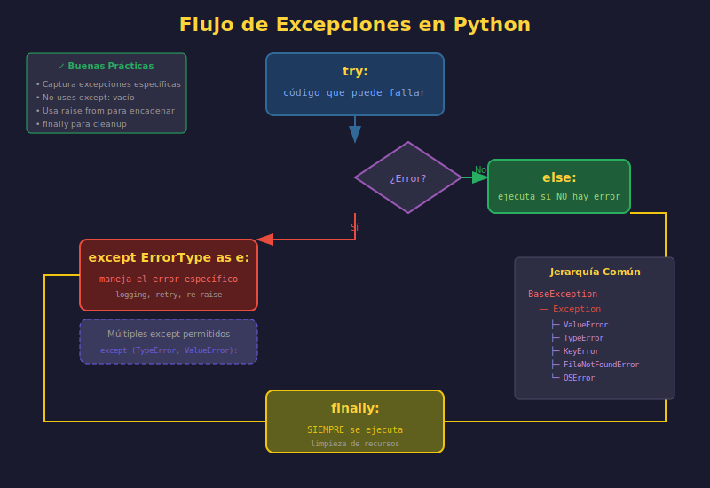

# ⚠️ Sistema de Excepciones en Python

## 🎯 Objetivos de Aprendizaje

- Comprender el sistema de excepciones de Python
- Dominar try/except/else/finally
- Crear excepciones personalizadas
- Implementar manejo robusto de errores

---

## 1. ¿Qué son las Excepciones?

Las **excepciones** son eventos que ocurren durante la ejecución de un programa y alteran el flujo normal de instrucciones.

```python
# Sin manejo de excepciones
result = 10 / 0  # ZeroDivisionError: division by zero
# El programa termina abruptamente

# Con manejo de excepciones
try:
    result = 10 / 0
except ZeroDivisionError:
    print("No se puede dividir por cero")
    result = 0
# El programa continúa normalmente
```



---

## 2. Jerarquía de Excepciones

### Árbol de Excepciones Built-in

```
BaseException
├── SystemExit
├── KeyboardInterrupt
├── GeneratorExit
└── Exception
    ├── StopIteration
    ├── ArithmeticError
    │   ├── ZeroDivisionError
    │   ├── OverflowError
    │   └── FloatingPointError
    ├── AssertionError
    ├── AttributeError
    ├── BufferError
    ├── EOFError
    ├── ImportError
    │   └── ModuleNotFoundError
    ├── LookupError
    │   ├── IndexError
    │   └── KeyError
    ├── MemoryError
    ├── NameError
    │   └── UnboundLocalError
    ├── OSError
    │   ├── FileNotFoundError
    │   ├── FileExistsError
    │   ├── PermissionError
    │   ├── IsADirectoryError
    │   └── NotADirectoryError
    ├── RuntimeError
    │   └── RecursionError
    ├── TypeError
    ├── ValueError
    │   └── UnicodeError
    └── Warning
```

### Excepciones Más Comunes

| Excepción | Cuándo Ocurre |
|-----------|---------------|
| `ValueError` | Valor incorrecto para una operación |
| `TypeError` | Tipo incorrecto para una operación |
| `KeyError` | Clave no existe en diccionario |
| `IndexError` | Índice fuera de rango |
| `FileNotFoundError` | Archivo no encontrado |
| `PermissionError` | Sin permisos de acceso |
| `AttributeError` | Atributo no existe en objeto |
| `ZeroDivisionError` | División por cero |

---

## 3. Sintaxis de try/except

### Estructura Básica

```python
try:
    # Código que puede lanzar excepción
    risky_operation()
except ExceptionType:
    # Manejo del error
    handle_error()
```

### Estructura Completa

```python
try:
    # Código que puede fallar
    result = risky_operation()

except SpecificError as e:
    # Manejo de error específico
    logger.error(f"Error específico: {e}")

except (Error1, Error2) as e:
    # Manejo de múltiples errores
    logger.error(f"Error tipo 1 o 2: {e}")

except Exception as e:
    # Cualquier otra excepción (última opción)
    logger.error(f"Error inesperado: {e}")
    raise  # Re-lanzar después de loguear

else:
    # Se ejecuta SOLO si no hubo excepción
    logger.info("Operación exitosa")
    process_result(result)

finally:
    # Se ejecuta SIEMPRE (haya o no excepción)
    cleanup_resources()
```

---

## 4. Ejemplos Prácticos

### Manejo de Archivos

```python
from pathlib import Path


def read_config(config_path: str) -> dict[str, str]:
    """
    Lee archivo de configuración.

    Args:
        config_path: Ruta al archivo de configuración

    Returns:
        Diccionario con configuración

    Raises:
        FileNotFoundError: Si el archivo no existe
        ValueError: Si el formato es inválido
    """
    path = Path(config_path)

    try:
        content = path.read_text(encoding="utf-8")

    except FileNotFoundError:
        raise FileNotFoundError(
            f"Archivo de configuración no encontrado: {config_path}"
        )
    except PermissionError:
        raise PermissionError(
            f"Sin permisos para leer: {config_path}"
        )

    # Parsear configuración (ejemplo simple key=value)
    config: dict[str, str] = {}

    for line_num, line in enumerate(content.splitlines(), start=1):
        line = line.strip()
        if not line or line.startswith("#"):
            continue

        if "=" not in line:
            raise ValueError(
                f"Formato inválido en línea {line_num}: {line}"
            )

        key, value = line.split("=", 1)
        config[key.strip()] = value.strip()

    return config
```

### Validación de Datos

```python
def validate_user_data(data: dict) -> None:
    """
    Valida datos de usuario.

    Raises:
        ValueError: Si los datos son inválidos
        TypeError: Si los tipos son incorrectos
    """
    required_fields = ["name", "email", "age"]

    # Verificar campos requeridos
    for field in required_fields:
        if field not in data:
            raise ValueError(f"Campo requerido faltante: {field}")

    # Validar tipos
    if not isinstance(data["name"], str):
        raise TypeError("'name' debe ser string")

    if not isinstance(data["age"], int):
        raise TypeError("'age' debe ser entero")

    # Validar valores
    if len(data["name"]) < 2:
        raise ValueError("'name' debe tener al menos 2 caracteres")

    if not 0 <= data["age"] <= 150:
        raise ValueError("'age' debe estar entre 0 y 150")

    if "@" not in data["email"]:
        raise ValueError("'email' debe contener @")
```

### Operaciones de Base de Datos (Simulado)

```python
class DatabaseError(Exception):
    """Error base para operaciones de base de datos."""
    pass


class ConnectionError(DatabaseError):
    """Error de conexión a base de datos."""
    pass


class QueryError(DatabaseError):
    """Error al ejecutar consulta."""
    pass


def execute_query(query: str) -> list[dict]:
    """
    Ejecuta consulta en base de datos.

    Args:
        query: Consulta SQL

    Returns:
        Lista de resultados

    Raises:
        ConnectionError: Si no hay conexión
        QueryError: Si la consulta es inválida
    """
    connection = None

    try:
        connection = get_database_connection()
        result = connection.execute(query)
        return result.fetchall()

    except TimeoutError as e:
        raise ConnectionError(f"Timeout al conectar: {e}") from e

    except SyntaxError as e:
        raise QueryError(f"Consulta inválida: {e}") from e

    finally:
        if connection:
            connection.close()
```

---

## 5. Excepciones Personalizadas

### Creación de Excepciones Custom

```python
# ============================================
# EXCEPCIONES PERSONALIZADAS
# ============================================

class AppError(Exception):
    """Excepción base de la aplicación."""

    def __init__(self, message: str, code: str | None = None):
        super().__init__(message)
        self.message = message
        self.code = code

    def __str__(self) -> str:
        if self.code:
            return f"[{self.code}] {self.message}"
        return self.message


class ValidationError(AppError):
    """Error de validación de datos."""

    def __init__(self, field: str, message: str):
        super().__init__(message, code="VALIDATION_ERROR")
        self.field = field

    def __str__(self) -> str:
        return f"[{self.code}] Campo '{self.field}': {self.message}"


class NotFoundError(AppError):
    """Recurso no encontrado."""

    def __init__(self, resource: str, identifier: str | int):
        message = f"{resource} con id '{identifier}' no encontrado"
        super().__init__(message, code="NOT_FOUND")
        self.resource = resource
        self.identifier = identifier


class AuthenticationError(AppError):
    """Error de autenticación."""

    def __init__(self, message: str = "Credenciales inválidas"):
        super().__init__(message, code="AUTH_ERROR")


class AuthorizationError(AppError):
    """Error de autorización."""

    def __init__(self, action: str, resource: str):
        message = f"No autorizado para '{action}' en '{resource}'"
        super().__init__(message, code="FORBIDDEN")
        self.action = action
        self.resource = resource
```

### Uso de Excepciones Personalizadas

```python
class UserService:
    """Servicio de gestión de usuarios."""

    def __init__(self, users: dict[int, dict]):
        self._users = users

    def get_user(self, user_id: int) -> dict:
        """
        Obtiene usuario por ID.

        Raises:
            NotFoundError: Si el usuario no existe
        """
        if user_id not in self._users:
            raise NotFoundError("User", user_id)
        return self._users[user_id]

    def create_user(self, data: dict) -> dict:
        """
        Crea nuevo usuario.

        Raises:
            ValidationError: Si los datos son inválidos
        """
        if not data.get("email"):
            raise ValidationError("email", "El email es requerido")

        if "@" not in data["email"]:
            raise ValidationError("email", "Formato de email inválido")

        # Verificar email único
        for user in self._users.values():
            if user.get("email") == data["email"]:
                raise ValidationError("email", "El email ya está registrado")

        # Crear usuario
        user_id = max(self._users.keys(), default=0) + 1
        user = {"id": user_id, **data}
        self._users[user_id] = user
        return user


# Uso con manejo de errores
service = UserService({})

try:
    user = service.create_user({"email": "invalid-email"})
except ValidationError as e:
    print(f"Error de validación: {e}")
    # [VALIDATION_ERROR] Campo 'email': Formato de email inválido
except AppError as e:
    print(f"Error de aplicación: {e}")
```

---

## 6. Patrones Avanzados

### Exception Chaining (Encadenamiento)

```python
def process_data(file_path: str) -> dict:
    """Procesa datos de archivo."""
    try:
        with open(file_path, "r", encoding="utf-8") as f:
            data = json.load(f)
    except FileNotFoundError as e:
        # 'from e' preserva la excepción original
        raise DataProcessingError(
            f"No se pudo cargar datos: {file_path}"
        ) from e
    except json.JSONDecodeError as e:
        raise DataProcessingError(
            f"JSON inválido en: {file_path}"
        ) from e

    return data
```

### Context Manager para Excepciones

```python
from contextlib import contextmanager
from typing import Type


@contextmanager
def handle_errors(
    *exception_types: Type[Exception],
    default: any = None,
    log: bool = True
):
    """
    Context manager para manejar excepciones de forma elegante.

    Args:
        exception_types: Tipos de excepciones a capturar
        default: Valor por defecto si hay error
        log: Si se debe loguear el error
    """
    try:
        yield
    except exception_types as e:
        if log:
            logger.warning(f"Error manejado: {e}")
        return default


# Uso
with handle_errors(ValueError, KeyError, default=0):
    result = int("not a number")  # ValueError, retorna 0
```

### Retry Pattern (Reintentos)

```python
import time
from functools import wraps
from typing import Callable, Type


def retry(
    max_attempts: int = 3,
    delay: float = 1.0,
    backoff: float = 2.0,
    exceptions: tuple[Type[Exception], ...] = (Exception,)
) -> Callable:
    """
    Decorador para reintentar operaciones que fallan.

    Args:
        max_attempts: Número máximo de intentos
        delay: Delay inicial entre intentos (segundos)
        backoff: Multiplicador del delay
        exceptions: Excepciones que activan reintento
    """
    def decorator(func: Callable) -> Callable:
        @wraps(func)
        def wrapper(*args, **kwargs):
            current_delay = delay
            last_exception = None

            for attempt in range(1, max_attempts + 1):
                try:
                    return func(*args, **kwargs)
                except exceptions as e:
                    last_exception = e
                    if attempt < max_attempts:
                        logger.warning(
                            f"Intento {attempt}/{max_attempts} falló: {e}. "
                            f"Reintentando en {current_delay}s..."
                        )
                        time.sleep(current_delay)
                        current_delay *= backoff

            raise last_exception

        return wrapper
    return decorator


# Uso
@retry(max_attempts=3, delay=1.0, exceptions=(ConnectionError, TimeoutError))
def fetch_data(url: str) -> dict:
    """Obtiene datos de API con reintentos automáticos."""
    response = requests.get(url, timeout=10)
    response.raise_for_status()
    return response.json()
```

---

## 7. Logging de Excepciones

### Configuración de Logging

```python
import logging
from pathlib import Path

# Configuración básica
logging.basicConfig(
    level=logging.INFO,
    format="%(asctime)s - %(name)s - %(levelname)s - %(message)s",
    handlers=[
        logging.FileHandler("app.log", encoding="utf-8"),
        logging.StreamHandler()
    ]
)

logger = logging.getLogger(__name__)


def process_with_logging(data: dict) -> dict:
    """Procesa datos con logging de errores."""
    logger.info(f"Iniciando procesamiento: {len(data)} items")

    try:
        result = risky_operation(data)
        logger.info("Procesamiento completado exitosamente")
        return result

    except ValueError as e:
        logger.error(f"Error de validación: {e}")
        raise

    except Exception as e:
        logger.exception("Error inesperado durante procesamiento")
        # logger.exception() incluye el traceback completo
        raise
```

### Logging con Contexto Extra

```python
import traceback


def log_exception_with_context(
    exc: Exception,
    context: dict | None = None
) -> None:
    """
    Loguea excepción con contexto adicional.

    Args:
        exc: La excepción a loguear
        context: Información adicional de contexto
    """
    error_info = {
        "type": type(exc).__name__,
        "message": str(exc),
        "traceback": traceback.format_exc(),
        "context": context or {}
    }

    logger.error(
        f"Exception: {error_info['type']} - {error_info['message']}",
        extra={"error_details": error_info}
    )


# Uso
try:
    process_user_order(user_id=123, order_id=456)
except Exception as e:
    log_exception_with_context(e, {
        "user_id": 123,
        "order_id": 456,
        "action": "process_order"
    })
    raise
```

---

## 8. Buenas Prácticas

### ✅ Hacer

```python
# 1. Capturar excepciones específicas
try:
    data = json.loads(content)
except json.JSONDecodeError as e:
    logger.error(f"JSON inválido: {e}")
    raise

# 2. Usar else para código que depende del try
try:
    file = open("data.txt", encoding="utf-8")
except FileNotFoundError:
    file = None
else:
    content = file.read()
    file.close()

# 3. Usar finally para cleanup
try:
    connection = create_connection()
    result = connection.query("SELECT *")
finally:
    if connection:
        connection.close()

# 4. Preservar la cadena de excepciones
try:
    load_config()
except FileNotFoundError as e:
    raise ConfigurationError("Config missing") from e

# 5. Documentar excepciones en docstrings
def divide(a: float, b: float) -> float:
    """
    Divide a por b.

    Raises:
        ZeroDivisionError: Si b es cero
    """
    return a / b
```

### ❌ Evitar

```python
# 1. NO capturar Exception sin re-raise
try:
    risky_operation()
except Exception:  # ❌ Captura todo
    pass           # ❌ Silencia el error

# 2. NO usar excepciones para control de flujo
try:
    value = my_dict[key]  # ❌
except KeyError:
    value = default
# Mejor: value = my_dict.get(key, default)

# 3. NO capturar BaseException
try:
    operation()
except BaseException:  # ❌ Captura KeyboardInterrupt, SystemExit
    handle()

# 4. NO crear excepciones genéricas
raise Exception("Algo salió mal")  # ❌ Muy genérico

# 5. NO ignorar excepciones sin loguear
try:
    operation()
except SomeError:
    pass  # ❌ Al menos loguea
```

---

## 9. Anti-patrones Comunes

### Pokemon Exception Handling

```python
# ❌ "Gotta catch 'em all"
try:
    do_something()
except:  # Captura TODO, incluso Ctrl+C
    pass

# ✅ Mejor
try:
    do_something()
except SpecificError as e:
    logger.error(f"Error esperado: {e}")
except Exception as e:
    logger.exception(f"Error inesperado: {e}")
    raise
```

### Swallowing Exceptions

```python
# ❌ Tragar excepciones
def get_user(user_id: int) -> dict | None:
    try:
        return fetch_from_db(user_id)
    except:
        return None  # Oculta el error real

# ✅ Mejor
def get_user(user_id: int) -> dict | None:
    try:
        return fetch_from_db(user_id)
    except UserNotFoundError:
        return None  # Esperado
    except DatabaseError as e:
        logger.error(f"Error de BD: {e}")
        raise  # Propagar errores reales
```

---

## 📚 Resumen

| Bloque | Propósito |
|--------|-----------|
| `try` | Código que puede lanzar excepción |
| `except` | Manejo de excepciones específicas |
| `else` | Código si NO hubo excepción |
| `finally` | Código que SIEMPRE se ejecuta |
| `raise` | Lanzar excepción |
| `raise ... from` | Encadenar excepciones |

---

## ✅ Checklist de Verificación

- [ ] Capturo excepciones específicas (no `Exception` genérico)
- [ ] Uso `else` para código que depende del éxito del `try`
- [ ] Uso `finally` para liberar recursos
- [ ] Creo excepciones personalizadas cuando tiene sentido
- [ ] Documento excepciones en docstrings
- [ ] Logueo excepciones antes de re-lanzar
- [ ] Preservo la cadena de excepciones con `from`
- [ ] No silencio excepciones sin justificación
