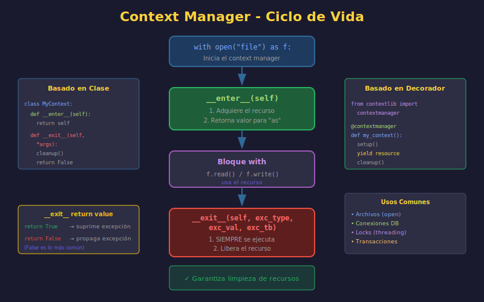

# 🔐 Context Managers en Python

## 🎯 Objetivos de Aprendizaje

- Comprender qué son los context managers y su propósito
- Dominar la sentencia `with`
- Implementar context managers con clases
- Crear context managers con `@contextmanager`
- Aplicar patrones avanzados de gestión de recursos

---

## 1. ¿Qué es un Context Manager?

Un **context manager** es un objeto que define el contexto de ejecución para un bloque de código, manejando automáticamente la inicialización y limpieza de recursos.

### El Problema que Resuelven

```python
# ❌ Sin context manager - propenso a errores
file = open("data.txt", "r", encoding="utf-8")
try:
    content = file.read()
    process(content)
finally:
    file.close()  # ¿Qué pasa si olvidamos esto?

# ✅ Con context manager - limpio y seguro
with open("data.txt", "r", encoding="utf-8") as file:
    content = file.read()
    process(content)
# El archivo se cierra automáticamente, incluso si hay error
```



---

## 2. La Sentencia `with`

### Sintaxis Básica

```python
with context_manager as variable:
    # Código que usa el recurso
    use_resource(variable)
# Recurso liberado automáticamente aquí
```

### Múltiples Context Managers

```python
# Forma 1: Anidados
with open("input.txt", "r", encoding="utf-8") as infile:
    with open("output.txt", "w", encoding="utf-8") as outfile:
        outfile.write(infile.read())

# Forma 2: En una línea (Python 3.1+)
with open("input.txt", "r", encoding="utf-8") as infile, \
     open("output.txt", "w", encoding="utf-8") as outfile:
    outfile.write(infile.read())

# Forma 3: Con paréntesis (Python 3.10+) - ¡Recomendada!
with (
    open("input.txt", "r", encoding="utf-8") as infile,
    open("output.txt", "w", encoding="utf-8") as outfile,
):
    outfile.write(infile.read())
```

---

## 3. El Protocolo de Context Manager

### Métodos Mágicos

Un context manager implementa dos métodos:

| Método | Cuándo se llama | Propósito |
|--------|-----------------|-----------|
| `__enter__` | Al entrar al `with` | Inicializar recurso |
| `__exit__` | Al salir del `with` | Liberar recurso |

```python
# Equivalencia de with
manager = ContextManager()
value = manager.__enter__()
try:
    # Código del bloque with
    use(value)
except Exception as exc:
    # Si __exit__ retorna True, la excepción se suprime
    if not manager.__exit__(type(exc), exc, exc.__traceback__):
        raise
else:
    manager.__exit__(None, None, None)
```

---

## 4. Implementación con Clases

### Ejemplo Básico: Timer

```python
import time
from typing import Self


class Timer:
    """Context manager para medir tiempo de ejecución."""

    def __init__(self, name: str = "Timer"):
        self.name = name
        self.start_time: float = 0
        self.end_time: float = 0
        self.elapsed: float = 0

    def __enter__(self) -> Self:
        """Inicia el timer al entrar al contexto."""
        self.start_time = time.perf_counter()
        return self

    def __exit__(
        self,
        exc_type: type[BaseException] | None,
        exc_val: BaseException | None,
        exc_tb: object
    ) -> bool:
        """
        Detiene el timer al salir del contexto.

        Args:
            exc_type: Tipo de excepción (None si no hubo)
            exc_val: Instancia de excepción
            exc_tb: Traceback

        Returns:
            False para propagar excepciones, True para suprimirlas
        """
        self.end_time = time.perf_counter()
        self.elapsed = self.end_time - self.start_time
        print(f"{self.name}: {self.elapsed:.4f} segundos")
        return False  # No suprimir excepciones


# Uso
with Timer("Procesamiento"):
    data = [x ** 2 for x in range(1_000_000)]
# Output: Procesamiento: 0.0523 segundos
```

### Ejemplo: Conexión a Base de Datos

```python
from typing import Self


class DatabaseConnection:
    """Context manager para conexiones de base de datos."""

    def __init__(self, host: str, database: str):
        self.host = host
        self.database = database
        self._connection = None

    def __enter__(self) -> Self:
        """Establece conexión al entrar."""
        print(f"Conectando a {self.database}@{self.host}...")
        self._connection = self._create_connection()
        return self

    def __exit__(
        self,
        exc_type: type[BaseException] | None,
        exc_val: BaseException | None,
        exc_tb: object
    ) -> bool:
        """Cierra conexión al salir."""
        if self._connection:
            if exc_type:
                print("Error detectado, haciendo rollback...")
                self._connection.rollback()
            else:
                print("Commit exitoso")
                self._connection.commit()

            self._connection.close()
            print("Conexión cerrada")

        return False  # Propagar excepciones

    def _create_connection(self):
        """Crea conexión real (simulado)."""
        # En producción, usar un driver real
        return MockConnection()

    def execute(self, query: str) -> list[dict]:
        """Ejecuta consulta SQL."""
        if not self._connection:
            raise RuntimeError("No hay conexión activa")
        return self._connection.execute(query)


# Uso
with DatabaseConnection("localhost", "mydb") as db:
    users = db.execute("SELECT * FROM users")
    for user in users:
        print(user)
```

### Ejemplo: Archivo con Backup Automático

```python
from pathlib import Path
import shutil
from typing import Self
from datetime import datetime


class SafeFileWriter:
    """
    Context manager que crea backup antes de modificar archivo.
    """

    def __init__(self, file_path: str, backup: bool = True):
        self.file_path = Path(file_path)
        self.backup = backup
        self.backup_path: Path | None = None
        self._file = None

    def __enter__(self) -> Self:
        """Crea backup y abre archivo para escritura."""
        # Crear backup si el archivo existe
        if self.backup and self.file_path.exists():
            timestamp = datetime.now().strftime("%Y%m%d_%H%M%S")
            self.backup_path = self.file_path.with_suffix(
                f".{timestamp}.bak"
            )
            shutil.copy2(self.file_path, self.backup_path)
            print(f"Backup creado: {self.backup_path}")

        # Abrir archivo para escritura
        self._file = open(self.file_path, "w", encoding="utf-8")
        return self

    def __exit__(
        self,
        exc_type: type[BaseException] | None,
        exc_val: BaseException | None,
        exc_tb: object
    ) -> bool:
        """Cierra archivo y restaura backup si hubo error."""
        if self._file:
            self._file.close()

        if exc_type and self.backup_path:
            # Restaurar backup en caso de error
            print(f"Error detectado, restaurando backup...")
            shutil.copy2(self.backup_path, self.file_path)
            print(f"Archivo restaurado desde {self.backup_path}")

        return False

    def write(self, content: str) -> int:
        """Escribe contenido al archivo."""
        if not self._file:
            raise RuntimeError("Archivo no abierto")
        return self._file.write(content)


# Uso
with SafeFileWriter("config.json") as f:
    f.write('{"setting": "new_value"}')
```

---

## 5. Implementación con `@contextmanager`

### El Decorador `@contextmanager`

El módulo `contextlib` proporciona una forma más simple de crear context managers usando generadores.

```python
from contextlib import contextmanager
from typing import Iterator


@contextmanager
def simple_timer(name: str) -> Iterator[None]:
    """Context manager simple para medir tiempo."""
    start = time.perf_counter()
    try:
        yield  # Aquí se ejecuta el bloque with
    finally:
        elapsed = time.perf_counter() - start
        print(f"{name}: {elapsed:.4f}s")


# Uso
with simple_timer("Mi operación"):
    time.sleep(0.5)
# Output: Mi operación: 0.5012s
```

### Anatomía de `@contextmanager`

```python
@contextmanager
def managed_resource(name: str) -> Iterator[Resource]:
    """
    Template de context manager con @contextmanager.
    """
    # SETUP: Código antes de yield (equivale a __enter__)
    print(f"Adquiriendo recurso: {name}")
    resource = acquire_resource(name)

    try:
        yield resource  # El valor después de 'as' en 'with ... as'

    except Exception as e:
        # MANEJO DE ERROR: Opcional
        print(f"Error durante uso de {name}: {e}")
        raise

    finally:
        # CLEANUP: Código después de yield (equivale a __exit__)
        print(f"Liberando recurso: {name}")
        release_resource(resource)
```

### Ejemplos Prácticos

```python
from contextlib import contextmanager
from typing import Iterator
import os


@contextmanager
def temporary_env(key: str, value: str) -> Iterator[None]:
    """
    Establece variable de entorno temporalmente.
    """
    old_value = os.environ.get(key)
    os.environ[key] = value

    try:
        yield
    finally:
        if old_value is None:
            del os.environ[key]
        else:
            os.environ[key] = old_value


# Uso
print(os.environ.get("DEBUG"))  # None
with temporary_env("DEBUG", "true"):
    print(os.environ.get("DEBUG"))  # true
print(os.environ.get("DEBUG"))  # None


@contextmanager
def working_directory(path: str) -> Iterator[Path]:
    """
    Cambia temporalmente el directorio de trabajo.
    """
    original = Path.cwd()
    target = Path(path)

    try:
        os.chdir(target)
        yield target
    finally:
        os.chdir(original)


# Uso
with working_directory("/tmp"):
    print(f"Trabajando en: {Path.cwd()}")
# Automáticamente vuelve al directorio original


@contextmanager
def suppress_output() -> Iterator[None]:
    """Suprime stdout temporalmente."""
    import sys
    from io import StringIO

    old_stdout = sys.stdout
    sys.stdout = StringIO()

    try:
        yield
    finally:
        sys.stdout = old_stdout


# Uso
with suppress_output():
    print("Esto no se verá")
print("Esto sí se verá")
```

---

## 6. Context Managers del Módulo `contextlib`

### `closing()` - Cierre Automático

```python
from contextlib import closing
from urllib.request import urlopen


# Para objetos que tienen close() pero no son context managers
with closing(urlopen("https://python.org")) as page:
    content = page.read()
# page.close() se llama automáticamente
```

### `suppress()` - Suprimir Excepciones

```python
from contextlib import suppress
import os


# Sin suppress
try:
    os.remove("archivo_que_no_existe.txt")
except FileNotFoundError:
    pass

# Con suppress - más limpio
with suppress(FileNotFoundError):
    os.remove("archivo_que_no_existe.txt")
# Si el archivo no existe, no pasa nada


# Múltiples excepciones
with suppress(FileNotFoundError, PermissionError):
    os.remove("archivo.txt")
```

### `redirect_stdout()` / `redirect_stderr()`

```python
from contextlib import redirect_stdout, redirect_stderr
from io import StringIO


# Capturar stdout
output = StringIO()
with redirect_stdout(output):
    print("Esto va al StringIO")
    help(len)

captured = output.getvalue()
print(f"Capturado {len(captured)} caracteres")


# Redirigir a archivo
with open("output.log", "w", encoding="utf-8") as f:
    with redirect_stdout(f):
        print("Esto va al archivo")
```

### `nullcontext()` - Context Manager Nulo

```python
from contextlib import nullcontext


def process_file(path: str | None) -> str:
    """Procesa archivo o usa stdin."""
    if path:
        cm = open(path, "r", encoding="utf-8")
    else:
        cm = nullcontext(sys.stdin)

    with cm as f:
        return f.read()


# Útil para código condicional
debug = False
timer_cm = Timer("debug") if debug else nullcontext()

with timer_cm:
    expensive_operation()
```

### `ExitStack` - Gestión Dinámica

```python
from contextlib import ExitStack


def process_multiple_files(file_paths: list[str]) -> list[str]:
    """Procesa múltiples archivos de forma segura."""
    contents: list[str] = []

    with ExitStack() as stack:
        # Abrir todos los archivos dinámicamente
        files = [
            stack.enter_context(open(path, encoding="utf-8"))
            for path in file_paths
        ]

        # Procesar
        for f in files:
            contents.append(f.read())

    # Todos los archivos se cierran automáticamente
    return contents


# Uso con cleanup callbacks
with ExitStack() as stack:
    # Registrar callback de limpieza
    stack.callback(print, "Limpieza ejecutada")

    # Si algo falla, el callback igual se ejecuta
    risky_operation()
```

---

## 7. Context Managers Asíncronos

### Para código `async`

```python
from contextlib import asynccontextmanager
from typing import AsyncIterator
import asyncio


@asynccontextmanager
async def async_timer(name: str) -> AsyncIterator[None]:
    """Context manager asíncrono para timing."""
    start = asyncio.get_event_loop().time()
    try:
        yield
    finally:
        elapsed = asyncio.get_event_loop().time() - start
        print(f"{name}: {elapsed:.4f}s")


# Uso
async def main():
    async with async_timer("Operación async"):
        await asyncio.sleep(0.5)


# Clase async context manager
class AsyncDatabaseConnection:
    """Conexión asíncrona a base de datos."""

    async def __aenter__(self):
        """Setup asíncrono."""
        await self._connect()
        return self

    async def __aexit__(self, exc_type, exc_val, exc_tb):
        """Cleanup asíncrono."""
        await self._disconnect()
        return False

    async def _connect(self):
        print("Conectando...")
        await asyncio.sleep(0.1)

    async def _disconnect(self):
        print("Desconectando...")
        await asyncio.sleep(0.1)


# Uso
async def query_database():
    async with AsyncDatabaseConnection() as db:
        result = await db.query("SELECT *")
```

---

## 8. Patrones Avanzados

### Composición de Context Managers

```python
from contextlib import contextmanager
from typing import Iterator


@contextmanager
def transaction(connection) -> Iterator[None]:
    """Maneja transacción de base de datos."""
    try:
        yield
        connection.commit()
    except Exception:
        connection.rollback()
        raise


@contextmanager
def logging_context(operation: str) -> Iterator[None]:
    """Añade logging a una operación."""
    logger.info(f"Iniciando: {operation}")
    try:
        yield
        logger.info(f"Completado: {operation}")
    except Exception as e:
        logger.error(f"Error en {operation}: {e}")
        raise


# Composición
with (
    DatabaseConnection("localhost", "mydb") as db,
    transaction(db),
    logging_context("user_update"),
):
    db.execute("UPDATE users SET status = 'active'")
```

### Context Manager Reusable

```python
from contextlib import contextmanager
from typing import Iterator


class ReusableTimer:
    """Timer que puede usarse múltiples veces."""

    def __init__(self):
        self.measurements: list[float] = []

    @contextmanager
    def measure(self, name: str = "") -> Iterator[None]:
        """Mide una operación."""
        start = time.perf_counter()
        try:
            yield
        finally:
            elapsed = time.perf_counter() - start
            self.measurements.append(elapsed)
            if name:
                print(f"{name}: {elapsed:.4f}s")

    @property
    def total(self) -> float:
        """Tiempo total medido."""
        return sum(self.measurements)

    @property
    def average(self) -> float:
        """Promedio de mediciones."""
        if not self.measurements:
            return 0.0
        return self.total / len(self.measurements)


# Uso
timer = ReusableTimer()

with timer.measure("Operación 1"):
    time.sleep(0.1)

with timer.measure("Operación 2"):
    time.sleep(0.2)

print(f"Total: {timer.total:.4f}s")
print(f"Promedio: {timer.average:.4f}s")
```

---

## 9. Buenas Prácticas

### ✅ Hacer

```python
# 1. Usar with para todos los recursos
with open("file.txt", encoding="utf-8") as f:
    content = f.read()

# 2. Preferir @contextmanager para casos simples
@contextmanager
def simple_resource():
    resource = acquire()
    try:
        yield resource
    finally:
        release(resource)

# 3. Siempre usar try/finally en @contextmanager
@contextmanager
def safe_resource():
    resource = acquire()
    try:
        yield resource
    finally:
        release(resource)  # Siempre se ejecuta

# 4. No suprimir excepciones silenciosamente
def __exit__(self, exc_type, exc_val, exc_tb):
    self.cleanup()
    return False  # Propagar excepciones
```

### ❌ Evitar

```python
# 1. NO olvidar finally en @contextmanager
@contextmanager
def leaky_resource():  # ❌
    resource = acquire()
    yield resource
    release(resource)  # No se ejecuta si hay excepción

# 2. NO suprimir excepciones sin motivo
def __exit__(self, exc_type, exc_val, exc_tb):
    return True  # ❌ Suprime TODAS las excepciones

# 3. NO usar recursos fuera del context manager
file = open("data.txt")
with file:  # ❌ file ya abierto fuera del with
    content = file.read()
```

---

## 📚 Resumen

| Enfoque | Cuándo Usar |
|---------|-------------|
| Clase con `__enter__`/`__exit__` | Lógica compleja, estado persistente |
| `@contextmanager` | Casos simples, código más limpio |
| `contextlib` utilities | Casos específicos (suppress, redirect) |
| `ExitStack` | Número dinámico de resources |

---

## ✅ Checklist de Verificación

- [ ] Uso `with` para todos los recursos que lo soporten
- [ ] Implemento `__enter__` y `__exit__` correctamente
- [ ] Uso `try/finally` en `@contextmanager`
- [ ] No suprimo excepciones sin justificación
- [ ] Retorno `False` en `__exit__` para propagar errores
- [ ] Uso `ExitStack` para recursos dinámicos
- [ ] Documento el comportamiento del context manager
