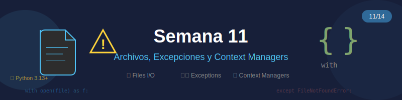

# 🐍 Semana 11: Archivos, Excepciones y Context Managers

<p align="center">
  
</p>

## 🎯 Objetivos de Aprendizaje

Al finalizar esta semana, serás capaz de:

- ✅ Leer y escribir archivos de texto y binarios
- ✅ Trabajar con diferentes encodings (UTF-8, Latin-1, etc.)
- ✅ Manejar excepciones con try/except/finally/else
- ✅ Crear excepciones personalizadas
- ✅ Usar context managers con la sentencia `with`
- ✅ Implementar tus propios context managers
- ✅ Aplicar patrones robustos de manejo de archivos
- ✅ Procesar archivos CSV y JSON

---

## 📚 Requisitos Previos

- ✅ Completar Semana 10 (ABC, Módulos, Paquetes)
- ✅ Dominar clases y objetos
- ✅ Entender decoradores básicos (para context managers)
- ✅ Familiaridad con tipos de datos

---

## 🗂️ Estructura de la Semana

```
week-11/
├── 📖 README.md                 ← Estás aquí
├── 📋 rubrica-evaluacion.md
├── 🎨 0-assets/
│   ├── week-11-header.svg
│   ├── 01-file-operations.svg
│   ├── 02-exception-flow.svg
│   ├── 03-context-manager.svg
│   └── 04-file-patterns.svg
├── 📚 1-teoria/
│   ├── 01-manejo-archivos.md
│   ├── 02-excepciones.md
│   ├── 03-context-managers.md
│   └── 04-patrones-archivos.md
├── 💻 2-ejercicios/
│   ├── 01-lectura-escritura/
│   ├── 02-excepciones-robustas/
│   └── 03-context-managers-custom/
├── 🎯 3-proyecto/
│   ├── README.md
│   ├── starter/
│   └── solution/              # ⚠️ Solo instructores
├── 📂 4-recursos/
│   ├── ebooks-free/
│   ├── videografia/
│   └── webgrafia/
└── 📖 5-glosario/
```

---

## 📝 Contenidos

### 📚 Teoría

| Archivo | Tema | Duración |
|---------|------|----------|
| [01-manejo-archivos.md](1-teoria/01-manejo-archivos.md) | Lectura/escritura de archivos | 30 min |
| [02-excepciones.md](1-teoria/02-excepciones.md) | Sistema de excepciones de Python | 30 min |
| [03-context-managers.md](1-teoria/03-context-managers.md) | Context managers y `with` | 25 min |
| [04-patrones-archivos.md](1-teoria/04-patrones-archivos.md) | Patrones avanzados con archivos | 25 min |

### 💻 Ejercicios

| Ejercicio | Tema | Dificultad |
|-----------|------|------------|
| [01-lectura-escritura](2-ejercicios/01-lectura-escritura/) | Operaciones básicas con archivos | ⭐⭐ |
| [02-excepciones-robustas](2-ejercicios/02-excepciones-robustas/) | Manejo robusto de errores | ⭐⭐⭐ |
| [03-context-managers-custom](2-ejercicios/03-context-managers-custom/) | Crear context managers propios | ⭐⭐⭐ |

### 🎯 Proyecto Semanal

**Sistema de Logs y Análisis de Archivos**

Un sistema completo para:
- Leer y procesar archivos de log
- Manejar errores de forma robusta
- Generar reportes en diferentes formatos
- Usar context managers para recursos

---

## ⏱️ Distribución del Tiempo (6 horas)

| Actividad | Tiempo | Descripción |
|-----------|--------|-------------|
| Teoría | 2h | Lectura y comprensión del material |
| Ejercicios | 2.5h | Práctica guiada |
| Proyecto | 1.5h | Implementación del sistema de logs |

---

## 🔑 Conceptos Clave

### Manejo de Archivos

```python
# Lectura moderna con encoding explícito
with open("data.txt", "r", encoding="utf-8") as file:
    content = file.read()

# Escritura con modo específico
with open("output.txt", "w", encoding="utf-8") as file:
    file.write("Datos procesados\n")

# Lectura línea por línea (eficiente en memoria)
with open("large.txt", encoding="utf-8") as file:
    for line in file:
        process(line.strip())
```

### Excepciones

```python
try:
    result = risky_operation()
except FileNotFoundError as e:
    logger.error(f"Archivo no encontrado: {e}")
except PermissionError:
    logger.error("Sin permisos de acceso")
except Exception as e:
    logger.error(f"Error inesperado: {e}")
    raise
else:
    logger.info("Operación exitosa")
finally:
    cleanup_resources()
```

### Context Managers

```python
from contextlib import contextmanager

@contextmanager
def managed_resource(name: str):
    """Context manager personalizado."""
    resource = acquire_resource(name)
    try:
        yield resource
    finally:
        release_resource(resource)

# Uso
with managed_resource("database") as db:
    db.execute("SELECT * FROM users")
```

---

## 📌 Entregables

1. **Ejercicios completados** (3 ejercicios)
2. **Proyecto funcional** con:
   - Lectura de archivos de log
   - Manejo robusto de excepciones
   - Context managers personalizados
   - Generación de reportes
3. **Cuestionario teórico** sobre excepciones y context managers

---

## 🔗 Navegación

| ← Anterior | Actual | Siguiente → |
|:-----------|:------:|------------:|
| [Semana 10: ABC, Módulos, Paquetes](../week-10/README.md) | **Semana 11** | [Semana 12: Decoradores y Generadores](../week-12/README.md) |

---

## 📚 Recursos Adicionales

- [📖 Python File I/O](https://docs.python.org/3/tutorial/inputoutput.html#reading-and-writing-files)
- [📖 Built-in Exceptions](https://docs.python.org/3/library/exceptions.html)
- [📖 Context Managers](https://docs.python.org/3/reference/datamodel.html#context-managers)
- [📖 contextlib Module](https://docs.python.org/3/library/contextlib.html)

---

<p align="center">
  <strong>Semana 11 de 14</strong> · Bootcamp Python Zero to Hero
</p>
