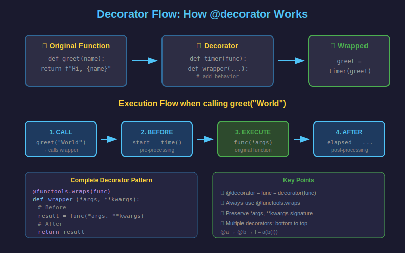

# 🎯 Decoradores en Python

## 1. ¿Qué es un Decorador?

Un **decorador** es una función que modifica el comportamiento de otra función sin cambiar su código fuente. Es una forma elegante de añadir funcionalidad de manera declarativa.



---

## 2. Funciones como Objetos de Primera Clase

En Python, las funciones son objetos que pueden:

```python
# 1. Asignarse a variables
def greet(name: str) -> str:
    return f"Hello, {name}!"

say_hello = greet  # Asignar función a variable
print(say_hello("World"))  # Hello, World!


# 2. Pasarse como argumentos
def apply_twice(func, value):
    return func(func(value))

def add_exclamation(text: str) -> str:
    return text + "!"

result = apply_twice(add_exclamation, "Hi")
print(result)  # Hi!!


# 3. Retornarse desde otras funciones
def create_multiplier(n: int):
    def multiplier(x: int) -> int:
        return x * n
    return multiplier

double = create_multiplier(2)
print(double(5))  # 10
```

---

## 3. Closures: La Base de los Decoradores

Un **closure** es una función que "recuerda" las variables del scope donde fue creada.

```python
def outer_function(message: str):
    """La función exterior define una variable."""

    def inner_function():
        """La función interior captura 'message'."""
        print(message)  # Accede a variable del scope exterior

    return inner_function

# El closure "recuerda" el mensaje
my_func = outer_function("Hello from closure!")
my_func()  # Hello from closure!

# Cada closure tiene su propio "recuerdo"
greet_spanish = outer_function("¡Hola!")
greet_english = outer_function("Hello!")

greet_spanish()  # ¡Hola!
greet_english()  # Hello!
```

---

## 4. Tu Primer Decorador

Un decorador básico envuelve una función:

```python
def my_decorator(func):
    """Decorador que imprime antes y después."""
    def wrapper():
        print("Before the function")
        func()
        print("After the function")
    return wrapper

# Sin azúcar sintáctico
def say_hello():
    print("Hello!")

say_hello = my_decorator(say_hello)
say_hello()
# Before the function
# Hello!
# After the function


# Con azúcar sintáctico (@)
@my_decorator
def say_goodbye():
    print("Goodbye!")

say_goodbye()
# Before the function
# Goodbye!
# After the function
```

---

## 5. Decoradores con Argumentos de Función

Para manejar funciones con argumentos, usa `*args` y `**kwargs`:

```python
from typing import Callable, Any

def log_call(func: Callable) -> Callable:
    """Registra cada llamada a la función."""
    def wrapper(*args, **kwargs) -> Any:
        print(f"Calling {func.__name__} with args={args}, kwargs={kwargs}")
        result = func(*args, **kwargs)
        print(f"{func.__name__} returned {result}")
        return result
    return wrapper

@log_call
def add(a: int, b: int) -> int:
    return a + b

@log_call
def greet(name: str, greeting: str = "Hello") -> str:
    return f"{greeting}, {name}!"

add(3, 5)
# Calling add with args=(3, 5), kwargs={}
# add returned 8

greet("Alice", greeting="Hi")
# Calling greet with args=('Alice',), kwargs={'greeting': 'Hi'}
# greet returned Hi, Alice!
```

---

## 6. Preservar Metadata con `@functools.wraps`

Sin `@wraps`, el decorador oculta la información de la función original:

```python
import functools
from typing import Callable, ParamSpec, TypeVar

P = ParamSpec("P")
R = TypeVar("R")

# ❌ SIN @wraps - pierde metadata
def bad_decorator(func):
    def wrapper(*args, **kwargs):
        return func(*args, **kwargs)
    return wrapper

@bad_decorator
def my_function():
    """This is my function."""
    pass

print(my_function.__name__)  # wrapper  ❌
print(my_function.__doc__)   # None     ❌


# ✅ CON @wraps - preserva metadata
def good_decorator(func: Callable[P, R]) -> Callable[P, R]:
    @functools.wraps(func)
    def wrapper(*args: P.args, **kwargs: P.kwargs) -> R:
        return func(*args, **kwargs)
    return wrapper

@good_decorator
def my_function():
    """This is my function."""
    pass

print(my_function.__name__)  # my_function  ✅
print(my_function.__doc__)   # This is my function.  ✅
```

---

## 7. Decoradores Prácticos

### Timer: Medir tiempo de ejecución

```python
import functools
import time
from typing import Callable, ParamSpec, TypeVar

P = ParamSpec("P")
R = TypeVar("R")

def timer(func: Callable[P, R]) -> Callable[P, R]:
    """Mide el tiempo de ejecución."""
    @functools.wraps(func)
    def wrapper(*args: P.args, **kwargs: P.kwargs) -> R:
        start = time.perf_counter()
        result = func(*args, **kwargs)
        elapsed = time.perf_counter() - start
        print(f"⏱️ {func.__name__} took {elapsed:.4f}s")
        return result
    return wrapper

@timer
def slow_sum(n: int) -> int:
    """Suma números del 1 al n (lento)."""
    return sum(range(n + 1))

slow_sum(1_000_000)
# ⏱️ slow_sum took 0.0234s
```

### Retry: Reintentar en caso de error

```python
import functools
import time
from typing import Callable, ParamSpec, TypeVar

P = ParamSpec("P")
R = TypeVar("R")

def retry(max_attempts: int = 3, delay: float = 1.0):
    """Reintenta la función si falla."""
    def decorator(func: Callable[P, R]) -> Callable[P, R]:
        @functools.wraps(func)
        def wrapper(*args: P.args, **kwargs: P.kwargs) -> R:
            last_exception = None
            for attempt in range(1, max_attempts + 1):
                try:
                    return func(*args, **kwargs)
                except Exception as e:
                    last_exception = e
                    print(f"Attempt {attempt} failed: {e}")
                    if attempt < max_attempts:
                        time.sleep(delay)
            raise last_exception
        return wrapper
    return decorator

@retry(max_attempts=3, delay=0.5)
def unstable_operation() -> str:
    import random
    if random.random() < 0.7:
        raise ConnectionError("Network error")
    return "Success!"
```

### Cache: Memorización de resultados

```python
import functools

# Python 3.9+ tiene @functools.cache
@functools.cache
def fibonacci(n: int) -> int:
    """Calcula Fibonacci con cache."""
    if n < 2:
        return n
    return fibonacci(n - 1) + fibonacci(n - 2)

# Sin cache: muy lento para n grande
# Con cache: instantáneo
print(fibonacci(100))  # 354224848179261915075
```

---

## 8. Decoradores con Argumentos

Para crear decoradores que acepten argumentos, necesitas una función extra:

```python
import functools
from typing import Callable, ParamSpec, TypeVar

P = ParamSpec("P")
R = TypeVar("R")

def repeat(times: int):
    """Decorador que repite la ejecución n veces."""
    def decorator(func: Callable[P, R]) -> Callable[P, list[R]]:
        @functools.wraps(func)
        def wrapper(*args: P.args, **kwargs: P.kwargs) -> list[R]:
            results = []
            for _ in range(times):
                results.append(func(*args, **kwargs))
            return results
        return wrapper
    return decorator

@repeat(times=3)
def say_hello(name: str) -> str:
    return f"Hello, {name}!"

print(say_hello("World"))
# ['Hello, World!', 'Hello, World!', 'Hello, World!']
```

### Decorador de validación con argumentos

```python
import functools
from typing import Callable, Any

def validate_types(**expected_types):
    """Valida tipos de argumentos."""
    def decorator(func: Callable) -> Callable:
        @functools.wraps(func)
        def wrapper(*args, **kwargs) -> Any:
            # Obtener nombres de parámetros
            import inspect
            sig = inspect.signature(func)
            bound = sig.bind(*args, **kwargs)

            # Validar cada argumento
            for param, expected in expected_types.items():
                if param in bound.arguments:
                    value = bound.arguments[param]
                    if not isinstance(value, expected):
                        raise TypeError(
                            f"{param} must be {expected.__name__}, "
                            f"got {type(value).__name__}"
                        )

            return func(*args, **kwargs)
        return wrapper
    return decorator

@validate_types(name=str, age=int)
def create_user(name: str, age: int) -> dict:
    return {"name": name, "age": age}

create_user("Alice", 30)    # ✅ OK
create_user("Bob", "30")    # ❌ TypeError: age must be int, got str
```

---

## 9. Decoradores de Clase

Los decoradores también pueden aplicarse a clases:

```python
import functools
from dataclasses import dataclass

# @dataclass es un decorador de clase built-in
@dataclass
class Point:
    x: float
    y: float

# Decorador de clase personalizado
def singleton(cls):
    """Asegura que solo exista una instancia."""
    instances = {}

    @functools.wraps(cls)
    def get_instance(*args, **kwargs):
        if cls not in instances:
            instances[cls] = cls(*args, **kwargs)
        return instances[cls]

    return get_instance

@singleton
class Database:
    def __init__(self, host: str):
        self.host = host
        print(f"Connecting to {host}")

db1 = Database("localhost")  # Connecting to localhost
db2 = Database("other_host")  # No imprime nada

print(db1 is db2)  # True - misma instancia
```

---

## 10. Múltiples Decoradores

Los decoradores se aplican de abajo hacia arriba:

```python
@decorator_a
@decorator_b
@decorator_c
def my_function():
    pass

# Equivalente a:
my_function = decorator_a(decorator_b(decorator_c(my_function)))
```

```python
import functools

def bold(func):
    @functools.wraps(func)
    def wrapper(*args, **kwargs):
        return f"<b>{func(*args, **kwargs)}</b>"
    return wrapper

def italic(func):
    @functools.wraps(func)
    def wrapper(*args, **kwargs):
        return f"<i>{func(*args, **kwargs)}</i>"
    return wrapper

@bold
@italic
def greet(name: str) -> str:
    return f"Hello, {name}"

print(greet("World"))  # <b><i>Hello, World</i></b>
```

---

## 📚 Resumen

| Concepto | Descripción |
|----------|-------------|
| Decorador | Función que modifica otra función |
| Closure | Función que captura variables del scope exterior |
| `@functools.wraps` | Preserva metadata de la función original |
| Decorador con args | Requiere función factory que retorna el decorador |
| Múltiples decoradores | Se aplican de abajo hacia arriba |

---

## ✅ Checklist

- [ ] Entiendo que las funciones son objetos de primera clase
- [ ] Puedo crear un closure que capture variables
- [ ] Sé crear decoradores básicos con `@syntax`
- [ ] Uso `@functools.wraps` siempre
- [ ] Puedo crear decoradores con argumentos
- [ ] Entiendo el orden de múltiples decoradores
