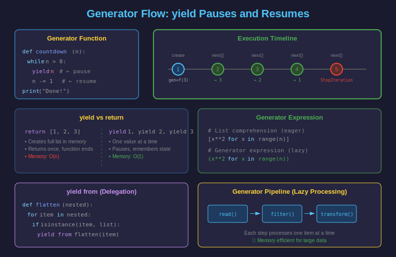

# 🔄 Generadores en Python

## 1. ¿Qué es un Generador?

Un **generador** es una función que produce una secuencia de valores bajo demanda usando `yield` en lugar de `return`. Esto permite procesar datos de manera **lazy** (perezosa), ahorrando memoria.



---

## 2. Tu Primer Generador

```python
# Función normal - retorna todo de una vez
def get_numbers_list(n: int) -> list[int]:
    """Retorna lista de números (usa memoria)."""
    result = []
    for i in range(n):
        result.append(i)
    return result

# Generador - produce uno a uno
def get_numbers_gen(n: int):
    """Genera números uno a uno (lazy)."""
    for i in range(n):
        yield i  # Pausa y produce valor

# Uso
numbers = get_numbers_gen(5)
print(numbers)        # <generator object get_numbers_gen at 0x...>
print(next(numbers))  # 0
print(next(numbers))  # 1
print(next(numbers))  # 2

# Iterar el resto
for num in numbers:
    print(num)  # 3, 4
```

---

## 3. `yield` vs `return`

| `return` | `yield` |
|----------|---------|
| Termina la función | Pausa la función |
| Retorna un valor | Produce un valor |
| Ejecuta todo de inmediato | Ejecuta bajo demanda (lazy) |
| Almacena todo en memoria | Genera uno a uno |

```python
def with_return():
    print("Start")
    return [1, 2, 3]
    print("End")  # Nunca se ejecuta

def with_yield():
    print("Start")
    yield 1
    print("After 1")
    yield 2
    print("After 2")
    yield 3
    print("End")

# return: ejecuta todo inmediatamente
result = with_return()  # Imprime: Start
print(result)           # [1, 2, 3]

# yield: ejecuta paso a paso
gen = with_yield()      # No imprime nada todavía
print(next(gen))        # Start -> 1
print(next(gen))        # After 1 -> 2
print(next(gen))        # After 2 -> 3
# Si llamamos next() otra vez:
# print(next(gen))      # End -> StopIteration
```

---

## 4. Type Hints para Generadores

```python
from typing import Iterator, Generator

# Forma simple - solo indica qué produce
def countdown(n: int) -> Iterator[int]:
    """Cuenta regresiva desde n."""
    while n > 0:
        yield n
        n -= 1

# Forma completa - indica yield, send y return
def echo() -> Generator[str, str, None]:
    """
    Generator[YieldType, SendType, ReturnType]
    - YieldType: lo que produce
    - SendType: lo que recibe con send()
    - ReturnType: lo que retorna al terminar
    """
    received = yield "Ready"
    yield f"Echo: {received}"
```

---

## 5. Generadores para Datos Grandes

Los generadores son ideales para procesar archivos grandes:

```python
from typing import Iterator

def read_large_file(path: str) -> Iterator[str]:
    """Lee archivo línea por línea sin cargar todo en memoria."""
    with open(path, "r", encoding="utf-8") as f:
        for line in f:
            yield line.strip()

def filter_errors(lines: Iterator[str]) -> Iterator[str]:
    """Filtra solo líneas con ERROR."""
    for line in lines:
        if "ERROR" in line:
            yield line

def extract_timestamps(lines: Iterator[str]) -> Iterator[str]:
    """Extrae timestamps de las líneas."""
    for line in lines:
        # Asume formato: "2024-01-15 10:30:45 - ERROR - ..."
        yield line[:19]

# Pipeline de generadores - procesa archivos de cualquier tamaño
# sin cargar todo en memoria
lines = read_large_file("huge_log.txt")
errors = filter_errors(lines)
timestamps = extract_timestamps(errors)

for ts in timestamps:
    print(ts)
```

---

## 6. Expresiones Generadoras

Una forma compacta de crear generadores (similar a list comprehension):

```python
# List comprehension - crea lista en memoria
squares_list = [x**2 for x in range(1_000_000)]
print(type(squares_list))  # <class 'list'>
# Usa ~8MB de memoria

# Generator expression - crea generador
squares_gen = (x**2 for x in range(1_000_000))
print(type(squares_gen))  # <class 'generator'>
# Usa ~120 bytes

# Uso idéntico
for square in squares_gen:
    if square > 100:
        print(square)
        break

# Convertir generador a lista (si es necesario)
small_squares = list(x**2 for x in range(10))
```

### Expresiones generadoras en funciones

```python
# sum() acepta iterables, incluyendo generadores
total = sum(x**2 for x in range(1000))

# any() y all() con generadores
numbers = [1, 2, 3, 4, 5]
has_even = any(n % 2 == 0 for n in numbers)  # True
all_positive = all(n > 0 for n in numbers)   # True

# max() y min()
max_square = max(x**2 for x in range(100))  # 9801
```

---

## 7. `yield from`: Delegación

`yield from` permite delegar a otro iterador:

```python
from typing import Iterator

# Sin yield from - repetitivo
def chain_manual(*iterables) -> Iterator:
    for iterable in iterables:
        for item in iterable:
            yield item

# Con yield from - elegante
def chain(*iterables) -> Iterator:
    for iterable in iterables:
        yield from iterable

# Uso
result = list(chain([1, 2], [3, 4], [5, 6]))
print(result)  # [1, 2, 3, 4, 5, 6]


# Ejemplo: aplanar lista anidada
def flatten(nested: list) -> Iterator:
    """Aplana lista anidada de cualquier profundidad."""
    for item in nested:
        if isinstance(item, list):
            yield from flatten(item)  # Recursión con yield from
        else:
            yield item

nested = [1, [2, 3, [4, 5]], 6, [7, [8, [9]]]]
print(list(flatten(nested)))  # [1, 2, 3, 4, 5, 6, 7, 8, 9]
```

---

## 8. Generadores Infinitos

Los generadores pueden producir secuencias infinitas:

```python
from typing import Iterator

def infinite_counter(start: int = 0) -> Iterator[int]:
    """Contador infinito."""
    n = start
    while True:
        yield n
        n += 1

def fibonacci() -> Iterator[int]:
    """Secuencia infinita de Fibonacci."""
    a, b = 0, 1
    while True:
        yield a
        a, b = b, a + b

def cycle(iterable) -> Iterator:
    """Repite iterable infinitamente."""
    saved = list(iterable)
    while saved:
        yield from saved

# Usar con control
counter = infinite_counter()
for i, num in enumerate(counter):
    if i >= 5:
        break
    print(num)  # 0, 1, 2, 3, 4

# Fibonacci: primeros 10 números
fib = fibonacci()
for _ in range(10):
    print(next(fib), end=" ")  # 0 1 1 2 3 5 8 13 21 34
```

---

## 9. Estados del Generador

Un generador tiene varios estados:

```python
import inspect

def simple_gen():
    yield 1
    yield 2

gen = simple_gen()

# Estado: GEN_CREATED (creado, no iniciado)
print(inspect.getgeneratorstate(gen))  # GEN_CREATED

next(gen)  # Consume primer valor
# Estado: GEN_SUSPENDED (pausado en yield)
print(inspect.getgeneratorstate(gen))  # GEN_SUSPENDED

next(gen)  # Consume segundo valor
# Todavía suspendido después del último yield
print(inspect.getgeneratorstate(gen))  # GEN_SUSPENDED

try:
    next(gen)  # No hay más valores
except StopIteration:
    pass

# Estado: GEN_CLOSED (terminado)
print(inspect.getgeneratorstate(gen))  # GEN_CLOSED
```

---

## 10. Métodos de Generadores

### `send()`: Enviar valores al generador

```python
def accumulator():
    """Acumulador que recibe valores."""
    total = 0
    while True:
        value = yield total
        if value is not None:
            total += value

acc = accumulator()
print(next(acc))      # 0 (iniciar generador)
print(acc.send(10))   # 10
print(acc.send(5))    # 15
print(acc.send(3))    # 18
```

### `throw()`: Lanzar excepción en el generador

```python
def gen_with_cleanup():
    try:
        yield 1
        yield 2
        yield 3
    except ValueError:
        print("Caught ValueError!")
        yield "recovered"

gen = gen_with_cleanup()
print(next(gen))  # 1
print(gen.throw(ValueError, "Test error"))  # Caught ValueError! -> recovered
```

### `close()`: Cerrar el generador

```python
def gen_with_finally():
    try:
        yield 1
        yield 2
    finally:
        print("Cleanup!")

gen = gen_with_finally()
print(next(gen))  # 1
gen.close()       # Cleanup!
```

---

## 11. Pipeline de Generadores

Encadenar generadores para procesamiento eficiente:

```python
from typing import Iterator
import re

def read_lines(path: str) -> Iterator[str]:
    """Lee líneas de archivo."""
    with open(path, encoding="utf-8") as f:
        for line in f:
            yield line

def strip_lines(lines: Iterator[str]) -> Iterator[str]:
    """Elimina espacios en blanco."""
    for line in lines:
        yield line.strip()

def filter_non_empty(lines: Iterator[str]) -> Iterator[str]:
    """Filtra líneas vacías."""
    for line in lines:
        if line:
            yield line

def filter_comments(lines: Iterator[str]) -> Iterator[str]:
    """Filtra comentarios."""
    for line in lines:
        if not line.startswith("#"):
            yield line

def parse_config(path: str) -> Iterator[tuple[str, str]]:
    """Parse archivo de configuración."""
    lines = read_lines(path)
    lines = strip_lines(lines)
    lines = filter_non_empty(lines)
    lines = filter_comments(lines)

    for line in lines:
        if "=" in line:
            key, value = line.split("=", 1)
            yield key.strip(), value.strip()

# Uso - procesa archivo de cualquier tamaño eficientemente
for key, value in parse_config("config.ini"):
    print(f"{key} = {value}")
```

---

## 📚 Resumen

| Concepto | Descripción |
|----------|-------------|
| `yield` | Produce valor y pausa el generador |
| `yield from` | Delega a otro iterador |
| Generator expression | `(x for x in iterable)` |
| `next()` | Obtiene siguiente valor |
| `send()` | Envía valor al generador |
| Pipeline | Encadenar generadores |

---

## ✅ Checklist

- [ ] Entiendo la diferencia entre `yield` y `return`
- [ ] Puedo crear generadores para datos grandes
- [ ] Uso expresiones generadoras cuando es apropiado
- [ ] Entiendo `yield from` para delegación
- [ ] Puedo crear pipelines de generadores
- [ ] Sé usar `send()`, `throw()` y `close()`
