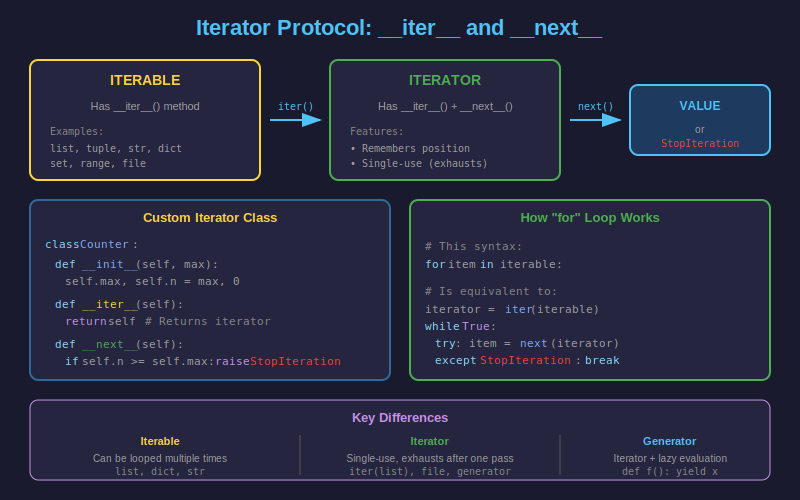

# 🔁 Iteradores en Python

## 1. ¿Qué es un Iterador?

Un **iterador** es un objeto que implementa el protocolo de iteración:
- `__iter__()`: Retorna el iterador mismo
- `__next__()`: Retorna el siguiente elemento o lanza `StopIteration`



---

## 2. Iterable vs Iterador

| Iterable | Iterador |
|----------|----------|
| Tiene `__iter__()` | Tiene `__iter__()` y `__next__()` |
| Puede iterarse múltiples veces | Solo una vez (se agota) |
| Ejemplos: `list`, `str`, `dict` | Resultado de `iter()`, generadores |

```python
# Lista es ITERABLE
my_list = [1, 2, 3]
print(hasattr(my_list, "__iter__"))  # True
print(hasattr(my_list, "__next__"))  # False

# Obtener ITERADOR de la lista
my_iterator = iter(my_list)
print(hasattr(my_iterator, "__iter__"))  # True
print(hasattr(my_iterator, "__next__"))  # True

# Usar el iterador
print(next(my_iterator))  # 1
print(next(my_iterator))  # 2
print(next(my_iterator))  # 3
# print(next(my_iterator))  # StopIteration!

# La lista sigue intacta - crear nuevo iterador
for item in my_list:
    print(item)  # 1, 2, 3
```

---

## 3. Cómo Funciona `for`

El bucle `for` usa el protocolo de iteración internamente:

```python
# Esto:
for item in [1, 2, 3]:
    print(item)

# Es equivalente a:
iterator = iter([1, 2, 3])
while True:
    try:
        item = next(iterator)
        print(item)
    except StopIteration:
        break
```

---

## 4. Crear un Iterador Personalizado

```python
from typing import Self

class Countdown:
    """Iterador de cuenta regresiva."""

    def __init__(self, start: int):
        self.current = start

    def __iter__(self) -> Self:
        """Retorna el iterador (sí mismo)."""
        return self

    def __next__(self) -> int:
        """Retorna siguiente valor o StopIteration."""
        if self.current <= 0:
            raise StopIteration

        value = self.current
        self.current -= 1
        return value

# Uso
for num in Countdown(5):
    print(num)  # 5, 4, 3, 2, 1

# También funciona con list(), sum(), etc.
numbers = list(Countdown(3))
print(numbers)  # [3, 2, 1]
```

---

## 5. Clase Iterable con Iterador Separado

Para permitir múltiples iteraciones, separa el iterable del iterador:

```python
from typing import Self

class Range:
    """Versión simplificada de range()."""

    def __init__(self, start: int, stop: int, step: int = 1):
        self.start = start
        self.stop = stop
        self.step = step

    def __iter__(self) -> "RangeIterator":
        """Crea nuevo iterador cada vez."""
        return RangeIterator(self.start, self.stop, self.step)


class RangeIterator:
    """Iterador para Range."""

    def __init__(self, start: int, stop: int, step: int):
        self.current = start
        self.stop = stop
        self.step = step

    def __iter__(self) -> Self:
        return self

    def __next__(self) -> int:
        if self.current >= self.stop:
            raise StopIteration

        value = self.current
        self.current += self.step
        return value


# Puede iterarse múltiples veces
my_range = Range(1, 5, 1)

print("Primera iteración:")
for n in my_range:
    print(n)  # 1, 2, 3, 4

print("Segunda iteración:")
for n in my_range:
    print(n)  # 1, 2, 3, 4
```

---

## 6. Iterador con Generador (Más Simple)

Usar `yield` simplifica la creación de iteradores:

```python
from typing import Iterator

class EvenNumbers:
    """Números pares hasta un límite."""

    def __init__(self, limit: int):
        self.limit = limit

    def __iter__(self) -> Iterator[int]:
        """Usar generador como iterador."""
        for n in range(0, self.limit, 2):
            yield n

# Uso
evens = EvenNumbers(10)

for n in evens:
    print(n)  # 0, 2, 4, 6, 8

# Puede iterarse múltiples veces
print(list(evens))  # [0, 2, 4, 6, 8]
```

---

## 7. El Módulo `itertools`

`itertools` proporciona iteradores eficientes para operaciones comunes:

### Iteradores Infinitos

```python
import itertools

# count(start, step) - contador infinito
counter = itertools.count(10, 2)
print([next(counter) for _ in range(5)])  # [10, 12, 14, 16, 18]

# cycle(iterable) - repite infinitamente
colors = itertools.cycle(["red", "green", "blue"])
print([next(colors) for _ in range(7)])
# ['red', 'green', 'blue', 'red', 'green', 'blue', 'red']

# repeat(value, times) - repite un valor
ones = itertools.repeat(1, 5)
print(list(ones))  # [1, 1, 1, 1, 1]
```

### Combinaciones y Permutaciones

```python
import itertools

# permutations - ordenaciones posibles
perms = itertools.permutations([1, 2, 3])
print(list(perms))
# [(1, 2, 3), (1, 3, 2), (2, 1, 3), (2, 3, 1), (3, 1, 2), (3, 2, 1)]

# combinations - subconjuntos sin repetición
combs = itertools.combinations([1, 2, 3, 4], 2)
print(list(combs))
# [(1, 2), (1, 3), (1, 4), (2, 3), (2, 4), (3, 4)]

# product - producto cartesiano
prod = itertools.product([1, 2], ["a", "b"])
print(list(prod))
# [(1, 'a'), (1, 'b'), (2, 'a'), (2, 'b')]
```

### Filtrado y Agrupación

```python
import itertools

# takewhile - toma mientras condición sea True
numbers = [1, 3, 5, 2, 4, 6]
result = itertools.takewhile(lambda x: x < 5, numbers)
print(list(result))  # [1, 3]

# dropwhile - descarta mientras condición sea True
result = itertools.dropwhile(lambda x: x < 5, numbers)
print(list(result))  # [5, 2, 4, 6]

# filterfalse - opuesto de filter()
result = itertools.filterfalse(lambda x: x % 2, range(10))
print(list(result))  # [0, 2, 4, 6, 8]

# groupby - agrupa elementos consecutivos
data = [("a", 1), ("a", 2), ("b", 3), ("b", 4), ("a", 5)]
for key, group in itertools.groupby(data, key=lambda x: x[0]):
    print(f"{key}: {list(group)}")
# a: [('a', 1), ('a', 2)]
# b: [('b', 3), ('b', 4)]
# a: [('a', 5)]
```

### Encadenamiento

```python
import itertools

# chain - concatena iterables
result = itertools.chain([1, 2], [3, 4], [5, 6])
print(list(result))  # [1, 2, 3, 4, 5, 6]

# chain.from_iterable - para iterable de iterables
nested = [[1, 2], [3, 4], [5, 6]]
result = itertools.chain.from_iterable(nested)
print(list(result))  # [1, 2, 3, 4, 5, 6]

# zip_longest - como zip pero completa con fillvalue
a = [1, 2, 3]
b = ["a", "b"]
result = itertools.zip_longest(a, b, fillvalue="-")
print(list(result))  # [(1, 'a'), (2, 'b'), (3, '-')]
```

### Acumulación

```python
import itertools
import operator

# accumulate - acumulador (como reduce pero retorna intermedios)
numbers = [1, 2, 3, 4, 5]

# Suma acumulativa
result = itertools.accumulate(numbers)
print(list(result))  # [1, 3, 6, 10, 15]

# Producto acumulativo
result = itertools.accumulate(numbers, operator.mul)
print(list(result))  # [1, 2, 6, 24, 120]

# Máximo acumulativo
result = itertools.accumulate(numbers, max)
print(list(result))  # [1, 2, 3, 4, 5]
```

---

## 8. Recetas Útiles con Itertools

```python
import itertools
from typing import Iterator, TypeVar

T = TypeVar("T")

def take(n: int, iterable: Iterator[T]) -> list[T]:
    """Toma los primeros n elementos."""
    return list(itertools.islice(iterable, n))

def nth(iterable: Iterator[T], n: int, default: T = None) -> T:
    """Obtiene el n-ésimo elemento."""
    return next(itertools.islice(iterable, n, None), default)

def chunked(iterable, size: int) -> Iterator[list]:
    """Divide iterable en chunks de tamaño fijo."""
    iterator = iter(iterable)
    while chunk := list(itertools.islice(iterator, size)):
        yield chunk

def pairwise(iterable: Iterator[T]) -> Iterator[tuple[T, T]]:
    """Retorna pares consecutivos: (1,2), (2,3), (3,4)..."""
    a, b = itertools.tee(iterable)
    next(b, None)
    return zip(a, b)

# Uso
numbers = range(10)
print(take(3, iter(numbers)))  # [0, 1, 2]

data = list(range(10))
print(list(chunked(data, 3)))  # [[0,1,2], [3,4,5], [6,7,8], [9]]

print(list(pairwise([1, 2, 3, 4])))  # [(1,2), (2,3), (3,4)]
```

---

## 📚 Resumen

| Concepto | Descripción |
|----------|-------------|
| Iterable | Objeto con `__iter__()` |
| Iterador | Objeto con `__iter__()` y `__next__()` |
| `iter()` | Obtiene iterador de un iterable |
| `next()` | Obtiene siguiente valor del iterador |
| `StopIteration` | Señala fin de la iteración |
| `itertools` | Módulo con iteradores eficientes |

---

## ✅ Checklist

- [ ] Distingo entre iterable e iterador
- [ ] Puedo crear iteradores con `__iter__` y `__next__`
- [ ] Uso generadores para simplificar iteradores
- [ ] Conozco `itertools.count`, `cycle`, `repeat`
- [ ] Puedo usar `itertools.chain`, `islice`, `groupby`
- [ ] Entiendo `permutations` y `combinations`
