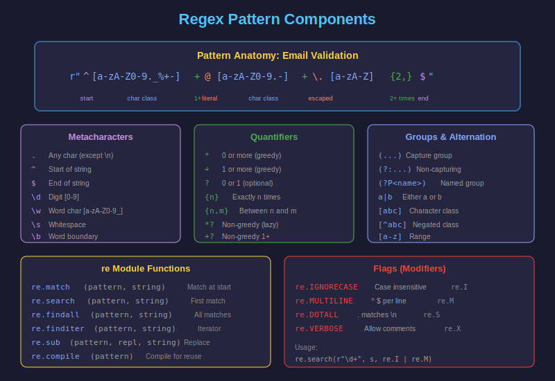

# 🔍 Expresiones Regulares en Python

## 1. ¿Qué son las Expresiones Regulares?

Las **expresiones regulares** (regex) son patrones para buscar, validar y manipular texto. Python las proporciona a través del módulo `re`.



---

## 2. Importar el Módulo `re`

```python
import re

# Búsqueda simple
text = "Hello, World!"
if re.search(r"World", text):
    print("Found!")  # Found!
```

> 💡 **Siempre usa raw strings** (`r"..."`) para patrones regex para evitar problemas con backslashes.

---

## 3. Funciones Principales de `re`

| Función | Descripción |
|---------|-------------|
| `re.match()` | Busca al **inicio** del string |
| `re.search()` | Busca en **cualquier parte** |
| `re.findall()` | Encuentra **todas** las coincidencias |
| `re.finditer()` | Iterador de coincidencias |
| `re.sub()` | **Reemplaza** coincidencias |
| `re.split()` | **Divide** por patrón |
| `re.compile()` | **Compila** patrón para reusar |

```python
import re

text = "The cat sat on the mat"

# match - solo al inicio
print(re.match(r"The", text))   # <Match object>
print(re.match(r"cat", text))   # None (no está al inicio)

# search - en cualquier parte
print(re.search(r"cat", text))  # <Match object>

# findall - todas las coincidencias
print(re.findall(r"at", text))  # ['at', 'at', 'at']

# sub - reemplazar
print(re.sub(r"cat", "dog", text))  # "The dog sat on the mat"

# split - dividir
print(re.split(r"\s+", text))  # ['The', 'cat', 'sat', 'on', 'the', 'mat']
```

---

## 4. Metacaracteres Básicos

### Caracteres Especiales

| Patrón | Significado | Ejemplo |
|--------|-------------|---------|
| `.` | Cualquier carácter (excepto `\n`) | `a.c` → "abc", "a1c" |
| `^` | Inicio del string | `^Hello` |
| `$` | Fin del string | `world$` |
| `\` | Escapa caracteres especiales | `\.` → "." literal |

```python
import re

# . - cualquier carácter
print(re.findall(r"a.c", "abc a1c a c"))  # ['abc', 'a1c', 'a c']

# ^ - inicio
print(re.search(r"^Hello", "Hello World"))  # Match
print(re.search(r"^World", "Hello World"))  # None

# $ - fin
print(re.search(r"World$", "Hello World"))  # Match
print(re.search(r"Hello$", "Hello World"))  # None

# \ - escapar
print(re.findall(r"\.", "a.b.c"))  # ['.', '.']
```

### Clases de Caracteres

| Patrón | Significado |
|--------|-------------|
| `\d` | Dígito `[0-9]` |
| `\D` | No dígito `[^0-9]` |
| `\w` | Word char `[a-zA-Z0-9_]` |
| `\W` | No word char |
| `\s` | Whitespace `[ \t\n\r\f\v]` |
| `\S` | No whitespace |

```python
import re

text = "Phone: 555-1234, Code: ABC123"

# \d - dígitos
print(re.findall(r"\d", text))     # ['5', '5', '5', '1', '2', '3', '4', '1', '2', '3']
print(re.findall(r"\d+", text))    # ['555', '1234', '123']

# \w - word characters
print(re.findall(r"\w+", text))    # ['Phone', '555', '1234', 'Code', 'ABC123']

# \s - espacios
print(re.split(r"\s+", text))      # ['Phone:', '555-1234,', 'Code:', 'ABC123']
```

### Conjuntos de Caracteres `[...]`

```python
import re

# [abc] - cualquiera de a, b, c
print(re.findall(r"[aeiou]", "hello world"))  # ['e', 'o', 'o']

# [a-z] - rango de a hasta z
print(re.findall(r"[a-z]+", "Hello World"))   # ['ello', 'orld']

# [^abc] - cualquiera EXCEPTO a, b, c
print(re.findall(r"[^aeiou]+", "hello"))      # ['h', 'll']

# Múltiples rangos
print(re.findall(r"[a-zA-Z0-9]+", "User_123!"))  # ['User', '123']
```

---

## 5. Cuantificadores

| Patrón | Significado |
|--------|-------------|
| `*` | 0 o más |
| `+` | 1 o más |
| `?` | 0 o 1 |
| `{n}` | Exactamente n |
| `{n,}` | n o más |
| `{n,m}` | Entre n y m |

```python
import re

# * - 0 o más
print(re.findall(r"ab*c", "ac abc abbc"))     # ['ac', 'abc', 'abbc']

# + - 1 o más
print(re.findall(r"ab+c", "ac abc abbc"))     # ['abc', 'abbc']

# ? - 0 o 1
print(re.findall(r"colou?r", "color colour")) # ['color', 'colour']

# {n} - exactamente n
print(re.findall(r"\d{3}", "12 123 1234"))    # ['123', '123']

# {n,m} - entre n y m
print(re.findall(r"\d{2,4}", "1 12 123 1234 12345"))  # ['12', '123', '1234', '1234']
```

### Greedy vs Non-Greedy

Por defecto, los cuantificadores son **greedy** (toman lo máximo posible). Usa `?` después para hacerlos **non-greedy**:

```python
import re

html = "<div>Hello</div><div>World</div>"

# Greedy - toma todo lo posible
print(re.findall(r"<div>.*</div>", html))
# ['<div>Hello</div><div>World</div>']

# Non-greedy - toma lo mínimo necesario
print(re.findall(r"<div>.*?</div>", html))
# ['<div>Hello</div>', '<div>World</div>']
```

---

## 6. Grupos de Captura

Los paréntesis `()` crean grupos que puedes extraer:

```python
import re

# Grupo simple
text = "John Smith, 30 years old"
match = re.search(r"(\w+) (\w+), (\d+)", text)

if match:
    print(match.group(0))  # "John Smith, 30" (todo el match)
    print(match.group(1))  # "John"
    print(match.group(2))  # "Smith"
    print(match.group(3))  # "30"
    print(match.groups())  # ('John', 'Smith', '30')

# Grupos con nombre
pattern = r"(?P<first>\w+) (?P<last>\w+), (?P<age>\d+)"
match = re.search(pattern, text)

if match:
    print(match.group("first"))  # "John"
    print(match.group("last"))   # "Smith"
    print(match.group("age"))    # "30"
    print(match.groupdict())     # {'first': 'John', 'last': 'Smith', 'age': '30'}
```

### Grupos No Capturadores

Usa `(?:...)` para agrupar sin capturar:

```python
import re

# Con captura
pattern1 = r"(https?://)([\w.]+)"
match = re.search(pattern1, "Visit https://example.com")
print(match.groups())  # ('https://', 'example.com')

# Sin captura del protocolo
pattern2 = r"(?:https?://)([\w.]+)"
match = re.search(pattern2, "Visit https://example.com")
print(match.groups())  # ('example.com',)
```

---

## 7. Alternancia y Anclas

```python
import re

# | - alternancia (OR)
print(re.findall(r"cat|dog", "I have a cat and a dog"))
# ['cat', 'dog']

# \b - word boundary
text = "category cat scattered"
print(re.findall(r"cat", text))      # ['cat', 'cat', 'cat']
print(re.findall(r"\bcat\b", text))  # ['cat']

# Anclas combinadas
email = "test@example.com"
pattern = r"^[\w.+-]+@[\w-]+\.[\w.-]+$"
if re.match(pattern, email):
    print("Valid email")
```

---

## 8. Flags (Modificadores)

| Flag | Descripción |
|------|-------------|
| `re.IGNORECASE` / `re.I` | Ignora mayúsculas/minúsculas |
| `re.MULTILINE` / `re.M` | `^` y `$` aplican a cada línea |
| `re.DOTALL` / `re.S` | `.` incluye `\n` |
| `re.VERBOSE` / `re.X` | Permite comentarios en patrón |

```python
import re

# IGNORECASE
print(re.findall(r"hello", "Hello HELLO hello", re.I))
# ['Hello', 'HELLO', 'hello']

# MULTILINE
text = """Line 1
Line 2
Line 3"""
print(re.findall(r"^Line", text, re.M))  # ['Line', 'Line', 'Line']

# VERBOSE - patrones legibles
phone_pattern = re.compile(r"""
    ^                   # Inicio
    (\d{3})            # Código de área
    [-.\s]?            # Separador opcional
    (\d{3})            # Primeros 3 dígitos
    [-.\s]?            # Separador opcional
    (\d{4})            # Últimos 4 dígitos
    $                  # Fin
""", re.VERBOSE)

for phone in ["555-123-4567", "555.123.4567", "5551234567"]:
    match = phone_pattern.match(phone)
    if match:
        print(f"Valid: {phone} -> {match.groups()}")
```

---

## 9. Patrones Comunes de Validación

```python
import re

# Email
email_pattern = r"^[\w.+-]+@[\w-]+\.[\w.-]+$"

def is_valid_email(email: str) -> bool:
    return bool(re.match(email_pattern, email))

print(is_valid_email("user@example.com"))     # True
print(is_valid_email("invalid-email"))        # False


# Teléfono (formato flexible)
phone_pattern = r"^\+?1?[-.\s]?\(?\d{3}\)?[-.\s]?\d{3}[-.\s]?\d{4}$"

def is_valid_phone(phone: str) -> bool:
    return bool(re.match(phone_pattern, phone))

print(is_valid_phone("555-123-4567"))   # True
print(is_valid_phone("+1 (555) 123-4567"))  # True


# URL
url_pattern = r"^https?://[\w.-]+(?:\.[\w.-]+)+(?:/[\w._~:/?#\[\]@!$&'()*+,;=-]*)?$"

def is_valid_url(url: str) -> bool:
    return bool(re.match(url_pattern, url, re.I))

print(is_valid_url("https://example.com"))           # True
print(is_valid_url("http://sub.example.com/path"))   # True


# Contraseña fuerte
# Al menos 8 caracteres, 1 mayúscula, 1 minúscula, 1 número, 1 especial
password_pattern = r"^(?=.*[a-z])(?=.*[A-Z])(?=.*\d)(?=.*[@$!%*?&])[A-Za-z\d@$!%*?&]{8,}$"

def is_strong_password(password: str) -> bool:
    return bool(re.match(password_pattern, password))

print(is_strong_password("Weak1"))          # False
print(is_strong_password("Strong@Pass1"))   # True
```

---

## 10. Reemplazos Avanzados con `re.sub()`

```python
import re

# Reemplazo simple
text = "Hello World"
print(re.sub(r"World", "Python", text))  # "Hello Python"

# Reemplazo con grupos
text = "John Smith"
print(re.sub(r"(\w+) (\w+)", r"\2, \1", text))  # "Smith, John"

# Reemplazo con función
def censor(match):
    word = match.group(0)
    return word[0] + "*" * (len(word) - 2) + word[-1]

text = "My password is secret123"
print(re.sub(r"\b\w{5,}\b", censor, text))
# "My p******d is s******3"

# Contar reemplazos
text = "one two three"
result, count = re.subn(r"\w+", "word", text)
print(f"Result: {result}, Count: {count}")
# Result: word word word, Count: 3
```

---

## 11. Compilar Patrones

Para patrones usados múltiples veces, compila para mejor rendimiento:

```python
import re

# Sin compilar (menos eficiente si se usa múltiples veces)
for email in emails:
    if re.match(r"^[\w.+-]+@[\w-]+\.[\w.-]+$", email):
        print(f"Valid: {email}")

# Compilado (más eficiente)
email_regex = re.compile(r"^[\w.+-]+@[\w-]+\.[\w.-]+$")

for email in emails:
    if email_regex.match(email):
        print(f"Valid: {email}")

# El objeto compilado tiene los mismos métodos
print(email_regex.match("test@example.com"))
print(email_regex.findall("contact: a@b.com, c@d.com"))
```

---

## 12. Extraer Información de Texto

```python
import re

log_line = '2024-01-15 10:30:45 - ERROR - app.api - Connection timeout after 30s'

# Patrón con grupos nombrados
pattern = r"""
    (?P<date>\d{4}-\d{2}-\d{2})\s+
    (?P<time>\d{2}:\d{2}:\d{2})\s+-\s+
    (?P<level>\w+)\s+-\s+
    (?P<logger>[\w.]+)\s+-\s+
    (?P<message>.+)
"""

match = re.match(pattern, log_line, re.VERBOSE)
if match:
    data = match.groupdict()
    print(data)
    # {'date': '2024-01-15', 'time': '10:30:45', 'level': 'ERROR',
    #  'logger': 'app.api', 'message': 'Connection timeout after 30s'}
```

---

## 📚 Resumen de Patrones

| Patrón | Significado |
|--------|-------------|
| `\d` | Dígito |
| `\w` | Word character |
| `\s` | Whitespace |
| `.` | Cualquier carácter |
| `^` / `$` | Inicio / Fin |
| `*` / `+` / `?` | 0+, 1+, 0-1 |
| `{n,m}` | Entre n y m |
| `[abc]` | Conjunto |
| `(...)` | Grupo de captura |
| `(?:...)` | Grupo sin captura |
| `\|` | Alternancia (OR) |
| `\b` | Word boundary |

---

## ✅ Checklist

- [ ] Uso `r"..."` para patrones regex
- [ ] Distingo entre `match()` y `search()`
- [ ] Uso clases de caracteres (`\d`, `\w`, `\s`)
- [ ] Aplico cuantificadores apropiadamente
- [ ] Creo grupos de captura con `()`
- [ ] Compilo patrones reutilizables
- [ ] Conozco flags como `re.IGNORECASE`
