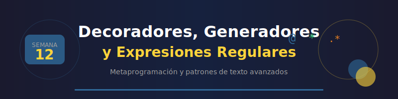

# 📘 Semana 12: Decoradores, Generadores y Expresiones Regulares

<p align="center">
  
</p>

## 🎯 Objetivos de Aprendizaje

Al finalizar esta semana, serás capaz de:

- ✅ Crear y aplicar decoradores con y sin argumentos
- ✅ Implementar generadores con `yield` y expresiones generadoras
- ✅ Dominar iteradores personalizados con `__iter__` y `__next__`
- ✅ Escribir expresiones regulares para búsqueda y validación
- ✅ Usar el módulo `re` para manipulación avanzada de texto
- ✅ Combinar estos conceptos en soluciones elegantes

---

## 📚 Requisitos Previos

- ✅ Semana 11: Archivos, excepciones y context managers
- ✅ Funciones de orden superior (pasar funciones como argumentos)
- ✅ Closures (funciones que capturan variables del scope exterior)

---

## 🗂️ Estructura de la Semana

```
week-12/
├── README.md                    ← Estás aquí
├── rubrica-evaluacion.md        # Criterios de evaluación
├── 0-assets/                    # Recursos visuales
│   ├── week-12-header.svg
│   ├── 01-decorator-flow.svg
│   ├── 02-generator-yield.svg
│   ├── 03-iterator-protocol.svg
│   └── 04-regex-patterns.svg
├── 1-teoria/
│   ├── 01-decoradores.md        # Decoradores: functools, patrones
│   ├── 02-generadores.md        # Yield, expresiones generadoras
│   ├── 03-iteradores.md         # Protocolo iterador, itertools
│   └── 04-expresiones-regulares.md  # Regex con módulo re
├── 2-ejercicios/
│   ├── 01-decoradores-practicos/
│   ├── 02-generadores-datos/
│   └── 03-regex-validacion/
├── 3-proyecto/
│   ├── README.md
│   ├── starter/
│   └── solution/                # ⚠️ Solo instructores
├── 4-recursos/
│   ├── ebooks-free/
│   ├── videografia/
│   └── webgrafia/
└── 5-glosario/
    └── README.md
```

---

## 📝 Contenidos

### 1️⃣ Decoradores (1-teoria/01-decoradores.md)

Los decoradores son funciones que modifican el comportamiento de otras funciones.

```python
import functools
from typing import Callable, ParamSpec, TypeVar

P = ParamSpec("P")
R = TypeVar("R")

def timer(func: Callable[P, R]) -> Callable[P, R]:
    """Mide el tiempo de ejecución de una función."""
    @functools.wraps(func)
    def wrapper(*args: P.args, **kwargs: P.kwargs) -> R:
        import time
        start = time.perf_counter()
        result = func(*args, **kwargs)
        elapsed = time.perf_counter() - start
        print(f"{func.__name__} executed in {elapsed:.4f}s")
        return result
    return wrapper

@timer
def slow_function() -> None:
    import time
    time.sleep(1)
```

**Temas:**
- Funciones como objetos de primera clase
- Closures y scope
- `@functools.wraps` para preservar metadata
- Decoradores con argumentos
- Decoradores de clase

### 2️⃣ Generadores (1-teoria/02-generadores.md)

Los generadores producen valores bajo demanda, ahorrando memoria.

```python
from typing import Iterator

def fibonacci(n: int) -> Iterator[int]:
    """Genera n números de Fibonacci."""
    a, b = 0, 1
    for _ in range(n):
        yield a
        a, b = b, a + b

# Uso eficiente en memoria
for num in fibonacci(1000):
    if num > 100:
        break
    print(num)

# Expresión generadora
squares = (x**2 for x in range(1000000))  # No consume memoria
```

**Temas:**
- `yield` vs `return`
- Expresiones generadoras
- `yield from` para delegación
- Generadores infinitos
- Pipeline de generadores

### 3️⃣ Iteradores (1-teoria/03-iteradores.md)

El protocolo iterador permite crear objetos iterables personalizados.

```python
from typing import Iterator, Self

class Countdown:
    """Iterador de cuenta regresiva."""

    def __init__(self, start: int):
        self.current = start

    def __iter__(self) -> Self:
        return self

    def __next__(self) -> int:
        if self.current <= 0:
            raise StopIteration
        self.current -= 1
        return self.current + 1

for num in Countdown(5):
    print(num)  # 5, 4, 3, 2, 1
```

**Temas:**
- `__iter__` y `__next__`
- Diferencia iterador vs iterable
- `itertools` para operaciones avanzadas
- Iteradores infinitos

### 4️⃣ Expresiones Regulares (1-teoria/04-expresiones-regulares.md)

Regex permite búsqueda y manipulación avanzada de texto.

```python
import re

# Validar email
email_pattern = r"^[\w.+-]+@[\w-]+\.[\w.-]+$"
email = "user@example.com"

if re.match(email_pattern, email):
    print("Email válido")

# Extraer información
text = "Contacto: 555-1234 o 555-5678"
phones = re.findall(r"\d{3}-\d{4}", text)
print(phones)  # ['555-1234', '555-5678']

# Reemplazar
result = re.sub(r"\d{3}-\d{4}", "[REDACTED]", text)
```

**Temas:**
- Metacaracteres y cuantificadores
- Grupos de captura
- `re.match`, `re.search`, `re.findall`
- `re.sub` para reemplazos
- Flags: `re.IGNORECASE`, `re.MULTILINE`

---

## ⏱️ Distribución del Tiempo

| Actividad | Tiempo | Descripción |
|-----------|--------|-------------|
| Teoría | 2h | Lectura y comprensión de conceptos |
| Ejercicios | 2.5h | Práctica guiada paso a paso |
| Proyecto | 1.5h | Validador de datos con decoradores y regex |

**Total: 6 horas**

---

## 📌 Entregables

1. **Ejercicios completados** (3 ejercicios)
2. **Proyecto**: Validador de Datos con Decoradores
3. **Autoevaluación**: Checklist de conceptos

---

## 🔗 Navegación

| ⬅️ Anterior | 🏠 Inicio | Siguiente ➡️ |
|:------------|:---------:|-------------:|
| [Semana 11: Archivos y Excepciones](../week-11/README.md) | [Bootcamp](../../README.md) | [Semana 13: Testing y Debugging](../week-13/README.md) |

---

## ✅ Checklist de Progreso

- [ ] Leí la teoría de decoradores
- [ ] Leí la teoría de generadores e iteradores
- [ ] Leí la teoría de expresiones regulares
- [ ] Completé ejercicio 01: Decoradores prácticos
- [ ] Completé ejercicio 02: Generadores de datos
- [ ] Completé ejercicio 03: Regex y validación
- [ ] Completé el proyecto semanal
- [ ] Revisé el glosario de términos
