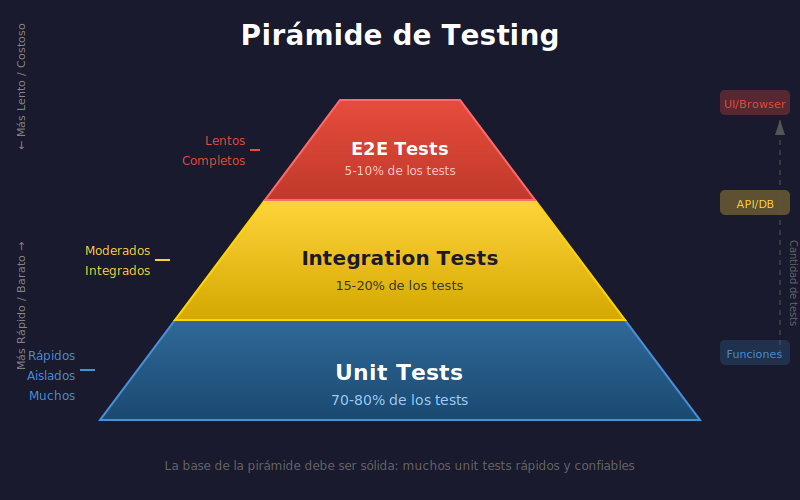

# 🧪 Introducción al Testing

## 📋 Contenido

1. [¿Por qué escribir tests?](#1-por-qué-escribir-tests)
2. [Tipos de tests](#2-tipos-de-tests)
3. [Test-Driven Development (TDD)](#3-test-driven-development-tdd)
4. [Anatomía de un buen test](#4-anatomía-de-un-buen-test)
5. [Principios de testing](#5-principios-de-testing)

---

## 1. ¿Por qué Escribir Tests?

### El Problema sin Tests

```python
# Sin tests, cada cambio es arriesgado
def calculate_discount(price: float, discount: float) -> float:
    return price - (price * discount / 100)

# ¿Funciona con números negativos?
# ¿Qué pasa con discount > 100?
# ¿Y si price es 0?
# 🤷 Nadie lo sabe hasta que algo falla en producción
```

### Beneficios del Testing

| Beneficio | Descripción |
|-----------|-------------|
| **Confianza** | Cambiar código sin miedo a romper algo |
| **Documentación** | Tests muestran cómo usar el código |
| **Diseño** | Escribir tests mejora el diseño del código |
| **Debugging** | Encontrar bugs más rápido |
| **Regresiones** | Evitar que bugs vuelvan a aparecer |

### El Costo de No Testear

```
📊 Costo de arreglar un bug:
- Durante desarrollo: $1
- En testing: $10
- En producción: $100+
```

---

## 2. Tipos de Tests

### La Pirámide de Testing



```
        /\
       /  \      E2E Tests (pocos)
      /----\     - Prueban el sistema completo
     /      \    - Lentos, frágiles
    /--------\
   /          \  Integration Tests (algunos)
  /------------\ - Prueban componentes juntos
 /              \- Más lentos
/----------------\
      Unit Tests (muchos)
      - Prueban funciones individuales
      - Rápidos, confiables
```

### Tests Unitarios

Prueban **una sola unidad** de código (función, método, clase).

```python
# Función a testear
def add(a: int, b: int) -> int:
    return a + b

# Test unitario
def test_add_positive_numbers():
    result = add(2, 3)
    assert result == 5

def test_add_negative_numbers():
    result = add(-1, -1)
    assert result == -2

def test_add_zero():
    result = add(5, 0)
    assert result == 5
```

**Características:**
- ✅ Rápidos (milisegundos)
- ✅ Aislados (no dependen de otros)
- ✅ Repetibles (mismo resultado siempre)
- ✅ Específicos (prueban una cosa)

### Tests de Integración

Prueban **varios componentes juntos**.

```python
# Test de integración: base de datos + servicio
def test_user_service_creates_user_in_database():
    # Arrange
    db = Database(":memory:")
    service = UserService(db)

    # Act
    user = service.create_user("Alice", "alice@example.com")

    # Assert
    saved_user = db.get_user(user.id)
    assert saved_user.name == "Alice"
    assert saved_user.email == "alice@example.com"
```

**Características:**
- ⚡ Más lentos que unitarios
- 🔗 Prueban interacciones
- 📦 Pueden requerir setup complejo

### Tests End-to-End (E2E)

Prueban el **sistema completo** como un usuario.

```python
# Test E2E: flujo completo de compra
def test_user_can_complete_purchase():
    # Simula usuario real
    browser.go_to("/products")
    browser.click("Add to Cart")
    browser.click("Checkout")
    browser.fill("card_number", "4111111111111111")
    browser.click("Pay")

    assert browser.text_contains("Order confirmed")
```

**Características:**
- 🐢 Muy lentos
- 🔨 Frágiles (cambios de UI los rompen)
- 👤 Simulan usuario real

---

## 3. Test-Driven Development (TDD)

### El Ciclo Red-Green-Refactor

```
    ┌─────────────┐
    │  🔴 RED     │ ← Escribe test que falla
    └──────┬──────┘
           │
           ▼
    ┌─────────────┐
    │  🟢 GREEN   │ ← Escribe código mínimo para pasar
    └──────┬──────┘
           │
           ▼
    ┌─────────────┐
    │  🔵 REFACTOR│ ← Mejora el código
    └──────┬──────┘
           │
           └──────→ Repite
```

### Ejemplo Práctico de TDD

**Paso 1: RED - Escribir test que falla**

```python
# test_calculator.py
def test_divide_returns_float():
    result = divide(10, 4)
    assert result == 2.5

# ❌ NameError: name 'divide' is not defined
```

**Paso 2: GREEN - Código mínimo para pasar**

```python
# calculator.py
def divide(a: float, b: float) -> float:
    return a / b

# ✅ Test pasa
```

**Paso 3: RED - Agregar test para edge case**

```python
def test_divide_by_zero_raises_error():
    with pytest.raises(ValueError):
        divide(10, 0)

# ❌ ZeroDivisionError (no ValueError)
```

**Paso 4: GREEN - Manejar el caso**

```python
def divide(a: float, b: float) -> float:
    if b == 0:
        raise ValueError("Cannot divide by zero")
    return a / b

# ✅ Ambos tests pasan
```

**Paso 5: REFACTOR - Mejorar si necesario**

```python
def divide(dividend: float, divisor: float) -> float:
    """
    Divide two numbers.

    Raises:
        ValueError: If divisor is zero.
    """
    if divisor == 0:
        raise ValueError("Cannot divide by zero")
    return dividend / divisor
```

### Beneficios de TDD

1. **Diseño emergente**: El código se diseña según las necesidades
2. **Cobertura alta**: Todo el código tiene tests
3. **Documentación viva**: Tests documentan el comportamiento
4. **Menos debugging**: Errores se detectan inmediatamente

---

## 4. Anatomía de un Buen Test

### El Patrón AAA (Arrange-Act-Assert)

```python
def test_user_full_name():
    # ARRANGE - Preparar datos y objetos
    user = User(first_name="John", last_name="Doe")

    # ACT - Ejecutar la acción a testear
    full_name = user.get_full_name()

    # ASSERT - Verificar el resultado
    assert full_name == "John Doe"
```

### Nombres Descriptivos

```python
# ❌ MAL - Nombre no descriptivo
def test_1():
    assert add(2, 2) == 4

# ❌ MAL - Muy genérico
def test_add():
    assert add(2, 2) == 4

# ✅ BIEN - Describe qué se prueba
def test_add_returns_sum_of_two_positive_integers():
    assert add(2, 2) == 4

# ✅ BIEN - Describe el escenario
def test_add_with_negative_numbers_returns_correct_sum():
    assert add(-5, 3) == -2
```

### Un Test, Una Cosa

```python
# ❌ MAL - Prueba múltiples cosas
def test_calculator():
    assert add(2, 2) == 4
    assert subtract(5, 3) == 2
    assert multiply(3, 4) == 12
    assert divide(10, 2) == 5

# ✅ BIEN - Un test por comportamiento
def test_add_positive_numbers():
    assert add(2, 2) == 4

def test_subtract_positive_numbers():
    assert subtract(5, 3) == 2
```

### Tests Independientes

```python
# ❌ MAL - Tests dependen de orden
counter = 0

def test_increment():
    global counter
    counter += 1
    assert counter == 1

def test_double():
    global counter
    counter *= 2
    assert counter == 2  # Falla si test_increment no corrió primero

# ✅ BIEN - Tests independientes
def test_increment():
    counter = Counter(0)
    counter.increment()
    assert counter.value == 1

def test_double():
    counter = Counter(1)
    counter.double()
    assert counter.value == 2
```

---

## 5. Principios de Testing

### FIRST

| Principio | Significado | Descripción |
|-----------|-------------|-------------|
| **F**ast | Rápidos | Ejecutan en milisegundos |
| **I**ndependent | Independientes | No dependen de otros tests |
| **R**epeatable | Repetibles | Mismo resultado siempre |
| **S**elf-validating | Auto-validantes | Pasan o fallan, sin inspección manual |
| **T**imely | Oportunos | Se escriben junto con el código |

### ¿Qué Testear?

```python
# ✅ TESTEAR
# - Lógica de negocio
# - Cálculos y transformaciones
# - Validaciones
# - Edge cases y errores
# - Comportamiento público

# ❌ NO TESTEAR (generalmente)
# - Getters/setters triviales
# - Código de frameworks
# - Constantes
# - Implementación privada
```

### Cobertura de Código

```python
def calculate_grade(score: int) -> str:
    if score >= 90:      # Línea 1
        return "A"       # Línea 2
    elif score >= 80:    # Línea 3
        return "B"       # Línea 4
    elif score >= 70:    # Línea 5
        return "C"       # Línea 6
    else:                # Línea 7
        return "F"       # Línea 8

# Tests para 100% cobertura
def test_grade_a():
    assert calculate_grade(95) == "A"  # Cubre líneas 1, 2

def test_grade_b():
    assert calculate_grade(85) == "B"  # Cubre líneas 3, 4

def test_grade_c():
    assert calculate_grade(75) == "C"  # Cubre líneas 5, 6

def test_grade_f():
    assert calculate_grade(50) == "F"  # Cubre líneas 7, 8
```

---

## 📚 Resumen

| Concepto | Descripción |
|----------|-------------|
| **Tests unitarios** | Prueban una función/método aislado |
| **Tests integración** | Prueban componentes juntos |
| **Tests E2E** | Prueban sistema completo |
| **TDD** | Red → Green → Refactor |
| **AAA** | Arrange → Act → Assert |
| **FIRST** | Fast, Independent, Repeatable, Self-validating, Timely |

---

## 🔗 Referencias

- [Martin Fowler - Test Pyramid](https://martinfowler.com/bliki/TestPyramid.html)
- [Kent Beck - Test-Driven Development](https://www.amazon.com/Test-Driven-Development-Kent-Beck/dp/0321146530)
- [Python Testing with pytest](https://pragprog.com/titles/bopytest2/python-testing-with-pytest-second-edition/)
