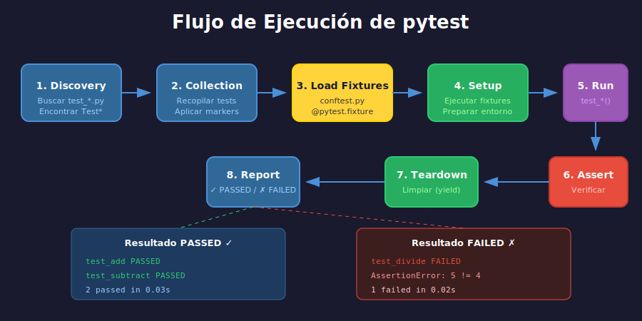

# 🚀 pytest Avanzado

## 📋 Contenido

1. [Fixtures](#1-fixtures)
2. [Parametrización](#2-parametrización)
3. [Markers](#3-markers)
4. [Mocking con unittest.mock](#4-mocking-con-unittestmock)
5. [conftest.py](#5-conftestpy)

---

## 1. Fixtures

Las **fixtures** son funciones que proveen datos o recursos para los tests.



### Fixture Básica

```python
import pytest

@pytest.fixture
def sample_user():
    """Fixture que provee un usuario de prueba."""
    return {
        "id": 1,
        "name": "Alice",
        "email": "alice@example.com"
    }


def test_user_has_name(sample_user):
    """Test que usa la fixture."""
    assert sample_user["name"] == "Alice"


def test_user_has_email(sample_user):
    """Otro test que usa la misma fixture."""
    assert "@" in sample_user["email"]
```

### Fixtures con Setup y Teardown

```python
import pytest
import tempfile
import os

@pytest.fixture
def temp_file():
    """Fixture que crea y limpia un archivo temporal."""
    # SETUP: Crear archivo
    fd, path = tempfile.mkstemp()
    os.write(fd, b"test content")
    os.close(fd)

    yield path  # <- El test recibe esto

    # TEARDOWN: Limpiar después del test
    os.unlink(path)


def test_temp_file_exists(temp_file):
    """El archivo existe durante el test."""
    assert os.path.exists(temp_file)


def test_temp_file_has_content(temp_file):
    """El archivo tiene contenido."""
    with open(temp_file) as f:
        assert f.read() == "test content"

# Después de cada test, el archivo se elimina automáticamente
```

### Scope de Fixtures


```python
import pytest

@pytest.fixture(scope="function")  # Default - una vez por test
def function_fixture():
    print("\n  [Setup function fixture]")
    yield "function_data"
    print("\n  [Teardown function fixture]")


@pytest.fixture(scope="class")  # Una vez por clase de tests
def class_fixture():
    print("\n  [Setup class fixture]")
    yield "class_data"
    print("\n  [Teardown class fixture]")


@pytest.fixture(scope="module")  # Una vez por archivo .py
def module_fixture():
    print("\n  [Setup module fixture]")
    yield "module_data"
    print("\n  [Teardown module fixture]")


@pytest.fixture(scope="session")  # Una vez por sesión de pytest
def session_fixture():
    print("\n  [Setup session fixture]")
    yield "session_data"
    print("\n  [Teardown session fixture]")
```

### Ejemplo Práctico: Base de Datos

```python
import pytest
import sqlite3

@pytest.fixture(scope="module")
def db_connection():
    """Conexión a base de datos para todo el módulo."""
    conn = sqlite3.connect(":memory:")
    conn.execute("""
        CREATE TABLE users (
            id INTEGER PRIMARY KEY,
            name TEXT,
            email TEXT
        )
    """)
    conn.commit()

    yield conn

    conn.close()


@pytest.fixture
def db_cursor(db_connection):
    """Cursor con transacción que se revierte después de cada test."""
    cursor = db_connection.cursor()

    yield cursor

    # Rollback para limpiar datos del test
    db_connection.rollback()


def test_insert_user(db_cursor):
    db_cursor.execute(
        "INSERT INTO users (name, email) VALUES (?, ?)",
        ("Alice", "alice@example.com")
    )
    db_cursor.execute("SELECT COUNT(*) FROM users")
    assert db_cursor.fetchone()[0] == 1


def test_database_is_clean(db_cursor):
    """Este test no ve el usuario del test anterior."""
    db_cursor.execute("SELECT COUNT(*) FROM users")
    assert db_cursor.fetchone()[0] == 0
```

### Fixtures que Usan Otras Fixtures

```python
@pytest.fixture
def user_data():
    return {"name": "Bob", "email": "bob@example.com"}


@pytest.fixture
def user(user_data):
    """Fixture que depende de otra fixture."""
    return User(**user_data)


@pytest.fixture
def authenticated_user(user):
    """Fixture que depende de user."""
    user.authenticate("password123")
    return user


def test_authenticated_user_is_logged_in(authenticated_user):
    assert authenticated_user.is_authenticated
```

---

## 2. Parametrización

Ejecutar el mismo test con diferentes datos.

### @pytest.mark.parametrize

```python
import pytest

def add(a: int, b: int) -> int:
    return a + b


@pytest.mark.parametrize("a, b, expected", [
    (1, 2, 3),
    (0, 0, 0),
    (-1, 1, 0),
    (100, 200, 300),
    (-5, -3, -8),
])
def test_add(a: int, b: int, expected: int):
    """Test con múltiples casos."""
    assert add(a, b) == expected


# pytest ejecuta 5 tests:
# test_add[1-2-3] PASSED
# test_add[0-0-0] PASSED
# test_add[-1-1-0] PASSED
# test_add[100-200-300] PASSED
# test_add[-5--3--8] PASSED
```

### IDs Personalizados

```python
@pytest.mark.parametrize("input_str, expected", [
    pytest.param("hello", "HELLO", id="lowercase"),
    pytest.param("WORLD", "WORLD", id="uppercase"),
    pytest.param("HeLLo", "HELLO", id="mixed"),
    pytest.param("", "", id="empty"),
])
def test_uppercase(input_str: str, expected: str):
    assert input_str.upper() == expected

# Salida:
# test_uppercase[lowercase] PASSED
# test_uppercase[uppercase] PASSED
# test_uppercase[mixed] PASSED
# test_uppercase[empty] PASSED
```

### Parametrizar Múltiples Argumentos

```python
@pytest.mark.parametrize("x", [1, 2, 3])
@pytest.mark.parametrize("y", [10, 20])
def test_multiply(x: int, y: int):
    """Ejecuta 6 combinaciones: (1,10), (1,20), (2,10), (2,20), (3,10), (3,20)"""
    result = x * y
    assert result == x * y
```

### Parametrizar con Excepciones

```python
@pytest.mark.parametrize("value, error", [
    ("not_a_number", ValueError),
    (None, TypeError),
])
def test_convert_invalid_raises(value, error):
    with pytest.raises(error):
        int(value)
```

### Parametrizar Fixtures

```python
@pytest.fixture(params=["mysql", "postgresql", "sqlite"])
def database(request):
    """Fixture parametrizada - tests corren 3 veces."""
    db_type = request.param

    if db_type == "sqlite":
        conn = sqlite3.connect(":memory:")
    else:
        conn = create_connection(db_type)

    yield conn
    conn.close()


def test_database_connection(database):
    """Este test corre 3 veces, una por cada DB."""
    assert database.is_connected()
```

---

## 3. Markers

Los markers permiten categorizar y filtrar tests.

### Markers Incorporados

```python
import pytest
import sys

# Skip: Saltar test incondicionalmente
@pytest.mark.skip(reason="Not implemented yet")
def test_future_feature():
    pass


# Skipif: Saltar condicionalmente
@pytest.mark.skipif(
    sys.platform == "win32",
    reason="Not supported on Windows"
)
def test_unix_only():
    pass


# Xfail: Test que se espera que falle
@pytest.mark.xfail(reason="Bug #123 not fixed yet")
def test_known_bug():
    assert False  # El test falla pero pytest lo reporta como xfail


# Xfail estricto: Falla si el test pasa
@pytest.mark.xfail(strict=True)
def test_should_fail():
    assert False
```

### Markers Personalizados

```python
# pytest.ini o pyproject.toml
"""
[tool.pytest.ini_options]
markers = [
    "slow: marks tests as slow",
    "integration: marks integration tests",
    "smoke: marks smoke tests",
]
"""

# tests/test_example.py
import pytest

@pytest.mark.slow
def test_slow_operation():
    """Test que tarda mucho."""
    import time
    time.sleep(5)
    assert True


@pytest.mark.integration
def test_database_integration():
    """Test de integración con BD."""
    pass


@pytest.mark.smoke
def test_basic_functionality():
    """Test básico de smoke."""
    assert 1 + 1 == 2
```

### Ejecutar por Markers

```bash
# Solo tests lentos
pytest -m slow

# Solo tests de integración
pytest -m integration

# Excluir tests lentos
pytest -m "not slow"

# Combinar markers
pytest -m "smoke and not slow"
pytest -m "integration or smoke"
```

### Marker para Toda una Clase

```python
@pytest.mark.integration
class TestDatabaseOperations:
    """Todos los tests de esta clase son de integración."""

    def test_insert(self):
        pass

    def test_update(self):
        pass

    def test_delete(self):
        pass
```

---

## 4. Mocking con unittest.mock

El **mocking** permite simular objetos o funciones para aislar el código que se prueba.

### ¿Cuándo usar Mocking?

- APIs externas
- Bases de datos
- Sistema de archivos
- Tiempo (datetime)
- Funciones costosas
- Comportamiento no determinístico

### Mock Básico

```python
from unittest.mock import Mock

def test_mock_basic():
    # Crear un mock
    mock_obj = Mock()

    # Configurar valor de retorno
    mock_obj.get_value.return_value = 42

    # Usar el mock
    result = mock_obj.get_value()

    # Verificar
    assert result == 42
    mock_obj.get_value.assert_called_once()
```

### Patch - Reemplazar Objetos

```python
from unittest.mock import patch

# Código a testear
def get_user_from_api(user_id: int) -> dict:
    import requests
    response = requests.get(f"https://api.example.com/users/{user_id}")
    return response.json()


# Test con patch
@patch("requests.get")
def test_get_user_from_api(mock_get):
    # Configurar mock
    mock_get.return_value.json.return_value = {
        "id": 1,
        "name": "Alice"
    }

    # Ejecutar
    result = get_user_from_api(1)

    # Verificar
    assert result["name"] == "Alice"
    mock_get.assert_called_once_with("https://api.example.com/users/1")
```

### Patch como Context Manager

```python
from unittest.mock import patch

def test_with_context_manager():
    with patch("module.function") as mock_func:
        mock_func.return_value = "mocked"

        result = module.function()

        assert result == "mocked"
```

### MagicMock

```python
from unittest.mock import MagicMock

def test_magic_mock():
    mock = MagicMock()

    # MagicMock implementa métodos mágicos
    mock.__len__.return_value = 5
    mock.__getitem__.return_value = "item"

    assert len(mock) == 5
    assert mock[0] == "item"
```

### Side Effects

```python
from unittest.mock import Mock, patch

# Efecto secundario: lanzar excepción
@patch("requests.get")
def test_api_error(mock_get):
    mock_get.side_effect = ConnectionError("Network error")

    with pytest.raises(ConnectionError):
        get_user_from_api(1)


# Efecto secundario: múltiples valores
@patch("random.randint")
def test_multiple_calls(mock_randint):
    mock_randint.side_effect = [1, 2, 3]

    assert random.randint(1, 10) == 1
    assert random.randint(1, 10) == 2
    assert random.randint(1, 10) == 3


# Efecto secundario: función personalizada
@patch("time.time")
def test_custom_side_effect(mock_time):
    call_count = 0
    def increment_time():
        nonlocal call_count
        call_count += 1
        return 1000 + call_count

    mock_time.side_effect = increment_time

    assert time.time() == 1001
    assert time.time() == 1002
```

### Verificar Llamadas

```python
from unittest.mock import Mock, call

def test_verify_calls():
    mock = Mock()

    mock.method("arg1")
    mock.method("arg2", key="value")
    mock.method("arg3")

    # Verificar llamadas específicas
    mock.method.assert_called()
    mock.method.assert_called_with("arg3")

    # Verificar número de llamadas
    assert mock.method.call_count == 3

    # Verificar todas las llamadas
    mock.method.assert_has_calls([
        call("arg1"),
        call("arg2", key="value"),
        call("arg3"),
    ])
```

### Ejemplo Completo: Testear Servicio

```python
# services/user_service.py
class UserService:
    def __init__(self, api_client, database):
        self.api = api_client
        self.db = database

    def sync_user(self, user_id: int) -> bool:
        """Sincroniza usuario desde API a BD."""
        user_data = self.api.get_user(user_id)
        if user_data:
            self.db.save_user(user_data)
            return True
        return False


# tests/test_user_service.py
from unittest.mock import Mock
from services.user_service import UserService

def test_sync_user_success():
    # Arrange
    mock_api = Mock()
    mock_db = Mock()
    mock_api.get_user.return_value = {"id": 1, "name": "Alice"}

    service = UserService(mock_api, mock_db)

    # Act
    result = service.sync_user(1)

    # Assert
    assert result is True
    mock_api.get_user.assert_called_once_with(1)
    mock_db.save_user.assert_called_once_with({"id": 1, "name": "Alice"})


def test_sync_user_not_found():
    # Arrange
    mock_api = Mock()
    mock_db = Mock()
    mock_api.get_user.return_value = None

    service = UserService(mock_api, mock_db)

    # Act
    result = service.sync_user(999)

    # Assert
    assert result is False
    mock_db.save_user.assert_not_called()
```

---

## 5. conftest.py

El archivo `conftest.py` contiene fixtures y configuraciones compartidas.

### Ubicación y Alcance

```
tests/
├── conftest.py              # Fixtures para todos los tests
├── unit/
│   ├── conftest.py          # Fixtures solo para unit/
│   └── test_calculator.py
└── integration/
    ├── conftest.py          # Fixtures solo para integration/
    └── test_api.py
```

### Ejemplo de conftest.py

```python
# tests/conftest.py
import pytest
from datetime import datetime

# Fixtures disponibles para todos los tests
@pytest.fixture
def sample_user():
    """Usuario de prueba."""
    return {
        "id": 1,
        "name": "Test User",
        "email": "test@example.com",
        "created_at": datetime.now()
    }


@pytest.fixture
def sample_users():
    """Lista de usuarios de prueba."""
    return [
        {"id": 1, "name": "Alice", "email": "alice@example.com"},
        {"id": 2, "name": "Bob", "email": "bob@example.com"},
        {"id": 3, "name": "Charlie", "email": "charlie@example.com"},
    ]


@pytest.fixture(scope="session")
def app_config():
    """Configuración de la aplicación para toda la sesión."""
    return {
        "debug": True,
        "testing": True,
        "database_url": "sqlite:///:memory:"
    }


# Fixture que usa otra fixture
@pytest.fixture
def authenticated_client(app_config, sample_user):
    """Cliente autenticado para tests."""
    client = TestClient(app_config)
    client.login(sample_user)
    return client


# Hooks de pytest
def pytest_configure(config):
    """Configuración al inicio de pytest."""
    config.addinivalue_line(
        "markers", "slow: marks tests as slow running"
    )


def pytest_collection_modifyitems(config, items):
    """Modificar tests recolectados."""
    for item in items:
        if "slow" in item.keywords:
            item.add_marker(pytest.mark.skip(reason="Skipping slow tests"))
```

### Uso Automático de Fixtures

```python
# conftest.py
@pytest.fixture(autouse=True)
def reset_database():
    """Se ejecuta automáticamente antes de cada test."""
    # Setup
    database.clear()

    yield

    # Teardown
    database.clear()


@pytest.fixture(autouse=True, scope="module")
def setup_logging():
    """Configura logging para el módulo."""
    import logging
    logging.basicConfig(level=logging.DEBUG)
    yield
    logging.shutdown()
```

---

## 📚 Resumen

| Concepto | Descripción |
|----------|-------------|
| **Fixtures** | Proveen datos/recursos para tests |
| **scope** | function, class, module, session |
| **yield** | Setup antes, teardown después |
| **@parametrize** | Ejecutar test con múltiples datos |
| **Markers** | Categorizar y filtrar tests |
| **Mock** | Simular objetos y funciones |
| **patch** | Reemplazar objetos temporalmente |
| **conftest.py** | Fixtures y configuración compartida |

---

## 🔗 Referencias

- [pytest Fixtures](https://docs.pytest.org/en/latest/how-to/fixtures.html)
- [pytest Parametrize](https://docs.pytest.org/en/latest/how-to/parametrize.html)
- [unittest.mock](https://docs.python.org/3/library/unittest.mock.html)
